# Data Leakage trong Home Credit Default Risk

## 1. Mục tiêu

Report này giải thích **data leakage** trong bài toán Home Credit Default Risk và trả lời câu hỏi:

> Leakage có phải chỉ là cách chia train/validation/test không?

**Không.** Chia dữ liệu đúng là điều kiện cần, nhưng leakage còn có thể xuất hiện trong feature engineering, aggregation, preprocessing, target encoding, feature selection, cách dùng thời gian và cách đánh giá mô hình.

Đơn vị dự đoán cuối cùng của bài toán là:

```text
Một SK_ID_CURR = một dòng trong model matrix
```

Mọi bước trong pipeline phải tôn trọng grain này.

---

## 2. Data leakage là gì?

Data leakage xảy ra khi mô hình được tiếp cận trực tiếp hoặc gián tiếp với thông tin mà tại thời điểm dự đoán thực tế nó không được phép biết.

```text
Thông tin từ validation, test, target hoặc tương lai
                         ↓
        ảnh hưởng đến feature hoặc model
                         ↓
             validation score cao giả tạo
```

Các nguồn leakage phổ biến:

- Cùng khách hàng xuất hiện ở cả train và validation.
- Preprocessing được fit trên toàn bộ dữ liệu.
- Feature selection nhìn thấy validation label.
- Target encoding được tính trên chính row cần dự đoán.
- Feature dùng hành vi xảy ra sau ngày nộp hồ sơ.
- Biến hậu quả của default được dùng làm input.
- Public leaderboard được dùng quá nhiều để tune model.

---

## 3. Leakage khác overfitting như thế nào?

| Khái niệm | Ý nghĩa |
|---|---|
| Overfitting | Mô hình học quá sát pattern ngẫu nhiên trong training data |
| Data leakage | Mô hình nhận thông tin không hợp lệ |
| Target leakage | Feature chứa trực tiếp hoặc gián tiếp thông tin từ target |
| Temporal leakage | Feature sử dụng thông tin xảy ra sau thời điểm dự đoán |
| Entity leakage | Cùng một thực thể xuất hiện ở cả train và validation |
| Distribution shift | Phân phối production khác phân phối train |

Leakage thường nguy hiểm hơn overfitting vì validation AUC có thể trông rất tốt dù mô hình không thể hoạt động ngoài thực tế.

---

## 4. Cấu trúc Home Credit liên quan đến leakage

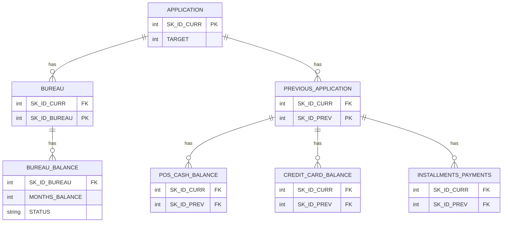

Các bảng lịch sử có quan hệ one-to-many. Vì vậy chúng phải được aggregate về một dòng mỗi `SK_ID_CURR` trước khi huấn luyện.

---

# 5. Leakage do chia sai đơn vị dữ liệu

## 5.1 Sai: chia child table theo dòng

Giả sử khách hàng `100001` có 20 bản ghi trong `installments_payments`:

```text
SK_ID_CURR = 100001
├── payment row 1
├── payment row 2
├── payment row 3
├── ...
└── payment row 20
```

Nếu chia ngẫu nhiên theo dòng:

```text
Train:
- Customer 100001, payment 1
- Customer 100001, payment 3
- Customer 100001, payment 7

Validation:
- Customer 100001, payment 2
- Customer 100001, payment 4
- Customer 100001, payment 8
```

Cùng một khách hàng xuất hiện ở cả hai tập. Đây là **entity leakage**.

Mô hình có thể học pattern riêng của khách hàng từ train rồi được đánh giá trên chính khách hàng đó trong validation.

## 5.2 Đúng: chia theo `SK_ID_CURR`

```python
from sklearn.model_selection import train_test_split

train_ids, valid_ids = train_test_split(
    application_train["SK_ID_CURR"],
    test_size=0.20,
    random_state=42,
    stratify=application_train["TARGET"]
)
```

Sau đó mọi child record phải đi theo customer:

```python
installments_train = installments_payments[
    installments_payments["SK_ID_CURR"].isin(train_ids)
]

installments_valid = installments_payments[
    installments_payments["SK_ID_CURR"].isin(valid_ids)
]
```

Quy tắc:

```text
Một SK_ID_CURR chỉ được thuộc đúng một partition.
```

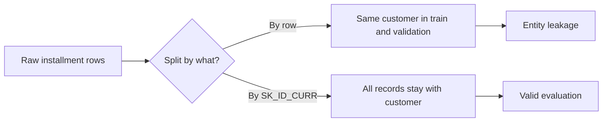

---

# 6. Leakage do preprocessing trên toàn bộ dữ liệu

Ngay cả khi split đúng, leakage vẫn có thể xảy ra nếu preprocessing được fit trên toàn bộ data.

## 6.1 Median imputation

### Sai

```python
median_credit = X_all["AMT_CREDIT"].median()

X_train["AMT_CREDIT"] = X_train["AMT_CREDIT"].fillna(median_credit)
X_valid["AMT_CREDIT"] = X_valid["AMT_CREDIT"].fillna(median_credit)
```

Median chứa thông tin từ validation distribution.

### Đúng

```python
median_credit = X_train["AMT_CREDIT"].median()

X_train["AMT_CREDIT"] = X_train["AMT_CREDIT"].fillna(median_credit)
X_valid["AMT_CREDIT"] = X_valid["AMT_CREDIT"].fillna(median_credit)
```

Nguyên tắc:

```text
fit(train)
transform(train)
transform(validation)
```

Không được:

```text
fit(train + validation)
```

## 6.2 Các transformer phải fit trên train-only

- Imputer.
- StandardScaler.
- MinMaxScaler.
- PCA.
- Frequency encoder.
- Rare-category grouping.
- WOE encoder.
- Quantile binning.
- Outlier thresholds.
- Feature selector.
- Target encoder.

## 6.3 Dùng sklearn Pipeline

```python
from sklearn.pipeline import Pipeline
from sklearn.impute import SimpleImputer
from sklearn.preprocessing import StandardScaler
from sklearn.linear_model import LogisticRegression

pipeline = Pipeline([
    ("imputer", SimpleImputer(strategy="median")),
    ("scaler", StandardScaler()),
    ("model", LogisticRegression(max_iter=1000))
])

pipeline.fit(X_train, y_train)
valid_pred = pipeline.predict_proba(X_valid)[:, 1]
```

`Pipeline` giúp ngăn transformer bị fit ngoài fold.

---

# 7. Leakage do feature selection

Giả sử tạo 500 features và chọn 50 features liên quan nhất với `TARGET`.

## 7.1 Sai

```python
selected_features = select_features(X_all, y_all)

X_train_selected = X_train[selected_features]
X_valid_selected = X_valid[selected_features]
```

Feature selector đã nhìn thấy `y_valid`.

## 7.2 Đúng

```python
selected_features = select_features(X_train, y_train)

X_train_selected = X_train[selected_features]
X_valid_selected = X_valid[selected_features]
```

Trong cross-validation, feature selection phải chạy lại trong từng fold.

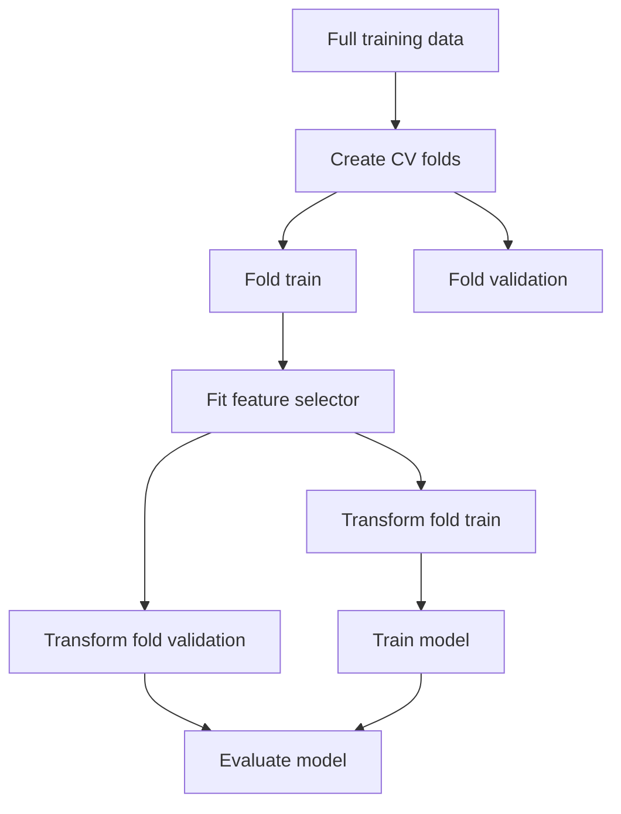

---

# 8. Leakage do target encoding

Target encoding thay category bằng default rate trung bình.

Ví dụ:

```text
OCCUPATION_TYPE = Laborers
Encoded value = default rate của Laborers
```

## 8.1 Sai: tính trên toàn bộ training set

```python
occupation_rate = (
    df.groupby("OCCUPATION_TYPE")["TARGET"].mean()
)

df["OCCUPATION_TE"] = (
    df["OCCUPATION_TYPE"].map(occupation_rate)
)
```

Mỗi row đã góp `TARGET` của chính nó vào giá trị encoding.

Category hiếm đặc biệt nguy hiểm:

```text
Category chỉ có 1 khách hàng
TARGET = 1
Target encoding = 1.0
```

## 8.2 Đúng: out-of-fold target encoding

Quy trình:

1. Chia training data thành K folds.
2. Với mỗi fold, tính category default rate từ K-1 folds còn lại.
3. Áp mapping vào fold được giữ ra.
4. Ghép các fold thành OOF encoded feature.
5. Fit mapping cuối trên toàn bộ train để transform test.

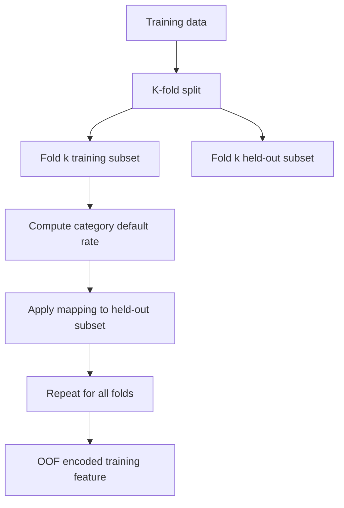

## 8.3 Pseudocode

```python
import pandas as pd
from sklearn.model_selection import StratifiedKFold

def oof_target_encode(
    train_df,
    test_df,
    column,
    target="TARGET",
    n_splits=5,
    smoothing=20
):
    train_encoded = pd.Series(index=train_df.index, dtype=float)
    global_mean = train_df[target].mean()

    skf = StratifiedKFold(
        n_splits=n_splits,
        shuffle=True,
        random_state=42
    )

    for train_idx, valid_idx in skf.split(train_df, train_df[target]):
        fold_train = train_df.iloc[train_idx]
        fold_valid = train_df.iloc[valid_idx]

        stats = fold_train.groupby(column)[target].agg(["mean", "count"])

        smooth_mean = (
            stats["mean"] * stats["count"]
            + global_mean * smoothing
        ) / (
            stats["count"] + smoothing
        )

        train_encoded.iloc[valid_idx] = (
            fold_valid[column]
            .map(smooth_mean)
            .fillna(global_mean)
        )

    full_stats = train_df.groupby(column)[target].agg(["mean", "count"])

    full_smooth_mean = (
        full_stats["mean"] * full_stats["count"]
        + global_mean * smoothing
    ) / (
        full_stats["count"] + smoothing
    )

    test_encoded = (
        test_df[column]
        .map(full_smooth_mean)
        .fillna(global_mean)
    )

    return train_encoded, test_encoded
```

---

# 9. Temporal leakage

Temporal leakage xảy ra khi feature dùng thông tin phát sinh sau thời điểm mô hình phải đưa ra quyết định.

Trong credit scoring:

```text
Scoring timestamp = thời điểm khách hàng nộp hồ sơ
```

Feature chỉ được dùng dữ liệu tồn tại trước hoặc tại thời điểm đó.

## 9.1 Ví dụ

```text
01/01: Khách hàng nộp hồ sơ
01/02: Khách hàng bỏ lỡ installment đầu tiên
01/03: Khoản vay trở thành overdue
```

Feature sau là không hợp lệ:

```text
max_days_past_due_next_3_months
```

Vì nó chưa tồn tại tại ngày 01/01.

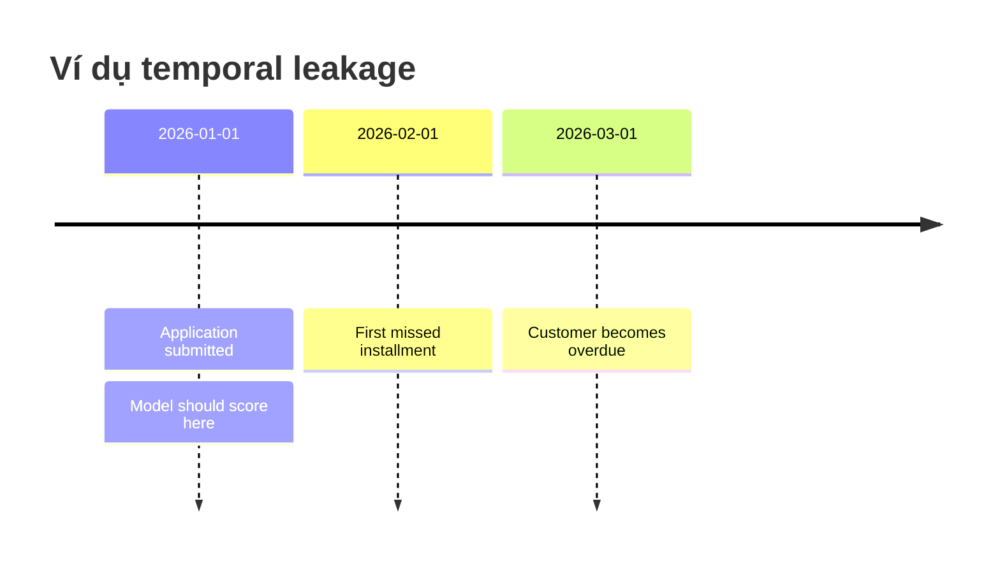

Cutoff rule:

```text
feature_event_time <= scoring_time
```

Trong production nên lưu rõ:

- `event_timestamp`
- `observation_timestamp`
- `scoring_timestamp`
- `cutoff_timestamp`

Ví dụ kiểm tra:

```python
history = history[
    history["event_timestamp"]
    <= history["scoring_timestamp"]
]
```

---

# 10. Target leakage trực tiếp

Một số feature là hậu quả của default hoặc repayment difficulty.

Ví dụ giả định:

- `loan_sent_to_collection`
- `legal_recovery_started`
- `account_written_off`
- `days_until_default`
- `final_loan_status`
- `late_payments_after_approval`

Nếu dùng chúng để dự đoán tại thời điểm application, mô hình gần như đã nhìn thấy outcome.

## Dấu hiệu đáng ngờ

- Feature chỉ xuất hiện sau khi loan được phê duyệt.
- Feature chỉ xuất hiện sau khi repayment difficulty xảy ra.
- Correlation với `TARGET` gần như hoàn hảo.
- Tên liên quan tới collection, write-off, recovery hoặc default.
- Feature có distribution bất thường giữa train và test.

---

# 11. Leakage trong aggregation nhiều bảng

## 11.1 Aggregate theo từng khách hàng thường là an toàn

```python
bureau_agg = (
    bureau.groupby("SK_ID_CURR")
          .agg(
              bureau_credit_mean=("AMT_CREDIT_SUM", "mean"),
              bureau_credit_max=("AMT_CREDIT_SUM", "max"),
              bureau_row_count=("SK_ID_BUREAU", "count")
          )
)
```

Nếu mỗi row chỉ sử dụng lịch sử của chính khách hàng, không dùng target và chỉ dùng dữ liệu trước scoring time, aggregation này thường hợp lệ.

## 11.2 Khi nào aggregation bị leakage?

Aggregation bị leakage nếu:

1. Dùng dữ liệu tương lai.
2. Dùng target của khách hàng khác.
3. Dùng statistic toàn dataset có chứa validation.
4. Aggregate theo category bằng target rồi join lại.
5. Cùng khách hàng xuất hiện trong nhiều folds.
6. Dùng biến hậu quả của outcome.

## 11.3 Aggregate hai tầng với `bureau_balance`

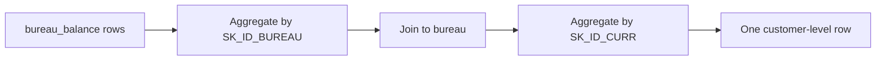

Ví dụ:

```python
bureau_balance_agg = (
    bureau_balance
    .groupby("SK_ID_BUREAU")
    .agg(
        months_count=("MONTHS_BALANCE", "count"),
        months_min=("MONTHS_BALANCE", "min"),
        months_max=("MONTHS_BALANCE", "max"),
        status_nunique=("STATUS", "nunique")
    )
    .reset_index()
)

bureau_enriched = bureau.merge(
    bureau_balance_agg,
    on="SK_ID_BUREAU",
    how="left"
)

customer_bureau_agg = (
    bureau_enriched
    .groupby("SK_ID_CURR")
    .agg(
        bureau_loan_count=("SK_ID_BUREAU", "nunique"),
        avg_months_count=("months_count", "mean"),
        max_months_count=("months_count", "max")
    )
)
```

Leakage không nằm ở việc aggregate hai tầng. Nó nằm ở dữ liệu được đưa vào aggregation và cách folds được quản lý.

---

# 12. Row explosion không hoàn toàn là leakage, nhưng có thể tạo leakage

Nếu join raw child table vào application:

```python
df = application_train.merge(
    installments_payments,
    on="SK_ID_CURR",
    how="left"
)
```

Một khách hàng có thể trở thành hàng chục dòng.

Hậu quả:

- Khách hàng nhiều records được tăng trọng số.
- Cùng target bị lặp lại nhiều lần.
- Validation metric bị bias.
- Nếu split sau join, cùng customer có thể nằm ở cả hai tập.
- Model được đánh giá ở row-level thay vì customer-level.

Quy trình đúng:

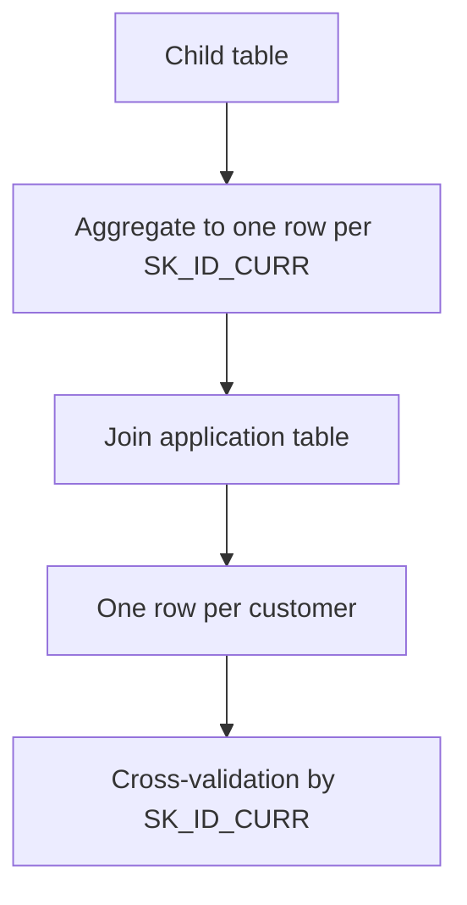

---

# 13. Missing indicators có gây leakage không?

Missing indicator tự nó không gây leakage:

```python
X["EXT_SOURCE_1_missing"] = (
    X["EXT_SOURCE_1"].isna().astype("int8")
)
```

Đây là row-level transformation.

Leakage có thể xuất hiện nếu:

- Chỉ tạo indicator cho cột được chọn bằng target correlation trên toàn data.
- Chọn missingness threshold từ train + validation.
- Loại cột dựa vào test distribution rồi báo local validation như đánh giá độc lập.

Nguyên tắc: quyết định rule bằng train, áp cùng rule cho validation/test.

---

# 14. Competition leakage và production leakage

## 14.1 Validation leakage

Thông tin từ local validation ảnh hưởng vào model.

Hậu quả:

- Local AUC cao giả tạo.
- Leaderboard thấp hơn dự kiến.

## 14.2 Test leakage

Thông tin từ Kaggle test được dùng để điều chỉnh pipeline.

Ví dụ:

- Dùng train + test để xác định category vocabulary.
- Dùng test missingness để loại feature.
- Dùng test distribution để chọn threshold.
- Tune model nhiều lần dựa trên public leaderboard.

Một số kỹ thuật unsupervised có thể được rules cho phép, nhưng chúng làm local validation khó diễn giải và không đại diện production.

## 14.3 Production leakage

Feature có trong offline training nhưng không có tại production scoring time.

Ví dụ:

- Feature chỉ cập nhật cuối tháng.
- External bureau data có độ trễ.
- Feature chứa trạng thái sau phê duyệt.
- Feature pipeline không thể tái tạo online.

Production leakage thường không bị Kaggle leaderboard phát hiện.

---

# 15. Train/test split có đủ không?

Không.

Split đúng chỉ đảm bảo:

```text
Train rows không trùng validation rows
```

Nhưng chưa đảm bảo:

- Transformer chỉ fit trên train.
- Feature selection không nhìn validation.
- Target encoding là out-of-fold.
- Không có dữ liệu tương lai.
- Không có customer trùng fold.
- Không có biến hậu quả của target.
- Hyperparameter tuning không overfit validation.
- Public leaderboard không bị dùng như training signal.

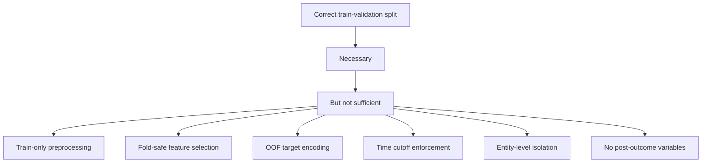

---

# 16. Pipeline cross-validation an toàn

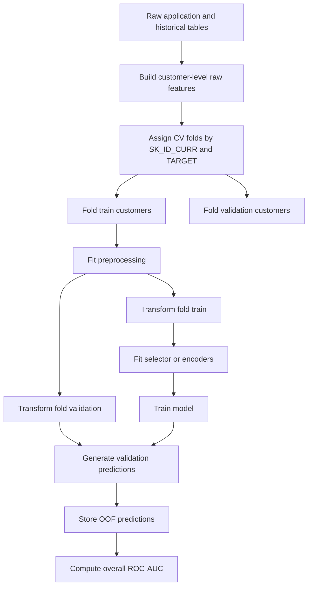

## Ví dụ LightGBM

```python
import numpy as np
import lightgbm as lgb

from sklearn.model_selection import StratifiedKFold
from sklearn.metrics import roc_auc_score

X = model_matrix.drop(columns=["SK_ID_CURR", "TARGET"])
y = model_matrix["TARGET"]

skf = StratifiedKFold(
    n_splits=5,
    shuffle=True,
    random_state=42
)

oof_pred = np.zeros(len(X))

for fold, (train_idx, valid_idx) in enumerate(skf.split(X, y)):
    X_train = X.iloc[train_idx].copy()
    y_train = y.iloc[train_idx].copy()

    X_valid = X.iloc[valid_idx].copy()
    y_valid = y.iloc[valid_idx].copy()

    # Fit train-dependent preprocessing here.
    # selector.fit(X_train, y_train)
    # X_train = selector.transform(X_train)
    # X_valid = selector.transform(X_valid)

    model = lgb.LGBMClassifier(
        objective="binary",
        n_estimators=5000,
        learning_rate=0.03,
        num_leaves=31,
        subsample=0.8,
        colsample_bytree=0.8,
        random_state=42 + fold
    )

    model.fit(
        X_train,
        y_train,
        eval_set=[(X_valid, y_valid)],
        callbacks=[
            lgb.early_stopping(200),
            lgb.log_evaluation(100)
        ]
    )

    oof_pred[valid_idx] = model.predict_proba(X_valid)[:, 1]

auc = roc_auc_score(y, oof_pred)
print(f"OOF ROC-AUC: {auc:.6f}")
```

---

# 17. Time-based validation cho credit scoring

Random stratified split không phải lúc nào cũng đủ cho production.

Nếu có application date, thiết kế tốt hơn là:

```text
Train = applications cũ
Validation = applications mới hơn
```

Ví dụ:

```text
Train: January–September
Validation: October–December
```

Lợi ích:

- Gần với production.
- Đo distribution drift.
- Đo stability qua thời gian.
- Phát hiện feature không tồn tại ở tương lai.

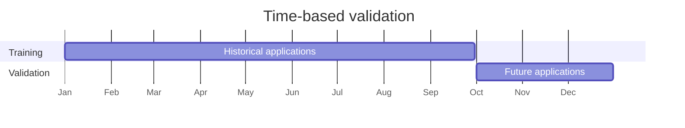

Nếu competition dataset không có timestamp đầy đủ, stratified CV vẫn dùng được nhưng phải ghi rõ giới hạn.

---

# 18. Group split khi một người có nhiều applications

Trong production, một người có thể nộp nhiều application:

```text
PERSON_ID = 5001
├── Application A
├── Application B
└── Application C
```

Nếu Application A nằm train và Application B nằm validation, mô hình có thể gián tiếp nhận ra cùng người.

Khi có customer-level ID nên dùng group split:

```python
from sklearn.model_selection import StratifiedGroupKFold

cv = StratifiedGroupKFold(
    n_splits=5,
    shuffle=True,
    random_state=42
)

for train_idx, valid_idx in cv.split(X, y, groups=person_id):
    ...
```

Trong Home Credit competition, `SK_ID_CURR` là đơn vị application hiện tại. Trong production cần xác định identifier cấp người.

---

# 19. Hyperparameter leakage

Nếu dùng cùng một validation set để thử hàng trăm cấu hình, validation dần trở thành một phần của training process.

```text
Trial 1 → xem AUC
Trial 2 → chỉnh num_leaves
Trial 3 → chỉnh learning_rate
...
Trial 300 → chọn cấu hình tốt nhất
```

Cách giảm:

- Dùng cross-validation.
- Giới hạn search space.
- Có holdout cuối không dùng để tune.
- Dùng nested CV nếu cần estimate nghiêm ngặt.
- Không dùng public leaderboard như objective chính.

---

# 20. Public leaderboard leakage

Trong Kaggle:

```text
Submit → xem public score → chỉnh model → submit lại
```

Lặp quá nhiều có thể làm model overfit public leaderboard subset.

Dấu hiệu:

- Public score tăng.
- Private score giảm.
- Local OOF không cải thiện nhưng leaderboard thay đổi.

Giải pháp:

- Tin OOF score hơn public score.
- Theo dõi variance giữa folds.
- Không chọn feature chỉ vì một submission tăng nhẹ.
- Giữ experiment log.

---

# 21. Checklist theo từng bước

## 21.1 Data ingestion

- [ ] Xác định grain của từng bảng.
- [ ] Xác định primary key và foreign key.
- [ ] Không có duplicate keys bất thường.
- [ ] Không dùng cột phát sinh sau outcome.
- [ ] Có timestamp/cutoff nếu production cần.

## 21.2 Aggregation

- [ ] Child tables được aggregate về `SK_ID_CURR`.
- [ ] Không join raw one-to-many trực tiếp vào model matrix.
- [ ] Không dùng target khi aggregate.
- [ ] Chỉ dùng lịch sử trước scoring timestamp.
- [ ] Row count được giữ như một feature riêng.
- [ ] Distinct count không vô tình cộng trùng giữa chunks.

## 21.3 Split

- [ ] Split theo customer/application entity.
- [ ] Không split child rows độc lập.
- [ ] Target ratio giữa folds hợp lý.
- [ ] Không có `SK_ID_CURR` trùng giữa folds.
- [ ] Nếu phù hợp, dùng time-based split.

## 21.4 Preprocessing

- [ ] Imputer fit train-only.
- [ ] Scaler fit train-only.
- [ ] WOE bins fit train-only.
- [ ] Category mapping fit train-only.
- [ ] PCA fit train-only.
- [ ] Feature selection fit train-only.

## 21.5 Encoding

- [ ] Target encoding dùng out-of-fold.
- [ ] Category hiếm có smoothing.
- [ ] Unseen category có fallback.
- [ ] Frequency encoding không dùng validation distribution nếu cần đánh giá thuần túy.

## 21.6 Evaluation

- [ ] OOF prediction phủ toàn bộ training rows.
- [ ] AUC được tính trên OOF predictions.
- [ ] Không tune trực tiếp trên holdout cuối.
- [ ] So sánh variance giữa folds.
- [ ] Theo dõi stability theo thời gian hoặc cohort.

---

# 22. Test tự động để phát hiện leakage

## 22.1 Customer overlap

```python
overlap = set(train_ids) & set(valid_ids)

assert len(overlap) == 0, (
    f"Found {len(overlap)} overlapping customers"
)
```

## 22.2 Một dòng mỗi khách hàng

```python
assert model_matrix["SK_ID_CURR"].is_unique
```

## 22.3 Target không nằm trong feature

```python
forbidden_columns = {
    "TARGET",
    "target",
    "label",
    "default_flag"
}

leaked_columns = set(model_features) & forbidden_columns
assert not leaked_columns
```

## 22.4 Suspicious univariate AUC

```python
from sklearn.metrics import roc_auc_score

def univariate_auc(x, y):
    mask = x.notna()

    if mask.sum() == 0:
        return None

    auc = roc_auc_score(y[mask], x[mask])
    return max(auc, 1 - auc)
```

Feature có AUC gần 1.0 không chắc chắn là leakage, nhưng phải được review.

## 22.5 Timestamp validation

```python
invalid_rows = history[
    history["event_timestamp"]
    > history["scoring_timestamp"]
]

assert invalid_rows.empty
```

---

# 23. Safe và unsafe transformations

| Transformation | Thường an toàn trước split? | Ghi chú |
|---|---:|---|
| `AMT_CREDIT / AMT_INCOME_TOTAL` | Có | Row-level, không học từ row khác |
| Missing indicator | Có | Nếu rule cột đã cố định |
| Customer-level history mean | Có | Chỉ dùng lịch sử hợp lệ của customer |
| Customer row count | Có | Chỉ dùng pre-application data |
| Global median imputation | Không | Phải fit train-only |
| Standardization | Không | Phải fit train-only |
| PCA | Không | Phải fit train-only |
| Target encoding | Không | Cần out-of-fold |
| WOE binning | Không | Phải fit train-only |
| Feature selection by target | Không | Phải chạy trong fold |
| Future payment behavior | Không | Temporal leakage |
| Final loan outcome | Không | Target leakage |

---

# 24. Anti-patterns phổ biến

## Anti-pattern 1: split sau khi join raw child table

```python
df = application_train.merge(
    installments_payments,
    on="SK_ID_CURR"
)

train_df, valid_df = train_test_split(df)
```

Vấn đề:

- Row explosion.
- Customer overlap.
- Validation sai grain.

## Anti-pattern 2: fit trên train + test

```python
full = pd.concat([train, test])
full = fit_transform_all_features(full)
```

Vấn đề:

- Test distribution ảnh hưởng feature engineering.
- Local validation khó diễn giải.

## Anti-pattern 3: feature selection trước split

```python
corr = train.corrwith(train["TARGET"])
selected = corr.abs().nlargest(100).index
```

Sau đó mới tạo validation split.

Validation labels đã ảnh hưởng danh sách feature.

## Anti-pattern 4: full-data target encoding

```python
occupation_rate = train.groupby(
    "OCCUPATION_TYPE"
)["TARGET"].mean()

train["occupation_te"] = train[
    "OCCUPATION_TYPE"
].map(occupation_rate)
```

Vấn đề:

- Self-target leakage.
- Category hiếm nguy hiểm.

## Anti-pattern 5: post-outcome feature

```text
payment_default_after_application
```

Feature xảy ra sau scoring date nên không hợp lệ.

---

# 25. Pipeline đề xuất cho Home Credit

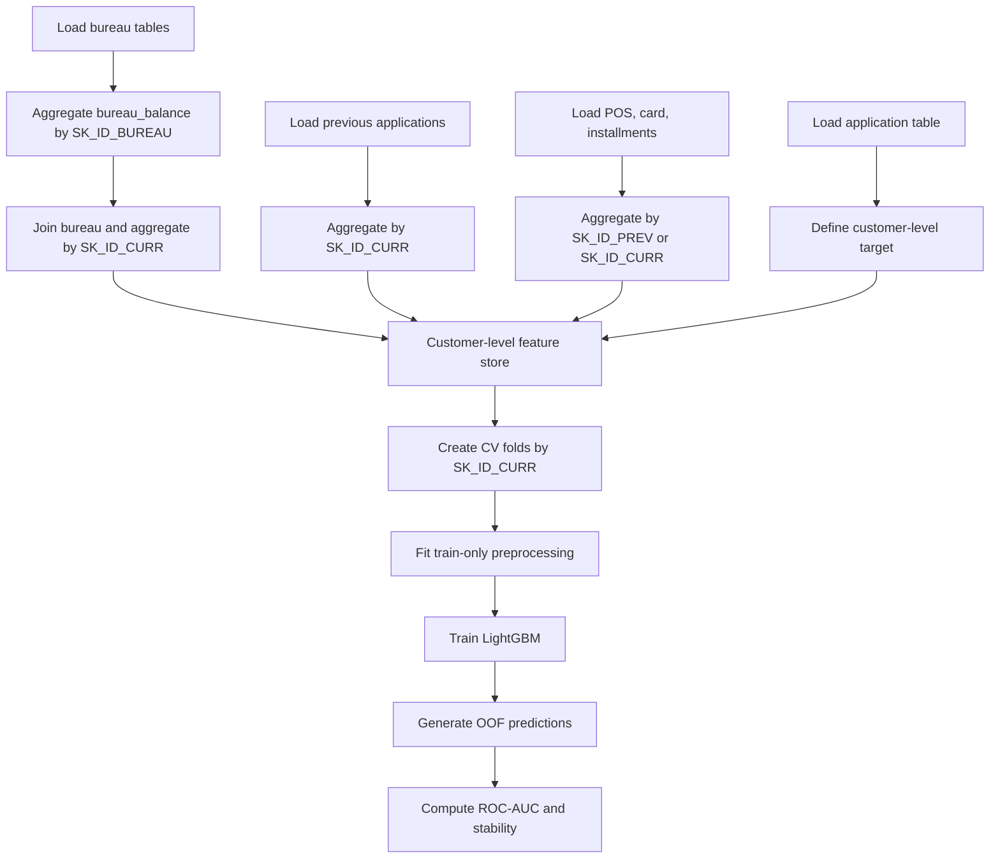

Recommended order:

1. Xác định scoring timestamp.
2. Xác định grain từng bảng.
3. Loại post-outcome columns.
4. Aggregate child tables về `SK_ID_CURR`.
5. Tạo master table một dòng mỗi applicant.
6. Tạo folds.
7. Fit preprocessing trong fold.
8. Tạo OOF predictions.
9. Đánh giá AUC và stability.
10. Retrain trên full train.
11. Transform competition test bằng pipeline đã fit.

---

# 26. Leakage trong feature extraction A/B/C

Giả sử pipeline có ba tầng:

| Stage | Data |
|---|---|
| A | Static application features |
| B | A + depth-1 historical sources |
| C | B + depth-2 monthly/history sources |

AUC tăng từ A tới B và C không tự động chứng minh pipeline không có leakage.

Cần kiểm tra:

- Depth-1 data có tồn tại trước application date không?
- Depth-2 monthly records có chứa dữ liệu sau application không?
- Feature selection mỗi stage có fit trên full train trước CV không?
- Category statistics có dùng validation fold không?
- Missing indicator selection có nhìn toàn dataset không?
- Mỗi `SK_ID_CURR` có nằm đúng một fold không?

Cách so sánh đúng:

```text
Stage A:
- Build valid static features
- Evaluate with fixed CV folds

Stage B:
- Add valid depth-1 features
- Use exactly the same CV folds
- Refit train-dependent transforms per fold

Stage C:
- Add valid depth-2 features
- Use exactly the same CV folds
- Refit train-dependent transforms per fold
```

Dùng cùng folds giúp incremental gain được so sánh công bằng.

---

# 27. Cách tư duy để phát hiện leakage

Một split đúng chỉ trả lời:

> Row nào thuộc train và row nào thuộc validation?

Leakage control đầy đủ phải trả lời thêm:

1. Ai đã được dùng để tính feature?
2. Feature được tạo ở thời điểm nào?
3. Transformer đã nhìn thấy distribution nào?
4. Feature selector đã nhìn thấy label nào?
5. Customer có xuất hiện ở nhiều partition không?
6. Feature có tái tạo được tại production scoring time không?
7. Validation có bị dùng quá nhiều lần để tune không?

Nguyên tắc quan trọng nhất:

> Tại mỗi bước, hãy hỏi: thông tin này có thực sự tồn tại tại thời điểm mô hình phải đưa ra dự đoán không?

---

# 28. Tóm tắt

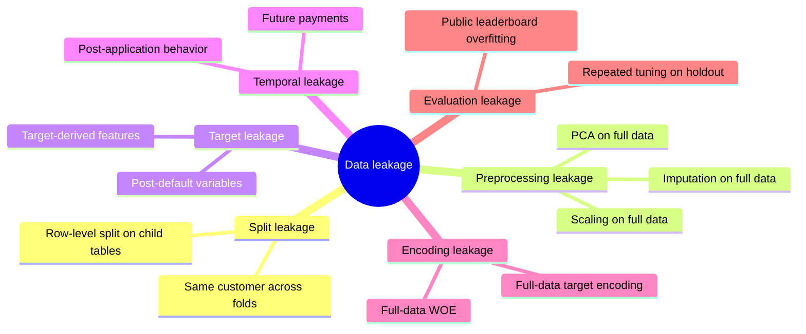

Data leakage trong Home Credit không chỉ là train/test split.

Một pipeline an toàn cần:

```text
Entity isolation
+ Train-only preprocessing
+ Fold-safe feature selection
+ Out-of-fold target encoding
+ Historical time cutoff
+ One row per customer
+ No post-outcome variables
+ Honest validation protocol
```

---

## Final checklist

- [ ] Một dòng cuối cùng cho mỗi `SK_ID_CURR`.
- [ ] Không có `SK_ID_CURR` trùng giữa folds.
- [ ] Mọi child record đi theo customer tương ứng.
- [ ] Không có feature phát sinh sau scoring time.
- [ ] Không có biến hậu quả của target.
- [ ] Preprocessing fit train-only.
- [ ] Feature selection chạy trong fold.
- [ ] Target encoding là out-of-fold.
- [ ] OOF AUC được dùng làm metric chính.
- [ ] Public leaderboard chỉ là tín hiệu phụ.
- [ ] Pipeline có thể tái tạo trong production.
