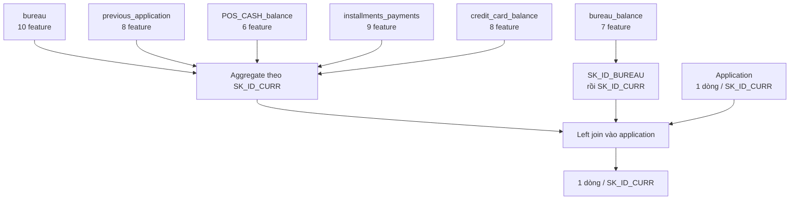

# Báo cáo cách tạo feature aggregate từ các bảng lịch sử HCDR

## 1. Mục tiêu và phạm vi

Báo cáo này giải thích **từng feature mới** được pipeline Home Credit Default Risk
tạo từ sáu bảng lịch sử trước khi ghép vào dữ liệu application. Nguồn sự thật là
implementation hiện tại trong
[`aggregate.py`](../../../../src/home_credit_default_rate/aggregate.py).

Phạm vi chỉ gồm 48 feature lịch sử của Stage B/C. Các feature làm sạch và ratio
tạo trực tiếp từ `application_train`/`application_test` không nằm trong báo cáo này.

## 2. Nguyên tắc aggregate

`application` có đúng một dòng cho mỗi `SK_ID_CURR`, trong khi một khách hàng có
thể có nhiều khoản vay, application cũ, kỳ thanh toán và snapshot tháng. Nếu join
trực tiếp, một application sẽ bị nhân thành nhiều dòng. Pipeline vì vậy tổng hợp
mỗi bảng lịch sử về tối đa một dòng cho mỗi khách hàng rồi mới left join:



Pipeline không tự động áp dụng `min`, `max` và `avg` lên mọi cột. Cột và phép
tổng hợp được chọn theo ý nghĩa:

- `count(*)` đo số dòng lịch sử;
- `count(distinct SK_ID_PREV)` đo số hợp đồng;
- `mean` mô tả mức điển hình theo dòng hoặc snapshot;
- `max` giữ lại mức cực đại như dư nợ hoặc DPD lớn nhất;
- `min` được dùng cho mốc xa nhất hoặc tỷ lệ thanh toán thấp nhất;
- `sum` đo tổng quy mô, tổng dư nợ hoặc tổng thiếu hụt;
- trung bình của cờ 0/1 tạo tỷ lệ trạng thái.

Trong các công thức dưới đây, `I(điều kiện)` bằng 1 khi điều kiện đúng và bằng 0
khi sai. Các phép `avg`, `min`, `max` và `sum` của DuckDB bỏ qua null;
`count(*)` vẫn đếm dòng. Mỗi công thức mặc định được tính trong nhóm của một
`SK_ID_CURR`, trừ khi phần mô tả ghi rõ aggregate hai cấp.

## 3. Tổng quan 48 feature

| Bảng nguồn | Grain raw | Grain output | Số feature | Stage |
| ---------- | --------- | ------------ | ----------: | ----- |
| `bureau` | một khoản tín dụng bureau | một khách hàng | 10 | B |
| `previous_application` | một application cũ | một khách hàng | 8 | B |
| `bureau_balance` | một tháng của khoản bureau | một khách hàng | 7 | C |
| `POS_CASH_balance` | một snapshot tháng POS/cash | một khách hàng | 6 | C |
| `installments_payments` | một lần thanh toán | một khách hàng | 9 | C |
| `credit_card_balance` | một snapshot tháng thẻ | một khách hàng | 8 | C |
| **Tổng** | | | **48** | |

Stage B thêm 18 feature từ `bureau` và `previous_application`. Stage C thêm 30
feature từ bốn bảng còn lại.

## 4. Bảng `bureau`: lịch sử tín dụng tại tổ chức khác

Mỗi dòng raw là một khoản tín dụng được Credit Bureau ghi nhận. Pipeline chọn
feature về số lượng khoản, quy mô tín dụng, dư nợ, thời điểm mở và trạng thái:

| Feature mới | Công thức | Diễn giải |
| ----------- | --------- | --------- |
| `BUREAU_APP_CNT` | `count(*)` | Tổng số khoản tín dụng bureau của khách hàng. |
| `BUREAU_AMT_CREDIT_SUM_MEAN` | `avg(AMT_CREDIT_SUM)` | Quy mô tín dụng trung bình trên mỗi khoản. |
| `BUREAU_AMT_CREDIT_SUM_MAX` | `max(AMT_CREDIT_SUM)` | Quy mô tín dụng lớn nhất từng được ghi nhận. |
| `BUREAU_AMT_CREDIT_SUM_SUM` | `sum(AMT_CREDIT_SUM)` | Tổng quy mô tín dụng của tất cả khoản. |
| `BUREAU_AMT_DEBT_MEAN` | `avg(AMT_CREDIT_SUM_DEBT)` | Dư nợ trung bình trên mỗi khoản. |
| `BUREAU_AMT_DEBT_SUM` | `sum(AMT_CREDIT_SUM_DEBT)` | Tổng dư nợ bureau của khách hàng. |
| `BUREAU_DAYS_CREDIT_MEAN` | `avg(DAYS_CREDIT)` | Khoảng cách ngày trung bình từ lúc mở khoản tín dụng tới application hiện tại. |
| `BUREAU_DAYS_CREDIT_MIN` | `min(DAYS_CREDIT)` | Giá trị âm nhỏ nhất, tương ứng khoản được mở xa nhất trong quá khứ. |
| `BUREAU_ACTIVE_RATIO` | `sum(I(CREDIT_ACTIVE='Active')) / count(*)` | Tỷ lệ khoản còn active. |
| `BUREAU_CLOSED_RATIO` | `sum(I(CREDIT_ACTIVE='Closed')) / count(*)` | Tỷ lệ khoản đã closed. |

Hai tỷ lệ trạng thái dùng toàn bộ số dòng bureau làm mẫu số. Trạng thái khác
`Active` hoặc `Closed` vẫn nằm trong mẫu số nhưng đóng góp 0 vào tử số tương ứng.

## 5. Bảng `previous_application`: application Home Credit trước đây

Mỗi dòng raw là một application cũ. Pipeline giữ số lần nộp, số tiền đề nghị,
số tiền tín dụng được ghi nhận và kết quả xét duyệt:

| Feature mới | Công thức | Diễn giải |
| ----------- | --------- | --------- |
| `PREV_APP_CNT` | `count(*)` | Tổng số application trước đây. |
| `PREV_AMT_APPLICATION_MEAN` | `avg(AMT_APPLICATION)` | Số tiền khách đề nghị trung bình. |
| `PREV_AMT_APPLICATION_MAX` | `max(AMT_APPLICATION)` | Số tiền đề nghị lớn nhất. |
| `PREV_AMT_APPLICATION_MIN` | `min(AMT_APPLICATION)` | Số tiền đề nghị nhỏ nhất. |
| `PREV_AMT_CREDIT_MEAN` | `avg(AMT_CREDIT)` | Số tiền tín dụng được ghi nhận trung bình. |
| `PREV_AMT_CREDIT_MAX` | `max(AMT_CREDIT)` | Số tiền tín dụng được ghi nhận lớn nhất. |
| `PREV_REFUSED_RATIO` | `avg(I(NAME_CONTRACT_STATUS='Refused'))` | Tỷ lệ application bị từ chối. |
| `PREV_APPROVED_RATIO` | `avg(I(NAME_CONTRACT_STATUS='Approved'))` | Tỷ lệ application được duyệt. |

Hai feature trạng thái là trung bình của cờ 0/1, tương đương số application có
trạng thái tương ứng chia cho tổng số application cũ.

## 6. Bảng `bureau_balance`: lịch sử tháng của khoản bureau

### 6.1. Vì sao phải aggregate hai cấp

`bureau_balance` chỉ có `SK_ID_BUREAU`, không có `SK_ID_CURR`. Pipeline trước hết
nén các dòng tháng về một dòng cho mỗi khoản bureau, sau đó dùng bảng `bureau` để
ánh xạ khoản đó về khách hàng:

```text
bureau_balance (nhiều tháng)
  -> GROUP BY SK_ID_BUREAU
  -> JOIN bureau USING (SK_ID_BUREAU)
  -> GROUP BY SK_ID_CURR
```

### 6.2. Feature trung gian cấp khoản vay

| Feature trung gian | Công thức theo `SK_ID_BUREAU` | Diễn giải |
| ------------------ | -------------------------------- | --------- |
| `MONTHS_MIN` | `min(MONTHS_BALANCE)` | Tháng xa nhất trong lịch sử khoản vay. |
| `MONTHS_MAX` | `max(MONTHS_BALANCE)` | Tháng gần application nhất. |
| `MONTHS_SIZE` | `count(*)` | Số snapshot tháng của khoản vay. |
| `STATUS_0_RATIO` | `avg(I(STATUS='0'))` | Tỷ lệ tháng có trạng thái 0. |
| `STATUS_DPD_RATIO` | `avg(I(STATUS in ('1','2','3','4','5')))` | Tỷ lệ tháng có trạng thái quá hạn 1–5. |
| `STATUS_C_RATIO` | `avg(I(STATUS='C'))` | Tỷ lệ tháng khoản vay ở trạng thái closed. |

### 6.3. Feature đầu ra cấp khách hàng

| Feature mới | Công thức trên các khoản của khách hàng | Diễn giải |
| ----------- | ---------------------------------------- | --------- |
| `BB_MONTHS_MIN_MEAN` | `avg(MONTHS_MIN)` | Trung bình mốc tháng xa nhất của từng khoản. |
| `BB_MONTHS_MIN_MIN` | `min(MONTHS_MIN)` | Mốc lịch sử xa nhất trong tất cả khoản bureau. |
| `BB_MONTHS_MAX_MAX` | `max(MONTHS_MAX)` | Mốc lịch sử gần application nhất. |
| `BB_MONTHS_SIZE_SUM` | `sum(MONTHS_SIZE)` | Tổng số snapshot tháng của mọi khoản bureau. |
| `BB_STATUS_0_RATIO_MEAN` | `avg(STATUS_0_RATIO)` | Trung bình tỷ lệ tháng trạng thái 0 giữa các khoản. |
| `BB_STATUS_DPD_RATIO_MEAN` | `avg(STATUS_DPD_RATIO)` | Trung bình tỷ lệ tháng quá hạn 1–5 giữa các khoản. |
| `BB_STATUS_C_RATIO_MEAN` | `avg(STATUS_C_RATIO)` | Trung bình tỷ lệ tháng closed giữa các khoản. |

Ba tỷ lệ đầu ra là **trung bình không trọng số giữa các khoản vay**. Ví dụ, một
khoản có 3 tháng và một khoản có 30 tháng có trọng số bằng nhau ở bước aggregate
thứ hai. Đây không phải tỷ lệ tính trực tiếp trên toàn bộ dòng tháng của khách hàng.

## 7. Bảng `POS_CASH_balance`: snapshot tháng POS/cash loan

Bảng này đã có `SK_ID_CURR`, nên được aggregate trực tiếp về khách hàng:

| Feature mới | Công thức | Diễn giải |
| ----------- | --------- | --------- |
| `POS_ROW_CNT` | `count(*)` | Tổng số snapshot tháng POS/cash. |
| `POS_PREV_CNT` | `count(distinct SK_ID_PREV)` | Số hợp đồng POS/cash khác nhau. |
| `POS_DPD_MEAN` | `avg(SK_DPD)` | Số ngày quá hạn trung bình theo snapshot. |
| `POS_DPD_MAX` | `max(SK_DPD)` | Số ngày quá hạn lớn nhất. |
| `POS_DPD_DEF_MEAN` | `avg(SK_DPD_DEF)` | DPD có tolerance trung bình theo snapshot. |
| `POS_DPD_DEF_MAX` | `max(SK_DPD_DEF)` | DPD có tolerance lớn nhất. |

`POS_ROW_CNT` đo số snapshot, còn `POS_PREV_CNT` đo số hợp đồng. Một hợp đồng có
thể đóng góp nhiều snapshot nên hai đại lượng này không tương đương.

## 8. Bảng `installments_payments`: hành vi trả góp

### 8.1. Đại lượng tạo ở cấp dòng thanh toán

Trước khi aggregate, pipeline tạo bốn đại lượng:

- `DPD = max(DAYS_ENTRY_PAYMENT - DAYS_INSTALMENT, 0)`: số ngày trả trễ;
- `DBD = max(DAYS_INSTALMENT - DAYS_ENTRY_PAYMENT, 0)`: số ngày trả sớm;
- `PAYMENT_PERC = AMT_PAYMENT / AMT_INSTALMENT`: tỷ lệ thực trả trên số phải trả;
  mẫu số 0 được đổi thành null;
- `PAYMENT_DIFF = AMT_INSTALMENT - AMT_PAYMENT`: phần tiền còn thiếu; giá trị âm
  biểu thị thực trả lớn hơn số tiền kỳ hạn.

### 8.2. Feature đầu ra cấp khách hàng

| Feature mới | Công thức | Diễn giải |
| ----------- | --------- | --------- |
| `INS_ROW_CNT` | `count(*)` | Tổng số dòng thanh toán trả góp. |
| `INS_PREV_CNT` | `count(distinct SK_ID_PREV)` | Số hợp đồng trả góp khác nhau. |
| `INS_DPD_MEAN` | `avg(DPD)` | Số ngày trả trễ trung bình, gồm lần không trễ với giá trị 0. |
| `INS_DPD_MAX` | `max(DPD)` | Số ngày trả trễ lớn nhất. |
| `INS_DBD_MEAN` | `avg(DBD)` | Số ngày trả sớm trung bình, gồm lần không sớm với giá trị 0. |
| `INS_PAYMENT_PERC_MEAN` | `avg(PAYMENT_PERC)` | Tỷ lệ thanh toán trung bình. |
| `INS_PAYMENT_PERC_MIN` | `min(PAYMENT_PERC)` | Tỷ lệ thanh toán thấp nhất trong một kỳ. |
| `INS_PAYMENT_DIFF_MEAN` | `avg(PAYMENT_DIFF)` | Phần thiếu hụt thanh toán trung bình mỗi dòng. |
| `INS_PAYMENT_DIFF_SUM` | `sum(PAYMENT_DIFF)` | Tổng phần thiếu hụt trên toàn bộ lịch sử trả góp. |

## 9. Bảng `credit_card_balance`: snapshot tháng thẻ tín dụng

Pipeline tính mức sử dụng hạn mức trên mỗi snapshot:

```text
UTILIZATION = AMT_BALANCE / AMT_CREDIT_LIMIT_ACTUAL
```

Nếu `AMT_CREDIT_LIMIT_ACTUAL = 0`, mẫu số được đổi thành null để tránh chia cho 0.

| Feature mới | Công thức | Diễn giải |
| ----------- | --------- | --------- |
| `CC_ROW_CNT` | `count(*)` | Tổng số snapshot tháng thẻ tín dụng. |
| `CC_PREV_CNT` | `count(distinct SK_ID_PREV)` | Số hợp đồng thẻ khác nhau. |
| `CC_AMT_BALANCE_MEAN` | `avg(AMT_BALANCE)` | Dư nợ thẻ trung bình theo snapshot. |
| `CC_AMT_BALANCE_MAX` | `max(AMT_BALANCE)` | Dư nợ thẻ lớn nhất. |
| `CC_UTILIZATION_MEAN` | `avg(UTILIZATION)` | Mức sử dụng hạn mức trung bình. |
| `CC_UTILIZATION_MAX` | `max(UTILIZATION)` | Mức sử dụng hạn mức lớn nhất. |
| `CC_DPD_MEAN` | `avg(SK_DPD)` | Số ngày quá hạn trung bình theo snapshot. |
| `CC_DPD_MAX` | `max(SK_DPD)` | Số ngày quá hạn lớn nhất. |

## 10. Cách 48 feature được ghép vào training data

Sau khi mỗi block chỉ còn tối đa một dòng cho mỗi `SK_ID_CURR`, pipeline thực hiện
left join với application bằng `validate="one_to_one"` và kiểm tra số dòng sau mỗi
join không thay đổi:

- Stage A: chỉ dùng feature application;
- Stage B: thêm 18 feature từ `bureau` và `previous_application`;
- Stage C: thêm 30 feature từ `bureau_balance`, POS, installments và credit card.

Khách hàng không có lịch sử trong một bảng phụ vẫn được giữ lại; các feature của
block đó là missing. Aggregate không sử dụng `TARGET`, còn imputation, scaling,
one-hot, binning, WoE và lựa chọn feature chỉ được fit trên train split sau đó.
Implementation ghép matrix nằm trong
[`build_feature_matrix()`](../../../../src/home_credit_default_rate/aggregate.py).

## 11. Giới hạn của bộ aggregate hiện tại

Các điểm sau mô tả đúng implementation hiện tại, không phải lỗi dữ liệu:

- POS, installments và credit card được aggregate trực tiếp theo `SK_ID_CURR`;
  feature `mean` là trung bình theo dòng/snapshot, không cân bằng theo hợp đồng;
- ngoài `bureau_balance`, pipeline chưa aggregate từng `SK_ID_PREV` trước khi về
  cấp khách hàng;
- chưa có cửa sổ gần đây như 3/6/12 tháng;
- chưa tạo mode hoặc trạng thái gần nhất cho các cột categorical;
- aggregate cache không chứa hash của raw CSV hoặc câu SQL, nên thay đổi source hay
  công thức cần invalidation đúng file cache trước khi chạy lại.

## 12. Nguồn kiểm chứng

- [`aggregate.py`](../../../../src/home_credit_default_rate/aggregate.py): toàn bộ
  câu SQL tạo 48 feature và contract join một-một.
- [`pipeline.py`](../../../../src/home_credit_default_rate/pipeline.py): mô tả
  feature, split và các bước tiền xử lý/modeling sau khi dựng matrix.
- [`src-data-extraction-and-flow-report-vi.md`](src-data-extraction-and-flow-report-vi.md):
  luồng end-to-end từ dữ liệu raw tới artifact và submission.
