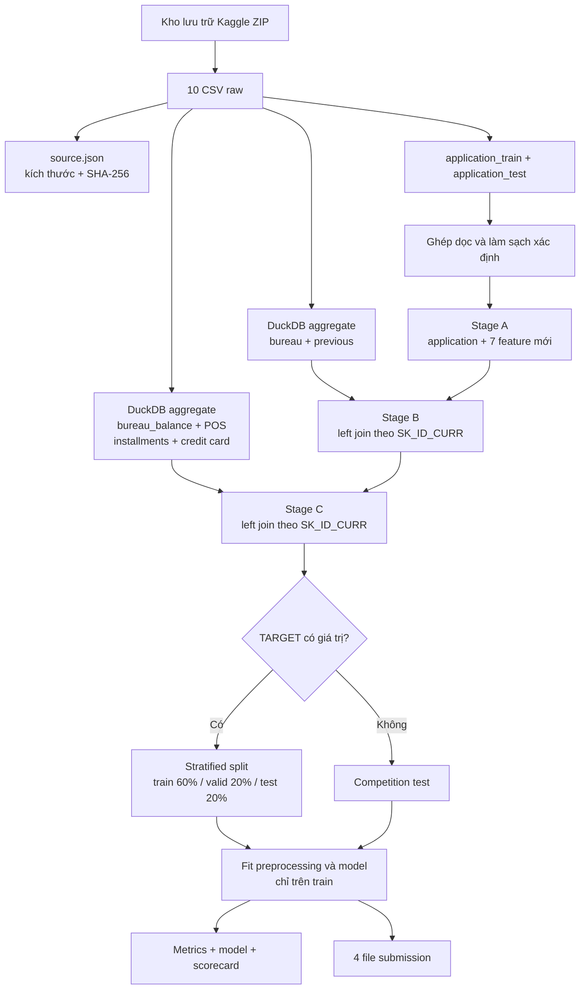

# Luồng trích xuất dữ liệu trong `src/home_credit_default_rate`

> **Câu hỏi chính:** snapshot Home Credit Default Risk đi từ file Kaggle đến feature
> matrix, split, model và submission như thế nào trong implementation hiện tại?
>
> **Phạm vi:** code trong `src/home_credit_default_rate/`, hai entry point chuẩn bị/chạy
> dữ liệu và artifact local đã tồn tại ngày 03/08/2026. Báo cáo không phân tích sâu
> chất lượng mô hình; kết quả model tổng hợp nằm trong
> [báo cáo tuần 2](../../weekly-report/week2/week2-report-hcdr.md).

## 1. Câu trả lời ngắn

Pipeline lấy hai bảng application làm **xương sống một dòng cho mỗi `SK_ID_CURR`**.
Các bảng lịch sử one-to-many không được join trực tiếp. Chúng được DuckDB đọc từ CSV,
tổng hợp về đúng một dòng cho mỗi `SK_ID_CURR`, cache thành Parquet, rồi mới left join
vào application. Sau đó chỉ các dòng có `TARGET` mới được chia ngẫu nhiên phân tầng
60/20/20; mọi phép học từ dữ liệu như imputation, scaling, one-hot, binning, WoE và
chọn feature đều fit trên train split.



**Verified từ artifact local:** Stage C giữ nguyên 356.255 application, gồm 307.511
dòng có nhãn và 48.744 dòng competition test. Matrix có 177 cột: `SK_ID_CURR`,
`TARGET` và 175 feature. `SK_ID_CURR` trong ba split là duy nhất và không mất dòng.

## 2. Thành phần và trách nhiệm

| Thành phần                                                                                 | Trách nhiệm                                                                        |
| -------------------------------------------------------------------------------------------- | ------------------------------------------------------------------------------------ |
| [`scripts/data/prepare_hcdr_data.py`](../../../scripts/data/prepare_hcdr_data.py)           | Giải nén ZIP, kiểm đủ 10 CSV, băm archive và từng CSV vào`source.json`    |
| [`data.py`](../../../src/home_credit_default_rate/data.py)                                  | Resolve/đọc bảng application, kiểm tra khóa, xử lý sentinel và tạo ratio    |
| [`aggregate.py`](../../../src/home_credit_default_rate/aggregate.py)                        | Đọc sáu bảng lịch sử bằng DuckDB, aggregate và cache Parquet                 |
| [`pipeline.py`](../../../src/home_credit_default_rate/pipeline.py)                          | Orchestrate matrix A/B/C, split, EDA, preprocessing, model, scorecard và submission |
| [`scripts/pipelines/run_hcdr_pipeline.py`](../../../scripts/pipelines/run_hcdr_pipeline.py) | CLI chọn level A/B/C và truyền ba thư mục chuẩn vào`run_pipeline()`         |
| [`tests/test_home_credit.py`](../../../tests/test_home_credit.py)                           | Kiểm tra contract làm sạch, Stage A và column profile ở mức unit test          |

## 3. Luồng chi tiết từng bước

### Bước 0 — đặt archive vào raw directory

`prepare_hcdr_data.py` **không tự tải dữ liệu**. Điều kiện đầu vào của nó là file:

```text
datasets/raw/home-credit-default-risk/home-credit-default-risk.zip
```

Có thể lấy archive bằng Kaggle CLI sau khi tài khoản đã chấp nhận điều khoản cuộc thi:

```bash
mkdir -p datasets/raw/home-credit-default-risk
uv run kaggle competitions download \
  -c home-credit-default-risk \
  -p datasets/raw/home-credit-default-risk
```

Credential và archive nằm ngoài Git. Không in token vào log.

### Bước 1 — giải nén và fingerprint nguồn

Chạy:

```bash
uv run python scripts/data/prepare_hcdr_data.py
```

Script thực hiện tuần tự:

1. resolve `--raw-dir` thành đường dẫn tuyệt đối;
2. yêu cầu archive tồn tại, nếu không thì dừng bằng `FileNotFoundError`;
3. dùng `ZipFile.extractall()` giải nén vào raw directory;
4. lấy các file `*.csv` ngay dưới raw directory và yêu cầu đúng **10 file**;
5. tính byte size và SHA-256 theo chunk 1 MiB cho archive và từng CSV;
6. ghi `source.json` với competition slug, thời điểm UTC và fingerprint.

**Verified trên snapshot local:** archive có 721.616.255 byte. Manifest ghi 10 CSV;
chín file dữ liệu/metadata/submission được mô tả chi tiết trong
[báo cáo cấu trúc dữ liệu](home_credit_default_risk_data_structure_report_vi.md),
trong đó `HomeCredit_columns_description.csv` là metadata chứ không phải input model.

**Giới hạn:** bước này chứng minh file nào đã được giải nén, nhưng
`run_pipeline()` hiện không đọc lại `source.json` để xác nhận raw CSV vẫn khớp hash.

### Bước 2 — resolve và load hai bảng application

Entry point mặc định gọi:

```python
run_pipeline(
    Path("datasets/raw/home-credit-default-risk"),
    Path("datasets/processed/hcdr"),
    Path("outputs/hcdr"),
    level="C",
)
```

Trong `data.py`, `TABLE_FILES` ánh xạ tên logic sang đúng filename, kể cả tên có chữ
hoa `POS_CASH_balance.csv`. `resolve_table_path()` từ chối tên bảng lạ và dừng rõ ràng
nếu file thiếu. `load_tables()` mặc định chỉ nạp:

- `application_train.csv`: 307.511 dòng × 122 cột, có `TARGET`;
- `application_test.csv`: 48.744 dòng × 121 cột, không có `TARGET`.

Hai bảng được đọc bằng `pandas.read_csv(..., low_memory=False)`. Sáu bảng lịch sử
không được nạp đồng thời vào pandas vì chúng lớn hơn nhiều; chúng đi qua DuckDB ở
Bước 5.

### Bước 3 — ghép train/test trước khi làm sạch xác định

`application_test` được `reindex` theo toàn bộ cột của train, làm cho `TARGET` của test
thành missing. Hai bảng sau đó được `concat` dọc thành 356.255 dòng.

Việc ghép trước cleaning không gây target leakage trong implementation hiện tại vì
`clean_application()` chỉ áp dụng các rule cố định theo từng dòng; nó không học median,
category frequency hay thống kê từ train/test. Pipeline vẫn giữ `TARGET` để tách lại
hai population sau feature extraction.

### Bước 4 — làm sạch application và tạo 7 feature

`clean_application()` trước hết yêu cầu có `SK_ID_CURR` và khóa này không trùng. Sau đó nó xử lý theo thứ tự:

| Input/rule                          | Xử lý                                     | Feature phát sinh             |
| ----------------------------------- | ------------------------------------------- | ------------------------------ |
| `DAYS_EMPLOYED == 365243`         | Ghi cờ, thay sentinel bằng`NaN`         | `DAYS_EMPLOYED_ANOMALY`      |
| `CODE_GENDER == "XNA"`            | Ghi cờ, thay bằng missing                 | `CODE_GENDER_ANOMALY`        |
| `NAME_FAMILY_STATUS == "Unknown"` | Ghi cờ, thay bằng missing                 | `NAME_FAMILY_STATUS_ANOMALY` |
| mọi cột bắt đầu bằng`DAYS_` | Lấy trị tuyệt đối sau khi bỏ sentinel | không thêm cột              |
| `AMT_CREDIT / AMT_INCOME_TOTAL`   | Mẫu số 0 đổi thành`NaN`              | `CREDIT_INCOME_RATIO`        |
| `AMT_ANNUITY / AMT_INCOME_TOTAL`  | Mẫu số 0 đổi thành`NaN`              | `ANNUITY_INCOME_RATIO`       |
| `AMT_CREDIT / AMT_GOODS_PRICE`    | Mẫu số 0 đổi thành`NaN`              | `CREDIT_GOODS_RATIO`         |
| `DAYS_EMPLOYED / DAYS_BIRTH`      | Mẫu số 0 đổi thành`NaN`              | `EMPLOYED_BIRTH_RATIO`       |

Pipeline gọi hàm hai lần:

1. trên bảng train+test kết hợp để lấy dữ liệu clean;
2. trên train raw riêng để lấy ba dòng anomaly findings và bad rate có nhãn cho EDA.

Chỉ phần có nhãn của bảng clean được ghi thành
`datasets/processed/hcdr/application-clean.parquet`. Artifact hiện tại có 307.511
dòng × 129 cột. Competition test clean không có file riêng; nó được giữ trong feature
matrix kết hợp ở bước sau.

### Bước 5 — aggregate các bảng lịch sử theo cách tiết kiệm bộ nhớ

Mỗi hàm aggregate tạo SQL trên `read_csv_auto(..., sample_size=100000)`. DuckDB chạy
8 thread, giới hạn bộ nhớ 6 GiB và dùng
`datasets/processed/hcdr/aggregates/duckdb_tmp/` làm vùng spill. Kết quả được ghi ZSTD
Parquet trước khi pandas đọc phần đã thu gọn.

| Block                     | Grain raw → grain output                         | Phép tổng hợp chính                                           | Feature mới | Dòng cache hiện tại |
| ------------------------- | ------------------------------------------------- | ----------------------------------------------------------------- | -----------: | ---------------------: |
| `bureau`                | nhiều credit ngoài Home Credit →`SK_ID_CURR` | count; mean/max/sum credit và debt; recency; active/closed ratio |           10 |                305.811 |
| `previous`              | nhiều application trước →`SK_ID_CURR`       | count; mean/max/min amount; approved/refused ratio                |            8 |                338.857 |
| `bureau_balance`        | tháng →`SK_ID_BUREAU` → `SK_ID_CURR`       | month extent/count; tỷ lệ status 0, DPD 1–5 và closed         |            7 |                134.542 |
| `POS_CASH_balance`      | nhiều snapshot tháng →`SK_ID_CURR`           | row/loan count; mean/max`SK_DPD` và `SK_DPD_DEF`             |            6 |                337.252 |
| `installments_payments` | nhiều payment →`SK_ID_CURR`                   | row/loan count; DPD/DBD; payment ratio và shortfall              |            9 |                339.587 |
| `credit_card_balance`   | nhiều snapshot tháng →`SK_ID_CURR`           | row/contract count; balance; utilization; DPD                     |            8 |                103.558 |

Luồng `bureau_balance` là trường hợp hai tầng duy nhất trong SQL hiện tại:

1. aggregate từng `SK_ID_BUREAU` thành `by_loan`;
2. inner join `by_loan` với `bureau` qua `SK_ID_BUREAU` để lấy `SK_ID_CURR`;
3. aggregate lần hai về `SK_ID_CURR`.

POS, installments và credit card đã có `SK_ID_CURR` trong raw nên implementation
aggregate trực tiếp theo khóa này; không cần join qua `previous_application`.

Sau khi đọc cache, `_run()` kiểm tra `SK_ID_CURR` không trùng. Sáu cache local đều đã
qua contract này.

### Bước 6 — dựng feature matrix theo Stage A/B/C

`build_feature_matrix()` bắt đầu bằng bản copy application clean và chọn block theo `level`:

| Level | Block được nối                                    | Tổng cột | Model feature |
| ----- | ----------------------------------------------------- | ---------: | ------------: |
| A     | application clean                                     |        129 |           127 |
| B     | A + bureau + previous                                 |        147 |           145 |
| C     | B + bureau balance + POS + installments + credit card |        177 |           175 |

Mỗi block aggregate được left join theo `SK_ID_CURR` với
`validate="one_to_one"`. Sau từng join, pipeline assert số dòng vẫn bằng số application ban đầu. Vì vậy:

- application không có lịch sử vẫn được giữ;
- feature của block không có lịch sử trở thành missing;
- một aggregate có khóa trùng hoặc một join gây row explosion sẽ làm pipeline dừng.

Matrix được ghi vào `feature_matrix_A.parquet`, `feature_matrix_B.parquet` hoặc
`feature_matrix_C.parquet`. Level C đồng thời cập nhật alias
`feature_matrix.parquet`. Cả ba artifact local đều có 356.255 dòng.

**Cơ chế cache:** nếu `aggregates/<name>.parquet` đã tồn tại, SQL không chạy lại.
Điều này giúp rerun nhanh, nhưng cache không mang hash raw/query và không tự invalid
khi CSV hoặc code aggregate thay đổi. Khi đổi source hoặc công thức, cần xóa đúng các
file aggregate bị ảnh hưởng rồi chạy lại; đây là thao tác xóa dữ liệu nên phải kiểm tra
phạm vi trước khi thực hiện.

### Bước 7 — tách labeled data và competition test

Pipeline dùng trạng thái `TARGET` làm ranh giới:

- `TARGET.notna()`: 307.511 dòng modeling, target ép về `int8`;
- `TARGET.isna()`: 48.744 dòng competition test.

Danh sách feature là mọi cột ngoại trừ `SK_ID_CURR` và `TARGET`. Vì vậy ID không đi
vào model, và target không thể đi vào transformer.

### Bước 8 — split 60/20/20

`split_application()` gọi `train_test_split` hai lần với `random_state=42` và
`stratify=TARGET`:

1. 60% thành train, 40% thành holdout;
2. chia đôi holdout thành validation và local test.

| Split | Dòng đã kiểm chứng |
| ----- | ----------------------: |
| train |                 184.506 |
| valid |                  61.502 |
| test  |                  61.503 |
| tổng |                 307.511 |

`split_membership.csv` lưu `SK_ID_CURR,split`, sort theo ID, giúp truy lại chính xác
mỗi hồ sơ thuộc split nào. Dataset không có thời điểm application đủ để làm
out-of-time validation; đây chỉ là stratified random split.

### Bước 9 — EDA chỉ trên train split

`_write_eda()` nhận **train split**, không nhận toàn bộ labeled matrix. Nó ghi:

- `anomaly_findings.csv`;
- `column_profile.csv`: details, dtype, missing, cardinality và thống kê numeric;
- `categorical_bad_rates.csv`;
- `overview.png`.

Mô tả feature application được đọc từ `HomeCredit_columns_description.csv` bằng
encoding CP1252. Mô tả 55 feature phát sinh được bổ sung từ constant
`ENGINEERED_FEATURE_DETAILS`. Nếu bất kỳ modeling column nào thiếu mô tả, pipeline
dừng thay vì sinh profile không rõ provenance.

### Bước 10 — fit preprocessing và model không nhìn valid/test

Với ba raw model, `_preprocessor()` phân loại cột theo dtype trên `x_train`:

- numeric: median imputation có missing indicator, rồi
  `StandardScaler(with_mean=False)`;
- categorical: impute constant `MISSING`, rồi one-hot; category dưới 1% được gom theo
  cơ chế infrequent và category chưa gặp được xử lý bằng
  `handle_unknown="infrequent_if_exist"`.

`fit_transform()` chỉ chạy trên train. Valid, local test và competition test chỉ gọi
`transform()` bằng mapping đã fit. Sau đó pipeline fit Logistic Regression, LightGBM
và XGBoost; validation được dùng cho early stopping của hai tree model, local test chỉ
dùng đánh giá cuối.

Nhánh WoE cũng chỉ học trên train:

1. xét feature numeric;
2. tạo supervised tree bins theo `TARGET`;
3. giữ feature có IV ≥ 0,02 và WoE đơn điệu, tối đa 25 feature;
4. lặp bỏ feature có hệ số không âm theo convention `WoE=ln(%good/%bad)`;
5. freeze bins/mapping cho valid, test và competition test;
6. sinh scorecard, cutoff và PSI train so với application test.

### Bước 11 — ghi artifact và submission

Những đầu ra chính là:

```text
datasets/processed/hcdr/
├── application-clean.parquet
├── aggregates/*.parquet
├── feature_matrix_A|B|C.parquet
├── feature_matrix.parquet
└── split_membership.csv

outputs/hcdr/
├── eda/
├── models/
│   ├── *.joblib
│   ├── metrics_A|B|C.csv
│   └── feature_importance/
├── scorecard/
├── submissions/
│   ├── logistic_raw.csv
│   ├── lightgbm.csv
│   ├── xgboost.csv
│   └── logistic_woe.csv
└── run_summary_A|B|C.json
```

Mỗi submission được dựng từ `competition_test[SK_ID_CURR]` và xác suất/risk score
tương ứng, với header `SK_ID_CURR,TARGET`. Code hiện tại không join lại hoặc assert
thứ tự với `sample_submission.csv`; kiểm tra schema, 48.744 ID duy nhất, ID/order theo
sample và score hữu hạn trong `[0,1]` phải là quality gate trước khi upload.

## 4. Cách chạy lại từ đầu

Từ repository root:

```bash
uv sync --locked

# Chỉ cần nếu archive chưa có.
mkdir -p datasets/raw/home-credit-default-risk
uv run kaggle competitions download \
  -c home-credit-default-risk \
  -p datasets/raw/home-credit-default-risk

uv run python scripts/data/prepare_hcdr_data.py
uv run python scripts/pipelines/run_hcdr_pipeline.py --level A
uv run python scripts/pipelines/run_hcdr_pipeline.py --level B
uv run python scripts/pipelines/run_hcdr_pipeline.py --level C
./scripts/ops/check.sh
```

Chỉ Level C là đủ để tạo matrix/model cuối. Chạy A và B riêng khi cần ablation và
`metrics_A.csv`, `metrics_B.csv`. Vì aggregate cache được dùng lại, cần xác nhận cache
thuộc đúng source/code trước khi coi một rerun là tái lập độc lập.

## 5. Contract, bẫy và giới hạn

### Đã được code chặn

- thiếu file canonical hoặc thiếu `SK_ID_CURR`;
- `SK_ID_CURR` trùng trong application hoặc aggregate;
- level ngoài A/B/C;
- join làm đổi số dòng;
- feature không có mô tả EDA;
- WoE không chọn được đủ feature phù hợp.

### Chưa được tự động chặn hoàn toàn

- raw CSV thay đổi sau khi tạo `source.json`;
- aggregate cache cũ sau khi đổi source hoặc SQL;
- kiểu dữ liệu DuckDB suy ra từ sample 100.000 dòng không đại diện cho tail;
- orphan `SK_ID_BUREAU` bị loại bởi inner join trong block bureau balance;
- submission chưa đối chiếu trực tiếp với sample submission trong `run_pipeline()`;
- unit test hiện chưa chạy SQL aggregate end-to-end trên fixture nhiều bảng và chưa
  kiểm tra invariants của full Stage B/C.

### Giới hạn diễn giải

- `TARGET=1` là event của competition, không phải định nghĩa pháp lý phổ quát về nợ
  xấu/default.
- Missing aggregate thường có nghĩa không có lịch sử tương ứng, không mặc định là lỗi.
- Aggregate lịch sử không dùng target nên có thể dựng trước split, nhưng mọi transform
  có học phân phối/target phải tiếp tục chỉ fit trên train.
- Split ngẫu nhiên không đo temporal drift, calibration production, fairness hoặc tác
  động của chính sách phê duyệt. Pipeline này là benchmark thực hành, không phải hệ
  thống phê duyệt tín dụng production.

## 6. Bằng chứng và lệnh kiểm tra báo cáo

Các số về row/column được đọc từ metadata Parquet bằng PyArrow; uniqueness cache và
split được kiểm bằng pandas. Có thể kiểm lại nhanh bằng:

```bash
uv run python - <<'PY'
from pathlib import Path
import pandas as pd
import pyarrow.parquet as pq

root = Path("datasets/processed/hcdr")
for path in sorted(root.glob("*.parquet")):
    metadata = pq.ParquetFile(path).metadata
    print(path, metadata.num_rows, metadata.num_columns)

membership = pd.read_csv(root / "split_membership.csv")
print(membership["split"].value_counts())
print(len(membership), membership["SK_ID_CURR"].nunique())
PY
```

Nguồn code chính:

- [`data.py`](../../../src/home_credit_default_rate/data.py)
- [`aggregate.py`](../../../src/home_credit_default_rate/aggregate.py)
- [`pipeline.py`](../../../src/home_credit_default_rate/pipeline.py)
- [`prepare_hcdr_data.py`](../../../scripts/data/prepare_hcdr_data.py)
- [`run_hcdr_pipeline.py`](../../../scripts/pipelines/run_hcdr_pipeline.py)
- [`test_home_credit.py`](../../../tests/test_home_credit.py)
