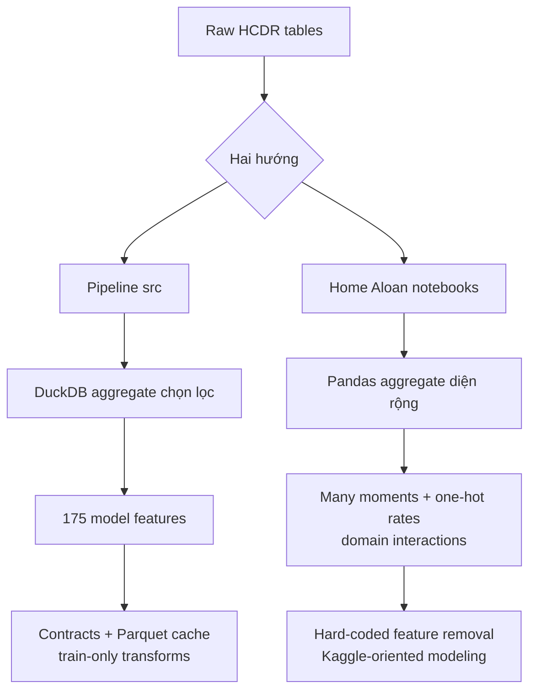
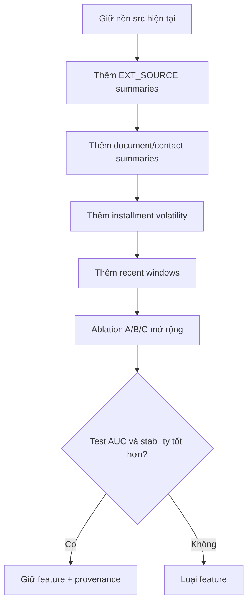

# Khác biệt giữa pipeline `src` và feature extraction của Home Aloan

> **Câu hỏi:** implementation hiện tại trong `src/home_credit_default_rate` khác các
> public notebook của đội top 1 Home Aloan ở đâu, và nên học gì từ chúng?
>
> **Phạm vi:** so sánh hai báo cáo đã kiểm chứng trong workspace; không chạy lại các
> notebook cũ và không xem chúng là toàn bộ winning solution.

## Kết luận ngắn

Hai bên cùng dùng đúng kiến trúc nền: lấy application làm xương sống, aggregate bảng
lịch sử về một dòng mỗi `SK_ID_CURR`, rồi left join các feature block. Khác biệt chính
là:

- pipeline `src` ưu tiên **ít feature nhưng có contract, provenance và khả năng chạy
  lại**;
- notebook Home Aloan ưu tiên **feature coverage rộng**, nhiều moment, one-hot ratio
  và interaction để tối đa AUC Kaggle;
- full solution hạng nhất còn có feature theo recency/window và OOF meta-feature mà
  cả hai implementation đang so sánh đều chưa có đầy đủ.

## So sánh trực tiếp

| Khía cạnh           | Pipeline`src/home_credit_default_rate`                                                            | Home Aloan public notebooks                                                                                                                 |
| --------------------- | --------------------------------------------------------------------------------------------------- | ------------------------------------------------------------------------------------------------------------------------------------------- |
| Mục tiêu thiết kế | Pipeline benchmark có thể audit và tái lập                                                     | Kernel thi đấu, ưu tiên thử nhanh và leaderboard AUC                                                                                  |
| Engine                | DuckDB đọc CSV, giới hạn 6 GiB, cache ZSTD Parquet                                              | pandas nạp và aggregate trực tiếp trong RAM                                                                                             |
| Độ rộng feature    | Stage C có 175 model feature đã kiểm chứng                                                     | Rộng hơn nhiều do one-hot và nhiều moment; chưa rerun nên không có số cột verified                                               |
| Application feature   | 4 ratio, 3 anomaly flag; giữ raw application                                                       | Khoảng 16–20`NEW_*`: thêm `EXT_SOURCE` mean/std/product, document/contact summaries, income-by-organization và age/car/phone ratios |
| Sentinel/category lạ | Đổi thành missing và giữ anomaly flag                                                          | Đổi`DAYS_EMPLOYED`; bỏ bốn dòng `CODE_GENDER=XNA`, không giữ cờ                                                                 |
| Ý nghĩa`DAYS_*`   | Chuẩn hóa sang trị tuyệt đối                                                                  | Giữ dấu âm gốc và dùng trực tiếp trong ratio                                                                                        |
| Bảng lịch sử       | Chọn một tập nhỏ feature nghiệp vụ cho mỗi block                                             | Áp dụng`min/max/mean/sum/var` rộng và mean của nhiều dummy category                                                                 |
| Segment trạng thái  | Có active/closed và approved/refused ratio chọn lọc                                             | Có các block all/active/closed, all/approved/refused và nhiều ratio tương ứng                                                        |
| Installments          | DPD/DBD, payment ratio, shortfall và count chọn lọc                                              | Cùng domain feature nhưng aggregate nhiều moment hơn, gồm std/var và các amount/date statistic                                       |
| Credit card           | Balance, utilization, DPD và count chọn lọc                                                      | Aggregate gần như toàn bộ numeric/dummy bằng nhiều moment                                                                             |
| Feature selection     | Preprocessing/WoE fit trên train; raw tree model dùng feature stage đã định nghĩa            | Notebook 02 drop danh sách hard-code 339 cột không có provenance đầy đủ                                                             |
| Train/test boundary   | Chỉ deterministic cleaning/aggregate làm trước split; transform học phân phối chỉ fit train | Ghép train + competition test trước khi tính median theo organization và fill score std                                                |
| Safe divide           | Mẫu số 0 đổi thành missing                                                                     | Nhiều phép chia không chặn zero hoặc non-finite                                                                                        |
| Validation            | Stratified random 60/20/20, membership được lưu                                                 | KFold trong LightGBM; file XGBoost hiện chỉ thực sự fit fold đầu                                                                      |
| Contract              | Kiểm uniqueness, one-to-one join, row count, feature description                                   | Ít assertion; phụ thuộc tên cột/category và API thư viện cũ                                                                        |
| Provenance/output     | `source.json`, Stage A/B/C, cache, metrics, model, scorecard, submission                          | Script sinh submission/plot; không có manifest feature hoặc cache lineage                                                                |

## Khác biệt quan trọng nhất trong feature extraction

### 1. `src` chọn lọc, notebook phủ rộng

Stage C hiện có 55 feature phát sinh được mô tả, đưa tổng số model feature lên 175.
Mỗi bảng lịch sử chỉ giữ một số statistic có ý nghĩa rõ. Ngược lại, notebook biến
nhiều category thành dummy rồi lấy mean, đồng thời áp dụng nhiều moment cho gần như toàn bộ credit-card và installment columns.

Hệ quả:

- `src` dễ truy nguồn, ít tốn RAM và ít feature thưa;
- notebook có nhiều cơ hội bắt được nonlinear signal, nhưng tạo redundancy và cần
  selection mạnh hơn.

### 2. Notebook giàu interaction ở application hơn

Pipeline hiện có các ratio cốt lõi như credit/income, annuity/income,
credit/goods-price và employed/age. Notebook bổ sung ba nhóm đáng chú ý:

1. `EXT_SOURCE_1/2/3`: mean, standard deviation và product;
2. document/contact flags: mean, sum, std và kurtosis;
3. peer/lifecycle: median income theo organization, car-age và phone-age ratios.

Đây là khoảng trống feature rõ nhất của pipeline hiện tại. Tuy nhiên statistic theo
organization phải fit trên train fold; không nên sao chép cách tính trên train+test
kết hợp.

### 3. `src` có contract tốt hơn đáng kể

Pipeline hiện tại kiểm tra khóa duy nhất, dùng one-to-one join, assert không đổi số
dòng và lưu matrix/cached aggregate. Safe divide đổi mẫu số 0 thành missing. Các
transform có học median/category/WoE chỉ fit trên train.

Notebook không có các contract tương đương, dùng danh sách drop 339 tên cố định và có
thể sinh `inf` từ ratio. Đây là khác biệt về độ tin cậy kỹ thuật, không chỉ là style.

### 4. Cả hai vẫn thiếu recency đủ sâu

Hai extractor chủ yếu aggregate toàn bộ lịch sử. Full winning solution được báo cáo
có thêm cửa sổ thời gian, N event gần nhất và weighted moving average. Vì thế hướng
nâng cấp lớn hơn không phải nhân bản thêm mọi `min/max/sum`, mà là biểu diễn **lịch sử
gần có trọng số**.

## Nên port gì vào `src`?

Ưu tiên theo tỷ lệ lợi ích/rủi ro:

1. thêm `EXT_SOURCE` mean/std/product bằng phép toán deterministic theo từng dòng;
2. thêm summary cho document/contact flags, sau khi kiểm redundancy;
3. mở rộng installments bằng std/var của DPD, DBD và payment shortfall;
4. thêm recent-window feature cho bureau balance, POS, installments và credit card;
5. chỉ sau đó mới thử thêm category-rate/moment diện rộng, kèm ablation Stage C.

Không nên port nguyên trạng:

- median organization học trên train+competition test;
- phép chia không safe;
- danh sách loại 339 feature hard-code;
- bỏ record `CODE_GENDER=XNA`;
- vòng lặp XGBoost chỉ chạy fold đầu;
- one-hot mọi category trước khi có rare-category và memory guard.

## Trạng thái bằng chứng

- **Verified:** 175 model feature, Stage A/B/C, contract join, split 60/20/20 và
  train-only preprocessing đến từ artifact/code của pipeline hiện tại.
- **Verified:** công thức, phép aggregate, danh sách drop 339 cột và lỗi one-fold
  XGBoost đến từ ba notebook local.
- **Inferred:** các feature notebook có thể cải thiện AUC của pipeline hiện tại; cần
  ablation mới xác nhận, không được coi là kết quả đã đạt.
- **Unknown:** số feature cuối của notebook trên môi trường hiện tại và gain riêng của
  từng nhóm feature, vì notebook chưa được rerun.

## Nguồn

- [Luồng trích xuất dữ liệu trong `src/home_credit_default_rate`](src-data-extraction-and-flow-report-vi.md)
- [Feature extraction của Home Aloan qua các leaderboard notebook](top-1-feature-extraction-from-leaderboard-notebooks.md)
- [Cấu trúc dữ liệu Home Credit Default Risk](home_credit_default_risk_data_structure_report_vi.md)
