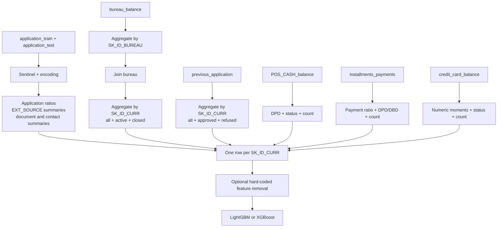
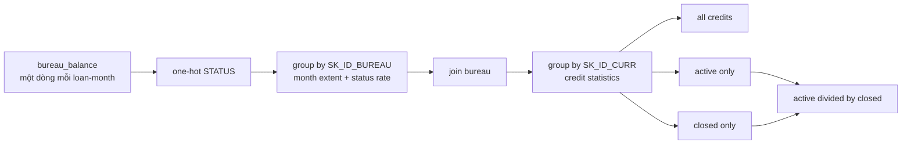
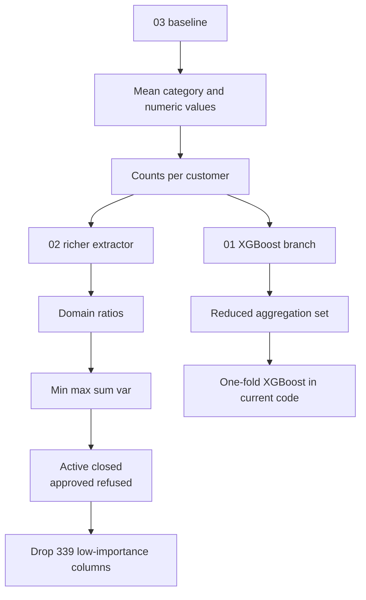
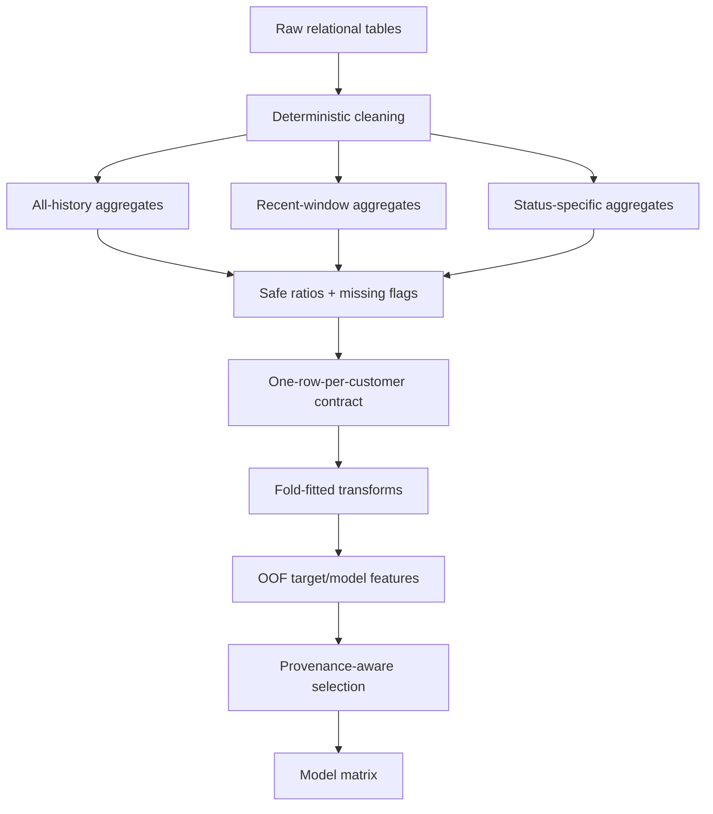

# Feature extraction của Home Aloan qua các leaderboard notebook

> **Câu hỏi chính:** ba notebook trong
> `notebooks/leaderboard/home-credit-default-risk/01-home-aloan/` biến tám bảng Home
> Credit Default Risk thành feature ở grain một dòng mỗi `SK_ID_CURR` như thế nào?
>
> **Phạm vi:** phân tích tĩnh code và metadata local ngày 03/08/2026, đối chiếu với
> write-up hạng nhất. Báo cáo tập trung vào feature extraction, không tái hiện toàn bộ
> ensemble hoặc khẳng định metric khi notebook chưa được chạy lại.

## Kết luận ngắn

**Verified từ code local:** lớp feature extraction dùng một mẫu nhất quán:

1. sửa một số sentinel và mã hóa category;
2. tạo ratio có nghĩa nghiệp vụ trên bảng application và payment;
3. biến category trong bảng lịch sử thành one-hot, rồi lấy tỷ lệ xuất hiện bằng
   `mean`;
4. aggregate mọi bảng one-to-many về `SK_ID_CURR` bằng `min`, `max`, `mean`, `sum`,
   `var`, `size` hoặc `nunique`;
5. tách các trạng thái quan trọng như active/closed và approved/refused;
6. left join từng feature block vào application.

Notebook giàu nhất trong ba file là `02-lighgbm-with-selected-features`: nó thêm ratio
active/closed, approved/refused và loại 339 cột theo một danh sách importance được
hard-code. Notebook `01-xgb-simple-features` giữ cùng kiến trúc nhưng giảm bớt phép
aggregate và đổi model sang XGBoost. Notebook `03-good-fun-with-lightgbm` là baseline
đơn giản hơn, chủ yếu lấy mean và count.

**Giới hạn quan trọng:** thư mục mang nhãn đội hạng nhất Home Aloan, nhưng ba kernel
không phải toàn bộ winning solution. Write-up hạng nhất còn mô tả nhiều feature theo
cửa sổ thời gian/số lần gần nhất, weighted moving average, target-neighbor feature,
weak-model out-of-fold feature và ensemble lớn; các phần đó không có trong ba file
local. Vì vậy nên gọi đây là **các public building block của đội top 1**, không phải
“full source code của giải nhất”.

## 1. Ba notebook thực sự đại diện cho điều gì?

| File local                            | Kaggle owner/title từ metadata              | Vai trò đọc từ code          | Điểm khác biệt chính                                          |
| ------------------------------------- | -------------------------------------------- | -------------------------------- | ------------------------------------------------------------------ |
| `03-good-fun-with-lightgbm`         | `ogrellier/good-fun-with-ligthgbm`         | Baseline đa bảng               | Mean + count, ít domain feature                                   |
| `02-lighgbm-with-selected-features` | `ogrellier/lighgbm-with-selected-features` | Extractor giàu nhất + LightGBM | Ratio, statistic rộng hơn, drop 339 feature                      |
| `01-xgb-simple-features`            | `tunguz/xgb-simple-features`               | Biến thể XGBoost               | Feature set gọn hơn; chỉ train fold đầu trong code hiện tại |

Thứ tự thư mục `01 → 02 → 03` không phải thứ tự phát triển. Theo độ phức tạp feature,
cách đọc hữu ích hơn là `03 → 02`, rồi xem `01` như một nhánh model/feature khác.
Metadata xác nhận cả ba kernel lấy nguồn competition `home-credit-default-risk`.
Hai file mới hơn cũng tự ghi rằng chúng fork từ kernel simple-features của `jsaguiar`;
do đó không nên gán toàn bộ ý tưởng trong code cho riêng đội Home Aloan.

## 2. Kiến trúc feature extraction chung



Điểm thiết kế đúng và quan trọng nhất là **đưa từng nhánh về đúng grain trước khi
join**. POS, installments và credit card được aggregate trực tiếp theo `SK_ID_CURR`.
Riêng `bureau_balance` cần hai tầng vì raw table chỉ có `SK_ID_BUREAU`.



## 3. Feature tạo từ từng bảng

### 3.1 `application_train/test`: sức trả nợ, vòng đời và external score

Hai notebook simple-features ghép train và competition test trước khi tạo feature.
Chúng bỏ bốn dòng train có `CODE_GENDER = XNA`, đổi `DAYS_EMPLOYED = 365243` thành
missing, factorize ba category nhị phân và one-hot các category còn lại.

Nhóm feature thủ công chính:

| Ý nghĩa                          | Feature/công thức                                                                       |
| ---------------------------------- | ----------------------------------------------------------------------------------------- |
| Gánh nặng khoản vay             | `AMT_CREDIT / AMT_ANNUITY`, `AMT_CREDIT / AMT_INCOME_TOTAL`                           |
| Giá trị tài sản/hàng hóa     | `AMT_CREDIT / AMT_GOODS_PRICE`                                                          |
| Gánh nặng trả góp              | `AMT_ANNUITY / (1 + AMT_INCOME_TOTAL)`                                                  |
| Thu nhập theo người phụ thuộc | `AMT_INCOME_TOTAL / (1 + CNT_CHILDREN)`                                                 |
| Thâm niên tương đối tuổi    | `DAYS_EMPLOYED / DAYS_BIRTH`                                                            |
| Tuổi xe tương đối             | `OWN_CAR_AGE / DAYS_BIRTH` và `/ DAYS_EMPLOYED`                                      |
| Độ cũ số điện thoại         | `DAYS_LAST_PHONE_CHANGE / DAYS_BIRTH` và `/ DAYS_EMPLOYED`                           |
| External score tổng hợp          | tích, mean và standard deviation của`EXT_SOURCE_1/2/3`                               |
| Hồ sơ giấy tờ/liên hệ        | mean/std/kurtosis của`FLAG_DOCUMENT_*`; sum/std/kurtosis của các cờ liên hệ/sống |
| Peer statistic                     | median thu nhập theo`ORGANIZATION_TYPE`                                                |

`02-lighgbm-with-selected-features` tạo 20 cột literal `NEW_*`; bản XGBoost tạo 16.
Các ratio cho cây quyết định một tín hiệu “khả năng chi trả” trực tiếp hơn việc buộc
model tự tìm interaction giữa hai cột amount. Các thống kê `EXT_SOURCE_*` nén ba score
ngoài thành mức trung tâm, độ đồng thuận và interaction.

### 3.2 `bureau_balance` + `bureau`: lịch sử tín dụng bên ngoài

`STATUS` trong `bureau_balance` được one-hot. Với mỗi `SK_ID_BUREAU`, code lấy:

- `MONTHS_BALANCE`: min, max và size;
- mean của từng dummy `STATUS`: chính là tỷ lệ tháng ở trạng thái đó.

Block này được join vào `bureau`, rồi aggregate lần hai theo `SK_ID_CURR`. Numeric
feature gồm recency của credit, ngày kết thúc/cập nhật, overdue, tổng credit/debt/limit,
annuity và số lần prolong. Dummy category của `CREDIT_ACTIVE`, `CREDIT_CURRENCY`,
`CREDIT_TYPE` cũng được lấy mean, nên kết quả biểu diễn cơ cấu danh mục tín dụng.

Ngoài aggregate toàn bộ khoản vay, code tách:

- `ACTIVE_*`: chỉ khoản đang active;
- `CLOSED_*`: chỉ khoản đã closed;
- `NEW_RATIO_BURO_* = ACTIVE_* / CLOSED_*` trong notebook 02.

Ratio cuối cùng thể hiện mức hiện tại so với lịch sử đã đóng, nhưng code không bảo vệ
mẫu số bằng 0 và không chuẩn hóa `inf` sau phép chia.

### 3.3 `previous_application`: hành vi xin vay trước đây tại Home Credit

Năm cột ngày có sentinel `365243` được đổi thành missing. Domain feature duy nhất tạo
trước aggregation là:

```text
APP_CREDIT_PERC = AMT_APPLICATION / AMT_CREDIT
```

Sau đó code aggregate amount, down payment, goods price, rate, giờ/ngày ra quyết định,
số kỳ trả và dummy category theo khách hàng. Nó tạo ba view:

- `PREV_*`: tất cả application trước;
- `APPROVED_*`: chỉ hồ sơ được duyệt;
- `REFUSED_*`: chỉ hồ sơ bị từ chối.

Notebook 02 còn tạo `NEW_RATIO_PREV_* = APPROVED_* / REFUSED_*`. Đây là cách biến
trạng thái quy trình thành feature định lượng, nhưng vẫn có rủi ro chia cho 0 và ratio
cực trị.

### 3.4 `POS_CASH_balance`: độ trễ của POS/cash loan

Block này giữ rất ít tín hiệu nhưng đúng trọng tâm:

- `MONTHS_BALANCE`: max, mean, size;
- `SK_DPD`, `SK_DPD_DEF`: max và mean;
- mean của dummy `NAME_CONTRACT_STATUS`;
- `POS_COUNT`: số record lịch sử.

Mean dummy là tỷ lệ thời gian ở từng trạng thái; `max DPD` đo sự kiện xấu nhất, còn
`mean DPD` đo mức trễ điển hình.

### 3.5 `installments_payments`: mức trả và đúng hạn

Đây là block có domain feature rõ nhất:

```text
PAYMENT_PERC = AMT_PAYMENT / AMT_INSTALMENT
PAYMENT_DIFF = AMT_INSTALMENT - AMT_PAYMENT
DPD = max(DAYS_ENTRY_PAYMENT - DAYS_INSTALMENT, 0)
DBD = max(DAYS_INSTALMENT - DAYS_ENTRY_PAYMENT, 0)
```

Sau đó code lấy các moment của DPD, DBD, tỷ lệ/chênh lệch thanh toán, amount và ngày
trả; đếm số version kỳ trả bằng `nunique` và số record bằng `INSTAL_COUNT`.

Ý nghĩa cần giữ đúng:

- `DPD > 0`: trả sau hạn;
- `DBD > 0`: trả trước hạn;
- `PAYMENT_PERC < 1`: trả thiếu ở record đó;
- `PAYMENT_DIFF > 0`: số tiền còn thiếu so với kỳ phải trả.

Code aggregate toàn lịch sử, chưa tạo cửa sổ gần đây như 3/6/12 tháng và chưa tách
theo `SK_ID_PREV` trước khi về khách hàng.

### 3.6 `credit_card_balance`: moment rộng, ít chọn lọc

Code bỏ `SK_ID_PREV`, one-hot status, rồi áp dụng `min`, `max`, `mean`, `sum`, `var`
cho gần như mọi cột theo `SK_ID_CURR`; `CC_COUNT` là số snapshot. Cách này phủ rộng và
nhanh, nhưng tạo nhiều cột thưa hoặc ít giá trị. Danh sách 339 feature bị bỏ ở notebook
02 chứa rất nhiều biến `CC_*`, cho thấy chính block aggregate cơ học này sinh nhiều
feature không hữu ích trong các lần importance trước đó.

## 4. Ba cấp độ extractor



### Baseline `03-good-fun-with-lightgbm`

Baseline one-hot một phần category, thay ID lịch sử bằng count rồi lấy mean theo
khách hàng. Cách này rẻ, dễ hiểu và cho một matrix đa bảng nhanh, nhưng làm mất tail,
worst-case, volatility và recency.

### Rich extractor `02-lighgbm-with-selected-features`

Đây là file nên đọc làm reference chính. Nó giữ nhiều moment hơn, thêm segmentation
theo trạng thái, tỷ số giữa segment và nhiều feature application. Trước modeling, nó
drop đúng 339 tên trong `features_with_no_imp_at_least_twice`.

Tên biến cho thấy các cột không có importance ít nhất hai lần, nhưng file không chứa
code sinh danh sách, run log, threshold hay fold provenance. Vì vậy **verified** là
“drop 339 cột hard-code”; “chúng đã được đánh giá zero-importance qua quy trình nào”
vẫn là **unknown**.

### XGBoost branch `01-xgb-simple-features`

Extractor gần notebook 02 nhưng giảm một số `min/max/std` và không có ratio
active/closed hoặc approved/refused. Dù gọi `kfold_xgb(..., num_folds=10, stratified=True)`, thân vòng lặp có `if n_fold == 0`, nên file hiện tại chỉ fit fold
đầu và dùng model đó dự đoán test. Đây không phải 10-fold ensemble hoàn chỉnh.

## 5. Phần top-1 nào không nằm trong ba notebook?

Write-up hạng nhất của Home Aloan và các bản tóm lược dẫn lại nó mô tả một tầng feature rộng hơn:

- aggregate theo cửa sổ gần hiện tại, ví dụ số ngày gần nhất hoặc N event gần nhất;
- weighted moving average để ưu tiên lịch sử gần;
- multiplication/division interaction rộng hơn giữa các feature;
- `neighbors_target_mean_500`: target mean của 500 hàng xóm trong không gian gồm
  `EXT_SOURCE_*` và credit/annuity ratio;
- prediction out-of-fold từ weak model như Ridge/Logistic/FM/NN làm meta-feature;
- feature selection và nhiều biến thể preprocessing/model để ensemble.

Các kỹ thuật trên là **evidence từ write-up bên ngoài**, không phải runtime truth của
ba file local. Đặc biệt, target-neighbor và weak-model feature chỉ an toàn khi giá trị
train được tạo out-of-fold; tính trực tiếp trên cùng target sẽ leakage.

## 6. Điểm mạnh có thể tái sử dụng

1. **Aggregate theo grain trước khi join.** Đây là nguyên tắc quan trọng nhất để tránh
   row explosion và giữ đúng một prediction mỗi `SK_ID_CURR`.
2. **Kết hợp statistic tổng quát với domain feature.** Moment phủ rộng dữ liệu; ratio
   credit/income, payment/installment và DPD/DBD đưa ý nghĩa nghiệp vụ vào matrix.
3. **Tách trạng thái trước khi aggregate.** Active/closed và approved/refused giữ được
   khác biệt mà một mean toàn cục sẽ che mất.
4. **Mean của one-hot là tỷ lệ.** Đây là cách rẻ để biến lịch sử category thành cơ cấu
   hành vi ở cấp khách hàng.
5. **Giữ nhiều view của cùng lịch sử.** All-history, status-specific và recent-window
   bổ sung cho nhau; top-1 không chỉ dựa vào một bảng aggregate duy nhất.

## 7. Rủi ro và cải tiến cần làm trước khi dùng lại

| Vấn đề trong notebook                                                                     | Tác động                                                                                                           | Cách triển khai an toàn hơn                                                                                      |
| -------------------------------------------------------------------------------------------- | --------------------------------------------------------------------------------------------------------------------- | -------------------------------------------------------------------------------------------------------------------- |
| Ghép train + competition test trước khi tính median theo organization và fill score std | Có thông tin phân phối test đi vào transform; đây là transductive preprocessing, không phải target leakage | Fit statistic trên train fold, apply sang valid/test                                                                |
| Ratio không chặn mẫu số 0/near-zero                                                      | Sinh`inf` hoặc tail cực lớn                                                                                      | Safe divide, đổi non-finite thành missing, clip theo train                                                        |
| Drop 339 tên hard-code                                                                      | Dễ lỗi khi schema/category đổi; thiếu provenance                                                                 | Lưu selection artifact theo input hash, fold, seed và criterion                                                    |
| Aggregate toàn lịch sử                                                                    | Mất recency và trend                                                                                                | Thêm cửa sổ 3/6/12 tháng hoặc N event gần nhất                                                                |
| Random KFold                                                                                 | Không chứng minh stability theo thời gian/population                                                               | Dùng split phù hợp deployment nếu có timestamp; HCDR application không cung cấp timestamp đủ cho OOT chuẩn |
| One-hot toàn bộ category lịch sử                                                         | Matrix rất rộng, nhiều rare dummy                                                                                  | Gom rare category theo train, kiểm support và stability                                                            |
| Bỏ bốn dòng`CODE_GENDER = XNA`                                                          | Thay đổi population và chỉ xảy ra phía train                                                                    | Chuẩn hóa thành missing/unknown và giữ anomaly flag                                                             |
| XGBoost chỉ fit fold đầu                                                                  | OOF array phần lớn bằng 0; không phải CV đầy đủ                                                              | Bỏ điều kiện fold đầu, average đủ fold và lưu fold provenance                                              |
| API pandas/LightGBM cũ                                                                      | Khó chạy lại trên môi trường hiện tại                                                                        | Port`append` sang `concat`, cập nhật callback/early stopping API, thêm smoke test                             |

Ngoài benchmark, `CODE_GENDER`, family status, occupation và các proxy nhân khẩu cần
fairness/legal review. AUC Kaggle không chứng minh feature phù hợp cho phê duyệt tín
dụng production.

## 8. Blueprint extractor nên kế thừa

Một implementation mới nên giữ ý tưởng nhưng đổi contract:

1. mỗi feature block khai báo `source_table`, raw grain, output grain và availability
   time;
2. mọi statistic học từ population chỉ fit trong train fold;
3. mỗi ratio dùng safe divide và có missing/zero-denominator flag khi cần;
4. history có ít nhất ba view: all-time, recent window và status-specific;
5. sau mỗi aggregate/join, assert uniqueness của `SK_ID_CURR` và row count;
6. feature selection lưu artifact thay vì nhúng danh sách không provenance;
7. target-derived feature bắt buộc tạo OOF và tách hẳn khỏi deterministic extractor;
8. ghi manifest gồm source hash, code hash, feature names, split và seed.



## 9. Trạng thái bằng chứng

- **Verified:** nội dung hàm, công thức, aggregation, 339 tên bị drop, metadata kernel
  và lỗi chỉ chạy fold đầu được đọc trực tiếp từ file local.
- **Verified:** cả ba script parse được bằng Python AST; có hai cảnh báo escape sequence
  trong chuỗi plot của notebook 03, không ảnh hưởng feature extraction.
- **Not rerun:** chưa chạy full notebook trên 3,2 GB raw CSV; không có metric hoặc
  feature-importance artifact của chính các kernel để đối chiếu.
- **Inferred:** notebook 03 là baseline khái niệm và notebook 02 là extractor giàu
  nhất, dựa trên độ rộng phép aggregate và feature thủ công, không dựa trên timestamp
  version của Kaggle.
- **Unknown:** quy trình chính xác sinh danh sách 339 low-importance feature và phần
  đóng góp riêng của mỗi kernel vào final blend hạng nhất.

## 10. Nguồn

### Code và metadata local

- [`01-xgb-simple-features.py`](../../../notebooks/leaderboard/home-credit-default-risk/01-home-aloan/01-xgb-simple-features/xgb-simple-features.py)
- [`02-lighgbm-with-selected-features.py`](../../../notebooks/leaderboard/home-credit-default-risk/01-home-aloan/02-lighgbm-with-selected-features/lighgbm-with-selected-features.py)
- [`03-good-fun-with-lightgbm.py`](../../../notebooks/leaderboard/home-credit-default-risk/01-home-aloan/03-good-fun-with-lightgbm/good-fun-with-ligthgbm.py)
- `kernel-metadata.json` nằm cạnh từng script; đây là nguồn cho owner, title và
  competition source.
- Cấu trúc/grain raw table: [báo cáo cấu trúc HCDR](home_credit_default_risk_data_structure_report_vi.md).

### Nguồn ngoài

- [Kaggle — 1st Place Solution, Home Aloan](https://www.kaggle.com/c/home-credit-default-risk/discussion/64821)
- [Kaggle — Home Credit Default Risk](https://www.kaggle.com/competitions/home-credit-default-risk)
- [Bojan Tunguz interview — xác nhận Home Aloan đứng hạng nhất](https://sia.hackernoon.com/interview-with-kaggle-grandmaster-dr-bojan-tunguz-726b28e601e)
- [Bản tổng hợp kỹ thuật có liên kết ngược về write-up hạng nhất](https://medium.com/thecyphy/home-credit-default-risk-part-1-3bfe3c7ddd7a)

Nguồn Kaggle là nguồn gốc cho danh tính solution. Hai bài tổng hợp chỉ được dùng để
đối chiếu các kỹ thuật của full solution không hiện diện trong code local; chúng không
thay thế bằng chứng từ notebook.
