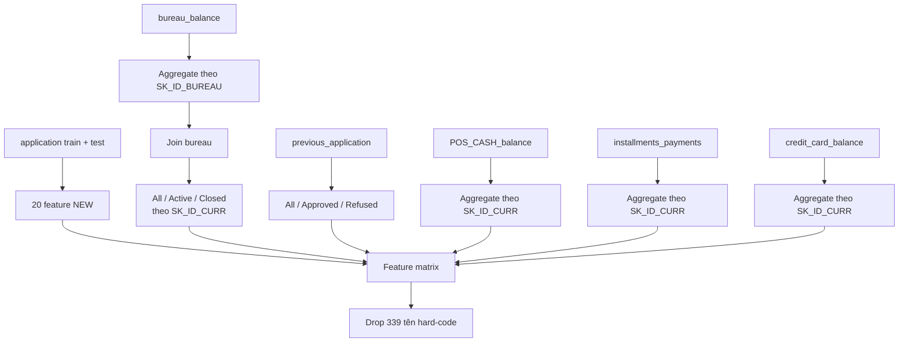

# Giải thích chi tiết feature extraction của notebook Home Aloan top 1

## 1. Mục tiêu và cách đọc

**Verified từ code local.** Báo cáo này chỉ giải thích cách notebook
[`02-lighgbm-with-selected-features.py`](../../../../notebooks/leaderboard/home-credit-default-risk/01-home-aloan/02-lighgbm-with-selected-features/lighgbm-with-selected-features.py)
biến từng bảng Home Credit Default Risk thành feature. Đây là notebook duy nhất
được dùng làm nguồn cho các công thức trong báo cáo.

Đây là **feature dictionary của một public notebook**, không phải toàn bộ
feature của winning solution Home Aloan. Những feature từ target, weak model,
recent window hoặc ensemble được mô tả trong write-up nhưng không có implementation
trong notebook này nên không được nhập vào dictionary.

Quy ước tên của notebook 02:

```text
<PREFIX>_<RAW_COLUMN>_<AGGREGATION>
```

Ví dụ, `BURO_AMT_CREDIT_SUM_DEBT_MEAN` là trung bình
`AMT_CREDIT_SUM_DEBT` trên các khoản bureau của một `SK_ID_CURR`. Các cột one-hot
được tạo động theo category thực sự xuất hiện trong input, nên báo cáo ghi chính xác
**mẫu tên và phép tính**, thay vì hard-code một schema category có thể thay đổi.

## 2. Luồng tổng quát



`mean` của một dummy 0/1 là tỷ lệ dòng thuộc category đó. Với các bảng snapshot,
`mean` là trung bình theo dòng tháng, không phải trung bình cân bằng theo hợp đồng.
Pandas bỏ qua `NaN` trong phần lớn phép aggregate; code không dùng safe divide nên
một số ratio có thể sinh `inf` khi mẫu số bằng 0.

## 3. `application_train/test`: 20 feature tạo trực tiếp

Notebook 02 ghép train và competition test, bỏ bốn dòng train có
`CODE_GENDER='XNA'`, thay `DAYS_EMPLOYED=365243` bằng missing, rồi tạo 20 cột sau:

| Feature mới | Công thức | Ý nghĩa |
| ----------- | --------- | ------- |
| `NEW_CREDIT_TO_ANNUITY_RATIO` | `AMT_CREDIT / AMT_ANNUITY` | Quy mô khoản vay so với annuity. |
| `NEW_CREDIT_TO_GOODS_RATIO` | `AMT_CREDIT / AMT_GOODS_PRICE` | Khoản vay so với giá trị hàng hóa. |
| `NEW_DOC_IND_AVG` | mean theo hàng của `FLAG_DOC*` | Tỷ lệ cờ giấy tờ được bật. |
| `NEW_DOC_IND_STD` | std theo hàng của `FLAG_DOC*` | Độ phân tán giữa các cờ giấy tờ. |
| `NEW_DOC_IND_KURT` | kurtosis theo hàng của `FLAG_DOC*` | Hình dạng phân phối các cờ giấy tờ. |
| `NEW_LIVE_IND_SUM` | sum theo hàng của nhóm cờ liên hệ/sống | Tổng số cờ liên hệ/sống được bật. |
| `NEW_LIVE_IND_STD` | std theo hàng của nhóm cờ liên hệ/sống | Độ phân tán giữa các cờ. |
| `NEW_LIVE_IND_KURT` | kurtosis theo hàng của nhóm cờ liên hệ/sống | Hình dạng phân phối các cờ. |
| `NEW_INC_PER_CHLD` | `AMT_INCOME_TOTAL / (1 + CNT_CHILDREN)` | Thu nhập điều chỉnh theo số con. |
| `NEW_INC_BY_ORG` | median `AMT_INCOME_TOTAL` theo `ORGANIZATION_TYPE` | Mức thu nhập điển hình của nhóm tổ chức. |
| `NEW_EMPLOY_TO_BIRTH_RATIO` | `DAYS_EMPLOYED / DAYS_BIRTH` | Thâm niên làm việc tương đối với tuổi. |
| `NEW_ANNUITY_TO_INCOME_RATIO` | `AMT_ANNUITY / (1 + AMT_INCOME_TOTAL)` | Gánh nặng annuity so với thu nhập. |
| `NEW_SOURCES_PROD` | `EXT_SOURCE_1 * EXT_SOURCE_2 * EXT_SOURCE_3` | Interaction nhân của ba external score. |
| `NEW_EXT_SOURCES_MEAN` | mean của `EXT_SOURCE_1/2/3` | External score trung tâm. |
| `NEW_SCORES_STD` | std của `EXT_SOURCE_1/2/3` | Mức bất đồng giữa ba external score. |
| `NEW_CAR_TO_BIRTH_RATIO` | `OWN_CAR_AGE / DAYS_BIRTH` | Tuổi xe tương đối với tuổi khách hàng. |
| `NEW_CAR_TO_EMPLOY_RATIO` | `OWN_CAR_AGE / DAYS_EMPLOYED` | Tuổi xe tương đối với thâm niên làm việc. |
| `NEW_PHONE_TO_BIRTH_RATIO` | `DAYS_LAST_PHONE_CHANGE / DAYS_BIRTH` | Độ cũ lần đổi điện thoại tương đối với tuổi. |
| `NEW_PHONE_TO_EMPLOY_RATIO` | `DAYS_LAST_PHONE_CHANGE / DAYS_EMPLOYED` | Độ cũ lần đổi điện thoại tương đối với thâm niên. |
| `NEW_CREDIT_TO_INCOME_RATIO` | `AMT_CREDIT / AMT_INCOME_TOTAL` | Khoản vay so với thu nhập. |

`NEW_INC_BY_ORG` và giá trị fill cho `NEW_SCORES_STD` được học trên bảng train+test
đã ghép. Đây là preprocessing transductive; không dùng `TARGET` nhưng vẫn lấy thông
tin phân phối competition test.

Sau đó `CODE_GENDER`, `FLAG_OWN_CAR`, `FLAG_OWN_REALTY` được factorize; các cột
object còn lại được one-hot theo mẫu `<RAW_COLUMN>_<CATEGORY>`. Những dummy này giữ
nguyên ở grain application, không cần aggregate.

## 4. `bureau_balance` và `bureau`

### 4.1. Cấp khoản bureau: `bureau_balance`

`STATUS` được one-hot. Mỗi `SK_ID_BUREAU` tạo ba feature thời gian cố định và một
feature cho mỗi category trạng thái:

| Feature/pattern | Công thức theo `SK_ID_BUREAU` | Ý nghĩa |
| --------------- | -------------------------------- | ------- |
| `MONTHS_BALANCE_MIN` | `min(MONTHS_BALANCE)` | Tháng xa nhất trong lịch sử khoản. |
| `MONTHS_BALANCE_MAX` | `max(MONTHS_BALANCE)` | Tháng gần application nhất. |
| `MONTHS_BALANCE_SIZE` | `size(MONTHS_BALANCE)` | Số snapshot tháng. |
| `STATUS_<VALUE>_MEAN` | `mean(I(STATUS=<VALUE>))` | Tỷ lệ tháng ở từng trạng thái, kể cả dummy missing. |

Các feature này được join vào từng dòng `bureau` theo `SK_ID_BUREAU` trước khi
tổng hợp lần hai về khách hàng.

### 4.2. Numeric feature cấp khách hàng

Bảng sau liệt kê toàn bộ cặp raw column–phép aggregate trong notebook 02:

| Raw/intermediate column | Phép aggregate |
| ----------------------- | -------------- |
| `DAYS_CREDIT` | `min`, `max`, `mean`, `var` |
| `DAYS_CREDIT_ENDDATE` | `min`, `max`, `mean` |
| `DAYS_CREDIT_UPDATE` | `mean` |
| `CREDIT_DAY_OVERDUE` | `max`, `mean` |
| `AMT_CREDIT_MAX_OVERDUE` | `mean` |
| `AMT_CREDIT_SUM` | `max`, `mean`, `sum` |
| `AMT_CREDIT_SUM_DEBT` | `max`, `mean`, `sum` |
| `AMT_CREDIT_SUM_OVERDUE` | `mean` |
| `AMT_CREDIT_SUM_LIMIT` | `mean`, `sum` |
| `AMT_ANNUITY` | `max`, `mean` |
| `CNT_CREDIT_PROLONG` | `sum` |
| `MONTHS_BALANCE_MIN` | `min` |
| `MONTHS_BALANCE_MAX` | `max` |
| `MONTHS_BALANCE_SIZE` | `mean`, `sum` |

Danh sách trên tạo 27 cặp `<COLUMN>_<AGG>`. Mỗi cặp được materialize thành bốn
view:

| View | Tên feature | Cách tạo |
| ---- | ----------- | ------- |
| Toàn bộ khoản | `BURO_<COLUMN>_<AGG>` | Aggregate mọi dòng bureau của khách hàng. |
| Khoản active | `ACTIVE_<COLUMN>_<AGG>` | Chỉ dùng dòng có `CREDIT_ACTIVE_Active=1`. |
| Khoản closed | `CLOSED_<COLUMN>_<AGG>` | Chỉ dùng dòng có `CREDIT_ACTIVE_Closed=1`. |
| Tỷ số active/closed | `NEW_RATIO_BURO_<COLUMN>_<AGG>` | `ACTIVE_<...> / CLOSED_<...>`. |

Như vậy phần numeric tạo 27 feature `BURO_*`, 27 `ACTIVE_*`, 27 `CLOSED_*` và
27 `NEW_RATIO_BURO_*`, tổng cộng 108 feature trước bước drop hard-code.

### 4.3. Category composition

Ba cột object của `bureau` là `CREDIT_ACTIVE`, `CREDIT_CURRENCY` và `CREDIT_TYPE`.
Chúng được one-hot rồi lấy mean theo khách hàng:

```text
BURO_<RAW_COLUMN>_<CATEGORY>_MEAN
```

Các dummy `STATUS` đã aggregate ở cấp khoản cũng được lấy mean lần hai:

```text
BURO_STATUS_<VALUE>_MEAN_MEAN
```

Đây là trung bình không trọng số giữa các khoản bureau. Category column chỉ xuất
hiện ở view `BURO_*`; view active/closed và ratio chỉ dùng 27 cặp numeric phía trên.

## 5. `previous_application`

### 5.1. Feature cấp dòng

Năm cột ngày `DAYS_FIRST_DRAWING`, `DAYS_FIRST_DUE`,
`DAYS_LAST_DUE_1ST_VERSION`, `DAYS_LAST_DUE`, `DAYS_TERMINATION` đổi sentinel
`365243` thành missing. Pipeline tạo thêm:

```text
APP_CREDIT_PERC = AMT_APPLICATION / AMT_CREDIT
```

### 5.2. Numeric feature cấp khách hàng

| Raw/derived column | Phép aggregate |
| ------------------ | -------------- |
| `AMT_ANNUITY` | `min`, `max`, `mean` |
| `AMT_APPLICATION` | `min`, `max`, `mean` |
| `AMT_CREDIT` | `min`, `max`, `mean` |
| `APP_CREDIT_PERC` | `min`, `max`, `mean`, `var` |
| `AMT_DOWN_PAYMENT` | `min`, `max`, `mean` |
| `AMT_GOODS_PRICE` | `min`, `max`, `mean` |
| `HOUR_APPR_PROCESS_START` | `min`, `max`, `mean` |
| `RATE_DOWN_PAYMENT` | `min`, `max`, `mean` |
| `DAYS_DECISION` | `min`, `max`, `mean` |
| `CNT_PAYMENT` | `mean`, `sum` |

Ba mươi cặp `<COLUMN>_<AGG>` được tạo ở bốn view:

| View | Tên feature | Cách tạo |
| ---- | ----------- | ------- |
| Tất cả application cũ | `PREV_<COLUMN>_<AGG>` | Aggregate toàn bộ lịch sử. |
| Chỉ application approved | `APPROVED_<COLUMN>_<AGG>` | Lọc `NAME_CONTRACT_STATUS_Approved=1`. |
| Chỉ application refused | `REFUSED_<COLUMN>_<AGG>` | Lọc `NAME_CONTRACT_STATUS_Refused=1`. |
| Tỷ số approved/refused | `NEW_RATIO_PREV_<COLUMN>_<AGG>` | `APPROVED_<...> / REFUSED_<...>`. |

Phần numeric vì vậy tạo 120 feature trước bước drop. Các tỷ số không chặn mẫu số
0, nên có thể sinh giá trị vô hạn.

### 5.3. Category composition

Mọi cột object của `previous_application` được one-hot. Mỗi dummy chỉ được
aggregate trên toàn bộ lịch sử theo mẫu:

```text
PREV_<RAW_COLUMN>_<CATEGORY>_MEAN
```

Mean của dummy là tỷ lệ application cũ thuộc category đó. Các dummy không được
tạo lại trong view approved/refused vì hai view này chỉ nhận numeric aggregation.

## 6. `POS_CASH_balance`

| Feature/pattern | Công thức | Ý nghĩa |
| --------------- | --------- | ------- |
| `POS_MONTHS_BALANCE_MAX` | `max(MONTHS_BALANCE)` | Snapshot gần application nhất. |
| `POS_MONTHS_BALANCE_MEAN` | `mean(MONTHS_BALANCE)` | Mốc tháng trung bình. |
| `POS_MONTHS_BALANCE_SIZE` | `size(MONTHS_BALANCE)` | Số snapshot có trong group. |
| `POS_SK_DPD_MAX` | `max(SK_DPD)` | DPD lớn nhất. |
| `POS_SK_DPD_MEAN` | `mean(SK_DPD)` | DPD trung bình theo snapshot. |
| `POS_SK_DPD_DEF_MAX` | `max(SK_DPD_DEF)` | DPD có tolerance lớn nhất. |
| `POS_SK_DPD_DEF_MEAN` | `mean(SK_DPD_DEF)` | DPD có tolerance trung bình. |
| `POS_<NAME_CONTRACT_STATUS_CATEGORY>_MEAN` | mean dummy | Tỷ lệ snapshot ở từng trạng thái, kể cả missing. |
| `POS_COUNT` | `groupby(SK_ID_CURR).size()` | Tổng số dòng POS/cash của khách hàng. |

`POS_MONTHS_BALANCE_SIZE` và `POS_COUNT` đều bằng số dòng trong group ở
implementation hiện tại; chúng khác tên nhưng mang cùng giá trị.

## 7. `installments_payments`

### 7.1. Feature cấp dòng

```text
PAYMENT_PERC = AMT_PAYMENT / AMT_INSTALMENT
PAYMENT_DIFF = AMT_INSTALMENT - AMT_PAYMENT
DPD = max(DAYS_ENTRY_PAYMENT - DAYS_INSTALMENT, 0)
DBD = max(DAYS_INSTALMENT - DAYS_ENTRY_PAYMENT, 0)
```

`DPD` đo trả trễ, `DBD` đo trả sớm, `PAYMENT_PERC < 1` biểu thị trả thiếu và
`PAYMENT_DIFF > 0` biểu thị phần tiền còn thiếu trên dòng thanh toán.

### 7.2. Feature cấp khách hàng

| Raw/derived column | Phép aggregate | Tên feature đầu ra |
| ------------------ | -------------- | ------------------ |
| `NUM_INSTALMENT_VERSION` | `nunique` | `INSTAL_NUM_INSTALMENT_VERSION_NUNIQUE` |
| `DPD` | `max`, `mean`, `sum` | `INSTAL_DPD_<AGG>` |
| `DBD` | `max`, `mean`, `sum` | `INSTAL_DBD_<AGG>` |
| `PAYMENT_PERC` | `max`, `mean`, `sum`, `var` | `INSTAL_PAYMENT_PERC_<AGG>` |
| `PAYMENT_DIFF` | `max`, `mean`, `sum`, `var` | `INSTAL_PAYMENT_DIFF_<AGG>` |
| `AMT_INSTALMENT` | `max`, `mean`, `sum` | `INSTAL_AMT_INSTALMENT_<AGG>` |
| `AMT_PAYMENT` | `min`, `max`, `mean`, `sum` | `INSTAL_AMT_PAYMENT_<AGG>` |
| `DAYS_ENTRY_PAYMENT` | `max`, `mean`, `sum` | `INSTAL_DAYS_ENTRY_PAYMENT_<AGG>` |
| Toàn bộ group | `size()` | `INSTAL_COUNT` |

Phần này tạo 25 statistic feature và một count, tổng cộng 26 feature. Raw
`installments_payments` không có cột object, nên vòng lặp category không tạo thêm
dummy feature trên schema HCDR hiện tại.

## 8. `credit_card_balance`

Notebook 02 one-hot `NAME_CONTRACT_STATUS`, bỏ `SK_ID_PREV`, rồi áp dụng đồng loạt
`min`, `max`, `mean`, `sum`, `var` cho từng cột còn lại trong group
`SK_ID_CURR`.

### 8.1. Hai mươi numeric column raw

Mỗi dòng dưới sinh năm feature theo mẫu `CC_<COLUMN>_{MIN|MAX|MEAN|SUM|VAR}`:

| Raw column | Ý nghĩa nhóm feature |
| ---------- | --------------------- |
| `MONTHS_BALANCE` | Phân bố mốc thời gian của snapshot. |
| `AMT_BALANCE` | Phân bố dư nợ thẻ. |
| `AMT_CREDIT_LIMIT_ACTUAL` | Phân bố hạn mức thực tế. |
| `AMT_DRAWINGS_ATM_CURRENT` | Số tiền rút ATM. |
| `AMT_DRAWINGS_CURRENT` | Tổng số tiền giao dịch/rút. |
| `AMT_DRAWINGS_OTHER_CURRENT` | Số tiền giao dịch loại khác. |
| `AMT_DRAWINGS_POS_CURRENT` | Số tiền giao dịch POS. |
| `AMT_INST_MIN_REGULARITY` | Khoản thanh toán tối thiểu định kỳ. |
| `AMT_PAYMENT_CURRENT` | Khoản thanh toán hiện tại. |
| `AMT_PAYMENT_TOTAL_CURRENT` | Tổng thanh toán hiện tại. |
| `AMT_RECEIVABLE_PRINCIPAL` | Khoản phải thu gốc. |
| `AMT_RECIVABLE` | Khoản phải thu, giữ nguyên spelling của raw. |
| `AMT_TOTAL_RECEIVABLE` | Tổng khoản phải thu. |
| `CNT_DRAWINGS_ATM_CURRENT` | Số lần rút ATM. |
| `CNT_DRAWINGS_CURRENT` | Tổng số lần giao dịch/rút. |
| `CNT_DRAWINGS_OTHER_CURRENT` | Số lần giao dịch loại khác. |
| `CNT_DRAWINGS_POS_CURRENT` | Số lần giao dịch POS. |
| `CNT_INSTALMENT_MATURE_CUM` | Số kỳ đã đáo hạn tích lũy. |
| `SK_DPD` | Số ngày quá hạn. |
| `SK_DPD_DEF` | Số ngày quá hạn có tolerance. |

Hai mươi cột × năm phép aggregate tạo 100 feature numeric.

### 8.2. Status và count

Mỗi dummy động của `NAME_CONTRACT_STATUS` cũng nhận đủ năm phép aggregate:

```text
CC_NAME_CONTRACT_STATUS_<CATEGORY>_{MIN|MAX|MEAN|SUM|VAR}
```

Với dummy 0/1, `mean` là tỷ lệ snapshot; `sum` là số snapshot; `min`/`max` cho biết
category có xuất hiện ở tất cả hoặc ít nhất một snapshot hay không. `var` đo độ biến
thiên của trạng thái. Cuối cùng:

```text
CC_COUNT = groupby(SK_ID_CURR).size()
```

Đây là block cơ học rộng nhất. Nó tạo nhiều feature tương quan hoặc ít biến thiên;
nhiều tên `CC_*` sau đó xuất hiện trong danh sách 339 feature bị loại.

## 9. Feature được ghép như thế nào

Mỗi hàm trả về một DataFrame có index `SK_ID_CURR`. Notebook bắt đầu từ application
rồi left join lần lượt các block bureau, previous, POS, installments và credit card.
Khách hàng không có lịch sử trong một block vẫn được giữ và nhận missing ở các
feature tương ứng.

Code notebook không dùng `validate="one_to_one"` và không assert row count sau join.
Tính đúng đắn dựa vào việc mỗi block `groupby(SK_ID_CURR)` tạo index duy nhất trước
khi join. Trước modeling, notebook 02 loại đúng 339 tên trong
`features_with_no_imp_at_least_twice`; danh sách là hard-code và không kèm quy trình
sinh hoặc fold provenance.

## 10. Giới hạn và lưu ý khi tái sử dụng

- Các phép chia không bảo vệ mẫu số 0 và không chuẩn hóa `inf`.
- `NEW_INC_BY_ORG` cùng fill value của `NEW_SCORES_STD` dùng phân phối train+test.
- POS, installments và credit card aggregate theo dòng/snapshot, không qua
  `SK_ID_PREV` trước.
- Không có recent window 3/6/12 tháng hoặc N event gần nhất.
- Exact dummy schema phụ thuộc category xuất hiện trong input và tùy chọn
  `dummy_na`; schema cần được freeze nếu chuyển sang pipeline tái lập.
- Danh sách drop 339 feature không có artifact giải thích cách được sinh.
- Target-neighbor và weak-model prediction trong full winning solution không nằm
  trong notebook này; nếu triển khai phải tạo OOF/fold-isolated để tránh leakage.

## 11. Báo cáo liên quan

- [Feature aggregate của pipeline HCDR local](historical-table-aggregation-features-report-vi.md).
- [Cấu trúc các bảng HCDR](../home_credit_default_risk_data_structure_report_vi.md).
