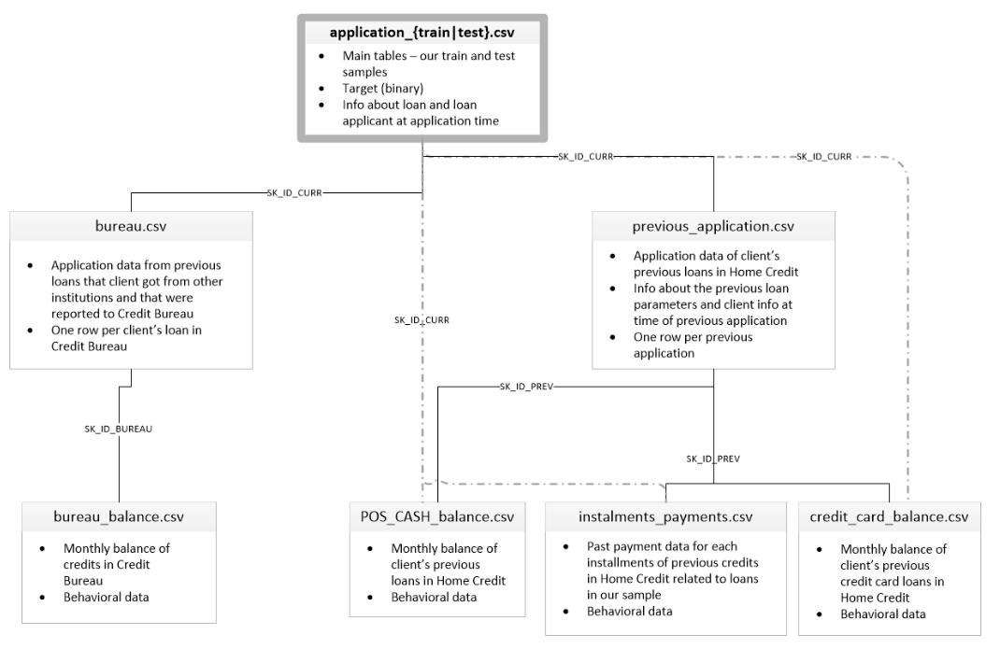

# Tổng quan dữ liệu — Home Credit Default Risk

> **Bài toán:** dự đoán xác suất khách hàng gặp khó khăn thanh toán cho đơn vay hiện tại
> **Đơn vị dự đoán:** một dòng cho mỗi `SK_ID_CURR`
> **Nhãn:** `TARGET` trong `application_train.csv`
> **Metric của competition:** ROC-AUC
> **Snapshot dữ liệu kiểm tra:** 03/08/2026

## 1. Tổng quan ngắn

Home Credit Default Risk là bài toán phân loại nhị phân trên dữ liệu quan hệ. Hai bảng `application_*` chứa đơn vay hiện tại; các bảng còn lại mô tả lịch sử tín dụng bên ngoài Home Credit, đơn vay trước đây và hành vi thanh toán theo tháng hoặc theo kỳ.

Điểm quan trọng nhất là **grain**. Mô hình cần một dòng cho mỗi `SK_ID_CURR`, trong khi các bảng lịch sử có nhiều dòng cho một khách hàng hoặc một khoản vay. Vì vậy phải tổng hợp các bảng lịch sử trước khi nối vào bảng application; join trực tiếp nhiều bảng one-to-many sẽ gây row explosion và làm sai mẫu huấn luyện.

`TARGET = 1` là event definition của competition về khó khăn thanh toán. Không nên diễn giải nó như một định nghĩa pháp lý chung về default hoặc nợ xấu.



## 2. Các bảng và file mô tả feature

Các số dòng/cột dưới đây được kiểm tra trực tiếp từ snapshot CSV local. Mỗi liên kết ở cột cuối là một data dictionary riêng có schema `id,name,details,sample`.

| Bảng                         | Grain của một dòng                                        | Khóa/liên kết                                   |      Dòng | Cột | Chi tiết feature                                  |
| ----------------------------- | ------------------------------------------------------------ | -------------------------------------------------- | ---------: | ---: | -------------------------------------------------- |
| `application_train.csv`     | Một đơn vay hiện tại dùng để train                   | `SK_ID_CURR`; có `TARGET`                     |    307.511 |  122 | [CSV](./details/application_train_features.csv)     |
| `application_test.csv`      | Một đơn vay hiện tại cần dự đoán                    | `SK_ID_CURR`                                     |     48.744 |  121 | [CSV](./details/application_test_features.csv)      |
| `bureau.csv`                | Một khoản tín dụng tại tổ chức khác                  | `SK_ID_BUREAU`, `SK_ID_CURR`                   |  1.716.428 |   17 | [CSV](./details/bureau_features.csv)                |
| `bureau_balance.csv`        | Một tháng của một khoản Credit Bureau                   | `SK_ID_BUREAU`, `MONTHS_BALANCE`               | 27.299.925 |    3 | [CSV](./details/bureau_balance_features.csv)        |
| `previous_application.csv`  | Một đơn vay trước đây tại Home Credit                | `SK_ID_PREV`, `SK_ID_CURR`                     |  1.670.214 |   37 | [CSV](./details/previous_application_features.csv)  |
| `POS_CASH_balance.csv`      | Một snapshot tháng của khoản POS/cash loan trước đây | `SK_ID_PREV`, `SK_ID_CURR`, `MONTHS_BALANCE` | 10.001.358 |    8 | [CSV](./details/pos_cash_balance_features.csv)      |
| `credit_card_balance.csv`   | Một snapshot tháng của thẻ tín dụng trước đây      | `SK_ID_PREV`, `SK_ID_CURR`, `MONTHS_BALANCE` |  3.840.312 |   23 | [CSV](./details/credit_card_balance_features.csv)   |
| `installments_payments.csv` | Một payment record/kỳ phải trả của khoản vay trước   | `SK_ID_PREV`, `SK_ID_CURR`                     | 13.605.401 |    8 | [CSV](./details/installments_payments_features.csv) |
| `sample_submission.csv`     | Một prediction cho mỗi đơn trong test                    | `SK_ID_CURR`, `TARGET`                         |     48.744 |    2 | [CSV](./details/sample_submission_features.csv)     |

`HomeCredit_columns_description.csv` là metadata nguồn, không phải bảng feature cho mô hình. Các file trong `details/` lấy **header CSV thực tế** làm chuẩn và dùng mô tả từ metadata này. Mô tả gốc được giữ bằng tiếng Anh để tránh làm lệch nghĩa; lỗi tên cột trong metadata như `SK_BUREAU_ID` và dấu cách thừa ở `SK_ID_PREV` đã được chuẩn hóa theo dữ liệu thật.

Cột `sample` của mỗi data dictionary lấy toàn bộ giá trị từ **một dòng hoàn chỉnh của chính bảng raw tương ứng**. Dòng được chọn không có ô trống, nhờ đó các giá trị trong cùng một file có thể đọc như một record nhất quán. Các category như `XNA` vẫn được giữ nguyên nếu đó là giá trị hiện diện trong dữ liệu gốc.

## 3. Quan hệ khóa

```text
application (SK_ID_CURR)
├── bureau (SK_ID_CURR, SK_ID_BUREAU)
│   └── bureau_balance (SK_ID_BUREAU, MONTHS_BALANCE)
└── previous_application (SK_ID_CURR, SK_ID_PREV)
    ├── POS_CASH_balance (SK_ID_PREV, MONTHS_BALANCE)
    ├── credit_card_balance (SK_ID_PREV, MONTHS_BALANCE)
    └── installments_payments (SK_ID_PREV)
```

- `SK_ID_CURR`: đơn vay hiện tại và đơn vị prediction.
- `SK_ID_BUREAU`: khoản tín dụng tại tổ chức khác; dùng để đưa lịch sử tháng từ `bureau_balance` về `bureau`.
- `SK_ID_PREV`: đơn vay/sản phẩm trước đây tại Home Credit; nối ba bảng hành vi về `previous_application` hoặc trực tiếp tổng hợp theo `SK_ID_CURR` khi phù hợp.

## 4. Cách tạo bảng mô hình

1. Dùng `application_train.csv` hoặc `application_test.csv` làm bảng gốc.
2. Tổng hợp `bureau_balance` theo `SK_ID_BUREAU`, nối vào `bureau`, rồi tổng hợp tiếp theo `SK_ID_CURR`.
3. Tổng hợp `previous_application`, `POS_CASH_balance`, `credit_card_balance` và `installments_payments` về `SK_ID_CURR`.
4. Chỉ join các feature block đã có đúng một dòng cho mỗi `SK_ID_CURR`.
5. Sau mỗi join, kiểm tra số dòng và tính duy nhất của `SK_ID_CURR`.

Các nhóm feature tổng hợp thường có ích là recency, số lượng/tần suất, mức độ quá hạn, tỷ lệ dư nợ/hạn mức, tỷ lệ thanh toán và xu hướng theo thời gian. Feature phải chỉ dùng thông tin có trước thời điểm đơn vay hiện tại.

## 5. Quy ước và kiểm tra tối thiểu

- `DAYS_*` và `MONTHS_BALANCE` là thời gian tương đối so với đơn hiện tại; giá trị âm thường chỉ thời điểm trong quá khứ.
- Không giả định payment record trong `installments_payments` luôn one-to-one với kỳ phải trả.
- Kiểm tra uniqueness của khóa, orphan key, join coverage, row count và train/test schema.
- Xử lý missing, sentinel, phép chia cho 0 và ratio cực trị trước khi huấn luyện.
- Submission phải có đúng `SK_ID_CURR,TARGET`, đủ 48.744 dòng, ID theo sample và xác suất hữu hạn trong `[0,1]`.

## 6. Nguồn và phạm vi

Nguồn chính là `datasets/raw/home-credit-default-risk/HomeCredit_columns_description.csv` và header của chín bảng CSV trong cùng thư mục. Báo cáo này chỉ mô tả cấu trúc dữ liệu của competition **Home Credit Default Risk (2018)**; không áp dụng cho **Home Credit — Credit Risk Model Stability**.

Tham khảo: [Kaggle competition](https://www.kaggle.com/competitions/home-credit-default-risk) và [trang dữ liệu](https://www.kaggle.com/competitions/home-credit-default-risk/data).
