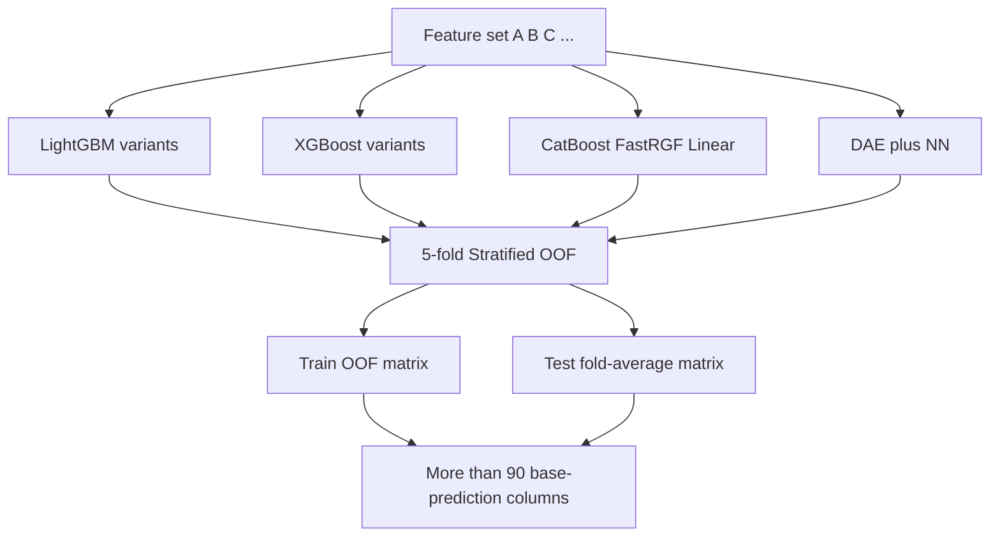
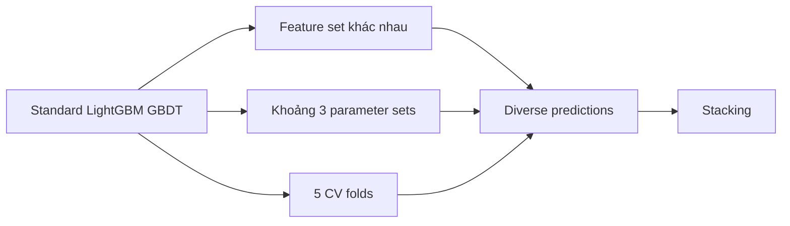
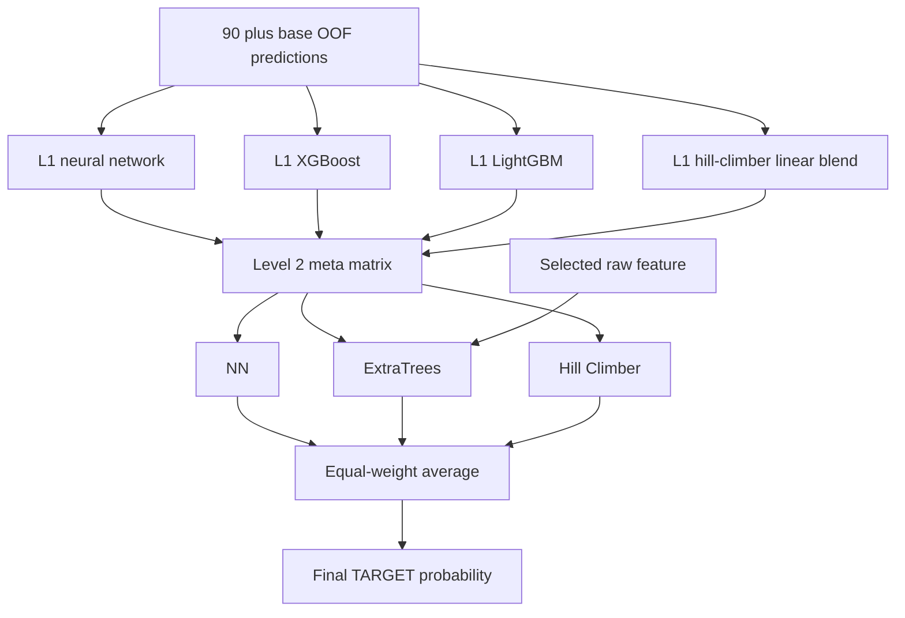

# Model và cách huấn luyện của Home Aloan — hạng 1 HCDR

> **Câu hỏi:** đội Home Aloan dùng model nào, huấn luyện và ensemble ra sao, và có
> thay đổi kiến trúc LightGBM hay không?
>
> **Phạm vi:** giải nhất competition Home Credit Default Risk 2018, đối chiếu write-up
> gốc của Bojan Tunguz với ba public kernel đang lưu trong repo. Nghiên cứu ngày
> 03/08/2026. Đây là phân tích benchmark Kaggle, không phải khuyến nghị triển khai
> credit decision production.

## Câu trả lời ngắn

**Không có bằng chứng đội thắng sửa kiến trúc nội bộ của LightGBM.** Họ dùng LightGBM
GBDT và XGBoost tương đối chuẩn; LightGBM là base learner đơn mạnh nhất. Điểm khác biệt
không nằm ở một “LightGBM đặc biệt”, mà ở hệ thống huấn luyện xung quanh nó:

1. nhiều feature set khác nhau;
2. mọi base model tạo prediction bằng 5-fold StratifiedKFold;
3. hơn 90 bộ base prediction từ LightGBM, XGBoost và các model bổ sung;
4. stacking nhiều tầng bằng NN, XGBoost, LightGBM, ExtraTrees và linear hill climber;
5. thêm một nhánh denoising autoencoder + neural network để tạo diversity;
6. final prediction là trung bình đều của ba prediction tầng cuối.

Write-up còn nói ba base model tốt nhất của đội đều có thể vào top 10, và chỉ cần lấy
trung bình ba model này cũng đủ đứng hạng nhất. Kết luận của chính đội thắng là feature
engineering/selection quan trọng hơn việc tạo một kiến trúc model mới hoặc tuning cực
sâu. Nguồn gốc: [Kaggle first-place discussion](https://www.kaggle.com/c/home-credit-default-risk/discussion/64821)
và [Kaggle discussion API](https://www.kaggle.com/api/i/discussions.DiscussionsService/GetForumTopicById?forumTopicId=64821&includeComments=true).

## 1. Những model nào đã được dùng?

| Model | Vai trò | Kết quả/nhận xét của đội thắng |
|---|---|---|
| **LightGBM** | Base learner chính; cũng là stacker tầng 1 | Model đơn mạnh nhất; best CV được báo cáo là `0.8039` |
| **XGBoost** | Base learner và stacker tầng 1 | Phần lớn XGBoost của Bojan dùng `gpu_hist` trên GPU |
| **CatBoost** | Base learner bổ sung | Chậm và score không tốt, nhưng tăng diversity cho meta-feature |
| **FastRGF** | Thử làm base learner | Được Olivier sử dụng; không được nêu là model chủ lực |
| **FFM** | Thử nghiệm | Kết quả thấp, khoảng `0.76` AUC trong thử nghiệm được mô tả |
| **Linear/Ridge regression** | Base/meta model đơn giản và feature selection | Ridge dùng forward selection; linear model giúp diversity |
| **DAE + neural network** | Base prediction khác họ cây | Yếu hơn LightGBM khi đứng riêng nhưng hữu ích khi blend |
| **NN stacker** | Học từ OOF predictions | Một hidden layer 500 ReLU ở tầng stacking |
| **ExtraTrees** | Meta-model tầng cao | Cây rất nông và regularize mạnh để tránh overfit meta matrix |
| **Hill Climber linear model** | Tối ưu linear blend ở các tầng stack | Write-up không công bố đủ chi tiết để tái lập chính xác thuật toán |

**Điểm cần tránh đọc nhầm:** DART LightGBM được nhắc trong một số tổng hợp của đội
hạng 2, nhưng write-up gốc của Home Aloan không nói họ sửa boosting thành DART. Public
kernel local cũng khai báo `boosting_type='gbdt'`.

## 2. Base model được huấn luyện như thế nào?

Tất cả base model trong final solution dùng **5-fold StratifiedKFold**. Với mỗi model:

- bốn fold dùng để fit, fold còn lại tạo out-of-fold prediction;
- năm fold ghép lại thành một OOF vector cho toàn bộ train;
- prediction competition test được tạo ở từng fold rồi average;
- OOF/test predictions trở thành một cột trong meta matrix.

Đây là phần training quan trọng hơn một lần fit LightGBM đơn lẻ: cùng một fold scheme
cho phép stacker học trên prediction không được tạo bởi model đã thấy chính target của
dòng đó. Nếu fit base model trên toàn train rồi dùng in-sample prediction làm đầu vào
stacker, kết quả sẽ leakage.

## 3. LightGBM có gì khác bình thường?

### Không có custom architecture hoặc custom objective

Write-up không mô tả:

- sửa source code hoặc thuật toán dựng cây của LightGBM;
- custom tree layer, neural-tree hybrid hoặc custom loss;
- một objective khác binary classification;
- một cấu hình duy nhất được tối ưu cực sâu.

Bojan dùng khoảng ba bộ hyperparameter LightGBM: một từ public kernel, một từ đội
Neptune và một bộ “standard”. LightGBM chạy CPU; XGBoost chủ yếu chạy GPU. Đội đã thử
optimization script nhưng kết quả local không thuyết phục, nên chọn **nhiều model có
hyperparameter/feature set khác nhau** thay cho một model được tune tối đa.

Vì vậy “architecture innovation” nằm ở **ensemble graph**, không nằm bên trong
LightGBM.

### Public LightGBM kernels trong repo

Ba kernel local chỉ là public building block, không phải toàn bộ final solution:

| Kernel | Cách train hiện trong code |
|---|---|
| `03-good-fun-with-lightgbm` | `LGBMClassifier`, 5-fold KFold, 4.000 cây tối đa, learning rate `0.03`, 30 leaves, depth 7, early stopping 100 |
| `02-lighgbm-with-selected-features` | `lgb.train`, standard GBDT, 5-fold KFold, 10.000 rounds tối đa, learning rate `0.02`, 20 leaves, depth 8, early stopping 200; drop 339 feature trước fit |
| `01-xgb-simple-features` | XGBoost depth 4, learning rate `0.01`, 10.000 cây tối đa, `scale_pos_weight=11`, early stopping 200 |

Kernel 02 gọi KFold thường vì `main()` truyền `stratified=False`, khác với final
solution được write-up xác nhận là 5-fold stratified. Kernel XGBoost khai báo 10-fold
stratified nhưng có `if n_fold == 0`, nên file local hiện chỉ train fold đầu. Không
được dùng hai kernel này làm bằng chứng rằng final ensemble cũng có các giới hạn đó.

## 4. Kiến trúc ensemble ba tầng

Mỗi thành viên tạo các base predictions từ feature set và model riêng. Đội chuẩn hóa
việc chia sẻ qua CSV, ghép thành dense meta matrix với hơn 90 prediction columns.

Write-up gọi đây là ensemble ba level. Cách đánh số model ở đoạn ExtraTrees hơi lẫn
giữa “L2 layer” và “L3 model”, nhưng luồng được mô tả rõ: base predictions → first
stackers → three higher-level predictions → equal-weight final blend.

### Các chi tiết khác thường

**Restacking raw feature.** ExtraTrees tầng cao không chỉ nhận prediction. Nó dùng bảy
L2 model cùng một raw feature `AMT_INCOME_TOTAL`. Đây là cách cho meta-model một ít
thông tin gốc để điều chỉnh prediction theo phân khúc.

**Meta-model cố ý đơn giản.** ExtraTrees có `max_depth=4` và
`min_samples_leaf=1000`. Regularization rất mạnh giúp giảm nguy cơ stacker học nhiễu
từ hơn 90 prediction tương quan cao.

**Diversity quan trọng hơn individual score.** CatBoost và NN không phải model đơn tốt
nhất nhưng vẫn được giữ vì lỗi của chúng khác boosted trees. Đội nhận xét NN giúp quan
hệ giữa CV và leaderboard ổn định hơn khi số base prediction tăng.

**Không phụ thuộc hoàn toàn vào stack phức tạp.** Sau competition, đội nhận thấy ba
base model tốt nhất đều đủ vào top 10 và trung bình đơn giản của chúng cũng đủ đứng
hạng nhất. Stack nhiều tầng chỉ khai thác phần gain rất nhỏ ở cuối leaderboard.

## 5. Nhánh DAE + neural network

Đây là thay đổi kiến trúc đáng kể duy nhất, nhưng nó là **model riêng**, không phải
LightGBM đã sửa đổi.

### Base neural model

Luồng xử lý:

1. rank-Gauss normalize feature, thay missing bằng 0;
2. dùng denoising autoencoder với swap noise `0.2` học representation không giám sát;
3. đưa representation vào supervised NN tối ưu log loss;
4. tạo OOF/test prediction như các base model khác.

Các thử nghiệm đầu dùng DAE topology `10000-10000-10000`, sau đó là supervised NN
`1000-1000`. Bản tốt nhất được báo cáo dùng DAE một hidden layer 50.000 neuron, sau đó
NN `1000-1000`. Hidden unit là ReLU, optimizer SGD, minibatch 128; supervised NN dùng
dropout `0.5` và khoảng 50 epoch. Một vòng 5-fold mất khoảng một ngày trên GTX 1080 Ti.

Best DAE+NN được báo cáo có CV `0.794961`, thấp hơn gần `0.01` AUC so với best
LightGBM `0.8039`. Vai trò của nó là tạo residual diversity cho ensemble, không thay
thế boosted tree.

### Neural stacker

NN dùng để stack đơn giản hơn nhiều: một hidden layer 500 ReLU, learning rate ban đầu
`1e-3`, decay multiplier `0.96` mỗi epoch và dropout `0.3`. Sự khác biệt quan trọng là
input của nó là OOF prediction matrix, không phải toàn bộ bảng feature thô.

## 6. Điều thực sự độc đáo trong training

Xếp theo mức ảnh hưởng kiến trúc:

1. **OOF everywhere:** mỗi base learner tạo meta-feature bằng cùng 5-fold stratified
   protocol.
2. **Feature-set ensemble:** nhiều LightGBM khác nhau chủ yếu vì nhìn feature set khác
   nhau, không chỉ vì đổi seed.
3. **Heterogeneous stacking:** tree booster, neural network, ExtraTrees và linear
   blender học các lỗi khác nhau.
4. **Raw-feature restacking:** đưa một feature gốc vào meta-model tầng cao.
5. **DAE as diversity generator:** representation learning không thắng model đơn nhưng
   có giá trị ở blend.
6. **Limited tuning by design:** một vài cấu hình chuẩn và nhiều nguồn diversity thay
   cho exhaustive hyperparameter search.
7. **Final simple average:** sau các stacker, ba output cuối được average đều thay vì
   thêm một optimizer phức tạp nữa.

Hill Climber là tên được write-up sử dụng cho linear blending model, nhưng không có
pseudocode, objective, constraint hoặc stopping rule. Cách tái lập chính xác phần này
là **unknown**; không nên tự gán cho nó một thuật toán cụ thể chỉ từ tên gọi.

## 7. Bài học cho pipeline hiện tại

Thứ tự thử nghiệm hợp lý:

1. nâng feature set và giữ LightGBM/XGBoost chuẩn;
2. chuyển đánh giá sang 5-fold stratified OOF khi mục tiêu là stacking;
3. lưu OOF/test prediction có provenance cho từng feature set, seed và model config;
4. đo correlation giữa residual/prediction trước khi thêm model vào blend;
5. bắt đầu bằng average hoặc constrained linear blend;
6. chỉ thử stacker phi tuyến khi OOF matrix đủ đa dạng và có nested validation;
7. coi DAE/NN là ablation diversity, không phải mặc định thay LightGBM.

Không nên tái hiện ngay ensemble 90+ model trong pipeline thực hành. Gain cuối rất nhỏ,
chi phí compute/provenance lớn, và random CV của HCDR không chứng minh temporal
stability hoặc production suitability.

## 8. Rủi ro tái lập

- `neighbors_target_mean_500` dùng target; write-up không mô tả chi tiết fold isolation.
  Bản tái lập phải tạo feature này OOF để tránh leakage.
- Stacking nhiều tầng cần nested hoặc strictly OOF training. Tuning stacker trên cùng
  OOF matrix rồi báo lại score đó có thể optimistic.
- Hơn 90 prediction không đồng nghĩa hơn 90 kiến trúc độc lập; phần lớn là biến thể
  feature/config của vài model family.
- Metric competition là ROC-AUC; model có thể rank tốt nhưng chưa được kiểm calibration,
  cutoff, fairness hoặc drift.
- Các score trong write-up là kết quả lịch sử do đội công bố, chưa được chạy lại trong
  workspace này.

## 9. Trạng thái bằng chứng

- **Verified primary:** model family, 5-fold StratifiedKFold, DAE/NN topology, hơn 90
  base predictions, stacker và final equal blend lấy trực tiếp từ post của Bojan Tunguz.
- **Verified local:** parameter và lỗi fold của ba public kernel đọc trực tiếp từ code
  trong repo.
- **Inferred:** diversity và regularization là lý do kỹ thuật của một số lựa chọn; khi
  write-up chỉ nêu cấu hình mà không nêu causal ablation, báo cáo không coi suy luận đó
  là fact.
- **Unknown:** exact weight-search của Hill Climber, toàn bộ danh sách 90+ base model,
  mọi hyperparameter và contribution riêng của từng tầng.

## 10. Nguồn

### Nguồn gốc

- Bojan Tunguz, **1st Place Solution**, Kaggle, 02/09/2018:
  [discussion UI](https://www.kaggle.com/c/home-credit-default-risk/discussion/64821),
  [discussion API chứa raw Markdown](https://www.kaggle.com/api/i/discussions.DiscussionsService/GetForumTopicById?forumTopicId=64821&includeComments=true).

### Code local

- [`03-good-fun-with-lightgbm.py`](../../../../notebooks/leaderboard/home-credit-default-risk/01-home-aloan/03-good-fun-with-lightgbm/good-fun-with-ligthgbm.py)
- [`02-lighgbm-with-selected-features.py`](../../../../notebooks/leaderboard/home-credit-default-risk/01-home-aloan/02-lighgbm-with-selected-features/lighgbm-with-selected-features.py)
- [`01-xgb-simple-features.py`](../../../../notebooks/leaderboard/home-credit-default-risk/01-home-aloan/01-xgb-simple-features/xgb-simple-features.py)
- Báo cáo liên quan: [feature extraction của Home Aloan](../feature-extraction/top-1-feature-extraction-from-leaderboard-notebooks.md).
