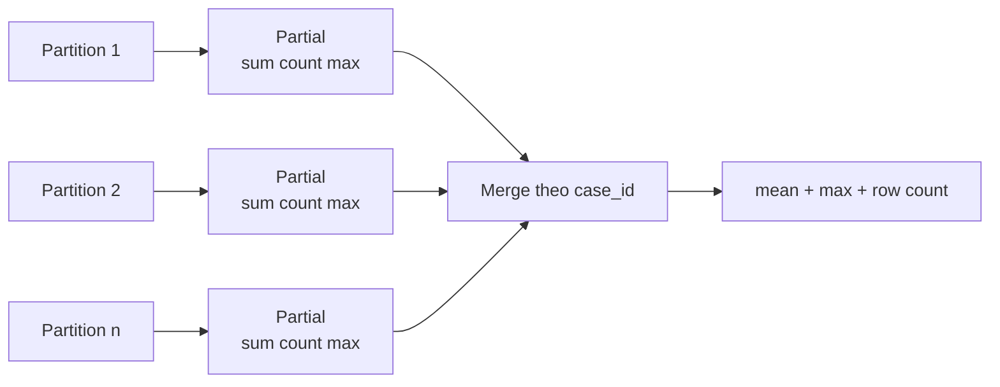

# Feature aggregate do pipeline HCMS tạo

## 1. Mục tiêu

Báo cáo này giải thích toàn bộ **quy tắc tạo feature mới** trong
[`aggregate.py`](../../../../src/home_credit_stability/aggregate.py). Vì 16 family dùng
cùng naming template, bảng công thức dưới đây là dictionary chuẩn; danh sách 331 cột
cụ thể nằm trong [CSV engineered features](../details/src_engineered_features.csv).

## 2. Tổng quan theo stage

| Stage | Family | Feature aggregate |
| --- | --- | ---: |
| A | `static_0`, `static_cb_0` | 24 + 24 = 48 |
| B | `applprev_1`, `credit_bureau_a_1`, `credit_bureau_b_1` | 49 + 49 + 49 |
| B | `debitcard_1`, `deposit_1`, `other_1`, `person_1` | 9 + 7 + 11 + 38 |
| B | ba `tax_registry_*_1` | 6 + 6 + 6 |
| C | `applprev_2`, `credit_bureau_a_2`, `credit_bureau_b_2`, `person_2` | 4 + 27 + 7 + 10 |
| **Tổng** | 16 family | **326** |

## 3. Công thức chính xác

Gọi `F` là prefix family viết hoa và `x` là raw column đã được chọn.

| Feature output | Điều kiện | Công thức theo `case_id` | Ý nghĩa |
| --- | --- | --- | --- |
| `F__x` | depth 0 numeric/date/category | giá trị raw; date đổi thành gap ngày | trạng thái hiện tại của case |
| `F__ROW_COUNT` | depth 1/2 | tổng số raw rows | độ dài lịch sử/độ phủ record |
| `F__x__MEAN` | numeric | `sum(partial SUM) / sum(partial COUNT)` | trung bình có trọng số đúng theo dòng non-null |
| `F__x__MAX` | numeric | `max(partial MAX)` | cực đại lịch sử |
| `F__x__MIN_GAP` | date | `min(date_decision - x)` | gap nhỏ nhất |
| `F__x__MAX_GAP` | date | `max(date_decision - x)` | gap lớn nhất |
| `F__x__NUNIQUE` | category | `sum(partition n_unique(x))` | proxy độ đa dạng category theo partition |

Numeric được cast `Float32` trước partial; sum dùng `Float64` để giảm overflow. Mean bỏ
qua null nhờ cặp sum/count. Với cột toàn null, count bằng 0 và mean trở thành null.

## 4. Vì sao partial aggregation cần thiết

`credit_bureau_a_2` có 188.298.452 dòng qua 11 file. Collect toàn bộ rồi group-by có
thể vượt RAM. Pipeline nén từng file về partial Parquet, giải phóng matrix, sau đó merge
partial. Cách này bảo toàn `MEAN` vì giữ cả sum và count, đồng thời bảo toàn `MAX`.

## 5. Giới hạn cần biết

- `max_columns_per_family=24` bỏ nhiều raw column trước modeling.
- Selection theo suffix/schema order, không theo IV hay importance.
- Depth 2 được aggregate thẳng về `case_id`; `num_group1/2` không được dựng thành
  hierarchy hợp đồng → kỳ chi tiết trước khi nén.
- `NUNIQUE` cộng distinct theo partition nên có thể overcount.
- Không có recency window, trend, last/first, sum exposure hoặc ratio nghiệp vụ riêng.
- Category ở depth 1/2 chỉ còn diversity count; giá trị category cụ thể bị mất.

Đây là trade-off auditability/bộ nhớ, không phải tuyên bố feature set tối ưu leaderboard.
