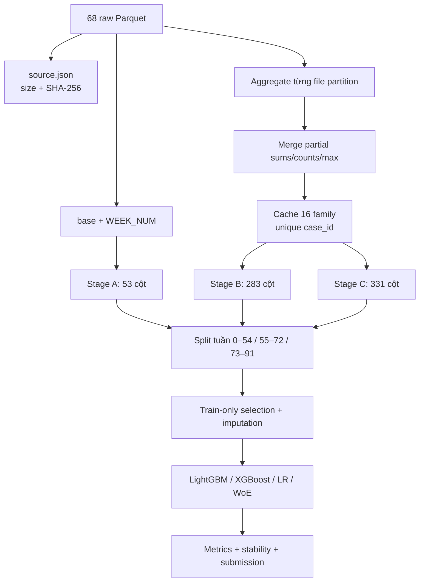

# Luồng trích xuất dữ liệu trong `src/home_credit_stability`

## 1. Câu trả lời ngắn

Pipeline scan Parquet bằng Polars, xử lý mỗi family độc lập, ghi partial aggregate nén
ZSTD rồi mới ghép vào `base`. Stage A/B/C lần lượt chứa 48/278/326 engineered model
feature trong matrix (chưa trừ bước selection). Model cuối chỉ chọn 129 raw numeric
feature, median-impute trên train và sinh 244 cột sau missing indicator.



## 2. Thành phần

| File | Trách nhiệm |
| --- | --- |
| [`data.py`](../../../../src/home_credit_stability/data.py) | validate layout, scan base, inventory và SHA-256 manifest |
| [`aggregate.py`](../../../../src/home_credit_stability/aggregate.py) | chọn cột theo suffix, partial aggregation, cache và join invariant |
| [`split.py`](../../../../src/home_credit_stability/split.py) | chia nguyên khối các tuần sớm/giữa/muộn |
| [`stability.py`](../../../../src/home_credit_stability/stability.py) | Gini theo tuần, slope penalty và residual penalty |
| [`pipeline.py`](../../../../src/home_credit_stability/pipeline.py) | orchestration, selection, model, scorecard, artifacts |
| [`prepare_hcms_data.py`](../../../../scripts/data/prepare_hcms_data.py) | fingerprint snapshot đã có; không tự download |
| [`run_hcms_pipeline.py`](../../../../scripts/pipelines/run_hcms_pipeline.py) | entry point chuẩn |

## 3. Luồng từng bước

### Bước 1 — validate và fingerprint

`parquet_root()` yêu cầu `train_base`, `test_base`, `feature_definitions.csv`.
`write_source_manifest()` đọc metadata, rồi SHA-256 từng nguồn vào `source.json`.

### Bước 2 — chọn cột có giới hạn bộ nhớ

Mỗi family lấy tối đa 24 raw feature theo thứ tự: suffix `P/A`, rồi `L/T`, numeric
khác, date, category. Train schema quyết định selection cho cả test, tránh test-only
schema drift. Đây là quota kỹ thuật, không phải feature importance.

### Bước 3 — biến đổi ngày và aggregate

Date được đổi thành số ngày giữa `date_decision` và event date. Depth 0 copy giá trị
về tên `<FAMILY>__<COLUMN>`. Depth 1/2 ghi partial theo từng file rồi merge:

- numeric: `SUM`, `COUNT`, `MAX` partial → `MEAN`, `MAX` toàn family;
- date gap: `MIN_GAP`, `MAX_GAP`;
- category: `NUNIQUE` partial;
- mọi depth 1/2: `ROW_COUNT`.

Lưu ý `NUNIQUE` hiện là **tổng distinct count của từng partition**, không phải global
distinct sau khi hợp nhất; category xuất hiện ở nhiều partition có thể bị đếm lặp.

### Bước 4 — join có invariant

Mỗi cache được assert `rows == n_unique(case_id)`. Matrix left join lần lượt và kiểm
số dòng đầu ra bằng base. Train/test còn được kiểm cùng schema trước khi reuse cache.

### Bước 5 — split out-of-time

92 tuần được sắp tăng dần và chia theo số tuần: train 0–54 (1.129.770 dòng), valid
55–72 (193.544), test 73–91 (203.345). Không tuần nào nằm ở hai split. Đây là
out-of-time theo `WEEK_NUM`, dù không chứng minh mọi event date/feature đều leakage-free.

### Bước 6 — selection và preprocessing

`_candidate_features()` chỉ giữ numeric có ít nhất một non-null ở train, lấy tối đa 10
feature mỗi prefix family rồi cap 160. Stage C thực tế chọn 129. `SimpleImputer` median
với missing indicators được fit train-only, tạo 244 transformed columns.

## 4. Artifact verified

| Matrix | Dòng train | Tổng cột | Engineered feature ngoài 5 cột base |
| --- | ---: | ---: | ---: |
| A | 1.526.659 | 53 | 48 |
| B | 1.526.659 | 283 | 278 |
| C | 1.526.659 | 331 | 326 |

Danh sách đầy đủ 331 cột, stage, family và diễn giải công thức nằm tại
[`details/src_engineered_features.csv`](../details/src_engineered_features.csv).

## 5. Tái lập

```bash
uv run python scripts/data/prepare_hcms_data.py
uv run python scripts/pipelines/run_hcms_pipeline.py
```

Full run tốn nhiều RAM/thời gian và dùng GPU cho LightGBM nếu môi trường hỗ trợ; không
cần chạy lại chỉ để đọc báo cáo vì matrix/model/artifact đã tồn tại.
