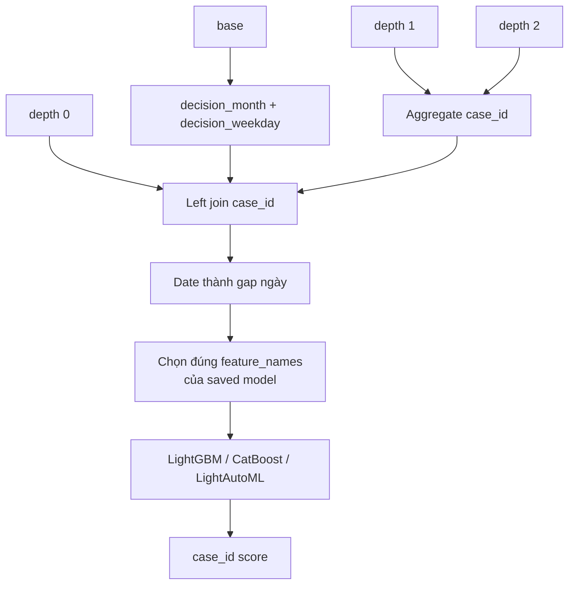

# Feature extraction trong các notebook gắn với đội hạng 1 `yuuniekiri`

## 1. Phạm vi bằng chứng

**Verified từ code local:** ba script trong
[`notebooks/leaderboard/home-credit-model-stability/01-yuuniee/`](../../../../notebooks/leaderboard/home-credit-model-stability/01-yuuniee/)
thực hiện inference LightGBM, CatBoost và LightAutoML. Chúng tải model đã train từ
Kaggle Dataset riêng. Vì training artifacts/code đầy đủ không có trong repo, báo cáo
không coi đây là toàn bộ winning solution và không suy ra fold score hay ensemble weight
chung ngoài những gì script thể hiện.

## 2. Luồng chung

## 3. Hai generator aggregate

### 3.1 LightGBM notebook — logic tùy family

Generator tổng quát chọn cột suffix `T/L/M/D/P/A` và `num_group*`:

| Nhóm cột | Aggregate |
| --- | --- |
| mọi cột được chọn | `min`, `max` |
| suffix `L/A` | thêm `mean`, `std`, `sum`, `median` |
| `credit_bureau_a_1` | thêm `first` cho 17 feature được hard-code |
| `person_1` | `first` cho 10 đặc trưng nhân khẩu/việc làm; max income và max income self-employed |
| `person_2` | `first` + `last` cho 3 feature employment |
| `tax_registry_a_1` | min/max/first/last/mean/std và range amount |
| `credit_bureau_a_2` | min/max/mean/std, range của 3 delinquency/collateral feature và row count depth 2 |
| `other_1` | `first` của mọi cột không phải group index |

Hai family `credit_bureau_b_1/2` trả danh sách aggregate rỗng trong nhánh riêng. Code
cũng không dùng `applprev_2` trong data store LightGBM. Sau join, date chuyển sang gap;
`MONTH` và `date_decision` bị drop. Saved LightGBM `feature_name_` là contract cuối,
không phải toàn bộ cột generator sinh ra.

### 3.2 CatBoost và LightAutoML — generator suffix thống nhất

Hai script này dùng cùng template rộng hơn:

| Suffix | Aggregate |
| --- | --- |
| `P/A` | min, max, mean, std |
| `D` | min, max rồi đổi thành gap ngày |
| `M` | first, last, n_unique |
| `T/L` | min, max, sum |
| `num_group*` | max |

CatBoost/LightAutoML join cả `applprev_2`, `person_2` và hai bureau depth 2. Numeric null
được fill 0, category null fill `Missing`. Inference chỉ select `cat_features` hoặc
`train_cols` đã lưu cùng model, vì vậy schema của saved artifacts mới là selection thật.

## 4. Feature mới đáng chú ý

- `decision_month`, `decision_weekday`: seasonality ở thời điểm quyết định.
- `date_decision - <event>D`: recency cho mọi date feature.
- `first_*`, `last_*`: trạng thái đầu/cuối sau sort `num_group1`.
- `n_unique_*M`: mức đa dạng category.
- `mean/std/sum/median_*`: location, dispersion và exposure, rộng hơn `src`.
- range hard-code `max-min_gap_depth2_*`: biên độ collateral/DPD/overdue.
- `mainoccupationinc_384A_any_selfemployed`: interaction giữa income và income type.

## 5. Các bẫy khi port

- `read_files()` aggregate từng partition rồi concat và `unique(case_id)`. Nếu cùng
  `case_id` xuất hiện ở nhiều partition, giữ một dòng có thể làm mất partial history.
- `first/last` chỉ có nghĩa khi sort và tie/order semantics đúng.
- Fill 0 trộn missing với số 0 nghiệp vụ; cần missing indicator hoặc category riêng.
- Range dùng API `.apply` cũ và fill null 0; semantics phải kiểm lại khi port.
- Các comment chứa nhiều ablation/LB number nhưng không đủ provenance để xem là kết quả
  tái lập.

