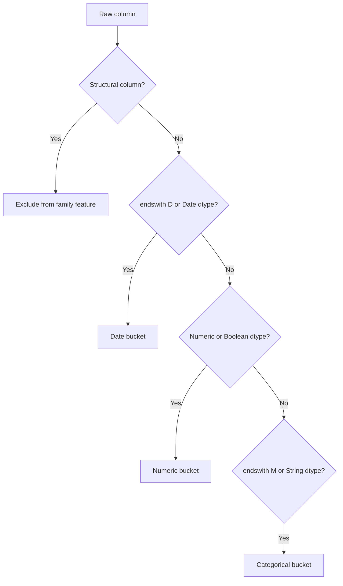

# Quy ước tên feature và suffix trong Home Credit Model Stability

> **Câu hỏi chính:** một tên như `pmts_dpdvalue_108P` gồm những phần nào, sáu suffix
> `A/D/L/M/P/T` có ý nghĩa gì, và pipeline hiện tại dùng chúng để tạo feature ra sao?
>
> **Phạm vi:** 465 định nghĩa trong `feature_definitions.csv`, schema 68 Parquet,
> implementation `src/home_credit_stability` và starter/baseline notebook local. Snapshot
> được kiểm tra ngày 05/08/2026.

## 1. Câu trả lời ngắn

Phần lớn tên feature HCMS có dạng:

```text
<semantic_stem>_<numeric_id><suffix>
```

Ví dụ:

```text
pmts_dpdvalue_108P
│             │  └─ P: transformation family — DPD/past-due
│             └──── 108: identifier của feature
└────────────────── pmts_dpdvalue: stem mô tả nội dung
```

- **Stem** là phần nên đọc để hiểu nghiệp vụ.
- **Numeric ID** dùng để phân biệt feature; không nên diễn giải nó như số ngày, window,
  depth, version hay dtype.
- **Suffix cuối** cho biết transformation family do nhà cung cấp dữ liệu gán.
- **Depth không nằm trong suffix feature**; depth nằm ở tên bảng `_0`, `_1`, `_2` và
  các khóa `num_group1`, `num_group2`.

Trong snapshot hiện tại, cả 464 feature nghiệp vụ có trong Parquet đều khớp pattern trên.
Các cột cấu trúc như `case_id`, `target`, `date_decision`, `MONTH`, `WEEK_NUM` và
`num_group*` là ngoại lệ. `*_101D` và `*_102M` không xuất hiện trong snapshot local;
`pmts_dpdvalue_108P` có thật và tuân theo cùng quy tắc.

## 2. Why — vì sao tên lại có ba phần?

Dataset có hàng trăm biến từ nhiều hệ thống và nhiều bảng. Chỉ dùng stem có thể gây đụng tên hoặc làm mất lineage; chỉ dùng dtype lại không diễn đạt được transformation semantics.
Cấu trúc ba phần giải quyết ba nhu cầu khác nhau:

| Thành phần  | Giải quyết vấn đề                                           | Không nên suy ra                                       |
| ------------- | ---------------------------------------------------------------- | -------------------------------------------------------- |
| semantic stem | giúp người đọc nhận ra amount, DPD, date, status, count... | công thức chính xác nếu chưa đọc definition      |
| numeric ID    | giữ identity của biến qua bảng/pipeline                      | đơn vị, thời gian, mức ưu tiên hoặc ordinal rank |
| suffix        | gắn feature vào transformation family                          | dtype tuyệt đối hoặc phép aggregate bắt buộc      |

**Verified:** có 463 numeric ID duy nhất trên 464 raw features; ID `997` là trường hợp
duy nhất được dùng hai lần: `periodicityofpmts_997L` và `periodicityofpmts_997M`. Điều
này cho thấy cặp **ID + suffix + stem**, không phải con số đứng riêng, mới là identity an
toàn.

## 3. Ý nghĩa sáu suffix

Kaggle mô tả suffix là loại transformation; [Ibis project](https://ibis-project.org/posts/ibisml/)
cũng dùng chính convention này để cast feature cho competition.

| Suffix | Nghĩa do competition công bố | Số raw feature | Dtype thực tế local              | Ví dụ                                        |
| ------ | ------------------------------- | --------------: | ---------------------------------- | ---------------------------------------------- |
| `A`  | transformed amount              |             102 | 102 numeric                        | `credamount_770A`, `totaldebt_9A`          |
| `D`  | transformed date                |              57 | 57 string ngày trong raw Parquet  | `approvaldate_319D`, `birth_259D`          |
| `M`  | masked category                 |              63 | 63 string                          | `education_927M`, `district_544M`          |
| `P`  | transformed DPD/past-due        |              33 | 33 numeric                         | `actualdpd_943P`, `pmts_dpdvalue_108P`     |
| `L`  | unspecified transform           |             187 | 143 numeric, 31 string, 13 boolean | `numinstls_657L`, `status_219L`            |
| `T`  | unspecified transform           |              22 | 17 numeric, 5 string               | `dpdmaxdatemonth_442T`, `incometype_1044T` |

### 3.1. `A` — amount

`A` thường biểu diễn tiền, dư nợ, hạn mức, installment hoặc income sau transformation
của nhà cung cấp. Đây là numeric nhưng **suffix không nói đơn vị tiền tệ** và không đảm
bảo các cột có thể cộng trực tiếp với nhau.

Feature extraction quan tâm `A` vì amount có hai loại tín hiệu:

- mức điển hình (`MEAN`) — quy mô thông thường của lịch sử;
- cực đại (`MAX`) — exposure lớn nhất hoặc tail risk.

**Ví dụ 1 — amount tại depth 0:**

```text
credamount_770A
= “Loan amount or credit card limit”
→ STATIC_0__credamount_770A
```

`static_0` đã ở grain một record/case, nên pipeline chỉ cast về `Float32` và giữ giá trị
thay vì aggregate. Khi diễn giải, feature này là quy mô khoản vay/hạn mức của case, không
phải tổng lịch sử của khách hàng.

**Ví dụ 2 — amount lịch sử tại depth 1:**

```text
debtoutstand_525A
= “Outstanding amount of existing contract”
→ CREDIT_BUREAU_A_1__debtoutstand_525A__MEAN
→ CREDIT_BUREAU_A_1__debtoutstand_525A__MAX
```

`MEAN` trả lời “dư nợ hiện hữu trung bình trên các contract là bao nhiêu?”, còn `MAX`
trả lời “contract có dư nợ lớn nhất là bao nhiêu?”. Hai câu hỏi khác nhau nên không thể
đổi chỗ hoặc cộng hai output này.

### 3.2. `P` — Days Past Due / past-due transform

`P` tập trung vào delinquency như actual DPD, max DPD hoặc payment past due. Ví dụ chính
xác người dùng nêu:

```text
pmts_dpdvalue_108P
= “Value of past due payment for active contract”
```

Trong Stage C, `src` tạo hai feature:

```text
CREDIT_BUREAU_B_2__pmts_dpdvalue_108P__MEAN
CREDIT_BUREAU_B_2__pmts_dpdvalue_108P__MAX
```

Mean mô tả mức past-due điển hình trên payment records; max giữ lại trường hợp nghiêm
trọng nhất. Suffix `P` không có nghĩa mọi giá trị đều là “số ngày” nguyên bản: phải đọc
description vì một số feature đã là average/max/tolerance transform.

**Ví dụ bổ sung — DPD ở depth 1:**

```text
actualdpd_943P
= “Days Past Due of previous contract, actual”
→ APPLPREV_1__actualdpd_943P__MEAN
→ APPLPREV_1__actualdpd_943P__MAX
```

Ở đây raw definition xác nhận đơn vị là DPD. `MEAN` mô tả mức trễ điển hình của các đơn
trước; `MAX` giữ lần trễ nặng nhất. Ngược lại, với `pmts_dpdvalue_108P`, description gọi
là “value of past due payment”, nên không được tự gán đơn vị ngày chỉ vì cùng suffix `P`.

### 3.3. `D` — date

Ngày calendar thô không có cùng ý nghĩa giữa các case ở các thời điểm khác nhau. Pipeline
chuẩn hóa bằng:

```text
gap_days = date_decision - event_date
```

- depth 0: giữ một `gap_days` cho case;
- depth 1/2: tạo `MIN_GAP` và `MAX_GAP` theo case.

Nếu mọi event đều ở quá khứ, `MIN_GAP` gần thời điểm quyết định hơn và `MAX_GAP` xa hơn.
Không được mặc định điều này khi gap âm: ngày sau `date_decision` có thể phản ánh field
được cập nhật trong tương lai hoặc semantics khác, cần audit leakage theo từng definition.

**Ví dụ — ngày duyệt của previous application:**

```text
approvaldate_319D
= “Approval Date of Previous Application”
→ gap = date_decision - approvaldate_319D
→ APPLPREV_1__approvaldate_319D__MIN_GAP
→ APPLPREV_1__approvaldate_319D__MAX_GAP
```

Nếu một case có ba đơn cũ được duyệt cách ngày quyết định hiện tại 30, 200 và 800 ngày,
`MIN_GAP = 30` biểu diễn lần duyệt gần nhất, còn `MAX_GAP = 800` biểu diễn lần xa nhất.
Pipeline target `D` theo cách này vì “30 ngày trước” có thể so sánh giữa các case tốt hơn
hai ngày calendar tuyệt đối khác nhau.

### 3.4. `M` — masked category

Giá trị `M` thường là category đã masking, ví dụ token/hash thay vì nhãn nghiệp vụ gốc.
Không nên cố giải mã token hoặc áp đặt ordinal order.

- depth 0: `src` giữ string trong matrix;
- depth 1/2: `src` nén thành `NUNIQUE`, một proxy cho độ đa dạng trạng thái/category.

Model path hiện tại cuối cùng chỉ chọn numeric/boolean, nên category `M` depth 0 không đi
vào 129 feature model. `M` depth 1/2 có thể đi vào sau khi trở thành numeric `NUNIQUE`.
Đây là **hành vi của implementation local**, không phải yêu cầu của competition.

**Ví dụ — education đã masking/category tại depth 1:**

```text
education_927M
= “Education level of the person”
→ PERSON_1__education_927M__NUNIQUE
```

Nếu các person records của một case chứa hai token education khác nhau, output xấp xỉ 2.
Pipeline không giải mã token và không giả định token nào “cao hơn”. `NUNIQUE` chỉ giữ độ
đa dạng, nên làm mất category cụ thể; đây là compression để có một số trên mỗi `case_id`,
không phải encoding đầy đủ nội dung education.

### 3.5. `L` và `T` — unspecified transform

Hai suffix này cố ý không định nghĩa transformation cụ thể. Dữ liệu local chứng minh chúng
dị thể: `L` có số, chuỗi và boolean; `T` có cả số tháng/năm lẫn category như income type.
Vì vậy quy tắc `L = numeric` hoặc `T = categorical` đều sai.

Pipeline xử lý đúng hướng bằng cách xem **dtype train schema trước**, suffix sau:

- numeric/boolean `L/T` → numeric bucket;
- string `L/T` → categorical bucket;
- aggregate tương ứng với bucket, không chỉ dựa vào chữ cuối.

#### Ví dụ `L` — cùng suffix, ba dtype khác nhau

**Numeric `L`:**

```text
days120_123L
= “Number of credit bureau queries for the last 120 days”
→ STATIC_CB_0__days120_123L
```

Đây là numeric depth 0, nên được giữ trực tiếp. Con số `123` là ID; cửa sổ 120 ngày nằm
trong stem/description, không nằm trong numeric ID.

**Boolean `L`:**

```text
isbidproduct_390L
= “Flag ... if the product is a cross-sell”
→ APPLPREV_1__isbidproduct_390L__MEAN
→ APPLPREV_1__isbidproduct_390L__MAX
```

Sau cast 0/1, `MEAN` là tỷ lệ previous applications có cờ cross-sell; `MAX` tương đương
“đã từng có ít nhất một cross-sell hay chưa”. Cùng công thức numeric nhưng semantics là
tỷ lệ/cờ, không phải amount.

**String `L`:**

```text
familystate_447L
= “Family state of the person”
→ PERSON_1__familystate_447L__NUNIQUE
```

Vì schema là string, pipeline đưa nó vào categorical bucket và đếm số trạng thái phân
biệt. Điều này chứng minh không thể hard-code mọi `L` thành float.

#### Ví dụ `T` — calendar component và category

**Numeric `T`:**

```text
dpdmaxdatemonth_804T
= “Month when maximum DPD occurred for active contracts”
→ CREDIT_BUREAU_B_1__dpdmaxdatemonth_804T__MEAN
→ CREDIT_BUREAU_B_1__dpdmaxdatemonth_804T__MAX
```

Pipeline coi month number là numeric vì dtype thực tế. Tuy nhiên mean của tháng 12 và
tháng 1 bằng 6,5 không có nghĩa calendar trực tiếp; đây là ví dụ mà suffix-based generic
aggregation chạy được về kỹ thuật nhưng chưa chắc tối ưu về semantics. Encoding tuần hoàn
`sin/cos` hoặc last/most-recent month là giả thuyết cần ablation, chưa phải behavior hiện tại.

**String `T`:**

```text
relatedpersons_role_762T
= “Relationship type of a client's related person”
→ PERSON_2__relatedpersons_role_762T__NUNIQUE
```

Vì đây là string ở depth 2, output đếm số relationship role khác nhau cho case. Như với
`M`, phép nén giữ diversity nhưng bỏ identity của từng role.

## 4. How — pipeline `src` target suffix như thế nào?

### 4.1. Phân bucket

Trong [`_selected_columns()`](../../../src/home_credit_stability/aggregate.py), thứ tự decision là:



Điểm mấu chốt: suffix `D` được ưu tiên vì raw date đang lưu dưới dạng string; còn `L/T` phải dựa vào dtype do chúng không xác định.

### 4.2. Ưu tiên khi family có quá nhiều cột

Mỗi family bị cap mặc định 24 raw columns. Pipeline giữ schema order trong từng nhóm và
xếp ưu tiên:

```text
numeric P/A
→ numeric L/T
→ numeric khác
→ date
→ categorical
→ lấy 24 cột đầu
```

**Why:** `P/A` là tín hiệu delinquency/exposure có semantics rõ và dễ aggregate; numeric
cũng rẻ hơn category rộng trong bounded-memory pipeline.

**Trade-off:** date và masked category có thể bị loại chỉ vì đứng sau quota, không phải vì
đã đo importance thấp. Đây là heuristic kỹ thuật, chưa phải feature selection thống kê.

### 4.3. Suffix + depth quyết định feature output

| Bucket                              | Depth 0              | Depth 1/2                             |
| ----------------------------------- | -------------------- | ------------------------------------- |
| numeric (`A/P`, numeric `L/T`)  | `FAMILY__raw_name` | `FAMILY__raw_name__MEAN`, `__MAX` |
| date (`D`)                        | gap ngày            | `__MIN_GAP`, `__MAX_GAP`          |
| categorical (`M`, string `L/T`) | string raw           | `__NUNIQUE`                         |
| mọi family depth 1/2               | —                   | `FAMILY__ROW_COUNT`                 |

Sơ đồ đầy đủ 331 output columns nằm tại
[`src_engineered_features.csv`](./details/src_engineered_features.csv).

### 4.4. Selection trước model không còn target suffix trực tiếp

Sau aggregation, [`_candidate_features()`](../../../src/home_credit_stability/pipeline.py)
không ưu tiên chữ `A/P/...` nữa. Nó:

1. chỉ lấy numeric/boolean output có non-null trong train weeks;
2. chia theo family prefix;
3. lấy tối đa 10 feature mỗi family theo availability rồi cap 160.

Artifact LightGBM Stage C hiện chọn 129 raw engineered feature: 50 `A`, 18 `D`, 18 `L`,
17 `M`, 15 `T`, 11 `P`. `M` ở đây là các output numeric như `NUNIQUE`, không phải raw
string category. Việc cùng có sáu suffix cho thấy quota suffix ở extraction không đồng
nghĩa model chỉ dùng `A/P`.

## 5. Cách đọc tên engineered feature

Tên output thêm hai lớp lineage quanh raw name:

```text
CREDIT_BUREAU_B_2__pmts_dpdvalue_108P__MEAN
│                  │                      └─ aggregate operation
│                  └──────────────────────── raw feature name
└─────────────────────────────────────────── source family
```

Một checklist đọc nhanh:

1. đọc prefix để biết bảng/grain nguồn;
2. đọc stem và tra `feature_definitions.csv`;
3. dùng numeric ID để đối chiếu đúng feature, không diễn giải con số;
4. đọc suffix để biết transformation family;
5. đọc hậu tố engineered (`MEAN`, `MAX`, `MIN_GAP`, `NUNIQUE`...) để biết phép nén;
6. kiểm depth/grain trước khi diễn giải metric.

## 6. Bẫy và giới hạn

- Không dùng `name[-1]` như dtype parser duy nhất cho `L/T`.
- Không one-hot hoặc ordinal-encode masked `M` trước khi fit train-only mapping.
- Không tính age/recency từ ngày hệ thống hiện tại; anchor phải là `date_decision`.
- Không đọc `108` trong `108P` như 108 ngày hoặc threshold 108.
- Không aggregate depth 1/2 mà bỏ `case_id` invariant.
- `NUNIQUE` local hiện cộng distinct count từng partition, có thể overcount category lặp
  giữa partitions; xem [báo cáo aggregation](./feature-extraction/historical-table-aggregation-features-report-vi.md).
- Suffix cho biết transformation family, không thay thế description, raw dtype và thống kê
  giá trị thực tế.

## 7. Nguồn và lệnh tái kiểm

Nguồn local:

- `datasets/raw/home-credit-model-stability/feature_definitions.csv`;
- schema trong `datasets/raw/home-credit-model-stability/parquet_files/train/`;
- [`aggregate.py`](../../../src/home_credit_stability/aggregate.py);
- [`pipeline.py`](../../../src/home_credit_stability/pipeline.py);
- starter và baseline notebooks trong `notebooks/top-voted/home-credit-model-stability/`.

Nguồn online: [Kaggle data page](https://www.kaggle.com/competitions/home-credit-credit-risk-model-stability/data)
và [IbisML competition walkthrough](https://ibis-project.org/posts/ibisml/), truy cập
05/08/2026.

Tái kiểm feature dictionary:

```bash
uv run python scripts/docs/generate_hcms_feature_dictionaries.py
```
