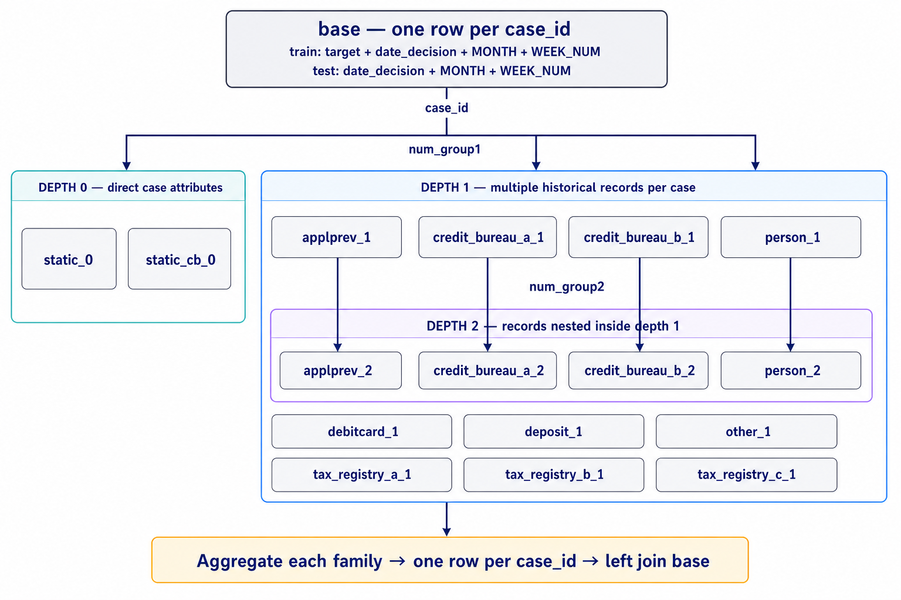

# Tổng quan dữ liệu — Home Credit Model Stability

> **Bài toán:** dự đoán xác suất khách hàng gặp khó khăn thanh toán và giữ chất lượng ổn định theo thời gian
> **Đơn vị dự đoán:** một dòng cho mỗi `case_id`
> **Nhãn:** `target` trong `train_base.parquet`
> **Metric:** Gini stability theo `WEEK_NUM`
> **Snapshot local:** manifest sinh ngày 31/07/2026

## 1. Tổng quan ngắn

Home Credit — Credit Risk Model Stability là dữ liệu quan hệ theo thời gian gồm một
bảng `base` ở grain hồ sơ tín dụng và 16 family feature. Tên file kết thúc bằng `_0`, `_1`, `_2` biểu thị depth quan hệ: depth 0 gần như một dòng/case; depth 1 có nhiều record/case; depth 2 có nhiều record bên trong record depth 1.

Điểm quan trọng nhất là không join trực tiếp các bảng depth 1/2 vào `base`. Mỗi family phải được tổng hợp về một dòng cho mỗi `case_id`; nếu không, một hồ sơ bị nhân dòng và trọng số target bị sai. `date_decision` và `WEEK_NUM` còn quyết định protocol theo thời gian, không chỉ là feature thông thường.



## 2. Inventory đã kiểm tra

Manifest local có **68 Parquet**, tổng **1.329.545.413 byte** và **243.465.546 dòng vật lý** trên tất cả bảng. `train_base` có 1.526.659 case, 92 tuần và bad rate 3,1437%.
Public test snapshot local chỉ có 10 case; competition dùng code submission và phần test chấm điểm đầy đủ không được phát hành như một bảng local thông thường.

| Stage  | Family                | Depth | File train | Dòng vật lý | Cột | Dictionary                                     |
| ------ | --------------------- | ----: | ---------: | -------------: | ---: | ---------------------------------------------- |
| Base   | `base`              |     0 |          1 |      1.526.659 |    5 | [CSV](./details/train_base_features.csv)        |
| A      | `static_0`          |     0 |          2 |      1.526.659 |  168 | [CSV](./details/static_0_features.csv)          |
| A      | `static_cb_0`       |     0 |          1 |      1.500.476 |   53 | [CSV](./details/static_cb_0_features.csv)       |
| B      | `applprev_1`        |     1 |          2 |      6.525.979 |   41 | [CSV](./details/applprev_1_features.csv)        |
| B      | `credit_bureau_a_1` |     1 |          4 |     15.940.537 |   79 | [CSV](./details/credit_bureau_a_1_features.csv) |
| B      | `credit_bureau_b_1` |     1 |          1 |         85.791 |   45 | [CSV](./details/credit_bureau_b_1_features.csv) |
| B      | `debitcard_1`       |     1 |          1 |        157.302 |    6 | [CSV](./details/debitcard_1_features.csv)       |
| B      | `deposit_1`         |     1 |          1 |        145.086 |    5 | [CSV](./details/deposit_1_features.csv)         |
| B      | `other_1`           |     1 |          1 |         51.109 |    7 | [CSV](./details/other_1_features.csv)           |
| B      | `person_1`          |     1 |          1 |      2.973.991 |   37 | [CSV](./details/person_1_features.csv)          |
| B      | `tax_registry_a_1`  |     1 |          1 |      3.275.770 |    5 | [CSV](./details/tax_registry_a_1_features.csv)  |
| B      | `tax_registry_b_1`  |     1 |          1 |      1.107.933 |    5 | [CSV](./details/tax_registry_b_1_features.csv)  |
| B      | `tax_registry_c_1`  |     1 |          1 |      3.343.800 |    5 | [CSV](./details/tax_registry_c_1_features.csv)  |
| C      | `applprev_2`        |     2 |          1 |     14.075.487 |    6 | [CSV](./details/applprev_2_features.csv)        |
| C      | `credit_bureau_a_2` |     2 |         11 |    188.298.452 |   19 | [CSV](./details/credit_bureau_a_2_features.csv) |
| C      | `credit_bureau_b_2` |     2 |          1 |      1.286.755 |    6 | [CSV](./details/credit_bureau_b_2_features.csv) |
| C      | `person_2`          |     2 |          1 |      1.643.410 |   11 | [CSV](./details/person_2_features.csv)          |
| Output | `sample_submission` |    — |          1 |             10 |    2 | [CSV](./details/sample_submission_features.csv) |

Mỗi dictionary dùng schema `id,name,details,sample`. Header Parquet thực tế là nguồn
sự thật; mô tả lấy từ `feature_definitions.csv`. Khác HCDR, một record HCMS rất thưa,
nên `sample` là giá trị non-null đầu tiên của từng cột, không cam kết cùng một raw row.

## 3. Ý nghĩa suffix và khóa

| Suffix       | Semantics chính thức dùng trong pipeline                                         |
| ------------ | ----------------------------------------------------------------------------------- |
| `P`, `A` | số đo numeric/amount; được ưu tiên trước khi giới hạn cột               |
| `L`, `T` | numeric hoặc ordinal/status tùy schema thực tế                                  |
| `D`        | ngày sự kiện; chuyển thành`date_decision - event_date` theo ngày            |
| `M`        | category/masked value; depth 1/2 được biểu diễn bằng số category phân biệt |

Giải thích đầy đủ cấu trúc `<stem>_<numeric_id><suffix>`, sáu suffix và cách pipeline
target từng nhóm nằm trong [báo cáo quy ước tên feature](./feature-naming-and-suffix-conventions-report-vi.md).

- `case_id`: khóa case và đơn vị submission.
- `num_group1`: thứ tự/nhóm depth 1 trong case.
- `num_group2`: thứ tự/nhóm depth 2 bên trong depth 1.
- `WEEK_NUM`: trục thời gian dùng để chia train/valid/test và tính stability.
- `target = 1`: event của competition; không phải định nghĩa pháp lý chung về default.

## 4. Contract tối thiểu

1. Aggregate từng family về `case_id` duy nhất trước khi join.
2. Giữ nguyên số dòng base sau mọi left join.
3. Chọn schema từ train để train/test tạo cùng feature.
4. Fit imputation, encoding, feature selection và model chỉ trên train weeks.
5. Không cho một `WEEK_NUM` xuất hiện ở nhiều split.
6. Submission phải đúng `case_id,score`, đúng ID/thứ tự sample và score hữu hạn trong `[0,1]`.

## 5. Nguồn và tái tạo

Nguồn: `datasets/raw/home-credit-model-stability/source.json`,
`feature_definitions.csv`, metadata 68 Parquet và code trong
`src/home_credit_stability/`. Tái tạo dictionary:

```bash
uv run python scripts/docs/generate_hcms_feature_dictionaries.py
```
