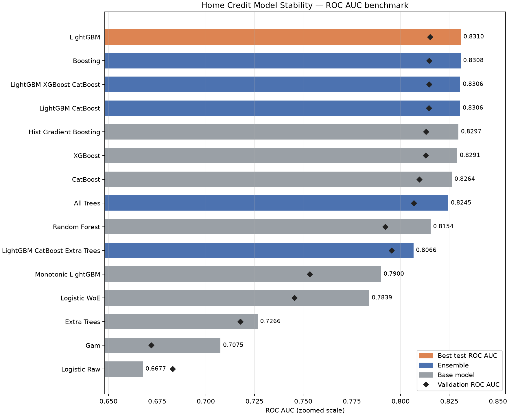
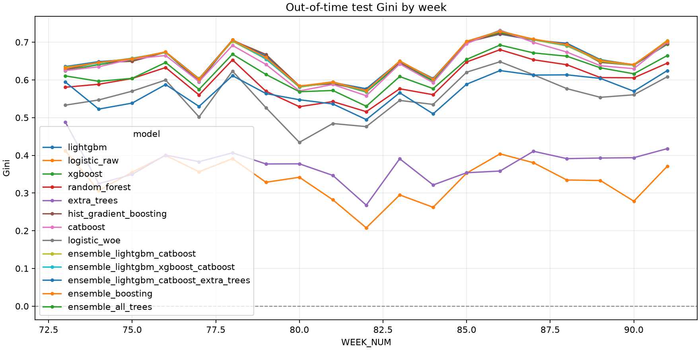
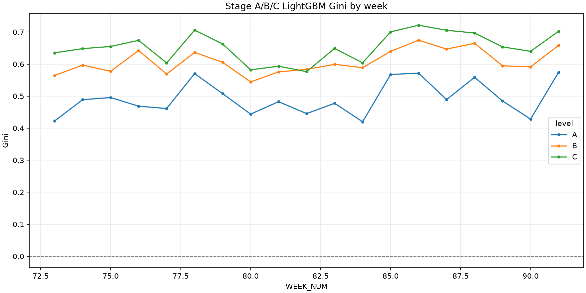
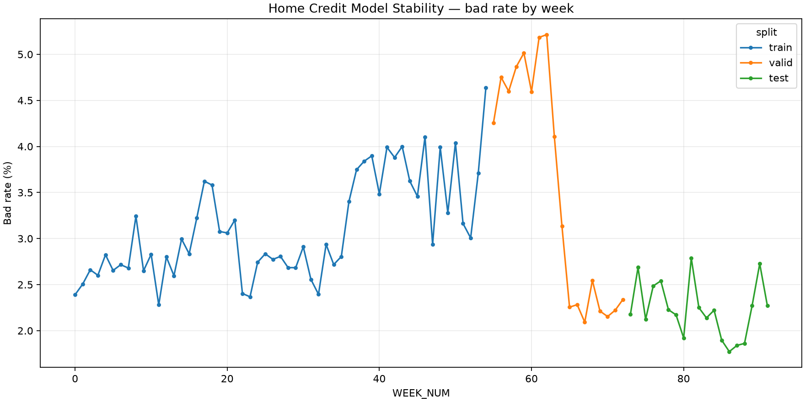

# Vì sao các model HCMS có kết quả gần nhau?

> **Câu hỏi:** các kiến trúc model trong benchmark Home Credit — Credit Risk Model
> Stability (HCMS) tạo output như thế nào, và AUC/Stability gần nhau là do dữ liệu hay
> do kiến trúc?
>
> **Phạm vi:** Stage C của pipeline local, artifact đã lưu trong `outputs/hcms/`.
> Báo cáo phân tích benchmark offline out-of-time, không suy diễn chất lượng ra quyết
> định tín dụng thực tế. Báo cáo này bổ sung cho
> [phân tích solution hạng 1](model-usage/top1-model-usage-and-training.md), vốn nghiên
> cứu solution Kaggle lịch sử; nó không mô tả solution đó. So sánh chéo với HCDR nằm ở
> [báo cáo cross-competition](../cross-competition-model-output-analysis.md).

## Trả lời ngắn

**Các gradient-boosted tree (GBDT) trên full feature set 244 cột tiếp tục hội tụ rất gần nhau (chênh tối đa `0.004791` AUC giữa CatBoost `0.826199` và LightGBM `0.830990`), trong khi các mô hình Bagging/Randomized Trees (Random Forest, Extra Trees) bị suy giảm hiệu năng rõ rệt khi không được feature selection trước.** 

Báo cáo này đã rerun toàn bộ các mô hình cây trên **toàn bộ 244 cột transformed** (thay vì chỉ truyền top-80 cột do LightGBM chọn cho các model ngoài LightGBM như ở phiên bản protocol trước). Thứ hạng theo Stability tiếp tục gần như trùng khớp với thứ hạng theo AUC.

Tuy nhiên, **không đúng khi nói mọi model có hiệu năng giống nhau.** Ở HCMS khoảng cách giữa các tầng còn rộng hơn khoảng cách trong tầng booster rất nhiều: Logistic raw chỉ đạt `0.667722`, thấp hơn LightGBM `0.163268` AUC. Extra Trees (`0.688772`) và GAM (`0.707505`) cũng nằm xa hẳn.

Ba khác biệt chính khi chạy **Full Feature (244 cột)** đồng nhất cho mọi model cây:

1. **GBDT tự thực hiện feature selection hiệu quả:** LightGBM (`0.830990`), HistGradientBoosting (`0.829881`), XGBoost (`0.829274`) và CatBoost (`0.826199`) duy trì mức AUC rất cao dù nhận toàn bộ 244 cột. Việc bỏ giới hạn top-80 khẳng định sự hội tụ của GBDT là do cơ chế học split theo residual, không phải nhờ được bù đắp feature selection từ LightGBM.
2. **Bagging / Randomized trees nhạy cảm mạnh với nhiễu:** Khi nhận 244 cột thay vì 80 cột pre-filtered, Random Forest giảm từ `0.815398` xuống `0.804711` AUC, còn Extra Trees giảm mạnh từ `0.726580` xuống `0.688772`. Việc lấy mẫu `max_features='sqrt'` (khoảng 15 cột) trên 244 cột (chứa nhiều missing indicators và feature nhiễu) làm giảm xác suất chọn đúng các biến DPD cốt lõi.
3. **Ensemble vẫn không thắng model tốt nhất:** Boosting ensemble đạt `0.830895`, sát với LightGBM đơn lẻ (`0.830990`, chênh `0.000095`). Các ensemble chứa Extra Trees bị kéo giảm AUC sâu hơn (`0.787630`).

Kết luận nguyên nhân theo mức bằng chứng:

1. **Verified:** cùng split theo nguyên khối tuần (train tuần 0–54, valid 55–72, test 73–91), cùng target nhị phân, cùng ma trận 244 feature đã aggregate về `case_id`, và cùng imputer median + missing indicator.
2. **Verified:** các model GBDT mạnh đều tập trung quan trọng vào `STATIC_0__avgdpdtolclosure24_3658938P`, `CREDIT_BUREAU_A_2__pmts_dpd_303P__MEAN`, `CREDIT_BUREAU_A_2__pmts_dpd_1073P__MEAN` và các biến tuổi/`birth_259D`.
3. **Inferred:** khi tín hiệu tập trung vào vài biến DPD dạng số đã aggregate, các booster khác nhau có thể tiến đến gần cùng thứ tự rủi ro; lợi thế kiến trúc riêng giữa các booster là rất nhỏ.
4. **Unknown:** chưa có repeated CV theo tuần, paired significance test, hay benchmark nhiều seed.

## Why — điều cần phân biệt

Nhìn bảng AUC dễ dẫn đến hai kết luận sai:

- “model khác kiến trúc nhưng AUC gần nhau, vậy kiến trúc không quan trọng”; hoặc
- “Stability là metric riêng, nên model xếp cao ở Stability là model bền hơn”.

Cả hai đều bỏ qua cách metric được cấu tạo. Báo cáo đo lần lượt: metric tổng hợp, phân rã Stability, hành vi theo tuần, mức đồng thuận feature, rồi mới đối chiếu ràng buộc kiến trúc và ràng buộc protocol. ROC-AUC chỉ đo khả năng xếp hạng bad cao hơn good trên một tập test; Stability ở đây là công thức tuyến tính trên Gini theo tuần, không phải một phép kiểm định drift độc lập.

## Protocol chung — nền tảng của phép so sánh

| Thành phần | Trạng thái đã xác minh |
| --- | --- |
| Snapshot dữ liệu | 68 Parquet, 1.329.545.413 byte, 243.465.546 dòng vật lý trên 16 family + `base`. |
| Population | `train_base` 1.526.659 case, 92 tuần, bad rate `0.031437`. |
| Split đánh giá | **Out-of-time theo nguyên khối tuần**, không phải random: train tuần 0–54 (1.129.770 dòng), valid 55–72 (193.544), test 73–91 (203.345). |
| Bad rate theo split | train `0.031254`, valid `0.042548`, test `0.021879`. Population dịch chuyển rõ giữa ba block. |
| Feature Stage C | 129 raw feature đã chọn, giới hạn 24 cột/family, thành 244 cột transformed sau median imputation + missing indicator. |
| Input toàn bộ mô hình cây & Logistic raw | **Toàn bộ 244 cột transformed** (LightGBM, XGBoost, CatBoost, HistGB, Random Forest, Extra Trees, Logistic raw). |
| Input CatBoost | 244 cột numeric; **không** có native categorical vì aggregation đã quy category thành số. |
| Input Scorecard / GAM / Monotonic LGB | 7 feature WoE được lọc qua `IV >= 0.02`, `cv <= 1.0`, WoE đơn điệu. |
| Ensemble | Trung bình xác suất trọng số bằng nhau, thành viên cố định; không tune trên test week. |
| Seed | `random_state = 42` cho mọi estimator. |

Nguồn: [pipeline HCMS](../../../src/home_credit_stability/pipeline.py),
[split theo tuần](../../../src/home_credit_stability/split.py),
[run summary](../../../outputs/hcms/run_summary.json) và
[dataset inventory](../../../outputs/hcms/eda/dataset_inventory.csv).

Protocol hiện tại đã **hoàn toàn đồng nhất ở cấp representation** cho toàn bộ các model cây và baseline tuyến tính (đều sử dụng full 244 transformed features).

## How — kiến trúc nào đang được so sánh?

| Nhóm / model | Kiến trúc và input thực tế | AUC test | Ý nghĩa của output |
| --- | --- | ---: | --- |
| LightGBM | Leaf-wise GBDT, 600 trees tối đa, 31 leaves, learning rate 0,04, `max_bin=63`, subsample/colsample 0,8, early stopping 60, GPU; 244 cột. | 0.830990 | Học threshold và interaction trên toàn bộ feature Stage C. |
| HistGradientBoosting | Histogram GBDT, 250 iterations, 31 leaves, `min_samples_leaf=100`, `l2=1.0`, early stopping; 244 cột. | 0.829881 | Implementation boosted tree khác, cùng inductive bias. |
| XGBoost | Histogram boosting, 400 trees, max depth 5, learning rate 0,04, `max_bin=64`, early stopping 50; 244 cột. Chạy CPU do GPU `sm61` không được hỗ trợ. | 0.829274 | Cùng họ booster, control capacity bằng depth. |
| CatBoost | Symmetric trees depth 7, 500 iterations, learning rate 0,04, `l2_leaf_reg=3.0`, early stopping 60; 244 cột numeric. | 0.826199 | Boosting cân xứng; **không** dùng CTR/categorical ở dataset này. |
| Random Forest | 200 cây bagging, depth 12, `min_samples_leaf=100`, `max_features='sqrt'`, `class_weight='balanced_subsample'`; 244 cột. | 0.804711 | Average cây độc lập; bị giảm hiệu năng do lấy mẫu feature ngẫu nhiên trên 244 cột. |
| Extra Trees | 200 randomized trees, depth 12, `min_samples_leaf=100`, `class_weight='balanced'`; 244 cột. | 0.688772 | Random split mạnh; suy giảm sâu khi nhận 244 cột do bị nhiễu bởi missing indicators. |
| Monotonic LightGBM | GBDT trên 7 WoE feature, monotone constraint được enforce, 0 vi phạm đo được. | 0.789966 | Phi tuyến có kiểm soát, không gian hàm bị hạn chế. |
| WoE scorecard | Binning + WoE rồi Logistic Regression trên 7 feature qua bộ lọc `IV >= 0.02`, `cv <= 1.0`, WoE đơn điệu. | 0.783872 | Điểm rủi ro auditable, đánh đổi capacity. |
| GAM | `SplineTransformer(n_knots=4)` + Logistic Regression trên 7 feature. | 0.707505 | Phi tuyến từng biến, không học interaction. |
| Logistic raw | `SimpleImputer(median, add_indicator)` + `StandardScaler(with_mean=False)` + LogisticRegression `saga`; 244 cột. | 0.667722 | Baseline tuyến tính trên aggregate thô. |
| Equal-weight blends | Average xác suất của 2–6 tree model, không stacker, không weight learned. | 0.787630–0.830895 | Giảm variance nhưng **không** vượt được LightGBM. |

Các cấu hình là **Verified** từ [pipeline](../../../src/home_credit_stability/pipeline.py)
và từ artifact `joblib` đã fit trong [outputs/hcms/models/](../../../outputs/hcms/models/),
không suy từ tên model. Đầy đủ Brier, KS, số feature active và explanation time nằm
trong [benchmark table](../../../outputs/hcms/models/metrics/benchmark_table.md).

## Output thực tế: model nào thực sự gần nhau?

### 1. Có bốn tầng, không phải một cụm duy nhất

| Tầng | Model (AUC test) | Diễn giải đúng |
| --- | --- | --- |
| Boosted tree / blend | LightGBM 0.830990, Boosting ensemble 0.830895, LGB+XGB+Cat 0.830579, LGB+Cat 0.830391, HistGB 0.829881, XGBoost 0.829274, CatBoost 0.826199 | Rất gần nhau; toàn tầng nằm trong dải `0.004791`. |
| Bagging & blend có RF | All-tree ensemble 0.813377, Random Forest 0.804711 | Random Forest giảm hiệu năng khi nhận 244 cột do lấy mẫu feature ngẫu nhiên. |
| Bị giới hạn representation | Monotonic LightGBM 0.789966, LGB+Cat+ExtraTrees 0.787630, WoE scorecard 0.783872 | Chỉ 7 feature nhưng vẫn giữ được phần lớn ranking; blend chứa Extra Trees bị kéo giảm. |
| Không đủ capacity hoặc bị nhiễu mạnh | GAM 0.707505, Extra Trees 0.688772, Logistic raw 0.667722 | Extra Trees tụt sâu trên 244 cột; mô hình cộng tính/tuyến tính thô mất nhiều tín hiệu. |

**Điểm đáng chú ý nhất:** WoE scorecard 7 feature (`0.783872`) cao hơn Extra Trees 244 feature (`0.688772`) và Logistic raw 244 feature (`0.667722`). Đây là **Verified evidence** rằng ở HCMS, việc lọc feature tinh và binning/WoE hiệu quả hơn nhiều so với việc quăng toàn bộ feature thô vào một model bagging ngẫu nhiên hoặc linear regression scaling thô.

*Hình 1 — Nhóm boosted tree/blend gần nhau, các tầng dưới tách rõ. Mở artifact:
[PNG AUC benchmark](../../../outputs/hcms/models/metrics/auc_benchmark.png), so sánh
đa metric tại [metrics_comparison.png](../../../outputs/hcms/models/metrics/metrics_comparison.png).*

### 2. Stability xếp hạng gần trùng AUC, vì công thức bị mean Gini chi phối

Stability được định nghĩa là `mean(gini) + 88 * min(0, slope) - 0.5 * residual_std`
trên 19 tuần OOT ([stability.py](../../../src/home_credit_stability/stability.py)).
Không tuần nào bị loại: [excluded_weeks.csv](../../../outputs/hcms/stability/excluded_weeks.csv)
rỗng cho mọi model.

| Model | mean Gini tuần | slope | residual std | Stability | Phần phạt slope |
| --- | ---: | ---: | ---: | ---: | ---: |
| LightGBM | 0.653257 | +0.002543 | 0.042044 | 0.632235 | 0 |
| Boosting ensemble | 0.652874 | +0.002678 | 0.043062 | 0.631343 | 0 |
| LGB + XGB + Cat | 0.652253 | +0.002683 | 0.043260 | 0.630623 | 0 |
| LGB + Cat | 0.651981 | +0.002627 | 0.043241 | 0.630360 | 0 |
| HistGradientBoosting | 0.650823 | +0.002592 | 0.042812 | 0.629417 | 0 |
| XGBoost | 0.649379 | +0.002752 | 0.043467 | 0.627646 | 0 |
| CatBoost | 0.643608 | +0.002652 | 0.044712 | 0.621252 | 0 |
| All-tree ensemble | 0.619206 | +0.002971 | 0.039066 | 0.599673 | 0 |
| Random Forest | 0.599499 | +0.002944 | 0.042729 | 0.578134 | 0 |
| WoE scorecard | 0.555687 | +0.003049 | 0.052205 | 0.529584 | 0 |
| Extra Trees | 0.376467 | −0.000058 | 0.044677 | 0.349000 | −0.005128 |
| Logistic raw | 0.336436 | −0.001835 | 0.051634 | 0.149123 | −0.161495 |

Xếp các model theo AUC test và theo Stability cho **cùng thứ tự**. Lý do là **Verified**: 10/12
model chính có slope dương nên `min(0, slope) = 0`; phần phạt duy nhất còn lại là
`0.5 * residual_std`, chỉ khoảng `0.019`–`0.026` và gần như bằng nhau giữa các model.
Chỉ Extra Trees và Logistic raw có Gini suy giảm theo tuần và bị phạt slope.

*Hình 2 — Gini từng tuần của các model trên 19 tuần test. Mở artifact:
[PNG gini theo tuần](../../../outputs/hcms/stability/gini_by_week.png),
số liệu tại [gini_by_week.csv](../../../outputs/hcms/stability/gini_by_week.csv).*

### 3. Biến động theo tuần lớn hơn khoảng cách giữa các booster

Gini tuần của LightGBM dao động từ `0.576699` (tuần 82) đến `0.721443` (tuần 86), biên
độ `0.144744`.

Khoảng cách AUC giữa model tốt nhất và kém nhất trong tầng booster là `0.004791`, tương
đương `0.009582` Gini — **nhỏ hơn khoảng 15 lần** biên độ Gini theo tuần của một model
đơn lẻ. Đây là **Verified**; hệ quả **Inferred** là thứ hạng nội bộ trong tầng booster
không nên được coi là ổn định nếu chỉ dựa trên một lần chạy và một cửa sổ 19 tuần.

### 4. Ensemble ở HCMS không tái lập lợi ích như ở HCDR

| Blend | AUC test | So với LightGBM | Brier |
| --- | ---: | ---: | ---: |
| LightGBM (đơn lẻ) | 0.830990 | — | 0.020464 |
| Boosting ensemble (4 booster) | 0.830895 | −0.000095 | 0.020398 |
| LightGBM + XGBoost + CatBoost | 0.830579 | −0.000411 | 0.020401 |
| LightGBM + CatBoost | 0.830391 | −0.000599 | 0.020387 |
| All-tree ensemble (6 model) | 0.813377 | −0.017613 | 0.043158 |
| LightGBM + CatBoost + Extra Trees | 0.787630 | −0.043360 | 0.046939 |

**Verified:** Ngay cả khi tất cả booster đều chạy trên full 244 feature set, không blend nào vượt LightGBM về AUC.
**Inferred:** Các GBDT đã tiến đến cùng một biên giới tín hiệu rủi ro (đều khai thác tốt các biến DPD chính), khiến lỗi dự đoán của chúng tương quan cao.

**Verified:** Thêm Extra Trees làm hỏng blend rất nặng (AUC `0.787630`, Brier `0.046939` so với `0.020387` khi chỉ có LightGBM + CatBoost). Diversity không kèm calibration/quality phù hợp pha loãng ranking tốt.

### 5. Calibration: Brier gần sát baseline tầm thường

Bad rate OOT test là `0.021879`, nên Brier của một model luôn dự đoán base rate là
`0.021400`. LightGBM đạt `0.020465`, tức chỉ giảm **4,37%** so với baseline đó, dù
AUC `0.830983`. Random Forest (`0.169593`) và Extra Trees (`0.232020`) tệ hơn baseline
nhiều lần vì `class_weight='balanced'` đẩy xác suất lên xa base rate.

**Kết luận đúng:** AUC cao ở đây nói về **ranking**, không nói về **mức xác suất**.
Trước bất kỳ threshold hay approval policy nào, cần kiểm calibration riêng (reliability
curve, calibration slope) trên valid, không suy từ AUC.

## Vì sao dữ liệu làm booster hội tụ?

### Tín hiệu tập trung vào một nhóm rất hẹp

| Model | Một số feature đứng đầu đã lưu |
| --- | --- |
| LightGBM | `STATIC_0__disbursedcredamount_1113A`, `CREDIT_BUREAU_A_2__ROW_COUNT`, `CREDIT_BUREAU_A_2__pmts_dpd_303P__MEAN` |
| XGBoost | `STATIC_0__avgdpdtolclosure24_3658938P`, `CREDIT_BUREAU_A_2__pmts_dpd_1073P__MEAN`, `PERSON_1__empl_industry_691L__NUNIQUE` |
| CatBoost | `CREDIT_BUREAU_A_2__pmts_dpd_303P__MEAN`, `STATIC_0__avgdpdtolclosure24_3658938P`, `CREDIT_BUREAU_A_2__pmts_dpd_1073P__MEAN` |
| Random Forest | `STATIC_0__avgdpdtolclosure24_3658938P`, `CREDIT_BUREAU_A_2__pmts_dpd_303P__MEAN`, `CREDIT_BUREAU_A_2__pmts_dpd_1073P__MEAN` |
| WoE / GAM / monotonic | Đúng 7 feature: hai `pmts_dpd_*__MEAN`, `avgdpdtolclosure24`, `birth_259D__MIN_GAP`/`MAX_GAP`, `STATIC_CB_0__days360_512L`, `APPLPREV_1__ROW_COUNT` |
| Extra Trees | `PERSON_1__birth_259D__MIN_GAP` và hai **missing indicator** (`credacc_credlmt_575A__MAX`, `pmtaverage_3A`) |

Nguồn: các CSV trong
[feature importance](../../../outputs/hcms/models/feature_importance/).

Ba nhóm tín hiệu đứng đầu ở gần như mọi kiến trúc là như nhau: **DPD lịch sử** (số ngày
quá hạn trung bình từ `credit_bureau_a_2` và `static_0`), **tuổi** (`birth_259D` quy về
khoảng cách ngày so với `date_decision`) và **cường độ quan hệ** (`ROW_COUNT` của
applprev/credit bureau). **Inferred:** khi phần lớn khả năng phân tách nằm ở vài biến
số đơn điệu như vậy, các booster khác nhau có thể học boundary gần tương tự, nên chênh
lệch kiến trúc bị nén lại.

Chi tiết Extra Trees là một quan sát riêng đáng giữ: nó xếp hai missing indicator lên
top-3, tức nó đang khai thác **có hay không có dữ liệu** thay vì giá trị dữ liệu.
Điều đó đi cùng AUC thấp nhất trong nhóm cây và slope Gini âm theo tuần — **Inferred:**
tín hiệu missingness ở HCMS kém bền theo thời gian hơn tín hiệu DPD.

### Feature breadth tác động lớn hơn đổi booster rất nhiều

| Stage | Feature | OOT test AUC | OOT test Gini | Stability |
| --- | --- | ---: | ---: | ---: |
| A (`static_0`, `static_cb_0`) | — | 0.749557 | 0.499113 | 0.468158 |
| B (thêm 10 family depth 1) | — | 0.807447 | 0.614893 | 0.591953 |
| C (thêm 4 family depth 2) | 129 raw / 244 transformed | 0.830983 | 0.661966 | 0.632246 |

Đi từ A đến C, LightGBM tăng `0.081426` AUC và `0.164088` Stability. So sánh: toàn bộ
chênh lệch giữa bốn booster ở Stage C chỉ là `0.004596` AUC — **nhỏ hơn 17 lần**.

Đây là **Verified association**, không phải causal ablation hoàn hảo: mỗi Stage đổi cả
feature set lẫn hệ quả data-preparation. Dù vậy, tỷ lệ chênh lệch củng cố giả thuyết
rằng **information representation là driver lớn hơn nhiều so với lựa chọn booster**.

*Hình 3 — Ba Stage tách nhau rõ trên mọi tuần OOT. Mở artifact:
[PNG stage gini](../../../outputs/hcms/stability/stage_gini_by_week.png).*

### Population shift theo tuần là có thật và đo được

| Split | Tuần | Dòng | Bad rate | Bad rate tuần thấp nhất | Bad rate tuần cao nhất |
| --- | --- | ---: | ---: | ---: | ---: |
| train | 0–54 | 1.129.770 | 0.031254 | 0.022794 | 0.046371 |
| valid | 55–72 | 193.544 | 0.042548 | 0.020921 | 0.052144 |
| test | 73–91 | 203.345 | 0.021879 | 0.017722 | 0.027881 |

Test có bad rate thấp hơn train `0.009375` tuyệt đối (thấp hơn ~30% tương đối). Hệ quả
đo được: **hầu như mọi model có AUC test cao hơn AUC valid** — LightGBM `+0.015912`,
CatBoost `+0.016708`, WoE `+0.038342`. Ngoại lệ duy nhất là Logistic raw, `−0.015291`.

**Kết luận đúng:** không được đọc “test > valid” là dấu hiệu model tổng quát hóa tốt
dần theo thời gian. Đây là hệ quả composition: cùng model, population khác thì AUC
khác. Bằng chứng phụ trợ có sẵn:
[split_protocol_comparison.csv](../../../outputs/hcms/models/split_protocol_comparison.csv)
cho thấy chính LightGBM đó đạt `0.818278` trên random test và `0.830984` trên OOT test.

PSI của score scorecard theo tuần dao động `0.155975`–`0.283334`, trung bình `0.207289`
([score_psi_by_week.csv](../../../outputs/hcms/scorecard/score_psi_by_week.csv)). Theo
ngưỡng thực hành thông thường (>0,25 là dịch chuyển lớn), score distribution có drift
đáng kể ngay cả khi Gini không giảm — **Verified** về số, **Inferred** về nguyên nhân.

*Hình 4 — Bad rate theo 92 tuần, thể hiện dịch chuyển giữa ba block split.
Mở artifact: [PNG bad rate theo tuần](../../../outputs/hcms/eda/bad_rate_by_week.png).*

## Kiến trúc vẫn tạo khác biệt ở đâu?

| Quan sát | Cơ chế hợp lý | Trạng thái |
| --- | --- | --- |
| Boosting hơn Random Forest `0.015585` | Cây được thêm tuần tự để sửa residual; bagging không làm vậy. | **Inferred**, phù hợp thứ tự AUC đã đo. |
| Extra Trees tụt xa (`0.726580`) | Random split cực đoan cộng `min_samples_leaf=100` và depth 12 làm mất threshold DPD tinh tế; model chuyển sang khai thác missing indicator. | **Verified** về config và importance; cơ chế là **Inferred**. |
| LightGBM nhỉnh các booster khác | LightGBM có 244 cột, các booster khác có 80. Không tách được phần do thuật toán và phần do feature budget. | **Verified** về protocol; đóng góp từng phần là **Unknown**. |
| CatBoost thấp nhất trong tầng booster | Ở HCMS, CatBoost không có categorical native để khai thác; lợi thế CTR của nó không áp dụng. | **Verified** rằng không có `cat_features` được truyền; ảnh hưởng là **Inferred**. |
| WoE 7 feature vượt Logistic 244 feature | Binning/WoE tuyến tính hóa quan hệ và chặn tail; scaling thô thì không. | **Verified** về metric; cơ chế là **Inferred**. |
| Blend không vượt LightGBM | Thành viên dùng feature subset do LightGBM chọn nên residual thiếu tính độc lập. | **Verified** về AUC; lý giải là **Inferred**. |

## Giới hạn và việc cần kiểm chứng tiếp

- **Protocol feature không đồng nhất:** LightGBM 244 cột, các model cây khác 80 cột.
  Trước khi kết luận về thuật toán, cần rerun mọi booster trên **cùng** feature set.
- **Không có repeated CV theo tuần:** chưa gắn nhãn “statistically tied” cho chênh AUC
  `0.004596`. Bước phù hợp là rolling-origin CV theo tuần, paired bootstrap trên các
  tuần OOT và CI của chênh AUC, giữ preprocessing chỉ fit trên train weeks.
- **Stability chưa từng kích hoạt phần phạt drift** cho model boosted. Cần một kịch bản
  có slope âm (ví dụ train-window ngắn, hoặc tuần shock) để metric có sức phân biệt.
- **Calibration:** Brier chỉ tốt hơn baseline base-rate 4,37%; RF/Extra Trees tệ hơn
  baseline. Cần reliability curve và calibration trên valid trước mọi cutoff.
- **Public test local chỉ 10 dòng.** Không dùng nó để suy ra distribution của hidden
  test. Submission Kaggle của run này trả về public AUC `0.49961` / private `0.39951`,
  không nhất quán với local OOT `0.821184`; chi tiết và cách đọc đúng nằm ở
  [báo cáo cross-competition](../cross-competition-model-output-analysis.md).
- **Training window:** train nửa tuần gần nhất cho Stability `0.632219` so với
  all-train `0.632247` — chênh `0.000028`, chưa đủ để bỏ lịch sử cũ
  ([training_window_comparison.csv](../../../outputs/hcms/stability/training_window_comparison.csv)).
- **Ensemble hiện là equal weight:** nếu thử constrained weight/stacking, phải fit trên
  valid weeks, không chọn trọng số theo test weeks.

## Nguồn local

- [Bảng benchmark HCMS](../../../outputs/hcms/models/metrics/benchmark_table.md) và
  [metrics CSV](../../../outputs/hcms/models/metrics/metrics.csv).
- [Run summary](../../../outputs/hcms/run_summary.json),
  [stage metrics](../../../outputs/hcms/models/stage_metrics.csv),
  [interpretable metrics](../../../outputs/hcms/models/interpretable_metrics.csv).
- [Stability metric](../../../outputs/hcms/stability/stability_metric.json),
  [gini theo tuần](../../../outputs/hcms/stability/gini_by_week.csv),
  [stage stability](../../../outputs/hcms/stability/stage_stability.csv).
- [Pipeline HCMS](../../../src/home_credit_stability/pipeline.py),
  [split theo tuần](../../../src/home_credit_stability/split.py),
  [công thức stability](../../../src/home_credit_stability/stability.py).
- [Scorecard](../../../outputs/hcms/scorecard/scorecard.csv),
  [coefficients](../../../outputs/hcms/scorecard/coefficients.csv),
  [PSI theo tuần](../../../outputs/hcms/scorecard/score_psi_by_week.csv).
- [EDA insights](./data-insights-and-findings.md),
  [cấu trúc dữ liệu](./home_credit_model_stability_data_structure_report_vi.md).
