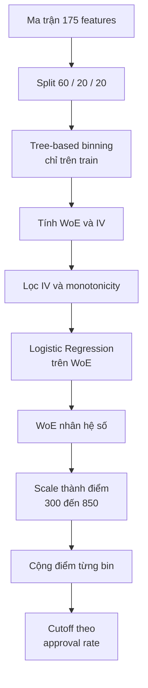

# Phương pháp tính điểm tín dụng 300–850 cho Home Credit Default Risk

## 1. Tóm tắt

Repository không tính **FICO® Score chính thức**. Nó xây dựng một scorecard nội bộ
dạng FICO-like cho bài toán Home Credit Default Risk (HCDR): điểm nằm trong dải
300–850 và điểm cao biểu diễn rủi ro thấp hơn.

Sau khi feature extraction hoàn tất, phương pháp gồm sáu bước chính:

1. chia dữ liệu thành train, validation và test;
2. chia từng biến số thành các bin rủi ro;
3. chuyển mỗi bin thành Weight of Evidence (WoE);
4. chọn các biến có quan hệ đủ mạnh và ổn định với target;
5. fit Logistic Regression trên các giá trị WoE;
6. đổi contribution của mô hình thành điểm và đặt cutoff theo approval rate.

Scorecard cuối dùng 21 feature. `LightGBM`, `XGBoost` và Logistic Regression trên
feature thô chỉ là các mô hình challenger để so sánh khả năng phân hạng; chúng không
đóng góp vào điểm 300–850.

## 2. Vì sao đây không phải FICO Score chính thức?

Tài liệu [`Understanding FICO Scores`](./Understanding_FICO_Scores_5181BK.pdf) cho
biết base FICO Scores thường nằm trong dải 300–850 và được tạo từ credit-report data.
Năm nhóm thông tin chính là payment history, amount of debt, length of credit
history, new credit và credit mix. Tuy nhiên, các tỷ lệ 35%/30%/15%/10%/10% chỉ mô
tả mức quan trọng tương đối; chúng không phải công thức có thể dùng để tự tính FICO
Score.

Score của repository khác ở ba điểm:

- dữ liệu đến từ competition HCDR, không phải credit report của ba bureau Mỹ;
- target là khó khăn thanh toán trong định nghĩa của competition;
- toàn bộ bin, WoE, hệ số và phép scale được học lại từ sample HCDR.

Các biến `EXT_SOURCE_1/2/3` chỉ được metadata mô tả là normalized scores từ nguồn
bên ngoài. Không có bằng chứng rằng chúng là FICO Scores. Vì vậy, tên chính xác của
output là **điểm HCDR 300–850** hoặc **FICO-like score**.

## 3. Điểm bắt đầu của phương pháp

Báo cáo bắt đầu sau feature extraction, tại ma trận Stage C
[`feature_matrix_C.parquet`](../../datasets/processed/hcdr/feature_matrix_C.parquet).
Ma trận có:

- 307.511 hồ sơ có nhãn;
- 48.744 hồ sơ application test không có nhãn;
- 175 model features, không tính `SK_ID_CURR` và `TARGET`.

`TARGET=1` biểu diễn khách hàng có khó khăn thanh toán; `TARGET=0` là các trường hợp
còn lại. Population có nhãn được stratify theo target rồi chia ngẫu nhiên 60/20/20:

| Split | Số hồ sơ | Mục đích |
|---|---:|---|
| Train | 184.506 | Học bin, WoE, chọn biến và fit model |
| Validation | 61.502 | Đánh giá ngoài train |
| Test | 61.503 | Đánh giá cuối và tạo cutoff trong implementation hiện tại |

Đây là random split, không phải out-of-time validation.

## 4. Luồng phương pháp

## 5. Bước 1 — chia feature thành các bin rủi ro

Một feature liên tục có thể liên hệ với rủi ro theo cách phi tuyến. Ví dụ, thay đổi
thu nhập từ mức rất thấp lên trung bình có thể quan trọng hơn thay đổi cùng một lượng
ở vùng thu nhập cao. Vì vậy scorecard không đưa trực tiếp giá trị thô vào mô hình.

Với từng numeric feature, một decision tree một chiều học các threshold từ train
split. Mỗi leaf trở thành một bin. Phương pháp giới hạn số leaf và yêu cầu mỗi leaf
có đủ quan sát để tránh tạo các nhóm quá nhỏ, dễ nhiễu. Hai biên ngoài cùng được mở
tới âm/vô cùng dương, và missing được giữ thành một bin riêng.

Kết quả của bước này là phép ánh xạ:

$$
x_j \longrightarrow bin(x_j)
$$

Bin được học chỉ từ train rồi giữ nguyên khi áp dụng lên validation, test và
application test. Điều này tránh dùng target của holdout để thiết kế ranh giới rủi
ro.

## 6. Bước 2 — chuyển bin thành Weight of Evidence

Trong mỗi bin, pipeline đếm số hồ sơ good và bad. Pipeline dùng smoothing:

$$
\alpha=0.5
$$

Tỷ trọng good và bad được tính như sau:

$$
DistGood_{j,b}
=\frac{Good_{j,b}+\alpha}
{\sum_b Good_{j,b}+\alpha K_j}
$$

$$
DistBad_{j,b}
=\frac{Bad_{j,b}+\alpha}
{\sum_b Bad_{j,b}+\alpha K_j}
$$

WoE của bin là:

$$
WoE_{j,b}
=\ln\left(\frac{DistGood_{j,b}}{DistBad_{j,b}}\right)
$$

Theo convention này:

- WoE dương: bin chứa tỷ trọng good tương đối cao hơn;
- WoE âm: bin chứa tỷ trọng bad tương đối cao hơn;
- trị tuyệt đối càng lớn: mức tách biệt good/bad càng rõ;
- smoothing tránh giá trị vô hạn khi một bin không có good hoặc bad.

Information Value (IV) tóm tắt mức phân biệt của toàn bộ feature:

$$
IV_j
=\sum_b
(DistGood_{j,b}-DistBad_{j,b})\times WoE_{j,b}
$$

WoE giải quyết hai vấn đề: biến các feature có thang đo khác nhau về cùng một biểu
diễn log-ratio, đồng thời làm cho contribution của từng bin có thể giải thích được.

## 7. Bước 3 — chọn feature phù hợp với scorecard

Không phải tất cả 175 feature đều được đưa vào scorecard. Một numeric feature chỉ
được xem xét tiếp khi:

- IV tối thiểu bằng 0,02;
- WoE của các bin không missing là monotonic;
- feature nằm trong nhóm tối đa 25 IV cao nhất.

Monotonicity yêu cầu khi giá trị feature tăng qua các bin, WoE chỉ đi theo một
chiều. Ràng buộc này hy sinh một phần khả năng fit để đổi lấy quan hệ rủi ro ổn định
và dễ giải thích hơn.

Sau đó pipeline fit Logistic Regression thăm dò và loại các feature có hệ số không
âm. Vì WoE cao đang biểu diễn profile tốt, hệ số âm giữ đúng chiều kỳ vọng:

$$
WoE\uparrow
\Rightarrow \beta_j WoE\downarrow
\Rightarrow PD_{bad}\downarrow
$$

Sau lọc, Stage C còn 21 feature. Chúng bao phủ external scores, employment, bureau,
previous applications, installments, credit-card utilization, region và housing.
Danh sách và các bin cụ thể nằm trong
[`scorecard.csv`](../../outputs/hcdr/scorecard/scorecard.csv).

## 8. Bước 4 — Logistic Regression trên WoE

Mỗi hồ sơ được đổi từ raw features thành vector WoE:

$$
(x_1,\ldots,x_{21})
\longrightarrow
(WoE_{1,bin(x_1)},\ldots,WoE_{21,bin(x_{21})})
$$

Logistic Regression kết hợp 21 tín hiệu này để dự báo xác suất khó khăn thanh toán:

$$
z=\beta_0+\sum_{j=1}^{21}\beta_jWoE_j
$$

$$
PD_{bad}=\frac{1}{1+e^{-z}}
$$

Trong lần chạy Stage C hiện tại, intercept là `-2,433120` và toàn bộ 21 hệ số đều
âm. Xác suất từ `predict_proba()` là output có thẩm quyền khi cần PD; điểm integer
300–850 là một biểu diễn khác của cùng cấu trúc contribution.

## 9. Bước 5 — đổi contribution thành điểm 300–850

Contribution của feature \(j\) khi hồ sơ rơi vào bin \(b\) là:

$$
C_{j,b}=\beta_j\times WoE_{j,b}
$$

Pipeline tìm tổng contribution thấp nhất và cao nhất có thể bằng cách cộng extreme
của từng feature. Trong artifact hiện tại:

$$
C_{min}=-3.759470,
\qquad
C_{max}=4.346948
$$

Hai extreme được ánh xạ tuyến tính về 850 và 300:

$$
Factor=\frac{300-850}{C_{max}-C_{min}}=-67.847474
$$

Offset được chia đều cho 21 feature:

$$
BasePerFeature
=\frac{850-Factor\times C_{min}}{21}
=28.329973
$$

Điểm của một bin là:

$$
Points_{j,b}
=round\left(BasePerFeature+Factor\times C_{j,b}\right)
$$

Vì `Factor` âm, contribution làm tăng bad log-odds sẽ nhận ít điểm hơn. Sau rounding,
pipeline hiệu chỉnh extreme để tổng điểm lý thuyết thấp nhất đúng 300 và cao nhất
đúng 850.

Điểm cuối của một hồ sơ là tổng điểm của 21 bin mà hồ sơ đó thuộc về:

$$
Score(x)=\sum_{j=1}^{21}Points_{j,bin(x_j)}
$$

Ví dụ đã kiểm tra trên `SK_ID_CURR=100006`:

- tổng contribution trước intercept: `-0,568962`;
- logit bad: `-2,433120 - 0,568962 = -3,002082`;
- predicted bad probability: `4,73%`;
- tổng integer bin points: `633`.

Điểm 633 không được tính trực tiếp bằng \(1-PD\). PD dùng contribution chưa làm
tròn và intercept; score dùng tổng integer points.

## 10. Bước 6 — tạo cutoff phê duyệt

Cutoff hiện tại không tối ưu accuracy hay Youden's J. Nó được chọn theo approval
rate mục tiêu. Với mục tiêu \(A\):

$$
Cutoff_A=Quantile_{1-A}(Score_{test})
$$

Hồ sơ được approve khi:

$$
Score(x)\ge Cutoff_A
$$

Kết quả hiện tại:

| Approval mục tiêu | Cutoff | Approval thực tế | Bad rate trong nhóm approved |
|---:|---:|---:|---:|
| 60% | 603 | 60,34% | 3,66% |
| 70% | 586 | 70,06% | 4,22% |
| 80% | 565 | 80,13% | 5,01% |

Khi approval target tăng, cutoff giảm và bad rate của nhóm approved tăng. Approval
thực tế hơi lệch target vì nhiều hồ sơ có cùng integer score tại cutoff.

## 11. Scorecard đánh đổi gì so với mô hình challenger?

Trên test split, các kết quả đã lưu là:

| Model | AUC | Vai trò |
|---|---:|---|
| Logistic-WoE | 0,745614 | Tạo PD, scorecard và cutoff |
| Logistic raw | 0,765819 | Baseline tuyến tính |
| LightGBM | 0,780945 | Challenger phi tuyến |
| XGBoost | 0,782472 | Challenger phi tuyến |

Scorecard WoE có AUC thấp hơn hai boosting model, nhưng mỗi quyết định có thể phân rã
thành bin, WoE, hệ số và điểm. Đây là trade-off giữa khả năng giải thích và năng lực
phân hạng. Trong repository hiện tại, boosting models không được ensemble vào điểm
300–850.

Score PSI giữa train và application test là `0,002532`, cho thấy phân phối điểm của
hai sample khá gần nhau. Tuy nhiên, đây không phải bằng chứng về stability theo thời
gian vì dataset không cung cấp một monitoring timeline phù hợp.

## 12. Giới hạn phương pháp

1. **Không phải FICO chính thức.** Dải 300–850 chỉ là lựa chọn scale; model và dữ
   liệu hoàn toàn khác FICO.
2. **Không phải out-of-time validation.** Random split không kiểm tra drift theo
   thời gian.
3. **Cutoff được chọn trên test.** Quy trình chặt chẽ hơn nên chọn cutoff trên
   validation, đóng băng policy rồi chỉ đánh giá trên test.
4. **Cutoff chưa tối ưu lợi nhuận.** Các mức 60/70/80% chưa sử dụng margin, exposure,
   loss-given-default hay cost of capital.
5. **Scale chưa dùng base odds/PDO.** Điểm hiện tại là min–max scaling của observed
   model contributions, không có diễn giải kiểu “tăng 20 điểm thì odds tốt/xấu tăng
   gấp đôi”.
6. **Rounding làm mất một ít thông tin.** Hai hồ sơ có cùng integer score có thể có
   PD hơi khác nhau. `predict_proba()` vẫn là nguồn PD chính xác hơn.

## 13. Kết luận

Phương pháp của repository là một scorecard Logistic-WoE minh bạch:

$$
Raw\ features
\rightarrow Bins
\rightarrow WoE
\rightarrow Logistic\ contributions
\rightarrow Points
\rightarrow Cutoff
$$

Điểm mạnh là mỗi điểm số có thể truy ngược về feature và bin cụ thể. Điểm yếu là
khả năng phân hạng thấp hơn boosting models và phép scale 300–850 chưa mang ý nghĩa
base odds/PDO. Vì vậy score phù hợp làm scorecard thực hành, nhưng chưa nên được gọi
là FICO Score hoặc dùng như policy production.

## 14. Nguồn

1. FICO, *Understanding FICO® Scores*, PDF 28 trang:
   [`Understanding_FICO_Scores_5181BK.pdf`](./Understanding_FICO_Scores_5181BK.pdf).
2. Phương pháp HCDR Logistic-WoE:
   [`src/home_credit_default_rate/pipeline.py`](../../src/home_credit_default_rate/pipeline.py).
3. Công thức binning, WoE/IV và point scaling:
   [`src/credit_scoring/scorecard.py`](../../src/credit_scoring/scorecard.py).
4. Kết quả Stage C:
   [`outputs/hcdr/run_summary.json`](../../outputs/hcdr/run_summary.json),
   [`scorecard.csv`](../../outputs/hcdr/scorecard/scorecard.csv),
   [`cutoffs.csv`](../../outputs/hcdr/scorecard/cutoffs.csv).
5. Luồng feature extraction trước điểm bắt đầu của báo cáo:
   [`src-data-extraction-and-flow-report-vi.md`](../03-competitions/home-credit-default-risk/feature-extraction/src-data-extraction-and-flow-report-vi.md).
