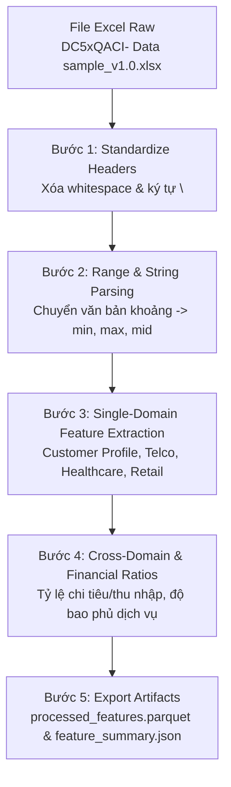

# Báo cáo Trích xuất Feature và Pipeline Xử lý Dữ liệu Local Sample DC5xQACI

## 1. Mục tiêu và phạm vi

Báo cáo này giải thích **từng bước xử lý và từng feature** trong pipeline biến đổi dữ liệu local mẫu `datasets/raw/local_data/DC5xQACI- Data sample_v1.0.xlsx` thành tập feature chuẩn hóa sẵn sàng cho huấn luyện mô hình tín dụng (Credit Scoring). Nguồn sự thật nằm ở implementation:

- [`src/local_data_pipeline/parser.py`](../../src/local_data_pipeline/parser.py): Các hàm parse chuỗi khoảng giá trị, tiền tệ, dung lượng internet và số đếm.
- [`src/local_data_pipeline/features.py`](../../src/local_data_pipeline/features.py): Logic trích xuất 57 feature từ 4 domain nghiệp vụ và nhóm feature tỷ lệ (Ratio).
- [`src/local_data_pipeline/pipeline.py`](../../src/local_data_pipeline/pipeline.py): Đóng gói orchestrator đọc Excel, trích xuất feature và lưu kết quả Parquet/JSON.
- [`scripts/pipelines/run_local_data_pipeline.py`](../../scripts/pipelines/run_local_data_pipeline.py): Entry point thực thi pipeline từ giao diện dòng lệnh (CLI).

Phạm vi bao quát **57 feature** được sinh ra từ 41 cột thô thuộc 4 nhóm dữ liệu chính: **Customer Profile**, **Telco & Internet**, **Healthcare & Pharmacy**, và **Retail Shopping**, kết hợp với tri thức trích xuất feature từ các cuộc thi Kaggle Credit Scoring nổi tiếng (Home Credit Default Risk, Home Credit Model Stability, GiveMeSomeCredit).

---

## 2. Kiến trúc và quy trình xử lý Step-by-Step

Dữ liệu thô từ file Excel `DC5xQACI- Data sample_v1.0.xlsx` chứa 2 sheet:
1. `descibe`: Từ điển định nghĩa các cột.
2. `sample`: Dữ liệu thô gồm 41 cột chứa văn bản tiếng Việt định dạng khoảng (ví dụ: `'Trên 18trđ đến 32trđ'`, `'220 - 350GB/tháng'`, `'200-500K'`, `'500K-1,5tr'`), ngày tháng và các mã danh mục.

Sơ đồ xử lý qua 5 bước chính:



---

## 3. Tổng quan 57 feature theo nhóm domain

| Domain / Nhóm Feature | Cột nguồn raw tiêu biểu | Ý nghĩa nghiệp vụ | Số lượng feature |
| --------------------- | ----------------------- | ----------------- | ----------------: |
| **Customer Profile** | `age_group`, `income_band_est`, `tenure_group`, `loyalty_points` | Nhân khẩu học, thu nhập ước tính, thâm niên, điểm thân thiết | 18 |
| **Telco & Internet** | `telco_install_date`, `telco_monetary_group`, `telco_internet_usage_group` | Thâm niên lắp đặt, gói cước, cước tháng, lưu lượng GB, trễ cước/hủy | 13 |
| **Healthcare & Pharmacy** | `healthcare_spend_6m`, `healthcare_aov_6m`, `healthcare_order_count_6m` | Chi tiêu nhà thuốc 6 tháng, giá trị đơn trung bình, tần suất mua | 8 |
| **Retail Shopping** | `retail_order_count_12m`, `retail_gmv_12m`, `retail_aov_12m` | Hành vi mua sắm thiết bị/bán lẻ, tổng GMV và AOV | 4 |
| **Cross-Domain & Ratio** | Kết hợp đa domain | Tỷ lệ gánh nặng chi tiêu/thu nhập, rủi ro rời bỏ (churn), phân khúc VIP | 14 |
| **Tổng cộng** | | | **57** |

---

## 4. Chi tiết xử lý từng bước và danh mục Feature

### Bước 1: Làm sạch & Chuẩn hóa Header (Header Normalization)

Trong sheet `sample`, một số cột chứa ký tự xuống dòng (như `\nuser_id`). Pipeline tự động xóa khoảng trắng thừa và ký tự `\n` trước khi truy cập cột:

$$\text{Cleaned Header} = \text{strip(Raw Header)}$$

---

### Bước 2: Parsing chuỗi phạm vi (Range Text & Currency Parsing)

Các cột văn bản biểu diễn khoảng giá trị được chuyển đổi thành 3 đại lượng số: $\text{Min}$, $\text{Max}$, và $\text{Midpoint}$ ($\text{Mid} = \frac{\text{Min} + \text{Max}}{2}$).

1. **Thu nhập ước tính (`income_band_est`)**:
   - `'Trên 18trđ đến 32trđ'` $\rightarrow \text{Min} = 18.000.000, \text{Max} = 32.000.000, \text{Mid} = 25.000.000 \text{ VND}$.
   - `'Trên 10trđ đến 18trđ'` $\rightarrow \text{Min} = 10.000.000, \text{Max} = 18.000.000, \text{Mid} = 14.000.000 \text{ VND}$.
2. **Chi tiêu nhà thuốc & AOV (`healthcare_spend_6m`, `healthcare_aov_6m`)**:
   - Quy đổi đơn vị: `K` $= 1.000$, `tr` $= 1.000.000 \text{ VND}$.
   - `'200-500K'` $\rightarrow \text{Min} = 200.000, \text{Max} = 500.000, \text{Mid} = 350.000 \text{ VND}$.
   - `'500K-1,5tr'` $\rightarrow \text{Min} = 500.000, \text{Max} = 1.500.000, \text{Mid} = 1.000.000 \text{ VND}$.
   - `'Trên 1,5tr'` $\rightarrow \text{Min} = 1.500.000, \text{Max} = 3.000.000, \text{Mid} = 2.250.000 \text{ VND}$.
3. **Tiền cước Telco (`telco_monetary_group`)**:
   - `'1M - 2M'` $\rightarrow \text{Min} = 1.000.000, \text{Max} = 2.000.000, \text{Mid} = 1.500.000 \text{ VND}$.
4. **Dung lượng Internet (`telco_internet_usage_group`)**:
   - `'120 - 220GB/tháng'` $\rightarrow \text{Min} = 120, \text{Max} = 220, \text{Mid} = 170 \text{ GB}$.
   - `'Trên 350GB/tháng'` $\rightarrow \text{Min} = 350, \text{Max} = 525, \text{Mid} = 437.5 \text{ GB}$.

---

### Bước 3: Group Feature Domain Customer Profile

| Feature mới | Công thức / Áp tính | Diễn giải nghiệp vụ |
| ----------- | ------------------- | ------------------- |
| `user_id` | Chuỗi ID chuẩn hóa | Mã định danh người dùng. |
| `age_group_raw` | Chuỗi thô | Giá trị thô của nhóm tuổi. |
| `age_midpoint` | Mapping trung vị (`18-23` $\rightarrow$ 20.5, `23-30` $\rightarrow$ 26.5, `31-40` $\rightarrow$ 35.5, `41-50` $\rightarrow$ 45.5, `60++` $\rightarrow$ 65.0) | Tuổi ước tính trung vị. |
| `is_senior` | $I(\text{age\_midpoint} \ge 60)$ | Cờ người dùng lớn tuổi ($\ge 60$). |
| `is_young` | $I(\text{age\_midpoint} \le 23)$ | Cờ người dùng trẻ tuổi ($\le 23$). |
| `gender_raw` | Chuỗi thô | Giới tính thô. |
| `is_male` | $I(\text{gender} = \text{'Nam'})$ | Biến nhị phân đại diện giới tính Nam (1) hay Nữ (0). |
| `city_raw` | Chuỗi thô | Tỉnh thành thô. |
| `is_metro_city` | $I(\text{city} \in \{\text{Hà Nội}, \text{Hồ Chí Minh}\})$ | Cờ sinh sống tại đô thị lớn Tier-1. |
| `household_type_raw` | Chuỗi thô | Loại nhà ở thô. |
| `is_company_household` | $I(\text{household\_type} = \text{'Công ty'})$ | Cờ địa chỉ đăng ký dạng doanh nghiệp/công ty. |
| `income_est_min` | Parse `income_band_est` | Mức thu nhập tối thiểu ước tính (VND). |
| `income_est_max` | Parse `income_band_est` | Mức thu nhập tối đa ước tính (VND). |
| `income_est_mid` | Parse `income_band_est` | Mức thu nhập trung vị ước tính (VND). |
| `has_income_info` | $I(\text{income\_est\_mid} > 0)$ | Cờ có thông tin thu nhập. |
| `active_domain_count_est` | Mapping (`2-3 services` $\rightarrow$ 2.5, `4+ services` $\rightarrow$ 4.5) | Ước tính số hệ sinh thái FPT đang sử dụng. |
| `tenure_years_est` | Mapping (`3-5 năm` $\rightarrow$ 4.0, `>5 năm` $\rightarrow$ 6.5) | Ước tính thâm niên sử dụng dịch vụ FPT (năm). |
| `recency_months_est` | Mapping (`<3 tháng` $\rightarrow$ 1.5, `1-2 năm` $\rightarrow$ 18.0, `3-5 năm` $\rightarrow$ 48.0) | Thời gian gần nhất sử dụng dịch vụ FPT (tháng). |
| `has_app` | $I(\text{app\_count\_group} \neq \text{Null})$ | Cờ có cài đặt và sử dụng ứng dụng di động. |
| `app_count_est` | Parse `app_count_group` | Số lượng app đã đăng ký. |
| `app_tenure_months_est` | Mapping (`<3 tháng` $\rightarrow$ 1.5, `3-6 tháng` $\rightarrow$ 4.5) | Thâm niên sử dụng app (tháng). |
| `app_recency_days_est` | Mapping (`<7 ngày` $\rightarrow$ 3.5, `31-90 ngày` $\rightarrow$ 60.5, `>90 ngày` $\rightarrow$ 135.0) | Khoảng thời gian gần nhất truy cập app (ngày). |
| `loyalty_points_min/max/mid` | Parse `loyalty_points` | Điểm tích lũy Loyalty hiện tại (min, max, mid). |
| `loyalty_tier_pts_mid` | Parse `loyalty_tier` | Điểm hạng Loyalty từng đạt (mid). |

---

### Bước 4: Group Feature Domain Telco & Internet

| Feature mới | Công thức / Áp tính | Diễn giải nghiệp vụ |
| ----------- | ------------------- | ------------------- |
| `has_telco` | $I(\text{telco\_install\_date} \neq \text{NaT})$ | Cờ có hợp đồng Internet/Telco. |
| `telco_install_age_days` | $\text{Timestamp}(\text{'2024-07-01'}) - \text{telco\_install\_date}$ (ngày) | Số ngày kể từ khi lắp đặt Internet. |
| `telco_install_year` | $\text{Year}(\text{telco\_install\_date})$ | Năm lắp đặt hợp đồng. |
| `telco_is_cancelled` | $I(\text{telco\_cancel_date} \neq \text{NaT})$ | Cờ cước Internet đã bị hủy. |
| `telco_contract_active_days` | $\text{telco\_cancel\_date} - \text{telco\_install\_date}$ | Số ngày hợp đồng duy trì active trước khi hủy. |
| `telco_contract_status_raw` | Chuỗi thô | Trạng thái hợp đồng thô. |
| `telco_inbound_cnt_180d` | Parse `telco_inbound_count_180d` | Số cuộc gọi vào CSKH trong 180 ngày. |
| `telco_outbound_cnt_180d` | Parse `telco_outbound_count_180d` | Số cuộc gọi gọi ra trong 180 ngày. |
| `telco_ticket_cnt_180d` | Parse `telco_ticket_count_180d` | Số khiếu nại/ticket hỗ trợ kỹ thuật trong 180 ngày. |
| `telco_gb_usage_mid` | Parse `telco_internet_usage_group` | Dung lượng sử dụng Internet hàng tháng (GB). |
| `telco_internet_trend_score` | Mapping (`Tăng` $\rightarrow$ 1.0, `Ổn định` $\rightarrow$ 0.0, `Giảm` $\rightarrow$ -1.0) | Điểm xu hướng sử dụng lưu lượng Internet. |
| `telco_monetary_mid` | Parse `telco_monetary_group` | Mức chi trả cước Internet trung bình (VND). |

---

### Bước 5: Group Feature Domain Healthcare & Pharmacy

| Feature mới | Công thức / Áp tính | Diễn giải nghiệp vụ |
| ----------- | ------------------- | ------------------- |
| `has_healthcare` | $I(\text{healthcare\_last\_order\_date} \neq \text{Null})$ | Cờ có mua sắm dược phẩm/nhà thuốc. |
| `healthcare_order_cnt_6m` | Parse `healthcare_order_count_6m` (`1 đơn` $\rightarrow$ 1, `4-6 đơn` $\rightarrow$ 5, `Trên 6 đơn` $\rightarrow$ 7) | Số lượng đơn hàng nhà thuốc trong 6 tháng. |
| `healthcare_spend_6m_mid` | Parse `healthcare_spend_6m` | Tổng số tiền chi tiêu mua thuốc 6 tháng (VND). |
| `healthcare_aov_6m_mid` | Parse `healthcare_aov_6m` | Giá trị trung bình mỗi đơn thuốc (VND). |
| `healthcare_repeat_rate_6m` | Parse `healthcare_repeat_purchase_rate_6m` (`Không có` $\rightarrow$ 0, `20-40` $\rightarrow$ 30) | Tỷ lệ quay lại mua hàng 6 tháng. |
| `healthcare_vaccine_visits_12m` | Parse `healthcare_vaccine_visit_count_12m` | Số lần đi tiêm chủng vaccine 12 tháng. |

---

### Bước 6: Group Feature Domain Retail Shopping

| Feature mới | Công thức / Áp tính | Diễn giải nghiệp vụ |
| ----------- | ------------------- | ------------------- |
| `has_retail` | $I(\text{retail\_order\_count\_12m} \neq \text{Null})$ | Cờ có giao dịch mua sắm retail/thiết bị. |
| `retail_order_cnt_12m` | Impute 0 nếu missing | Số đơn hàng mua bán lẻ 12 tháng. |
| `retail_gmv_12m` | Impute 0 nếu missing | Tổng giá trị hàng hóa GMV bán lẻ 12 tháng (VND). |
| `retail_aov_12m` | Impute 0 nếu missing | Giá trị trung bình mỗi đơn bán lẻ (VND). |

---

### Bước 7: Feature Financial Ratio & Cross-Domain Interactions

Kế thừa kinh nghiệm từ cuộc thi Home Credit & GiveMeSomeCredit, các biến **Ratio** mang lại tín hiệu phân loại rủi ro tín dụng rất mạnh hơn so với các biến tổng tuyệt đối độc lập:

1. **Tỷ lệ chi tiêu Dược phẩm / Thu nhập 6 tháng (`healthcare_spend_to_income_ratio`)**:
   $$\text{healthcare\_spend\_to\_income\_ratio} = \frac{\text{healthcare\_spend\_6m\_mid}}{6 \times \text{income\_est\_mid} + 1.0}$$
   *Diễn giải*: Đo lường gánh nặng chi tiêu y tế/dược phẩm so với tổng thu nhập 6 tháng. Tỷ lệ quá cao biểu thị gánh nặng chi phí y tế lớn.

2. **Tỷ lệ tiền cước Telco / Thu nhập hàng tháng (`telco_monetary_to_income_ratio`)**:
   $$\text{telco\_monetary\_to\_income\_ratio} = \frac{\text{telco\_monetary\_mid}}{\text{income\_est\_mid} + 1.0}$$
   *Diễn giải*: Mức độ sẵn lòng và khả năng chi trả cho dịch vụ viễn thông/Internet so với thu nhập hàng tháng.

3. **Tỷ lệ Giá trị đơn hàng / Tổng chi tiêu Dược phẩm (`healthcare_aov_to_spend_ratio`)**:
   $$\text{healthcare\_aov\_to\_spend\_ratio} = \frac{\text{healthcare\_aov\_6m\_mid}}{\text{healthcare\_spend\_6m\_mid} + 1.0}$$
   *Diễn giải*: Tỷ trọng của một đơn hàng so với tổng chi tiêu (đơn mua lẻ lớn hay mua nhiều đơn nhỏ).

4. **Tỷ lệ Tần suất cập nhật App / Thâm niên sử dụng App (`app_recency_to_tenure_ratio`)**:
   $$\text{app\_recency\_to\_tenure\_ratio} = \frac{\text{app\_recency\_days\_est}}{30 \times \text{app\_tenure\_months\_est} + 1.0}$$
   *Diễn giải*: Đo mức độ giảm tương tác app. Tỷ lệ gần 1 cho thấy người dùng đã lâu không vào lại app so với thâm niên của họ.

5. **Độ bao phủ Hệ sinh thái & Điểm đa dịch vụ (`active_domains_count_calc`, `domain_breadth_score`)**:
   $$\text{active\_domains\_count\_calc} = \sum_{d \in \{\text{app}, \text{telco}, \text{healthcare}, \text{retail}, \text{loyalty}\}} I(\text{has\_}d = 1)$$
   $$\text{domain\_breadth\_score} = \frac{\text{active\_domains\_count\_calc}}{5.0}$$
   *Diễn giải*: Khách hàng dùng càng nhiều dịch vụ trong hệ sinh thái FPT thì độ gắn kết càng cao, xác suất quỵt nợ (Default Rate) thường càng thấp.

6. **Cờ Rủi ro Rời bỏ / Churn Risk (`churn_risk_flag`)**:
   $$\text{churn\_risk\_flag} = I(\text{telco\_is\_cancelled} = 1 \lor \text{app\_recency\_days\_est} > 90)$$
   *Diễn giải*: Đánh dấu khách hàng đã hủy hợp đồng Internet hoặc đã trên 90 ngày không vào ứng dụng.

7. **Cờ Khách hàng VIP / Khả năng tài chính cao (`is_high_value_customer`)**:
   $$\text{is\_high\_value_customer} = I(\text{income\_est\_mid} \ge 18.000.000 \land \text{loyalty\_points\_mid} \ge 800)$$
   *Diễn giải*: Đánh dấu phân khúc khách hàng thu nhập cao và điểm tích lũy thành viên lớn.

---

## 5. Quy trình Lựa chọn Feature Cuối cùng cho Huấn luyện Mô hình ML (Final Feature Selection)

Để đảm bảo mô hình học máy (LightGBM, XGBoost, CatBoost, Logistic Regression / Scorecard) đạt hiệu năng tối ưu, không bị nhiễu bởi các biến văn bản thô hoặc biến hằng số, pipeline thực hiện lọc thông qua hàm `select_training_features()` để chọn ra **43 feature huấn luyện chính thức** (cộng với `user_id` làm khóa chính):

### 5.1 Các tiêu chí loại bỏ cột (Feature Elimination Rules)

1. **Loại bỏ 5 cột văn bản thô (`_raw`)**:
   - `age_group_raw`, `gender_raw`, `city_raw`, `household_type_raw`, `telco_contract_status_raw`.
   - *Lý do*: Thông tin đã được mã hóa đầy đủ sang các biến số thực/nhị phân (`age_midpoint`, `is_male`, `is_metro_city`, `is_company_household`, `telco_is_cancelled`).

2. **Loại bỏ 7 cột hằng số 0 variance (Zero Variance / 100% Missing)**:
   - `telco_inbound_cnt_180d`, `telco_outbound_cnt_180d`, `telco_ticket_cnt_180d`, `has_retail`, `retail_order_cnt_12m`, `retail_gmv_12m`, `retail_aov_12m`.
   - *Lý do*: Các cột có giá trị hằng số (hoặc 100% thiếu) không tạo ra Information Gain / Variance cho các đường phân tách của thuật toán cây hay trọng số của Logistic Regression.

---

### 5.2 Danh mục 43 Feature Huấn luyện Mô hình Chính thức

| Nhóm Nghiệp vụ | Danh sách Feature Huấn luyện | Số lượng |
| -------------- | ---------------------------- | --------: |
| **Định danh** | `user_id` (Khóa chính / ID) | 1 |
| **Nhân khẩu & Thu nhập** | `age_midpoint`, `is_senior`, `is_young`, `is_male`, `is_metro_city`, `is_company_household`, `income_est_min`, `income_est_max`, `income_est_mid`, `has_income_info`, `active_domain_count_est`, `tenure_years_est`, `recency_months_est` | 13 |
| **App & Thân thiết** | `has_app`, `app_count_est`, `app_tenure_months_est`, `app_recency_days_est`, `loyalty_points_min`, `loyalty_points_max`, `loyalty_points_mid`, `has_loyalty_pts`, `loyalty_tier_pts_mid` | 9 |
| **Telco & Internet** | `has_telco`, `telco_install_age_days`, `telco_install_year`, `telco_is_cancelled`, `telco_contract_active_days`, `telco_gb_usage_mid`, `telco_internet_trend_score`, `telco_monetary_mid` | 8 |
| **Y tế & Dược phẩm** | `has_healthcare`, `healthcare_order_cnt_6m`, `healthcare_spend_6m_mid`, `healthcare_aov_6m_mid`, `healthcare_repeat_rate_6m`, `healthcare_vaccine_visits_12m` | 6 |
| **Ratio & Tương tác ML** | `healthcare_spend_to_income_ratio`, `telco_monetary_to_income_ratio`, `healthcare_aov_to_spend_ratio`, `app_recency_to_tenure_ratio`, `active_domains_count_calc`, `domain_breadth_score`, `churn_risk_flag` | 7 |
| **Tổng cộng** | | **44** |

---

## 6. Kiểm tra Tái lập & Artifact Output

Pipeline sinh ra 5 file lưu trữ tại `datasets/processed/local_data/` và `outputs/eda/`:
1. `training_features.csv`: **Bảng feature chuyên dụng cho huấn luyện mô hình ML** (43 feature số + `user_id`).
2. `training_features.parquet`: Bảng feature huấn luyện dạng nén Parquet ZSTD.
3. `processed_features.csv`: Bảng tổng hợp đầy đủ 57 feature (bao gồm cả các cột chuỗi thô để audit).
4. `processed_features.parquet`: Bảng tổng hợp 57 feature dạng Parquet.
5. `feature_summary.json`: Metadata tóm tắt tỷ lệ missing, danh sách cột huấn luyện và thống kê bản ghi.

### Lệnh chạy pipeline & test:

```bash
# Chạy pipeline trích xuất feature từ file Excel sample
uv run python scripts/pipelines/run_local_data_pipeline.py

# Chạy EDA sinh bảng CSV chứa unique values từng cột
uv run python scripts/pipelines/run_local_eda.py

# Chạy bộ unit test kiểm tra tính đúng đắn của parser & feature pipeline
uv run python -m unittest discover -s tests -v

# Kiểm tra tính toàn vẹn hạ tầng agent
uv run python .agents/scripts/01_validate_workspace.py --full
```
