# Báo cáo tuần 1: Tổng quan bài toán, pipeline và notebook Kaggle

Nguồn chính: [report cuộc thi](01-kaggle-reports/competition/06-comp-give-me-some-credit.md), [knowledge base](00-tong-quan/README.md), [tổng hợp top-voted](01-kaggle-reports/top-voted/overview.md).

> **Phạm vi kiểm chứng.** Mọi con số ở phần 3 được tính lại trực tiếp từ `datasets/raw/cs-training.csv` và `datasets/processed/`, không chép lại từ tài liệu. Số ở phần 4, 5 và 6 đọc trực tiếp từ artifact trong `outputs/` (`models/metrics/metrics.csv`, `models/feature_importance/`, `scorecard/`) — pipeline đã chạy xong.
>
> Phần 7 đọc trực tiếp code trong `src/credit_scoring/`, nên mô tả cách từng feature bị biến đổi là theo code chứ không suy ra từ artifact.
>
> Mọi chart trong report do [`assets/gen_charts.py`](assets/gen_charts.py) sinh ra: `uv run --with matplotlib docs/assets/gen_charts.py`. Script tự `selfcheck()` đối chiếu số tính lại với số ghi trong report và trong `outputs/` — bảng và hình không thể lệch nhau mà không fail.

## 0. Thuật ngữ

Đọc trước nếu mới vào credit scoring; quen rồi thì bỏ qua.

### Nhãn và rủi ro

- **target / label** — cột cần dự đoán. Ở đây là `SeriousDlqin2yrs`.
- **default** — khách vỡ nợ. Chuẩn Basel: quá hạn từ **90 ngày** trở lên.
- **DPD (days past due)** — số ngày quá hạn. `90+ DPD` = quá hạn ít nhất 90 ngày.
- **delinquency** — tình trạng quá hạn. `NumberOfTime30-59DaysPastDue` = số lần từng quá hạn 30–59 ngày.
- **bad / good** — bad = hồ sơ có target = 1 (đã default); good = target = 0.
- **bad rate** — `số bad / tổng hồ sơ` của một nhóm. Toàn bộ dữ liệu: 6,684%.
- **mức nền (base rate)** — bad rate của toàn bộ dữ liệu, dùng làm mốc so sánh cho mọi nhóm con. Cao hơn mức nền = rủi ro hơn trung bình.
- **lệch lớp (class imbalance)** — bad ít hơn good rất nhiều (6,7% so với 93,3%).
- **bureau data** — dữ liệu lịch sử tín dụng từ tổ chức thông tin tín dụng (CIC ở Việt Nam, credit bureau ở Mỹ). Ba biến delinquency ở đây là bureau data.

### Feature và dữ liệu thô

- **feature / biến** — cột đầu vào của mô hình. Bộ này có 10.
- **utilization** — dư nợ đang dùng chia hạn mức được cấp. `0,8` = dùng 80% hạn mức.
- **DebtRatio** — nghĩa vụ trả nợ hàng tháng chia thu nhập hàng tháng. Mẫu số là thu nhập, nên thu nhập thiếu thì tỷ lệ này mất nghĩa.
- **capacity** — khả năng trả nợ (thu nhập, số người phụ thuộc).
- **missing** — ô không có giá trị (`NA` trong CSV, `NaN` sau khi đọc).
- **impute** — điền giá trị thay cho missing (median, mean, hoặc mô hình).
- **anomaly** — giá trị bất thường: sai chuẩn (`age = 0`), mã đặc biệt, hoặc cực trị.
- **mã đặc biệt (special code)** — số dùng để mã hoá một trạng thái chứ không phải số đo thật. Ở đây 96 và 98 nằm trên đúng 269 dòng của cả ba biến delinquency.
- **cờ (flag)** — cột 0/1 ghi lại "dòng này từng có giá trị bất thường", giữ tín hiệu sau khi thay giá trị gốc bằng `NaN`.
- **cap / winsorize** — chặn giá trị vượt ngưỡng về đúng ngưỡng, thay vì xoá dòng.
- **p25 / median / p75 / p99** — phân vị: mức mà 25% / 50% / 75% / 99% dữ liệu nằm dưới. median = p50.
- **đuôi phải (right tail)** — vùng cực trị lớn. `max` lệch `p99` càng nhiều thì đuôi càng dài.

### Binning, WoE và scorecard

- **binning** — gom một biến liên tục thành vài khoảng (bin), missing thành một bin riêng.
- **bin phân vị (quantile binning)** — chia bin theo phân vị, mỗi bin số lượng bằng nhau. Sập với biến đếm thưa: hơn 94% giá trị bằng 0 nên mọi phân vị đều bằng 0, cả biến gom về một bin.
- **tree-based binning** — để cây quyết định tự tìm ranh giới bin theo target. Xử lý được biến đếm thưa mà bin phân vị bó tay.
- **WoE (Weight of Evidence)** — điểm rủi ro của từng bin: `WoE = ln(%good trong bin / %bad trong bin)`. Quy ước ngược lại chỉ đổi dấu, `|IV|` không đổi — nhưng phải ghi rõ quy ước vào code. Biến sau WoE là một cột số, đưa thẳng vào Logistic Regression được.
- **IV (Information Value)** — sức dự báo của cả biến: `IV = Σ (%good − %bad) × WoE` trên mọi bin. Ngưỡng: `< 0,02` bỏ, `0,1–0,3` trung bình, `> 0,5` nghi overfit hoặc leakage.
- **đơn điệu (monotonic)** — bad rate hoặc WoE đi một chiều qua các bin, không lên xuống lộn xộn. Đơn điệu thì giải thích được với nghiệp vụ.
- **freeze** — chốt ranh giới bin và bảng WoE học từ train, không tính lại trên valid/test.
- **scorecard** — bảng quy đổi `(feature, bin) → điểm`, cộng lại thành điểm cuối. Triển khai được bằng SQL hoặc rules engine, không cần chạy model.
- **dải điểm 300–850** — thang điểm quen dùng kiểu FICO. `Score = Base + Factor × ln(odds)`, `Factor = PDO / ln(2)`.
- **PDO (points to double the odds)** — số điểm cần thêm để odds tốt/xấu gấp đôi.
- **cutoff** — ngưỡng điểm để duyệt hay từ chối.
- **approval rate** — tỷ lệ hồ sơ được duyệt. Chọn cutoff theo approval rate mục tiêu là cách nghiệp vụ hay dùng nhất.
- **PSI (Population Stability Index)** — đo dịch chuyển phân phối điểm giữa hai tập: `PSI = Σ (%actual − %expected) × ln(%actual / %expected)`. `< 0,10` bình thường, `> 0,25` báo động.

### Metric và mô hình

- **AUC (ROC AUC)** — xác suất mô hình cho một khách bad ngẫu nhiên điểm rủi ro cao hơn một khách good ngẫu nhiên. Thuần **xếp hạng**; nhận probability hoặc score, không nhận nhãn cứng. 0,5 = đoán bừa.
- **Gini** — `2 × AUC − 1`. Cùng thông tin, thang khác.
- **KS (Kolmogorov–Smirnov)** — khoảng cách lớn nhất giữa phân phối tích luỹ của good và bad, `max(TPR − FPR)`. 30–40% là bình thường.

## 1. Bài toán

GiveMeSomeCredit (Kaggle, 2011) yêu cầu dự đoán **xác suất một người gặp financial distress trong hai năm tới**. Target là `SeriousDlqin2yrs` — khách đã quá hạn từ 90 ngày trở lên, đúng chuẩn Basel về định nghĩa default.

Dữ liệu rất gọn: `cs-training.csv` có **150.000 dòng**, `cs-test.csv` có **101.503 dòng**, và mỗi hồ sơ gồm **10 feature**. Mười biến này thuộc bốn nhóm kinh điển của credit scoring.

Ngoài 10 feature, tập train có thêm cột nhãn **`SeriousDlqin2yrs`**.

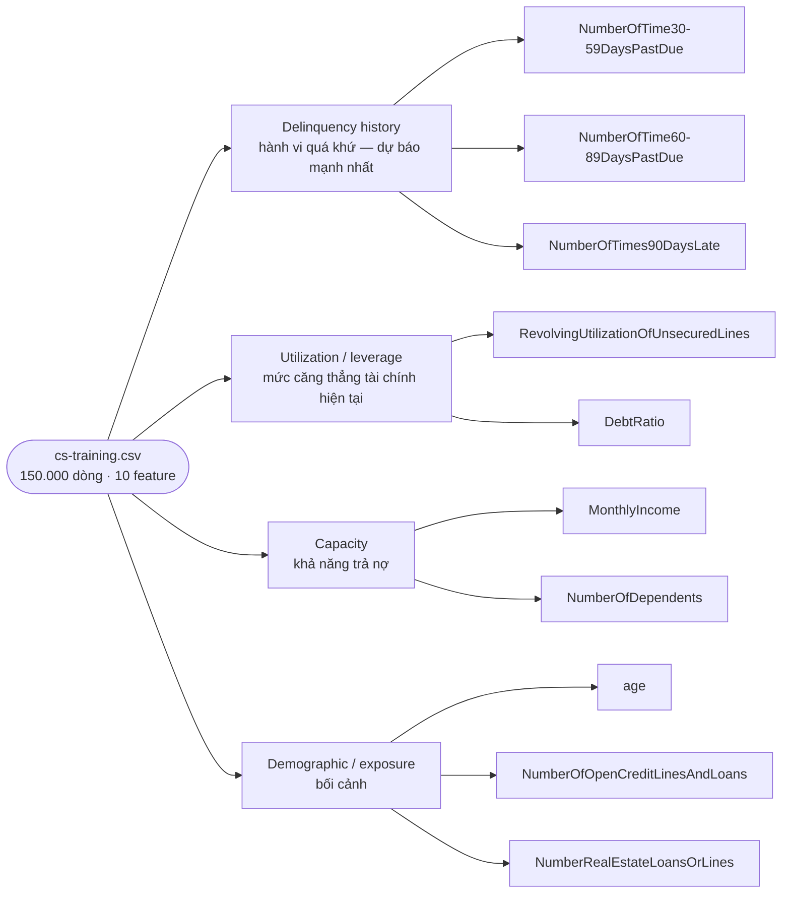

Bad rate khoảng **6,7%**; metric chính thức là **AUC**.

Nói rõ ngay: đây là **benchmark để tập quy trình**, không phải hệ thống phê duyệt production. Dữ liệu 2011, thị trường Mỹ, bureau-heavy, không có cột thời gian. Con số đạt được ở đây nói lên chất lượng quy trình, không nói lên hiệu quả kinh doanh.

[Chi tiết từng feature](<../datasets/raw/Data%20Dictionary.xls>).

## 2. Điểm khó và rủi ro phương pháp

**Lệch lớp.** Bad rate 6,7% nghĩa là mô hình đoán "tất cả đều tốt" đã đạt hơn 93% accuracy mà hoàn toàn vô dụng. Metric phải đo khả năng **xếp hạng**, không đo tỷ lệ đoán đúng tại một threshold.

**Missing phải được đo, không được giả định.** `MonthlyIncome` thiếu ~20%, `NumberOfDependents` ~2,6%. Câu nói quen thuộc trong tín dụng là "không có dữ liệu tự nó là tín hiệu rủi ro" — nhưng trên chính bộ này thì **ngược lại** (số liệu ở phần 3). Bài học: cho missing thành bin riêng rồi *đo WoE của nó*, đừng impute vô điều kiện mà cũng đừng mặc định missing là xấu.

**Anomaly và mã đặc biệt.** Bốn ổ gà: `age = 0`; mã **96/98** ở ba biến delinquency; `RevolvingUtilization` đuôi tới ~50.708; `DebtRatio` tới ~329.664. Quy trình an toàn: **tạo cờ anomaly rồi mới thay bằng NaN**, không xóa dòng. Ý nghĩa thật của 96/98 chưa được chủ dữ liệu xác nhận, đừng gọi nó là "lỗi nhập liệu" — số liệu phần 3 cho thấy nhóm này hoàn toàn không phải rác.

**Leakage nằm ở preprocessing, không chỉ ở feature.** Đây là rủi ro lớn nhất và là lỗi chung của cả ba notebook top-voted. Nếu tính median, ranh giới bin, WoE, IV hoặc chọn feature trên toàn bộ dữ liệu **rồi mới split**, thì target của tập đánh giá đã ảnh hưởng ngược vào encoding, và metric thu được sẽ lạc quan giả.

**Metric phải khớp bài toán.** AUC nhận probability hoặc score, không nhận nhãn cứng. Đi kèm AUC là Gini (`= 2 × AUC − 1`) và KS (`max(TPR − FPR)`, 30–40% là bình thường). AUC vượt 0,85 thường là dấu hiệu leakage — riêng bộ này ~0,86 hợp lý vì ba biến delinquency là bureau data trực tiếp và rất mạnh.

**Không có out-of-time validation.** Dataset không có cột thời gian, nên split 60/20/20 trong thiết kế là **stratified random**. Không được gọi nhầm tên: random split không phát hiện được drift và cho ước lượng lạc quan hơn production. Cũng vì vậy, benchmark offline này không nói gì về stability theo kỳ, calibration, fairness hay tác động kinh doanh.

## 3. Dữ liệu: feature, phân phối và EDA

Phần này được tính lại từ `datasets/`, không trích trực tiếp từ tài liệu. `cs-training.csv` có **150.000 dòng × 12 cột**: một cột index không tên, target, và 10 feature. `cs-test.csv` có **101.503 dòng** nhưng cột target **rỗng hoàn toàn** — đó là holdout của Kaggle, không dùng để đánh giá local được.

Target `SeriousDlqin2yrs`: **10.026 bad / 139.974 good**, bad rate **6,684%**.

### Phân phối 10 feature

| Feature                         |                  Missing |   p25 | median |   p75 |    p99 |               max |
| ------------------------------- | -----------------------: | ----: | -----: | ----: | -----: | ----------------: |
| RevolvingUtilization            |                        0 | 0,030 |  0,154 | 0,559 |   1,09 |  **50.708** |
| age                             |                        0 |    41 |     52 |    63 |     87 |               109 |
| NumberOfTime30-59DaysPastDue    |                        0 |     0 |      0 |     0 |      4 |      **98** |
| DebtRatio                       |                        0 | 0,175 |  0,367 | 0,868 |  4.979 | **329.664** |
| MonthlyIncome                   | **29.731 (19,8%)** | 3.400 |  5.400 | 8.249 | 25.000 |         3.008.750 |
| NumberOfOpenCreditLinesAndLoans |                        0 |     5 |      8 |    11 |     24 |                58 |
| NumberOfTimes90DaysLate         |                        0 |     0 |      0 |     0 |      3 |      **98** |
| NumberRealEstateLoansOrLines    |                        0 |     0 |      1 |     2 |      4 |                54 |
| NumberOfTime60-89DaysPastDue    |                        0 |     0 |      0 |     0 |      2 |      **98** |
| NumberOfDependents              |   **3.924 (2,6%)** |     0 |      0 |     1 |      4 |                20 |

Hai điều đọc ra ngay: bốn biến đếm gần như toàn số 0 (median và p75 đều bằng 0), và ba biến `RevolvingUtilization` / `DebtRatio` / `MonthlyIncome` có đuôi phải dài đến mức p99 và max lệch nhau vài nghìn lần. Đo bằng tỷ số `max / p99`:

<picture>
  <source media="(prefers-color-scheme: dark)" srcset="assets/06-tail-ratio-dark.png">
  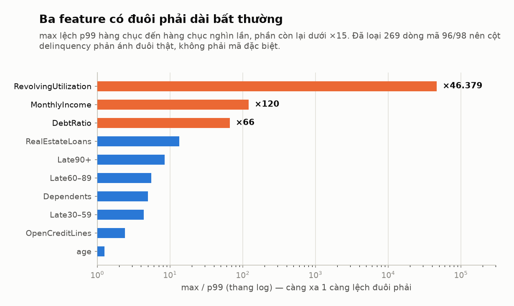
</picture>

Ba feature đầu lệch hàng chục đến hàng chục nghìn lần, phần còn lại dưới ×15 — ranh giới giữa "đuôi dài thật" và "phân phối bình thường" rất rõ. Chart tính sau khi loại 269 dòng mã 96/98 để cột delinquency phản ánh đuôi thật; tên viết tắt `Late30–59` / `Late60–89` / `Late90+` ứng với ba biến đếm quá hạn, `OpenCreditLines` và `RealEstateLoans` ứng với hai biến số khoản vay.

### Bad rate theo giá trị — quan hệ nào là thật

**Tuổi giảm rủi ro, đơn điệu và sạch:**

<picture>
  <source media="(prefers-color-scheme: dark)" srcset="assets/04-age-badrate-dark.png">
  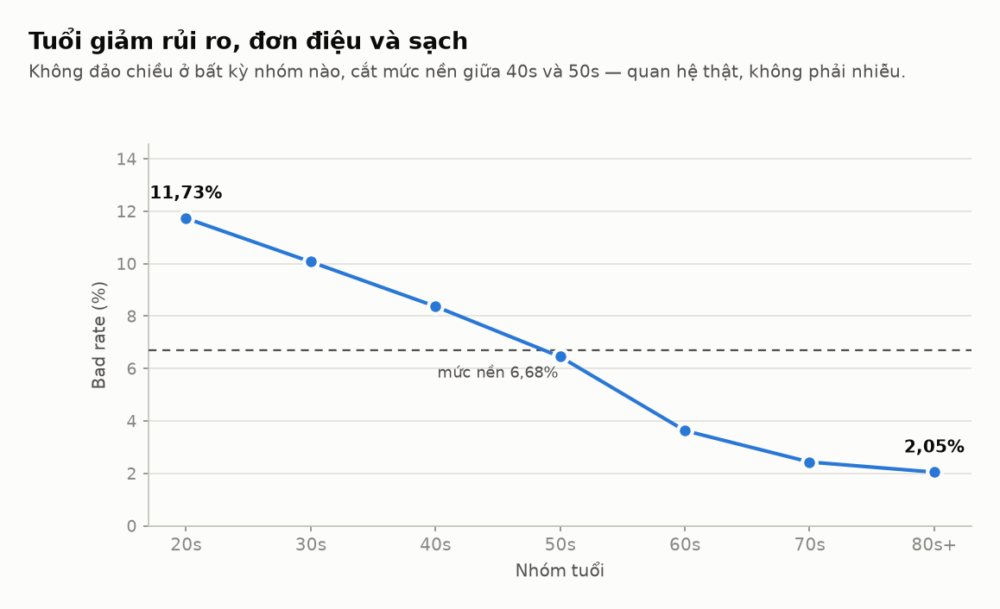
</picture>

Số liệu bảng

| Nhóm tuổi |    20s |    30s |   40s |   50s |   60s |   70s |  80s+ |
| ----------- | -----: | -----: | ----: | ----: | ----: | ----: | ----: |
| Bad rate    | 11,73% | 10,07% | 8,37% | 6,45% | 3,63% | 2,43% | 2,05% |

**Utilization tăng rủi ro rất mạnh — nhưng chỉ tới ngưỡng 2:**

<picture>
  <source media="(prefers-color-scheme: dark)" srcset="assets/02-utilization-badrate-dark.png">
  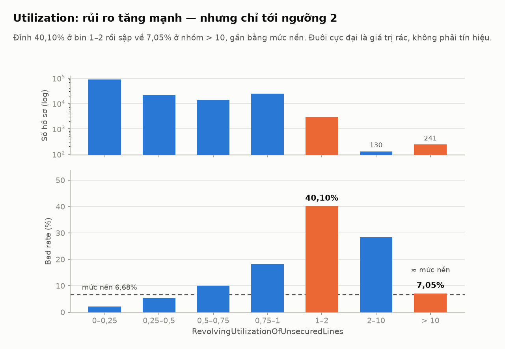
</picture>

Số liệu bảng

| Utilization | 0–0,25 | 0,25–0,5 | 0,5–0,75 | 0,75–1 |             1–2 |  2–10 |             >10 |
| ----------- | ------: | --------: | --------: | ------: | ---------------: | -----: | --------------: |
| n           |  87.657 |    21.055 |    13.764 |  24.203 |            2.950 |    130 |             241 |
| Bad rate    |   2,14% |     5,29% |    10,13% |  18,21% | **40,10%** | 28,46% | **7,05%** |

Nhóm `> 10` có bad rate 7,05%, tức **gần bằng mức nền 6,68%** — không hề rủi ro cao. Đây là bằng chứng thực nghiệm cho việc coi đuôi cực đại là giá trị rác chứ không phải tín hiệu, và xác nhận quan sát của notebook #3.

**Đếm quá hạn: mỗi lần thêm một lần là một bậc rủi ro.**

<picture>
  <source media="(prefers-color-scheme: dark)" srcset="assets/03-late90-badrate-dark.png">
  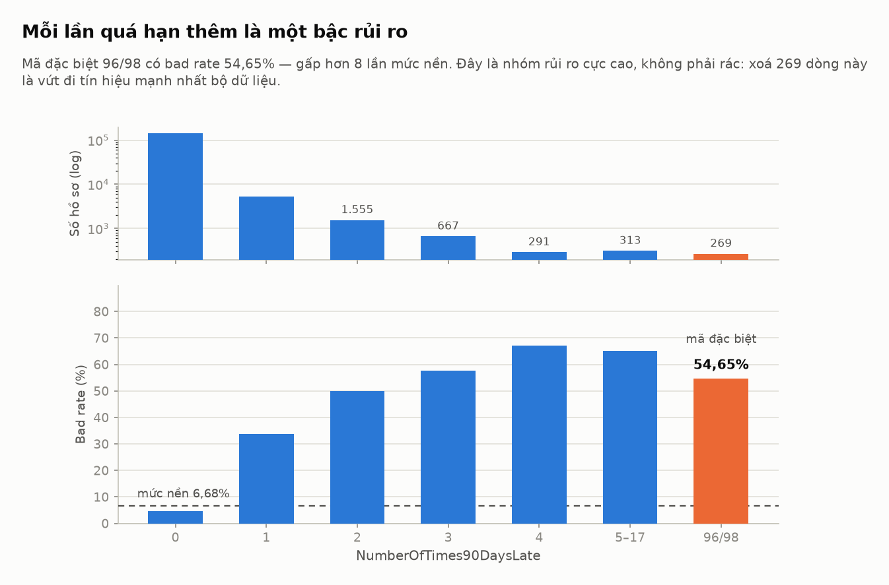
</picture>

Số liệu bảng

| `NumberOfTimes90DaysLate` |       0 |      1 |      2 |      3 |      4 |  5–17 |            96/98 |
| --------------------------- | ------: | -----: | -----: | -----: | -----: | -----: | ---------------: |
| n                           | 141.662 |  5.243 |  1.555 |    667 |    291 |    313 |              269 |
| Bad rate                    |   4,63% | 33,66% | 49,90% | 57,72% | 67,01% | 65,18% | **54,65%** |

### Bốn anomaly, kiểm chứng bằng số

1. **`age = 0`** — đúng **1 dòng**. Nhiễu, không phải pattern.
2. **Mã 96/98** — **5 dòng mang 96, 264 dòng mang 98, tổng 269 dòng**, và cả ba biến delinquency nhận mã này trên **đúng cùng 269 dòng đó**. Giá trị hợp lệ lớn nhất chỉ là 13/17/11, nên có khoảng trống rõ rệt giữa 17 và 96. Bad rate của nhóm này là **54,65%**, gấp hơn 8 lần mức nền. **Đây là nhóm rủi ro cực cao, không phải rác** — xóa 269 dòng này là vứt đi tín hiệu mạnh nhất bộ dữ liệu. Đúng cách: gắn cờ, đưa giá trị về NaN, để cờ vào model.
3. **`DebtRatio` cực lớn** — 3.750 dòng vượt p97,5 (3.489), trong đó **3.565 dòng (95%) có `MonthlyIncome` bị thiếu** và 185 dòng có income bằng 0 hoặc 1. Bad rate nhóm này 6,43%, tức ngang mức nền. Diễn giải: khi không biết thu nhập, `DebtRatio` không còn là tỷ lệ mà thành số nợ tuyệt đối. Đây là **lỗi mẫu số**, phải xử lý cùng `MonthlyIncome`, không cap riêng lẻ.
4. **`MonthlyIncome` bằng 0** — 1.634 dòng, bad rate chỉ **4,04%**.

### Missing ở đây là tín hiệu tốt, không phải tín hiệu xấu

<picture>
  <source media="(prefers-color-scheme: dark)" srcset="assets/05-missing-signal-dark.png">
  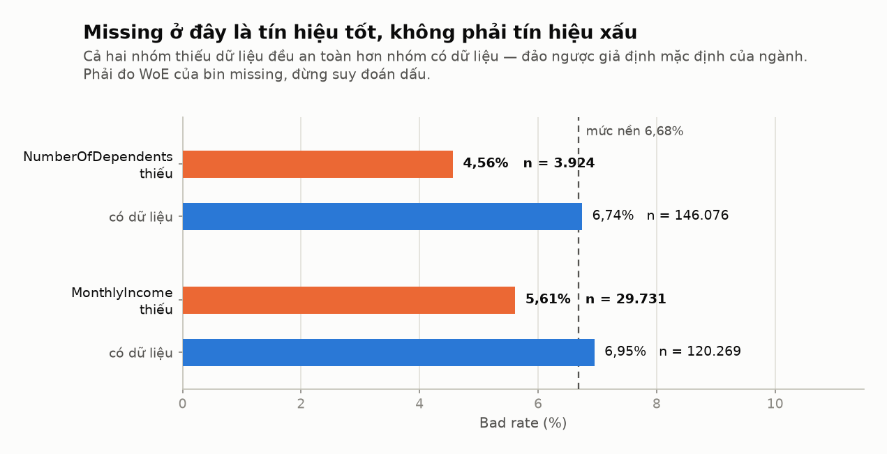
</picture>

Số liệu bảng

| Nhóm                                     |        Bad rate |
| ----------------------------------------- | --------------: |
| `MonthlyIncome` thiếu (n = 29.731)     | **5,61%** |
| `MonthlyIncome` có (n = 120.269)       |           6,95% |
| `NumberOfDependents` thiếu (n = 3.924) | **4,56%** |
| `NumberOfDependents` có (n = 146.076)  |           6,74% |

Cả hai nhóm missing đều **an toàn hơn** nhóm có dữ liệu. Điều này đảo ngược giả định mặc định của ngành và là lý do phải luôn đo WoE của bin missing thay vì suy đoán dấu.

### Pearson nói dối, IV thì không

Tính trên train split, dùng bin phân vị cộng một bin missing:

<picture>
  <source media="(prefers-color-scheme: dark)" srcset="assets/01-pearson-vs-iv-dark.png">
  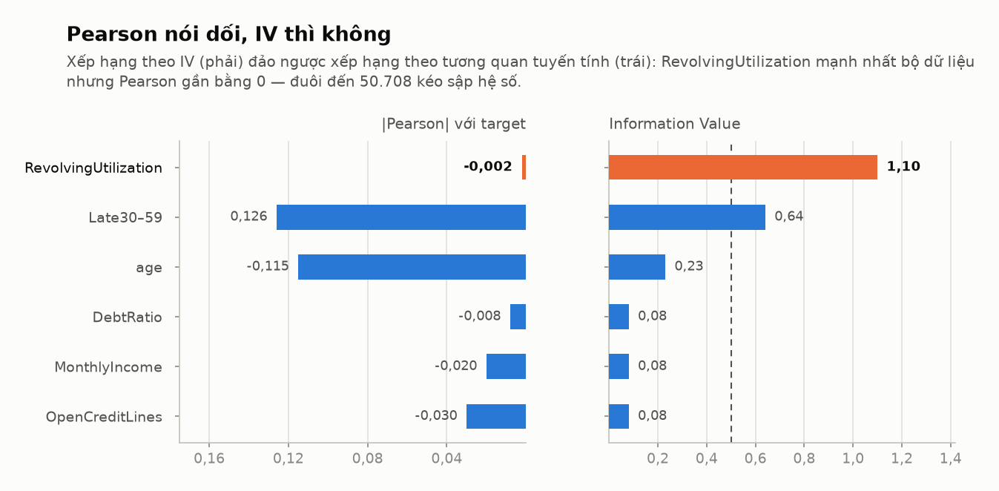
</picture>

Số liệu bảng

| Feature                         |      Pearson corr |             IV | Kết luận                |
| ------------------------------- | ----------------: | -------------: | ------------------------- |
| RevolvingUtilization            | **−0,002** | **1,10** | Mạnh (>0,5 nên soi kỹ) |
| NumberOfTime30-59DaysPastDue    |            +0,126 |           0,64 | Mạnh                     |
| age                             |           −0,115 |           0,23 | Trung bình               |
| NumberOfOpenCreditLinesAndLoans |           −0,030 |           0,08 | Yếu                      |
| MonthlyIncome                   |           −0,020 |           0,08 | Yếu                      |
| DebtRatio                       |           −0,008 |           0,08 | Yếu                      |

`RevolvingUtilization` có tương quan Pearson gần **bằng không** nhưng IV cao nhất bộ dữ liệu. Nguyên nhân: đuôi tới 50.708 kéo sập hệ số tuyến tính, trong khi quan hệ thực là đơn điệu theo thứ hạng. **Đừng dùng correlation matrix để lọc feature cho bài toán nhị phân.**

Một cảnh báo kỹ thuật đi kèm: bin phân vị làm `NumberOfTimes90DaysLate` và `NumberOfTime60-89DaysPastDue` **sập về đúng 1 bin** (vì hơn 94% giá trị là 0), cho IV bằng 0 — dù bảng bad rate ở trên cho thấy hai biến này cực mạnh. Với biến đếm thưa, phải dùng bin thủ công hoặc tree-based binning, đúng như [modeling playbook](00-tong-quan/05-modeling-playbook.md) cảnh báo.

### Artifact đã sinh trong `datasets/processed/`

- **`cs-training-clean.csv`** — 150.000 × 14. So với raw: bỏ cột index, thêm ba cột cờ `*SpecialCode`. `age = 0` thành NaN (1 dòng); mã 96/98 thành NaN (269 dòng mỗi biến). **Không impute, không cap** — utilization và `DebtRatio` giữ nguyên đuôi. Đúng nguyên tắc: bước clean trước split chỉ làm việc không học từ dữ liệu.
- **`split_membership.csv`** — 150.000 dòng, hai cột `row_index` và `split`. Kiểm chứng: train 90.000 (60,0%), valid 30.000 (20,0%), test 30.000 (20,0%); bad rate lần lượt 0,06684 / 0,06683 / 0,06683 so với 0,06684 toàn bộ. **Stratification đúng.** Split lưu thành file riêng theo chỉ số dòng nên tái lập được — đây là điều cả ba notebook top-voted đều không làm.

## 4. Feature importance: ba thước đo, ba thứ hạng

`outputs/` chứa ba xếp hạng độc lập, mỗi cái đo một đại lượng khác nhau: **IV** (`scorecard/iv_summary.csv`, tính trên train sau tree-based binning), **gain** của LightGBM, và **|hệ số|** của hai mô hình Logistic Regression (`models/feature_importance/feature_importance_table.csv`). Ba con số không so trực tiếp với nhau được — nhưng chỗ chúng *bất đồng* mới là chỗ đáng đọc.

<picture>
  <source media="(prefers-color-scheme: dark)" srcset="assets/08-feature-importance-dark.png">
  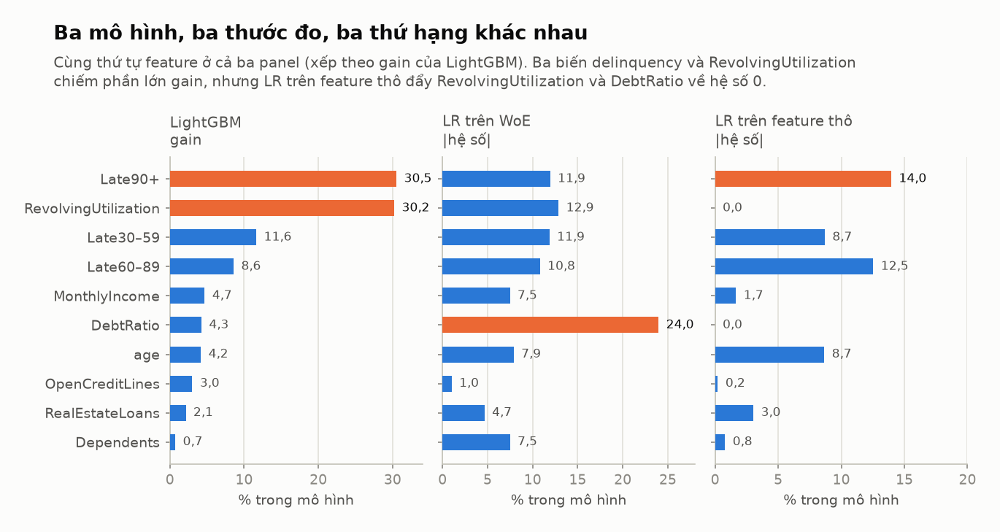
</picture>

**Chỗ ba thước đo đồng thuận.** Ba biến delinquency cộng `RevolvingUtilization` chiếm **81,0% toàn bộ gain** của LightGBM, và cũng là nhóm IV cao nhất. Kết luận của phần 1 — "bốn nhóm kinh điển, delinquency mạnh nhất" — được cả ba mô hình xác nhận, không phải phỏng đoán.

**Xếp hạng IV, sau tree-based binning, đủ cả 10 feature:**

| Feature                              | Số bin (gồm missing) |              IV | WoE đơn điệu | Đánh giá          |
| ------------------------------------ | ---------------------: | --------------: | :--------------: | -------------------- |
| RevolvingUtilizationOfUnsecuredLines |                      7 | **1,097** |        ✓        | `> 0,5` — soi kỹ |
| NumberOfTimes90DaysLate              |                      3 | **0,850** |        ✓        | `> 0,5` — soi kỹ |
| NumberOfTime30-59DaysPastDueNotWorse |                      4 | **0,715** |        ✓        | `> 0,5` — soi kỹ |
| age                                  |                      7 |           0,228 |        ✓        | trung bình          |
| MonthlyIncome                        |                      5 |           0,077 |        ✓        | yếu                 |
| NumberOfOpenCreditLinesAndLoans      |                      3 |           0,071 |        ✓        | yếu                 |
| NumberRealEstateLoansOrLines         |                      3 |           0,039 |        ✓        | yếu                 |
| NumberOfTime60-89DaysPastDueNotWorse |                      2 |           0,036 |        ✓        | yếu                 |
| NumberOfDependents                   |                      5 |           0,036 |        ✓        | yếu                 |
| DebtRatio                            |                      3 |           0,020 |        ✓        | yếu                 |

Bảng này **thay** bảng IV ở phần 3, và giải quyết đúng cảnh báo nêu ở đó: với bin phân vị, `NumberOfTimes90DaysLate` sập về một bin và IV bằng 0; với tree-based binning nó lên **0,850**, hạng hai toàn bộ dữ liệu. WoE đơn điệu ở cả 10 feature — không có biến nào phải sửa bin bằng tay.

Ba feature vượt ngưỡng `0,5`. Theo ngưỡng chuẩn đó là dấu hiệu nghi ngờ, nhưng ở đây giải thích được: chúng là bureau delinquency đo trực tiếp hành vi quá hạn, đúng như phần 2 đã lập luận. Ngược lại `NumberOfTime60-89DaysPastDueNotWorse` chỉ đạt IV 0,036 dù bad rate theo giá trị rất mạnh — vì cây chỉ tách được **2 bin**, và thông tin của nó gần như trùng với hai biến delinquency kia.

**Bốn chỗ bất đồng, cả bốn đều có ý nghĩa:**

1. **`RevolvingUtilization` và `DebtRatio` có hệ số đúng bằng 0 trong LR trên feature thô.** Biến mạnh nhất bộ dữ liệu (IV 1,097) bị mô hình bỏ hẳn, vì đuôi tới 50.708 và 329.664 chưa được xử lý. Đây là bằng chứng số cho việc WoE không phải trang trí: nó là thứ làm LR dùng được biến đó (AUC test 0,8165 lên 0,8473).
2. **Sáu cột cờ trong LR thô có hệ số giống nhau tuyệt đối: 0,4961.** Ba cột `*SpecialCode` và ba missing-indicator của biến delinquency nằm trên đúng cùng 269 dòng, tức trùng nhau hoàn toàn, nên collinear và mô hình chia đều tín dụng cho cả sáu. Tính chung, **8 cột cờ ngốn 50,4% tổng khối lượng hệ số**, còn 10 feature gốc chỉ được 49,6%. Cách sửa: gộp về **một** cờ duy nhất.
3. **LightGBM cho ba cột `*SpecialCode` gain đúng bằng 0** — không dùng lần nào, vì `NaN` của biến gốc đã mang đúng thông tin đó. Cùng một dữ liệu, hai mô hình xử lý ngược nhau hoàn toàn: LR thô dồn 24% khối lượng hệ số vào các cờ mà LightGBM không thèm cắt lấy một lần.
4. **`DebtRatio` là hệ số lớn nhất của LR trên WoE (24,0%) dù IV thấp nhất bộ (0,020).** Đây **không** phải "DebtRatio quan trọng nhất". Hệ số WoE chỉ đo mức mô hình dựa vào cột đó *sau khi* đã có các biến khác; với một biến yếu chia 3 bin, hệ số lớn là dấu hiệu cần soi lại bin, không phải bằng chứng sức mạnh. Xếp hạng đem đi nói với nghiệp vụ nên đọc **IV**, không đọc hệ số.

Ba cảnh báo khi đọc bất kỳ bảng feature importance nào: nó không nói gì về **nhân quả**; nó không đo **tương tác** giữa các biến; và `gain` thiên vị biến có nhiều giá trị phân biệt, nên biến liên tục luôn có lợi thế so với biến đếm thưa.

## 5. Metric sử dụng và kết quả

**AUC** là metric chính thức của cuộc thi, nên là metric quyết định. Đi kèm là **Gini** (`2 × AUC − 1`) và **KS** (`max(TPR − FPR)`) vì ngành tín dụng luôn báo cáo hai con số này song song. Cả ba đều là metric **xếp hạng** — không phụ thuộc threshold, đúng yêu cầu của bài toán lệch lớp 6,7%.

Không dùng **accuracy**: đoán "tất cả đều tốt" đã đạt 93,3% mà hoàn toàn vô dụng. Không dùng **F1 / weighted F1**: vẫn phải chốt một threshold, trong khi sản phẩm cuối là scorecard cắt theo approval rate, không phải nhãn cứng ở 0,5.

<picture>
  <source media="(prefers-color-scheme: dark)" srcset="assets/09-metrics-valid-test-dark.png">
  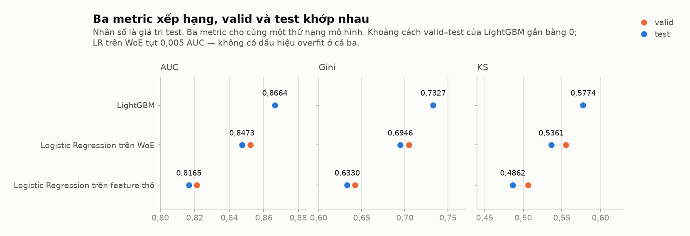
</picture>

Số liệu bảng — <code>outputs/models/metrics/metrics.csv</code>

| Mô hình    | Split |      n | Bad rate |    AUC |   Gini |     KS |
| ------------ | ----- | -----: | -------: | -----: | -----: | -----: |
| logistic_raw | valid | 30.000 |   6,683% | 0,8211 | 0,6423 | 0,5062 |
| logistic_raw | test  | 30.000 |   6,683% | 0,8165 | 0,6330 | 0,4862 |
| logistic_woe | valid | 30.000 |   6,683% | 0,8522 | 0,7045 | 0,5549 |
| logistic_woe | test  | 30.000 |   6,683% | 0,8473 | 0,6946 | 0,5361 |
| lightgbm     | valid | 30.000 |   6,683% | 0,8664 | 0,7328 | 0,5797 |
| lightgbm     | test  | 30.000 |   6,683% | 0,8664 | 0,7327 | 0,5774 |

Bốn điều đọc ra:

**Ba metric cho cùng một thứ hạng.** LightGBM > LR trên WoE > LR thô, không đảo ở AUC, Gini hay KS. Khi ba thước đo đồng thuận thì không cần tranh luận chọn metric nào; nếu chúng lệch nhau mới phải quay lại xem threshold và calibration.

**Không có dấu hiệu overfit.** Chênh lệch valid − test: LightGBM **0,00004**, LR thô 0,0046, LR trên WoE 0,0050. Cả ba đều nhỏ hơn nhiều so với khoảng cách giữa các mô hình, nên xếp hạng là thật chứ không phải nhiễu chọn mẫu.

**WoE lấy lại 61,7% khoảng cách.** LR thô 0,8165, LightGBM 0,8664, LR trên WoE 0,8473 — tức binning + WoE thu hồi gần hai phần ba phần AUC mà một mô hình tuyến tính bị mất so với GBDT, mà vẫn giữ được scorecard giải thích được. Phần 0,019 AUC còn lại là quan hệ phi tuyến và tương tác mà binning không nắm hết.

**KS 48,6–57,7% cao hơn dải 30–40% "bình thường" của ngành, và AUC vượt ngưỡng 0,85 hay bị coi là nghi leakage.** Cả hai đều cùng một nguyên nhân đã nêu ở phần 2: ba biến delinquency là bureau data đo trực tiếp hành vi quá hạn, mạnh hơn hẳn feature đơn xin vay thông thường. Không phải leakage, nhưng cũng có nghĩa các con số này **không** chuyển được sang bài toán chấm điểm khách chưa có lịch sử tín dụng.

Ba metric này **không** đo: **calibration** (xác suất có khớp bad rate thực không), **stability theo thời gian** (dataset không có cột thời gian, PSI ở phần 6 chỉ so hai nửa của train), **fairness** giữa các nhóm dân số, và **tác động kinh doanh**. Vì split là stratified random chứ không phải out-of-time, cả ba con số đều lạc quan hơn production.

## 6. Pipeline local từ dữ liệu đến cutoff

Toàn bộ luồng là một đường thẳng:

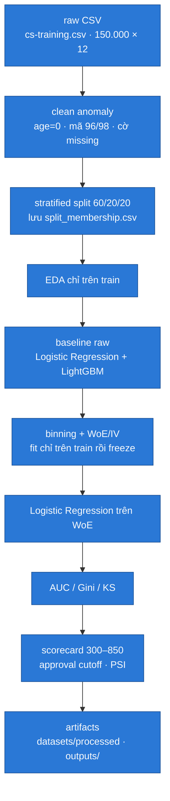

Cả mười bước đều đã chạy và để lại artifact: `datasets/processed/` cho hai bước đầu, `outputs/` cho tám bước sau. Thứ tự thực thi cũng kiểm được, vì code có trong workspace: [`pipeline.run_pipeline`](../src/credit_scoring/pipeline.py) gọi `clean_features` **trước** `_split`, và `_monotonic_table` chỉ nhận `train` — không có đường nào để valid/test lọt vào lúc học ranh giới bin hay bảng WoE. Chi tiết từng feature ở phần 7. Vai trò từng bước:

**Clean trước split** chỉ làm những việc *không học từ dữ liệu*: gắn cờ anomaly, thay mã đặc biệt bằng NaN, bỏ cột ID. Mọi thống kê (median, ranh giới bin, ngưỡng cap) phải nằm sau split — và `cs-training-clean.csv` đúng như vậy.

**Split 60/20/20 stratified** giữ bad rate đồng đều ở cả ba tập. Train để fit, valid để chọn cấu hình, test khóa riêng và chỉ chạm một lần khi báo cáo cuối. **EDA chỉ trên train** — nhìn dữ liệu test cũng là leakage ngầm.

**Hai baseline raw**: Logistic Regression là mức sàn giải thích được, LightGBM cho biết trần AUC của bộ dữ liệu. Chênh lệch hai con số cho biết binning còn bỏ sót bao nhiêu quan hệ phi tuyến.

**Binning và WoE** biến mỗi biến liên tục thành vài bin, mỗi bin một giá trị WoE, missing thành bin riêng, WoE nên đơn điệu theo bin. IV xếp hạng sức dự báo từng biến (`< 0,02` bỏ, `> 0,5` nghi ngờ). Bin edges và bảng WoE fit trên train rồi **freeze**; các tập sau chỉ `transform`.

**Scorecard và cutoff** là sản phẩm cuối, không phải xác suất. Hệ số LR trên WoE quy đổi thành điểm nguyên dải **300–850** (`scorecard/scorecard.csv`, đúng dải `run_summary.json` khai báo). Cutoff chọn theo **approval rate mục tiêu**, rồi đọc bad rate của phần được duyệt ở từng ngưỡng — số thật trong `scorecard/approval_cutoffs.csv`:

| Approval rate mục tiêu | Cutoff điểm | Approval rate thực | Bad rate phần được duyệt |
| -----------------------: | ------------: | ------------------: | ----------------------------: |
|                      60% |           651 |              60,08% |               **1,52%** |
|                      70% |           623 |              70,53% |               **2,00%** |
|                      80% |           594 |              80,37% |               **2,64%** |

Đây là con số nói được với nghiệp vụ, khác hẳn AUC: duyệt 60% hồ sơ điểm cao nhất thì bad rate còn 1,52%, tức **thấp hơn mức nền 6,68% khoảng 4,4 lần**. Nới lên 80% thì bad rate tăng lên 2,64%. Bảng này chính là chỗ đánh đổi doanh số và rủi ro được đặt lên bàn.

**PSI** đo dịch chuyển phân phối điểm (`< 0,10` bình thường, `> 0,25` báo động). Giá trị đo được: **0,00056** — nhưng đó là PSI giữa **nửa đầu và nửa sau của train**, không phải giữa hai kỳ thời gian. Con số gần bằng 0 này chỉ chứng minh cơ chế tính PSI chạy đúng; nó **không** nói gì về drift, vì dataset không có trục thời gian để chia kỳ.

Đặt cạnh mốc ngoài:

<picture>
  <source media="(prefers-color-scheme: dark)" srcset="assets/07-auc-ladder-dark.png">
  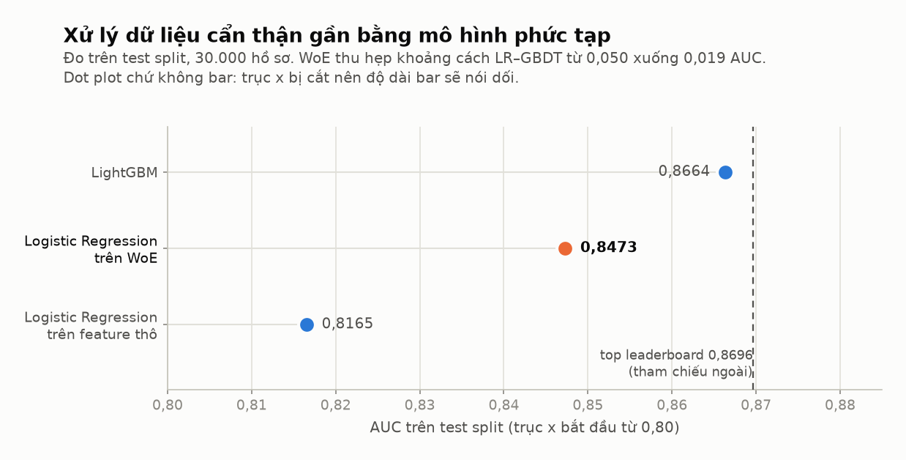
</picture>

LightGBM local đạt 0,8664 so với top leaderboard 0,8696 — **cách 0,0032 AUC**, với một cấu hình không tune sâu. Còn LR trên WoE, tức bản giải thích được và triển khai được bằng SQL, đạt 0,8473, cách top 0,0223. **Trên bộ ít feature, xử lý dữ liệu cẩn thận có giá trị hơn mô hình phức tạp**: bước tốn công nhất và đáng giá nhất là binning + WoE (+0,031 AUC), không phải việc đổi sang mô hình mạnh hơn (+0,019 AUC nữa).

## 7. Từng feature: từ raw đến processed

Phần này đọc trực tiếp code trong `src/credit_scoring/`. Ba chỗ quyết định số phận của một cột: [`data.clean_features`](../src/credit_scoring/data.py) (xử lý anomaly, trước split), pipeline sklearn trong [`pipeline._fit_baselines`](../src/credit_scoring/pipeline.py) (nhánh baseline), và [`pipeline._monotonic_table`](../src/credit_scoring/pipeline.py) cộng [`scorecard.bin_by_tree`](../src/credit_scoring/scorecard.py) / `scorecard.woe_iv` (nhánh scorecard).

Điều dễ bỏ sót nhất: **một cột raw đi theo hai nhánh khác nhau**, và hai nhánh xử lý nó ngược nhau.

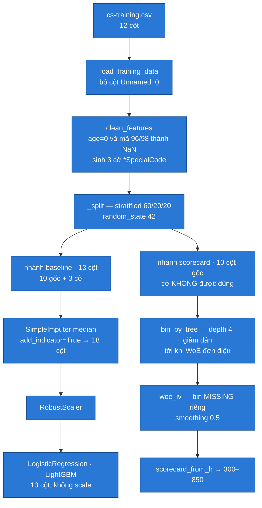

### Bước clean, trước khi split

`clean_features` chỉ làm những việc không học từ dữ liệu, và **ghi lại mọi thứ nó chạm vào** (`outputs/eda/anomaly_findings.csv`):

| Feature                  | Luật                 |        Số dòng | Hành động thực tế trong code                                                                   |
| ------------------------ | --------------------- | ---------------: | --------------------------------------------------------------------------------------------------- |
| `age`                  | `age == 0`          |                1 | thay bằng`NaN`; để imputer trong model xử lý                                                 |
| 3 biến delinquency      | giá trị ∈ {96, 98} |   269 mỗi biến | sinh cờ`*SpecialCode` (`int8`), rồi thay giá trị gốc bằng `NaN`                         |
| `RevolvingUtilization` | `> 10`              |              241 | **chỉ ghi nhận, không sửa** — giữ nguyên cho tree/WoE bin, để RobustScaler lo cho LR |
| `DebtRatio`            | `> 10`              | **28.877** | **chỉ ghi nhận, không sửa** — cùng lý do                                               |

Đây đúng nguyên tắc "clean trước split chỉ làm việc không học từ dữ liệu": không cap, không impute, không xoá dòng. Con số 28.877 đáng chú ý — ngưỡng `> 10` bắt 19,3% toàn bộ dữ liệu, tức nó không phải quy tắc phát hiện outlier mà chỉ là một lát cắt mô tả.

### Nhánh baseline: 13 cột vào, 18 cột ra

`Pipeline([SimpleImputer(strategy="median", add_indicator=True), RobustScaler(), LogisticRegression(max_iter=3000)])`. Ba hệ quả cụ thể:

- `add_indicator=True` sinh thêm một cột 0/1 cho **mỗi** cột có missing trên train: 3 biến delinquency (do 96/98 vừa thành `NaN`), `MonthlyIncome`, `NumberOfDependents` — đúng 5 cột, nên 13 thành 18. `age` **không** có indicator: dòng `age = 0` duy nhất rơi vào valid/test, train không thấy missing nào. Một hàng dữ liệu quyết định hình dạng ma trận feature.
- Ba cờ `*SpecialCode` và ba indicator của biến delinquency **trùng nhau hoàn toàn** — cùng 269 dòng. Đây chính là nguồn của sáu hệ số giống nhau tuyệt đối 0,4961 ở phần 4: `clean_features` đã tạo cờ, rồi `add_indicator` tạo lại y nguyên thông tin đó lần thứ hai.
- `RobustScaler` chuẩn hoá theo IQR, không chặn đuôi. Với `max` 50.708 và 329.664 thì sau khi chia IQR vẫn còn giá trị cực lớn, và L2 của Logistic Regression ép hệ số hai cột đó về **0** — kết quả đã thấy ở phần 4. LightGBM ăn thẳng 13 cột, không qua imputer và không qua scaler, vì cây tự xử lý `NaN` và bất biến với đơn vị đo.

### Nhánh scorecard: tree binning ép đơn điệu

`_monotonic_table` thử `max_depth` từ **4 giảm dần về 1**, mỗi lần gọi `bin_by_tree` (`DecisionTreeClassifier`, `min_samples_leaf=0.05`, tức tối thiểu 4.500 dòng mỗi bin) rồi kiểm `is_monotonic_woe`, và **lấy độ sâu đầu tiên cho WoE đơn điệu**. Đó là lý do cả 10 feature đều đơn điệu ở phần 4: không phải may mắn, mà là điều kiện dừng của vòng lặp. `woe_iv` dùng `WoE = ln(%good/%bad)` với smoothing Laplace 0,5, và luôn tạo **bin `MISSING` riêng** — kể cả khi rỗng, khi đó WoE bị đặt về 0.

| Feature                          | Ranh giới bin học trên train       |   Bin thật | `MISSING` (train) |    IV |          Hệ số |             Điểm |
| -------------------------------- | ------------------------------------- | ----------: | ------------------: | ----: | ---------------: | -----------------: |
| `RevolvingUtilization`         | 0,132 / 0,301 / 0,501 / 0,699 / 0,941 |           6 |                   0 | 1,097 |          −0,661 |           3 → 115 |
| `age`                          | 36,5 / 43,5 / 52,5 / 55,5 / 63,5      |           6 |                   0 | 0,228 |          −0,405 |           48 → 85 |
| `NumberOfTime30-59DaysPastDue` | 0,5 / 1,5                             |           3 |                 160 | 0,715 |          −0,609 |         −42 → 80 |
| `NumberOfTimes90DaysLate`      | 0,5                                   |           2 |                 160 | 0,850 |          −0,613 |         −42 → 76 |
| `MonthlyIncome`                | 3.332,5 / 5.559,5 / 6.666,5           |           4 |              17.814 | 0,077 |          −0,384 |           52 → 69 |
| `NumberOfDependents`           | 0,5 / 1,5 / 2,5                       |           4 |               2.316 | 0,036 |          −0,384 |           53 → 74 |
| `DebtRatio`                    | 0,414                                 |           2 |                   0 | 0,020 |          −1,230 |           50 → 71 |
| `NumberOfOpenCreditLines`      | 2,5                                   |           2 |                   0 | 0,071 | **+0,052** |           61 → 63 |
| `NumberRealEstateLoans`        | 0,5                                   |           2 |                   0 | 0,039 |          −0,239 |           57 → 63 |
| `NumberOfTime60-89DaysPastDue` | *không có*                        | **1** |                 160 | 0,036 | **+0,554** | 60 →**154** |

<picture>
  <source media="(prefers-color-scheme: dark)" srcset="assets/10-score-range-dark.png">
  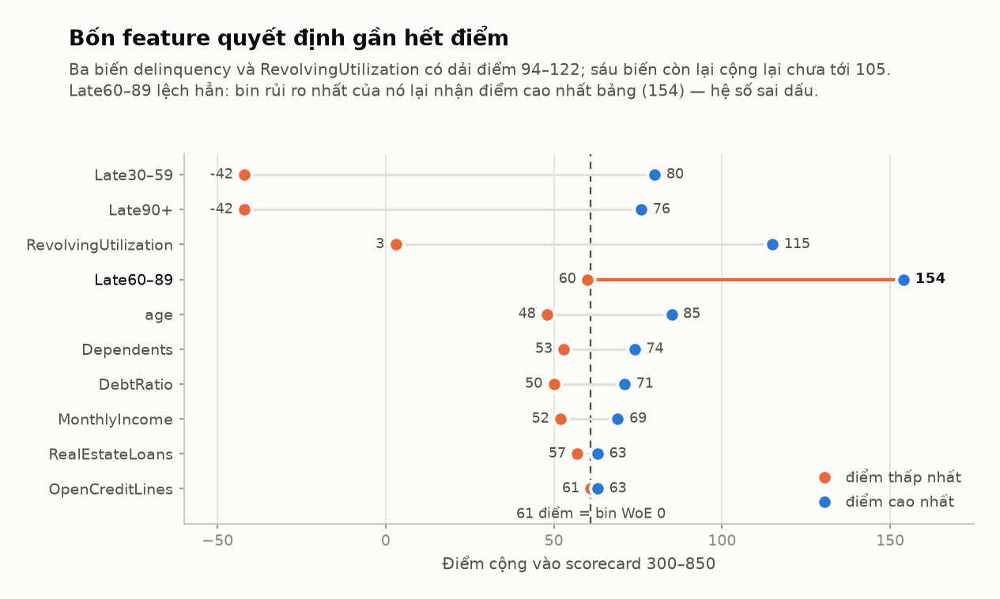
</picture>

Bốn feature — ba biến delinquency cộng `RevolvingUtilization` — chiếm dải điểm 94–122, còn sáu biến còn lại cộng lại chưa tới 105 điểm. Xếp hạng này khớp với cả IV và gain ở phần 4, nên scorecard đang phản ánh đúng sức dự báo.

### Bốn chỗ cần sửa, đọc ra từ chính bảng trên

1. **`NumberOfTime60-89DaysPastDue` có hệ số dương `+0,554`, ngược dấu so với tám feature khác — và điều đó làm scorecard sai.** Cột này không tách được bin nào: `min_samples_leaf=0.05` đòi mỗi lá tối thiểu **4.500** dòng, mà số dòng có giá trị từ 1 đến 17 trên train chỉ khoảng **4.401** — thiếu chưa tới 100 dòng là cây mất quyền cắt. Kết quả: chỉ còn **một bin thật** cộng bin `MISSING`. Toàn bộ IV 0,036 của nó đến từ bin `MISSING` — tức từ 269 dòng mã 96/98. Với WoE −2,736 và hệ số dương, nhóm đó nhận **154 điểm, cao nhất toàn bảng**, trong khi bin bình thường chỉ được 60. Cộng cả ba biến delinquency: nhóm mã 96/98 bị trừ −42 và −42 ở hai biến kia nhưng được **+154** ở biến này, ròng **+70** — nhóm có bad rate 54,65% lại được cộng điểm. Cách sửa: bỏ cột này khỏi scorecard (IV 0,036, thông tin trùng hai biến kia), hoặc dùng một cờ 96/98 duy nhất, hoặc ràng buộc dấu hệ số.
2. **`NumberOfOpenCreditLines` cũng sai dấu (`+0,052`)** — bin rủi ro hơn (`≤ 2,5`, WoE −0,728) được 63 điểm còn bin an toàn hơn được 61. Cùng lỗi, nhưng dải điểm chỉ 2 nên vô hại trên thực tế. Nó là bằng chứng lỗi ở 1 không phải ngẫu nhiên: LR trên WoE không bị ràng buộc dấu, nên đa cộng tuyến giữa ba biến delinquency đủ để lật dấu.
3. **Bin trên cùng của `RevolvingUtilization` gộp mất phát hiện của phần 3.** Ranh giới cao nhất là 0,941, nên `(0,941, ∞]` chứa 10.599 dòng train gồm cả nhóm 1–2 (bad rate 40,10%) và nhóm `> 10` (bad rate 7,05%, tức ngang mức nền). Bad rate gộp thành 22,8%. Ép đơn điệu **buộc** phải gộp như vậy — chính quan hệ không đơn điệu mà phần 3 phát hiện là thứ bị bỏ. Cách sửa: cắt đuôi `> 10` thành bin riêng và chấp nhận WoE không đơn điệu ở đúng một bin, hoặc thêm cờ `utilization > 10`.
4. **Bin `MISSING` rỗng vẫn được 61 điểm — điểm trung tính.** Bốn feature có `MISSING` rỗng trên train (`RevolvingUtilization`, `age`, `DebtRatio`, `NumberOfOpenCreditLines`) nhận WoE 0, quy ra đúng 61 điểm. Nghĩa là ở thời điểm chấm điểm, một hồ sơ **thiếu** `RevolvingUtilization` được 61 điểm, cao hơn hẳn hồ sơ có utilization cao nhất (3 điểm). Đúng chỗ này là dòng `age = 0`: nó rơi vào valid/test nên train chưa từng thấy, và khi chấm nó nhận điểm trung tính. Cách sửa: gán bin `MISSING` rỗng về bin xấu nhất, hoặc từ chối chấm khi thiếu biến có IV cao.

Ba lỗi đầu đều cùng một gốc: **`scorecard_from_lr` fit Logistic Regression không ràng buộc dấu hệ số** (`LogisticRegression(max_iter=2000)`, không có `monotone_constraints` như LightGBM). Ép WoE đơn điệu trong từng feature là chưa đủ — còn cần ép dấu ở tầng hệ số nữa, và cần bỏ feature trùng thông tin trước khi fit.

## 8. Notebook top-voted thường làm gì

Ba notebook được đọc sâu (336, 233 và 205 vote) khác nhau về chất lượng nhưng lặp lại một pattern chung:

1. **Khám phá** bad rate, missing, phân phối và các vùng anomaly.
2. **Thử nhiều cách xử lý** — impute median, cap, drop — tạo nhiều phiên bản dataset để so sánh.
3. **Dựng baseline rồi mở rộng**: Logistic Regression, tree model, boosting, đôi khi cả KNN hoặc neural network.
4. **Tune và ensemble** — grid/random search, voting, stacking, sinh prediction.
5. **Với hướng scorecard**: binning → WoE/IV → Logistic Regression → quy đổi thành điểm và cutoff.

**Đáng học**: điều tra anomaly theo vùng thay vì chỉ nhìn boxplot; harness so sánh nhiều dataset/model bằng cùng một metric; bảng artifact `(feature, bin, WoE, IV, hệ số, điểm)` tách rõ để triển khai được bằng SQL hay rules engine.

**Không nên sao chép**:

- fit preprocessing trước split (cả ba notebook đều mắc);
- lọc/xóa dòng dựa vào target — không áp dụng được khi chấm hồ sơ mới;
- tối ưu accuracy hoặc weighted F1 thay vì AUC;
- chọn cấu hình và báo cáo trên cùng một cơ chế CV, không có holdout;
- suy diễn kết luận pháp lý từ một histogram.

Kết luận: **số vote đo mức hữu ích mà cộng đồng cảm nhận, không đo tính tái lập (reproducibility).** Cả ba snapshot đều bị xóa output và `execution_count`, nên mọi metric chỉ là claim của tác giả — kể cả AUC 0,8662 hay được trích. Đọc notebook để lấy ý tưởng và checklist; split và preprocessing thì pipeline local phải tự viết lại cho đúng.

## Liên quan

- [Report cuộc thi](01-kaggle-reports/competition/06-comp-give-me-some-credit.md) · [EDA playbook](00-tong-quan/04-eda-playbook.md) · [Modeling playbook](00-tong-quan/05-modeling-playbook.md) · [Metrics/validation/monitoring](00-tong-quan/06-metrics-validation-monitoring.md)
- [Top-voted overview](01-kaggle-reports/top-voted/overview.md) và chi tiết [#1](01-kaggle-reports/top-voted/details/01-credit-scorecard-example.md) · [#2](01-kaggle-reports/top-voted/details/02-starter-credit-card-scoring.md) · [#3](01-kaggle-reports/top-voted/details/03-comp-stats-group-project.md)
