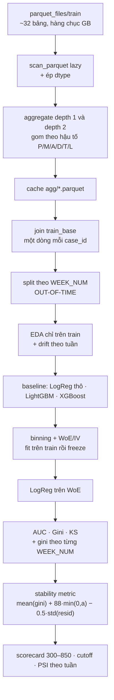

# Kế hoạch — Home Credit: Credit Risk Model Stability (2024)

Cuộc thi thứ hai của tuần 2. Đã có
[report cuộc thi #5](../../01-kaggle-reports/competition/05-comp-home-credit-model-stability.md)
và 10 notebook top-voted + 1 notebook leaderboard trong
[`notebooks/`](../../../notebooks/top-voted/home-credit-model-stability/).

Sản phẩm cuối:
`docs/weekly-report/week2/week2-report-model-stability.md`, cùng khuôn 8 phần với
[`week1-report.md`](../../week1-report.md) và
[`week2-report.md`](week2-report.md).

> **Trạng thái:** hoàn thành ngày 31/07/2026. Kết quả đo, giới hạn và các giả
> thuyết bị bác bỏ nằm trong
> [báo cáo hoàn chỉnh](week2-report-model-stability.md);
> config và metric máy đọc nằm tại `outputs/hcms/run_summary.json`. Các con số
> trong phần kế hoạch bên dưới được giữ như giả thuyết trước khi chạy.

## 0. Vì sao cuộc thi này khác hẳn hai cuộc trước

GiveMeSomeCredit và Home Credit Default Risk đều **không có cột thời gian**. Cả
hai report tuần 1 và tuần 2 đều phải viết cùng một câu xin lỗi: *"split là
stratified random, không phải out-of-time, nên mọi con số lạc quan hơn
production."*

Cuộc thi 2024 sinh ra để sửa đúng chỗ đó. Nó có `date_decision` và `WEEK_NUM`,
và `WEEK_NUM` của test **nối tiếp** train — test là tương lai thật. Nghĩa là
lần đầu tiên trong ba tuần, làm được:

- **out-of-time split** đúng nghĩa,
- **gini theo từng tuần** thay vì một con số tổng,
- **đo drift thật** thay vì PSI giữa hai nửa random,
- và metric chính thức **phạt mô hình suy giảm theo thời gian**.

Đây không phải bài "làm lại lần ba". Đây là bài duy nhất đo được thứ mà hai bài
kia bắt buộc phải bỏ qua.

## 1. Ánh xạ yêu cầu task → deliverable

| Yêu cầu trong`task.md`                                          | Phần report | Artifact                                                       |
| ------------------------------------------------------------------- | ------------ | -------------------------------------------------------------- |
| Cấu trúc dataset                                                  | §1, §3     | `datasets/raw/home-credit-model-stability/`, `source.json` |
| EDA                                                                 | §3          | `outputs/hcms/eda/`                                          |
| Phương pháp feature extraction phổ biến                        | §4          | `datasets/processed/hcms/feature_matrix.parquet`             |
| Mô hình cơ bản: XGBoost, LightGBM, LogisticRegression + Raw/WoE | §5, §6     | `outputs/hcms/models/`, `outputs/hcms/scorecard/`          |
| *(thêm, đặc thù cuộc thi này)* stability                    | §7          | `outputs/hcms/stability/`                                    |

## 2. Khác gì HCDR — bảng này quyết định toàn bộ kế hoạch

|                       | HCDR 2018 (đã làm) | Model Stability 2024                                                          |
| --------------------- | --------------------- | ----------------------------------------------------------------------------- |
| Số bảng             | 7                     | **~32 bảng gốc**, chia thành nhiều file theo `WEEK_NUM`           |
| Kích thước         | 2,68 GB               | **hàng chục GB** — phải đo lại sau khi tải                       |
| Định dạng          | CSV                   | **Parquet** (có cả bản CSV)                                          |
| Khoá                 | `SK_ID_CURR`        | `case_id`                                                                   |
| Depth                 | 0/1/2 (ngầm hiểu)   | **0/1/2 định nghĩa chính thức** qua `num_group1`, `num_group2` |
| Cột thời gian       | **không có**  | **`date_decision`, `WEEK_NUM`, `MONTH`**                          |
| Split                 | stratified random     | **out-of-time theo `WEEK_NUM`**                                       |
| Metric                | AUC                   | **gini stability** — công thức riêng, phạt suy giảm               |
| Predictor             | 346 cột              | **~470 predictor**, có quy ước hậu tố P/M/A/D/T/L                  |
| Nguồn dữ liệu      | bureau + nội bộ     | thêm**tax registry, deposit, debitcard** (alternative data)            |
| Ràng buộc nộp bài | không                | **code competition**: ≤12h, **tắt internet**                    |
| RAM khả dụng        | 14 GiB (đã biết)   | 14 GiB —**đây là ràng buộc thiết kế số một**                  |

Bốn hệ quả:

1. **14 GiB RAM với dữ liệu hàng chục GB → pandas hết cửa.** Phải Polars
   `scan_parquet` (lazy, streaming) hoặc DuckDB, đúng cách tuần 2 đã dùng DuckDB
   cho HCDR. Report #5 ghi rõ phần lớn team dùng Polars vì lý do này.
2. **Metric mới phải tự implement.** `stability_metric()` không có sẵn ở
   `src/credit_scoring/metrics.py`. Đây là hàm quan trọng nhất của cả tuần.
3. **Split đổi hoàn toàn.** Không `train_test_split(stratify=...)` nữa mà cắt
   theo `WEEK_NUM`. Hàm `_split` của tuần 1/2 **không dùng lại được**.
4. **Quy ước hậu tố là công cụ, không phải trang trí.** Với ~470 cột,
   `df.select(cs.ends_with("P"))` gom được toàn bộ biến DPD trong một dòng. Phải
   khai thác ngay từ đầu thay vì liệt kê tên cột bằng tay.

## 3. Chuẩn bị dữ liệu và môi trường

### 3.1 Tải dữ liệu

```bash
set -a && . ./.env && set +a          # KAGGLE_API_TOKEN
mkdir -p datasets/raw/home-credit-model-stability
uv run --with kaggle kaggle competitions download \
  -c home-credit-credit-risk-model-stability \
  -p datasets/raw/home-credit-model-stability
```

**Trước khi giải nén, kiểm ba thứ:**

| Kiểm                              | Vì sao                                                                                                   |
| ---------------------------------- | --------------------------------------------------------------------------------------------------------- |
| `df -h` còn trống bao nhiêu   | dữ liệu hàng chục GB, giải nén nở thêm                                                            |
| chỉ giữ nhánh`parquet_files/` | bộ có cả CSV và Parquet,**xoá CSV** — tiết kiệm quá nửa đĩa và đọc nhanh hơn nhiều |
| `feature_definitions.csv`        | file tra cứu ý nghĩa ~470 predictor, cần cho EDA                                                      |

Rồi ghi `source.json` với sha256 từng file giữ lại, đúng khuôn hai tuần trước.

Cấu trúc mong đợi (kiểm chứng lại sau khi giải nén):

```
parquet_files/
  train/  train_base.parquet
          train_static_0_*.parquet          depth 0
          train_static_cb_0.parquet         depth 0, external
          train_applprev_1_*.parquet        depth 1
          train_applprev_2.parquet          depth 2
          train_person_1.parquet            depth 1
          train_person_2.parquet            depth 2
          train_other_1.parquet
          train_deposit_1.parquet
          train_debitcard_1.parquet
          train_tax_registry_{a,b,c}_1.parquet
          train_credit_bureau_a_1_*.parquet
          train_credit_bureau_a_2_*.parquet    11 file
          train_credit_bureau_b_{1,2}.parquet
  test/   cùng bộ, credit_bureau_a_2 có 12 file
feature_definitions.csv
```

> **Lưu ý bảo mật.** `.env` chứa Kaggle API token. Thêm vào `.gitignore` trước
> khi commit; token đã lộ trong hội thoại nên nên revoke và tạo lại trên trang
> Kaggle account.

### 3.2 Môi trường

Thêm vào `pyproject.toml`: `polars`, `pyarrow`. Giữ `duckdb` đã có từ tuần 2.

Quy tắc bộ nhớ, áp dụng suốt pipeline:

- Đọc bằng `pl.scan_parquet(...)` (lazy), **không** `pl.read_parquet`.
- Mỗi bảng: aggregate về một dòng mỗi `case_id` **rồi mới** `.collect()`.
- Ghi kết quả agg ra `datasets/processed/hcms/agg/<tên bảng>.parquet` và không
  tính lại. Cache là bắt buộc, không phải tối ưu.
- Ép `float64 → float32`, `int64 → int32`, chuỗi → `Categorical` trước khi ghi.
- Feature matrix cuối phải vừa RAM. Nếu không vừa: giảm số predictor, **không**
  giảm số dòng.

## 4. Cấu trúc thư mục đầu ra

```
datasets/raw/home-credit-model-stability/     parquet_files/ + feature_definitions.csv + source.json
datasets/processed/hcms/
  agg/<table>.parquet                         cache aggregate từng bảng
  feature_matrix.parquet                      matrix cuối, một dòng mỗi case_id
  split_membership.csv                        case_id → WEEK_NUM → train/valid/test
outputs/hcms/
  eda/                                        bảng CSV + hình
  models/                                     metrics.csv, feature_importance/, *.joblib
  scorecard/                                  woe_iv_detail, scorecard, cutoffs, PSI
  stability/                                  gini_by_week.csv, stability_metric.json
  submissions/                                submission.csv
  run_summary.json
docs/weekly-report/week2/assets-week2-stability/ hình + gen_charts.py
docs/weekly-report/week2/week2-report-model-stability.md
src/home_credit_stability/                     package mới
```

## 5. Code: dùng lại gì, viết mới gì

### Dùng lại

| Nguồn                                   | Hàm                                                    | Ghi chú                                                                                                                                      |
| ---------------------------------------- | ------------------------------------------------------- | --------------------------------------------------------------------------------------------------------------------------------------------- |
| `credit_scoring/metrics.py`            | `psi`, **`gini_by_period`**                   | `gini_by_period` viết từ tuần 1 nhưng tuần 1 **không có cột thời gian để dùng**. Tuần này mới là chỗ nó có nghĩa. |
| `credit_scoring/scorecard.py`          | `woe_iv`, `is_monotonic_woe`, `scorecard_from_lr` | như tuần 2                                                                                                                                  |
| `credit_scoring/feature_importance.py` | `build_feature_importance_table`                      | như tuần 2                                                                                                                                  |
| `home_credit/binning.py`               | `bin_categorical`                                     | tuần 2 đã viết cho categorical, dùng lại nguyên                                                                                        |

### Viết mới trong `src/home_credit_stability/`

| File             | Nội dung                                                                       |
| ---------------- | ------------------------------------------------------------------------------- |
| `stability.py` | **`stability_metric()`** — hàm quan trọng nhất, xem §8             |
| `data.py`      | `scan_tables()`, `apply_dtypes()`, đọc `feature_definitions.csv`        |
| `aggregate.py` | agg depth 1 và depth 2 theo nhóm hậu tố, không liệt kê tay               |
| `split.py`     | `split_by_week()` — cắt theo `WEEK_NUM`, **không** stratify random |
| `pipeline.py`  | `run_pipeline()`                                                              |

**Không đụng** `src/credit_scoring/` và `src/home_credit/` — hai bộ đó đang chạy
đúng và đã có report dựa vào chúng.

## 6. Luồng pipeline



Nguyên tắc leakage giữ nguyên hai tuần trước, cộng **một điều kiện mới**: mọi
thống kê fit trên train phải fit trên **các tuần sớm nhất**, không phải trên
một mẫu ngẫu nhiên toàn tập. Nhìn dữ liệu tuần tương lai để chọn bin cũng là
leakage — và là loại leakage hai tuần trước **không thể phát hiện được**.

| Bước    | Verify                                                                              |
| --------- | ----------------------------------------------------------------------------------- |
| load      | số dòng`train_base` khớp `source.json`; `case_id` duy nhất                |
| aggregate | mỗi file agg có`case_id` duy nhất                                              |
| join      | số dòng sau join = số dòng`train_base`                                        |
| split     | ba tập**không giao nhau về `WEEK_NUM`**; in rõ khoảng tuần từng tập |
| baseline  | AUC test > 0,70 (mốc tham chiếu, xem §9)                                         |
| stability | `gini_by_week.csv` có đủ tuần của tập test, không tuần nào < 500 dòng   |
| scorecard | không hệ số sai dấu; điểm trong 300–850                                      |

## 7. Split out-of-time — phần đáng giá nhất của tuần này

Đây là chỗ khác biệt lớn nhất so với hai tuần trước, nên viết rõ:

```
WEEK_NUM tăng dần  ──────────────────────────────────────────►
[      train 60%      ][  valid 20%  ][   test 20%   ]
     tuần sớm nhất       tuần giữa       tuần muộn nhất
```

Cắt theo phân vị của `WEEK_NUM`, không theo số dòng — số hồ sơ mỗi tuần không
đều. Ghi `split_membership.csv` gồm `case_id`, `WEEK_NUM`, `split`.

**Ba thứ phải báo cáo mà hai tuần trước không có:**

1. **Bad rate theo từng tuần** trên toàn bộ chuỗi. Nếu bad rate tự nó trôi thì
   mọi so sánh AUC giữa các kỳ đều bị nhiễu bởi thay đổi dân số, không phải bởi
   mô hình kém đi.
2. **Chênh AUC train-period vs test-period.** Hai tuần trước gap valid−test
   < 0,01 và điều đó được coi là "không overfit". Với out-of-time, gap sẽ **lớn
   hơn** — và con số đó chính là phần lạc quan giả mà hai report trước không đo
   được. Đây là kết luận đắt giá nhất cần viết ra.
3. **PSI theo tuần**, không phải PSI một lần. Chuỗi PSI theo thời gian mới là
   monitoring thật; PSI 0,00253 của tuần 2 chỉ là một điểm.

Làm thêm **một baseline đối chứng**: chạy cùng mô hình với stratified random
split trên chính bộ này, rồi so AUC với bản out-of-time. Chênh lệch giữa hai con
số là **thước đo trực tiếp** cho câu "random split lạc quan hơn production" mà
hai report trước chỉ khẳng định chứ chưa chứng minh được. Rẻ, và là kết quả có
giá trị nhất của tuần.

## 8. Metric — implement gini stability

Nguyên văn từ
[report #5](../../01-kaggle-reports/competition/05-comp-home-credit-model-stability.md):

```
gini = 2 × AUC − 1
stability = mean(gini) + 88.0 × min(0, a) − 0.5 × std(residuals)
```

trong đó `a` là hệ số góc của hồi quy tuyến tính `a·x + b` fit qua chuỗi gini
theo `WEEK_NUM`, và `residuals` là phần dư quanh đường đó.

```python
def stability_metric(y_true, y_score, week_num):
    """gini stability. Trả về (stability, mean_gini, slope, std_resid, bảng theo tuần)."""
    g = (pd.DataFrame({"y": y_true, "s": y_score, "w": week_num})
           .groupby("w")
           .apply(lambda d: 2 * roc_auc_score(d.y, d.s) - 1))
    x = np.arange(len(g))
    a, b = np.polyfit(x, g.values, 1)
    resid = g.values - (a * x + b)
    return float(g.mean() + 88.0 * min(0.0, a) - 0.5 * resid.std()), ...
```

**Ba cái bẫy phải chặn:**

1. **Tuần có mẫu quá nhỏ** hoặc **một lớp duy nhất** → `roc_auc_score` ném lỗi
   hoặc trả số vô nghĩa. Loại tuần có < 500 dòng hoặc 0 bad, và **ghi lại đã
   loại tuần nào** — im lặng bỏ tuần là bóp méo metric.
2. **`x` phải là chỉ số tuần liên tiếp**, không phải giá trị `WEEK_NUM` thô, nếu
   chuỗi tuần có lỗ hổng. Chọn một cách rồi ghi rõ vào code.
3. **`min(0, a)` bất đối xứng có chủ ý** — mô hình tốt lên theo thời gian không
   được thưởng. Đừng "sửa" thành `abs(a)`.

**Self-check bắt buộc** (đúng tinh thần `gen_charts.py` của tuần 1): dựng chuỗi
gini giả và assert ba trường hợp — gini phẳng thì `stability == mean(gini)`;
gini dốc xuống thì bị phạt đúng `88·a`; gini dốc lên thì **không** được cộng
thêm. Không có ba assert này thì hàm coi như chưa viết.

Với hệ số 88, mô hình gini giảm 0,002/tuần bị phạt 0,176 — lớn hơn phần lớn
khoảng cách giữa các mô hình. Đó là lý do phải báo cáo `stability` **song song**
với AUC, và nếu hai thứ hạng khác nhau thì đó chính là phát hiện đáng viết nhất.

**Áp ngược lại tuần 1 và tuần 2?** Không được — cả hai bộ đều không có trục thời
gian. Đó là toàn bộ luận điểm.

## 9. Feature extraction

### Chiến lược ba tầng, giống tuần 2

| Tầng       | Nội dung                                                                            | AUC kỳ vọng     |
| ----------- | ------------------------------------------------------------------------------------ | ----------------- |
| **A** | chỉ`train_base` + `static_0` + `static_cb_0` (depth 0)                        | mốc khởi điểm |
| **B** | + depth 1:`applprev_1`, `person_1`, `tax_registry_*`, `credit_bureau_*_1`    | tăng             |
| **C** | + depth 2:`applprev_2`, `person_2`, `credit_bureau_a_2`, `credit_bureau_b_2` | tăng tiếp       |

Mỗi tầng đo **cả AUC lẫn stability**. Câu hỏi thú vị của tuần này không phải
"tầng nào AUC cao nhất" mà **"tầng nào stability cao nhất"** — thêm feature
external có thể tăng AUC mà giảm stability, và metric phạt điều đó gấp 88 lần.

> Không đặt ngưỡng AUC cụ thể vì chưa có mốc tham chiếu đo được cho split
> out-of-time. Ngưỡng chỉ chốt sau khi tầng A chạy xong — dùng chính tầng A làm
> mốc, mỗi tầng sau phải hơn tầng trước.

### Aggregate theo hậu tố, không theo tên cột

Đây là chỗ tận dụng quy ước đặt tên của cuộc thi:

| Hậu tố                 | Loại           | Hàm agg phù hợp                                                         |
| ------------------------ | --------------- | -------------------------------------------------------------------------- |
| **P**              | DPD             | `max`, `mean`, `sum` — DPD lớn nhất là tín hiệu mạnh nhất    |
| **A**              | amount          | `max`, `mean`, `sum`                                                 |
| **D**              | date            | `min`, `max` — rồi đổi thành khoảng cách tới `date_decision` |
| **M**              | masked category | `mode`, `n_unique`                                                     |
| **T**, **L** | không rõ      | `max`, `mean` — kiểm bằng `feature_definitions.csv`               |

Viết một hàm duy nhất nhận (bảng, khoá, map hậu tố → hàm) rồi chạy cho toàn bộ
depth 1 và depth 2. **Không** liệt kê ~470 tên cột bằng tay. Đặt tên đầu ra
`{BẢNG}_{CỘT}_{HÀM}` như tuần 2.

Cột `D` phải quy về khoảng cách tới `date_decision` **trước khi** agg — ngày
tuyệt đối đưa thẳng vào model là leakage thời gian trá hình: mô hình học được
"hồ sơ tháng 3 thì xấu" thay vì học hành vi.

## 10. Mô hình

Bốn mô hình đúng danh sách task, giống hai tuần trước:

| Tên             | Đầu vào                          | Ghi chú so với tuần 2                                                                                                                     |
| ---------------- | ----------------------------------- | -------------------------------------------------------------------------------------------------------------------------------------------- |
| `logistic_raw` | feature thô + one-hot              | dùng`StandardScaler(with_mean=False)` + SAGA — tuần 2 đã phát hiện LBFGS không hội tụ, rơi AUC 0,6422 xuống. Đừng lặp lại. |
| `logistic_woe` | sau WoE                             | binning fit trên**các tuần sớm** rồi freeze                                                                                       |
| `lightgbm`     | thô, categorical dạng`category` | early stopping trên valid — mà valid là**tuần tương lai gần**, không phải mẫu ngẫu nhiên                                  |
| `xgboost`      | thô, one-hot                       | `tree_method="hist"`                                                                                                                       |

Không ensemble, không stacking, không tuning sâu — task yêu cầu **mô hình cơ
bản**, và hai tuần trước đã cho thấy cấu hình không tune sâu vẫn đủ để rút kết
luận.

**Một thử nghiệm nhỏ đáng làm** (rẻ, và là điểm chính của cuộc thi): huấn luyện
LightGBM chỉ trên **nửa sau** của các tuần train, rồi so stability với bản
huấn luyện trên toàn bộ tuần train. Nếu bản dữ liệu gần hơn cho stability tốt
hơn, đó là bằng chứng số cho câu "scorecard phải cập nhật định kỳ" của phần
Overview cuộc thi.

## 11. Scorecard

Giữ nguyên quy trình tuần 2 (đã chạy đúng: 21 feature, hệ số từ −0,768 tới
−0,022, không cái nào dương, điểm đúng 300–850), cộng **một bước mới**:

**Lọc feature theo tính ổn định.** Với mỗi ứng viên, tính IV theo từng tuần trên
tập train. Feature có IV dao động mạnh giữa các tuần thì loại, kể cả khi IV
trung bình cao. Đây chính là điều Stability Prize gọi là *"approach to stability
at the level of feature selection"* — mức cơ bản, chưa phải mức đưa vào loss
function.

Cutoff vẫn báo cáo theo approval rate 60/70/80% kèm bad rate phần được duyệt,
nhưng thêm cột **bad rate của phần được duyệt theo từng tuần test** — cutoff
đứng yên trong khi dân số trôi là kịch bản hỏng thật ngoài sản xuất.

## 12. Rủi ro

| Rủi ro                                    | Dấu hiệu                      | Chặn                                                                                                                            |
| ------------------------------------------ | ------------------------------- | -------------------------------------------------------------------------------------------------------------------------------- |
| Hết RAM                                   | OOM khi join                    | lazy scan, cache agg, ép dtype; nếu vẫn hết thì bỏ bớt predictor,**không** bỏ dòng                               |
| Hết đĩa                                 | download fail giữa chừng      | kiểm`df -h` trước; xoá nhánh CSV, chỉ giữ parquet                                                                       |
| Leakage thời gian                         | AUC test ≈ AUC train           | mọi`fit` chỉ chạm các tuần train; cột `D` đổi thành khoảng cách trước khi agg                                   |
| Tuần thiếu mẫu làm hỏng metric        | `roc_auc_score` ném lỗi     | loại tuần < 500 dòng hoặc 0 bad,**và ghi lại**                                                                       |
| Nở số cột                               | > 1000 cột                     | agg theo hậu tố, giới hạn số hàm mỗi loại                                                                                |
| Nhầm`WEEK_NUM` thô với chỉ số tuần | slope sai                       | chốt một quy ước, ghi vào docstring                                                                                         |
| Kỳ vọng AUC theo mốc HCDR               | thất vọng vô cớ             | hai bộ khác nhau;**out-of-time luôn thấp hơn random split** — đó là dấu hiệu làm đúng, không phải làm sai |
| Submission                                 | cuộc thi đã đóng 27/5/2024 | kiểm xem late submission có mở không; nếu không thì bỏ mục LB, giữ nguyên mọi phần khác                            |

## 13. Deliverable và nghiệm thu

**Bắt buộc**

- [x] `datasets/raw/home-credit-model-stability/` chỉ giữ parquet +
  `feature_definitions.csv` + `sample_submission.csv` + `source.json` có sha256
- [x] `src/home_credit_stability/` chạy một lệnh ra toàn bộ artifact
- [x] `split_membership.csv` có `WEEK_NUM`, ba tập **không giao nhau về tuần**
- [x] `stability.py` có ba assert self-check ở §8
- [x] `outputs/hcms/stability/gini_by_week.csv` + `stability_metric.json` cho cả 4 mô hình
- [x] Bảng so **out-of-time vs random split** trên cùng mô hình, cùng dữ liệu
- [x] `docs/weekly-report/week2/week2-report-model-stability.md` đủ 8 phần
- [x] `docs/weekly-report/week2/assets-week2-stability/gen_charts.py` có `selfcheck()`

**Ngưỡng số**

- [x] Mỗi tầng B, C có AUC test **cao hơn tầng trước**
- [x] Không hệ số scorecard nào sai dấu; điểm trong 300–850
- [x] Mọi tuần trong `gini_by_week.csv` có ≥ 500 dòng, hoặc được ghi rõ là đã loại
- [x] `stability_metric()` pass ba assert

**Không làm:** ensemble/stacking, tuning Optuna, đưa stability vào loss function
(đó là hạng mục Stability Prize — nghiên cứu riêng, ngoài phạm vi "mô hình cơ
bản"), và mô phỏng ràng buộc 12h/tắt internet của code competition.

## 14. Thứ tự thực hiện

| # | Việc                                                           | Xong khi                                                                                   |
| - | --------------------------------------------------------------- | ------------------------------------------------------------------------------------------ |
| 1 | Tải + xoá CSV +`source.json`                                | dung lượng và số bảng đã đo, ghi vào report                                       |
| 2 | **`stability.py` + ba assert**                          | pass — làm**trước** mọi thứ khác, vì nó định nghĩa "tốt" nghĩa là gì |
| 3 | `split.py` cắt theo `WEEK_NUM` + bad rate theo tuần       | ba tập không giao tuần; có biểu đồ bad rate theo tuần                              |
| 4 | Tầng A + 4 mô hình + gini theo tuần                         | có mốc AUC**và** mốc stability đầu tiên                                       |
| 5 | Đối chứng random split vs out-of-time                        | có bảng chênh lệch                                                                     |
| 6 | Agg depth 1 → tầng B                                          | AUC và stability đều đo lại                                                           |
| 7 | Agg depth 2 → tầng C                                          | như trên                                                                                 |
| 8 | Lọc feature theo IV ổn định + scorecard + cutoff theo tuần | không hệ số sai dấu                                                                    |
| 9 | `gen_charts.py` + report                                      | `selfcheck()` pass                                                                       |

Bước 2 đứng trước bước 4 là có chủ ý: hai tuần trước chọn mô hình bằng AUC. Tuần
này AUC **không** phải tiêu chí quyết định, nên phải có hàm đo đúng trước khi
train bất cứ thứ gì — nếu không sẽ lại vô thức tối ưu theo AUC.

## 15. Câu hỏi cuộc thi này trả lời được, hai tuần trước thì không

Viết sẵn vào phần kết luận của report, đây là lý do tồn tại của cả kế hoạch:

1. Random split lạc quan hơn out-of-time **bao nhiêu**, đo trên cùng dữ liệu và
   cùng mô hình?
2. Mô hình AUC cao nhất có phải mô hình stability cao nhất không?
3. Thêm feature từ nguồn external tăng AUC — nhưng có làm gini dốc xuống không?
4. Bad rate tự nó trôi theo tuần bao nhiêu, và bao nhiêu phần suy giảm hiệu năng
   là do dân số đổi chứ không phải mô hình kém?
5. Cutoff chốt trên tuần sớm còn giữ được approval rate mục tiêu ở tuần muộn
   không?

## Liên quan

- [Report cuộc thi #5 — Model Stability](../../01-kaggle-reports/competition/05-comp-home-credit-model-stability.md) — nguồn của mọi trích dẫn nguyên văn ở đây
- [Report cuộc thi #7 — HCDR](../../01-kaggle-reports/competition/07-comp-home-credit-default-risk.md) — cuộc thi tiền nhiệm
- [Kế hoạch tuần 2 — HCDR](week2-plan-hcrd.md) · [Báo cáo tuần 2](week2-report.md) — khuôn để lặp lại
- [Báo cáo tuần 1](../../week1-report.md)
- [10 notebook top-voted](../../../notebooks/top-voted/home-credit-model-stability/) — starter notebook (5.103 vote), baseline (1.400), metric-hack (533)
- [Metrics, validation và monitoring](../../00-tong-quan/06-metrics-validation-monitoring.md)
