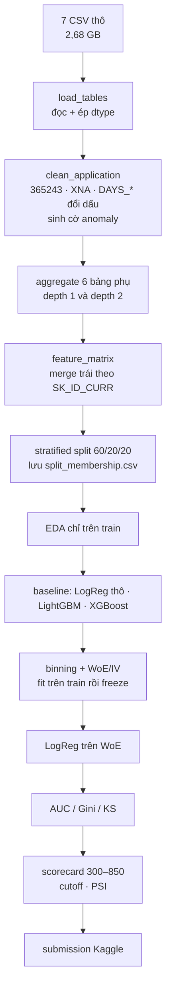

# Kế hoạch tuần 2 — Home Credit Default Risk

Đầu vào: [`task.md`](task.md). Cuộc thi: **Home Credit Default Risk** (đã có
[report cuộc thi #7](01-kaggle-reports/competition/07-comp-home-credit-default-risk.md)).
Mục tiêu: lặp lại đúng quy trình tuần 1 trên một bộ dữ liệu **nhiều bảng**, và
sản phẩm cuối là `docs/week2-report.md` cùng cấu trúc với
[`week1-report.md`](week1-report.md).

> **Trạng thái 31/07/2026:** pipeline local đã chạy xong tới tầng C. Kết quả đo,
> command và giới hạn nằm tại [`week2-report.md`](week2-report.md). Bốn file
> submission đã được Kaggle chấm; score và metadata nằm tại
> `outputs/hcdr/submissions/submission_scores.csv`.

## 0. Bốn việc task yêu cầu, ánh xạ sang deliverable

| Yêu cầu trong `task.md` | Phần trong report tuần 2 | Artifact |
|---|---|---|
| Cấu trúc dataset | §1, §3 | `datasets/raw/home-credit-default-risk/`, `source.json` |
| EDA | §3 | `outputs/hcdr/eda/` |
| Phương pháp feature extraction phổ biến | §4 | `datasets/processed/hcdr/feature_matrix.parquet` |
| Mô hình cơ bản: XGBoost, LightGBM, LogisticRegression + Raw/WoE | §5, §6 | `outputs/hcdr/models/`, `outputs/hcdr/scorecard/` |

Tuần 1 làm cả bốn việc trên một bảng 10 cột. Tuần 2 làm lại trên **7 bảng, 346
cột, quan hệ một-nhiều hai tầng** — chỗ khó chuyển từ *mô hình* sang *kỹ thuật
dữ liệu*.

## 1. Khác gì tuần 1 — bảng này quyết định toàn bộ kế hoạch

| | GiveMeSomeCredit (tuần 1) | Home Credit Default Risk (tuần 2) |
|---|---|---|
| Số bảng | 1 | **7** (+ 1 file mô tả cột) |
| Dòng train | 150.000 | **307.511** |
| Feature thô | 10, toàn số | **121** ở bảng chính, **16 categorical**, cộng 6 bảng phụ |
| Kích thước | 7,2 MB | **2,68 GB** |
| Bad rate | 6,684% | ~**8,07%** (phải đo lại) |
| Missing | 2 cột | **hàng chục cột**, nhóm nhà ở thiếu 50–70% |
| Categorical | không có | **có** — WoE và one-hot đều phải xử lý |
| Feature engineering | gần như không | **là phần chính**: aggregate 6 bảng phụ |
| Cột thời gian | không có | **vẫn không có** ở `application_train` |
| Metric | AUC | AUC |

Ba hệ quả trực tiếp:

1. **Bốn module tuần 1 dùng lại được gần như nguyên vẹn** (`metrics.py`,
   `scorecard.py`, `feature_importance.py`, phần lớn `eda.py`) vì chúng nhận
   DataFrame bất kỳ. Cái phải viết mới là tầng **load + aggregate + clean**.
2. **Categorical là việc mới hoàn toàn.** `bin_by_tree` hiện tại chỉ nhận cột
   số. Phải thêm nhánh: categorical thì mỗi mức là một bin, gộp mức hiếm.
3. **Vẫn không có out-of-time validation.** Cùng giới hạn tuần 1, và phải ghi
   rõ đúng như vậy trong report — đây là điều cuộc thi 2024
   ([Model Stability](01-kaggle-reports/competition/05-comp-home-credit-model-stability.md))
   sinh ra để sửa.

## 2. Chuẩn bị môi trường và dữ liệu

### 2.1 Dữ liệu

```bash
set -a && . ./.env && set +a          # KAGGLE_API_TOKEN
mkdir -p datasets/raw/home-credit-default-risk
uv run --with kaggle kaggle competitions download \
  -c home-credit-default-risk -p datasets/raw/home-credit-default-risk
unzip -d datasets/raw/home-credit-default-risk \
  datasets/raw/home-credit-default-risk/home-credit-default-risk.zip
```

Rồi ghi `datasets/raw/home-credit-default-risk/source.json` với sha256 từng
file, đúng khuôn `datasets/raw/source.json` của tuần 1.

Kiểm chứng: 10 file, tổng ~2,68 GB, `application_train.csv` = 307.511 dòng ×
122 cột.

> **Lưu ý bảo mật.** `.env` chứa Kaggle API token đang nằm trong thư mục dự án.
> Trước khi khởi tạo git repo, phải thêm `.env` vào `.gitignore`. Token đã bị lộ
> trong hội thoại nên nên xoay (revoke + tạo lại) trên trang Kaggle account.

### 2.2 Môi trường Python

Repo dùng `pyproject.toml` + `uv.lock`; môi trường được cài bằng
`uv sync --locked`. Runtime thực tế có **14 GiB RAM**, nên không đọc đồng thời
toàn bộ bảng phụ bằng pandas. Pipeline dùng DuckDB với memory limit 6 GiB để
aggregate trực tiếp từ CSV và cache Parquet.

## 3. Cấu trúc thư mục đầu ra

Đặt cạnh, không đè, artifact tuần 1:

```
datasets/raw/home-credit-default-risk/   10 file gốc + source.json
datasets/processed/hcdr/
  application-clean.parquet              bảng chính sau clean
  feature_matrix.parquet                 sau khi merge đủ aggregate
  split_membership.csv                   SK_ID_CURR → train/valid/test
outputs/hcdr/
  eda/                                   bảng CSV + hình
  models/                                metrics.csv, feature_importance/, *.joblib
  scorecard/                             woe_iv_detail, scorecard, cutoffs, PSI
  submissions/                           4 file submission Kaggle
  run_summary.json
docs/assets-week2/                       hình cho report + gen_charts.py
docs/week2-report.md
src/home_credit/                          package mới
```

## 4. Code: dùng lại gì, viết mới gì

### Dùng lại nguyên vẹn từ `src/credit_scoring/`

| Module | Hàm | Vì sao dùng được |
|---|---|---|
| `metrics.py` | `psi`, `gini_by_period` | nhận Series bất kỳ |
| `scorecard.py` | `woe_iv`, `is_monotonic_woe`, `scorecard_from_lr` | nhận cột bin dạng chuỗi |
| `feature_importance.py` | `build_feature_importance_table` | nhận model sklearn/LightGBM |
| `eda.py` | `summary_statistics`, `bad_rate_by_decile` | nhận DataFrame + tên cột |

### Viết mới trong `src/home_credit/`

| File | Nội dung | Ghi chú |
|---|---|---|
| `data.py` | `load_tables()`, `clean_application()` | anomaly HCDR: `DAYS_EMPLOYED=365243`, `CODE_GENDER=XNA`, `DAYS_*` âm |
| `aggregate.py` | `bureau_agg()`, `previous_agg()`, `pos_agg()`, `installments_agg()`, `credit_card_agg()`, `build_feature_matrix()` | phần nặng nhất |
| `binning.py` | `bin_categorical()` | mở rộng `bin_by_tree` cho cột chữ |
| `pipeline.py` | `run_pipeline()` | khung giống `credit_scoring/pipeline.py` |

Sửa lại `scorecard.bin_by_tree` để nó nhận cả categorical, **hoặc** thêm hàm
riêng trong `binning.py` rồi để `_monotonic_table` dispatch theo dtype. Ưu tiên
cách hai: không đụng code tuần 1 đang chạy đúng.

## 5. Luồng pipeline và tiêu chí kiểm chứng từng bước



Thứ tự **clean trước split, mọi thống kê sau split** giữ nguyên nguyên tắc tuần
1. Một chỗ khác cần chú ý: **aggregate nằm trước split** — hợp lệ, vì aggregate
chỉ dùng dữ liệu của chính khách đó, không dùng target và không dùng thống kê
toàn tập.

| Bước | Verify |
|---|---|
| load | 307.511 dòng; 10 file khớp sha256 |
| clean | số dòng không đổi; `anomaly_findings.csv` liệt kê đúng số dòng chạm vào |
| aggregate | mỗi bảng agg có `SK_ID_CURR` duy nhất; sau merge vẫn đúng 307.511 dòng |
| split | bad rate ba tập lệch nhau < 0,001 |
| baseline | AUC test LightGBM chỉ với `application_train` ≥ 0,74 |
| feature matrix | AUC test LightGBM đủ bảng phụ ≥ 0,77 |
| WoE | mọi feature vào scorecard có WoE đơn điệu |
| scorecard | điểm nằm trong 300–850; hệ số **không có cái nào sai dấu** |

Hai mốc AUC lấy từ bảng tham chiếu trong report #7 (0,75 chỉ application; 0,78–0,79
đủ bảng phụ; top LB ~0,805). Đặt ngưỡng thấp hơn một chút để còn chỗ cho cấu
hình không tune sâu.

## 6. EDA — làm gì trên train split

Bám [EDA playbook](00-tong-quan/04-eda-playbook.md), thêm phần đặc thù nhiều bảng:

**Bảng chính**
1. Target: đếm bad/good, bad rate — so với 8,07% tài liệu ghi.
2. Missing theo cột, xếp giảm dần. Chờ thấy cụm 47 cột nhà ở thiếu 50–70%.
3. Bad rate của nhóm missing so với nhóm có dữ liệu, cho từng cột thiếu nhiều —
   lặp lại đúng bài học tuần 1: **missing chưa chắc là tín hiệu xấu**, phải đo.
4. Bốn anomaly đã biết, kiểm chứng bằng số: `DAYS_EMPLOYED=365243` (~55.000
   dòng), `CODE_GENDER=XNA` (4 dòng), `AMT_INCOME_TOTAL` max 117 triệu,
   `NAME_FAMILY_STATUS=Unknown`. **Đo bad rate từng nhóm trước khi quyết định
   xử lý** — tuần 1 đã cho thấy nhóm mã 96/98 tưởng là rác lại có bad rate
   54,65%.
5. `EXT_SOURCE_1/2/3`: phân phối, tỷ lệ missing, bad rate theo decile, IV.
   Kỳ vọng đây là ba biến mạnh nhất — phải xác nhận, không tin sẵn.
6. Ma trận tương quan **trong nhóm 47 cột nhà ở** để chứng minh `_AVG`/`_MODE`/
   `_MEDI` trùng nhau, rồi giữ một biến thể.
7. Categorical: số mức, mức hiếm, bad rate từng mức của `NAME_INCOME_TYPE`,
   `OCCUPATION_TYPE`, `ORGANIZATION_TYPE` (58 mức — cần gộp).

**Bảng phụ**
8. Mỗi bảng: số dòng, số `SK_ID_CURR` phân biệt, phân phối số dòng trên mỗi
   khách (bao nhiêu khách không có bản ghi nào ở `bureau`?).
9. Tỷ lệ khách trong `application_train` **không** xuất hiện ở từng bảng phụ —
   quyết định giá trị điền cho cột agg bị thiếu (0 hay NaN, và có cờ hay không).

**Lặp lại kiểm chứng chủ đạo của tuần 1:** so `|Pearson|` với `IV` cho 20 feature
mạnh nhất. Tuần 1 cho thấy `RevolvingUtilization` có Pearson ≈ 0 nhưng IV cao
nhất. Trên HCDR, `DAYS_EMPLOYED` với mã sentinel 365243 là ứng viên rõ nhất cho
cùng hiện tượng.

## 7. Feature extraction — ba tầng, dừng khi hết lãi

Thiết kế theo **ba tầng tăng dần**, mỗi tầng train lại LightGBM để đo AUC tăng
bao nhiêu. Đây chính là cách kiểm chứng câu "dữ liệu > feature engineering >
thuật toán > tuning" của report #7 bằng số của mình, thay vì chép lại.

| Tầng | Nội dung | Số cột ước tính | AUC kỳ vọng |
|---|---|---|---|
| **A** | chỉ `application_train`, clean + encode categorical | ~130 | ~0,75 |
| **B** | + aggregate depth 1: `bureau`, `previous_application` | ~350 | ~0,77 |
| **C** | + depth 2: `bureau_balance`, `POS_CASH`, `installments`, `credit_card` + feature DPD | ~600 | ~0,78–0,79 |

Dừng ở C. Không làm ensemble, không stacking — task yêu cầu **mô hình cơ bản**.

### Quy ước đặt tên bắt buộc

`{BẢNG}_{CỘT}_{HÀM}`, ví dụ `BUREAU_AMT_CREDIT_SUM_MEAN`,
`INS_DPD_MAX`, `PREV_APP_CNT`. Không có quy ước này thì 600 cột thành không
truy được nguồn gốc — cảnh báo nguyên văn của report #7.

### Bộ aggregate cho từng bảng

| Bảng | Khoá | Hàm | Feature riêng |
|---|---|---|---|
| `bureau` | `SK_ID_CURR` | count, mean, max, sum | tách theo `CREDIT_ACTIVE` (Active/Closed) |
| `bureau_balance` | `SK_ID_BUREAU` → rồi `SK_ID_CURR` | min/max/size của `MONTHS_BALANCE`, tỷ lệ từng `STATUS` | **agg hai tầng** |
| `previous_application` | `SK_ID_CURR` | count, mean, max, min | tỷ lệ `NAME_CONTRACT_STATUS = Refused` |
| `POS_CASH_balance` | `SK_ID_PREV` → `SK_ID_CURR` | mean/max của `SK_DPD`, `SK_DPD_DEF` | agg hai tầng |
| `installments_payments` | `SK_ID_PREV` → `SK_ID_CURR` | mean/max/sum | `DPD`, `DBD`, `PAYMENT_PERC`, `PAYMENT_DIFF` — xem công thức ở report #7 |
| `credit_card_balance` | `SK_ID_PREV` → `SK_ID_CURR` | mean/max | tỷ lệ dùng hạn mức = `AMT_BALANCE / AMT_CREDIT_LIMIT_ACTUAL` |

Cộng thêm nhóm **tỷ lệ tự tạo trên bảng chính** — rẻ và hay mạnh:
`AMT_CREDIT / AMT_INCOME_TOTAL`, `AMT_ANNUITY / AMT_INCOME_TOTAL`,
`AMT_CREDIT / AMT_GOODS_PRICE`, `DAYS_EMPLOYED / DAYS_BIRTH`.

Nhóm DPD từ `installments_payments` được report #7 đánh giá là **mạnh nhất
ngoài `EXT_SOURCE_*`** — ưu tiên làm trước trong tầng C, và đo riêng phần AUC
nó đóng góp.

### Cửa sổ thời gian

Bản đầu chỉ agg toàn bộ lịch sử. Nếu tầng C chưa đạt 0,77 thì mới thêm cửa sổ
3/6/12 tháng theo `MONTHS_BALANCE` / `DAYS_INSTALMENT`. Không làm sẵn — đây
đúng chỗ dễ nở gấp ba số cột mà lãi không tương xứng.

## 8. Mô hình

Bốn mô hình, đúng danh sách task yêu cầu. **Ghi chú thuật ngữ:** task viết
"LinearRegresion", nhưng target nhị phân nên phải là **LogisticRegression** —
giống tuần 1.

| Tên | Đầu vào | Tiền xử lý | Vai trò |
|---|---|---|---|
| `logistic_raw` | feature thô + one-hot categorical | median impute + `add_indicator` + `RobustScaler` | sàn giải thích được |
| `logistic_woe` | feature sau WoE | binning fit trên train rồi freeze | **sản phẩm scorecard** |
| `lightgbm` | feature thô, categorical dạng `category` | không impute, không scale | trần AUC |
| `xgboost` | feature thô, one-hot | không impute (`missing=np.nan`) | đối chiếu với LightGBM |

Cấu hình khởi điểm, không tune sâu (tuần 1 cũng vậy, và LightGBM vẫn cách top
leaderboard 0,0032):

```python
lgb.LGBMClassifier(n_estimators=1000, learning_rate=0.02, num_leaves=32,
                   colsample_bytree=0.8, subsample=0.8, reg_lambda=1.0,
                   n_jobs=-1, random_state=42)   # early_stopping trên valid

xgb.XGBClassifier(n_estimators=1000, learning_rate=0.02, max_depth=6,
                  colsample_bytree=0.8, subsample=0.8, reg_lambda=1.0,
                  tree_method="hist", n_jobs=-1, random_state=42)
```

Không dùng `scale_pos_weight` / SMOTE: metric là AUC, thuần xếp hạng, cân bằng
lớp không đổi thứ hạng. Nếu vẫn muốn thử thì phải báo cáo là **không cải thiện**,
không im lặng bỏ.

### Lọc feature trước khi vào LogReg

600 cột không đưa thẳng vào Logistic Regression được. Thứ tự lọc, làm **chỉ trên
train**:

1. Bỏ cột missing > 90% trên train.
2. Bỏ cột chỉ có một giá trị.
3. Bỏ cột IV < 0,02.
4. Trong nhóm tương quan > 0,95, giữ cột IV cao nhất.
5. Giữ tối đa **25 feature** cho scorecard — hơn nữa thì bảng điểm không dùng
   được với nghiệp vụ.

## 9. Scorecard — ba lỗi tuần 1 phải sửa ở tuần 2

[§7 của report tuần 1](week1-report.md) tìm ra bốn lỗi trong scorecard. Ba lỗi
đầu cùng một gốc: **`scorecard_from_lr` fit Logistic Regression không ràng buộc
dấu hệ số**. Tuần 2 phải sửa, nếu không sẽ tái diễn ở quy mô lớn hơn:

1. **Ràng buộc dấu.** Với quy ước `WoE = ln(%good/%bad)`, mọi hệ số phải **âm**.
   Cách làm: fit xong kiểm dấu, cột nào sai dấu thì loại rồi fit lại, lặp tới
   khi sạch. Đơn giản hơn nhiều so với optimizer có ràng buộc, và cũng loại luôn
   feature trùng thông tin.
2. **Loại feature trùng thông tin trước khi fit** — bước 4 ở §8 đã lo.
3. **Bin `MISSING` rỗng không được nhận điểm trung tính.** Tuần 1 một hồ sơ
   thiếu `RevolvingUtilization` được 61 điểm, cao hơn hồ sơ utilization cao nhất
   (3 điểm). Trên HCDR nhiều cột thiếu 50–70% nên lỗi này nặng hơn nhiều: gán
   bin `MISSING` rỗng về bin xấu nhất của cùng feature.
4. **Categorical mức hiếm**: gộp mọi mức có < 1% số dòng train thành `OTHER`
   *trước* khi tính WoE, tránh WoE nổ do mẫu nhỏ. Smoothing Laplace 0,5 hiện có
   trong `woe_iv` chưa đủ khi một mức chỉ có vài chục dòng.

Sản phẩm cuối vẫn là: `scorecard.csv` dạng `(feature, bin, WoE, hệ số, điểm)`,
dải 300–850, cộng bảng cutoff theo approval rate 60/70/80% kèm bad rate phần
được duyệt — bảng nói chuyện được với nghiệp vụ.

## 10. Metric và giới hạn validation

Giống tuần 1: **AUC** (metric chính thức) + **Gini** + **KS**, báo cả valid và
test. Không dùng accuracy, không dùng F1.

Thêm hai thứ tuần 1 không có:

- **Submission Kaggle thật.** HCDR có leaderboard đang mở, `application_test.csv`
  48.744 dòng. Nộp cả bốn mô hình để có **AUC public LB** đối chiếu với AUC test
  local. Chênh lệch giữa hai con số là thước đo trung thực nhất cho việc split
  local có lạc quan quá không.
- **PSI giữa train và `application_test`** trên phân phối điểm. Tuần 1 chỉ so
  được hai nửa của train (PSI 0,00056, vô nghĩa). Ở đây tập test là dân số khác
  thật, nên PSI có nghĩa hơn — dù vẫn **không phải** out-of-time.

Phải ghi rõ trong report, giống tuần 1: `application_train` không có cột thời
gian, nên split là **stratified random**, không phát hiện được drift, và mọi con
số lạc quan hơn production.

## 11. Rủi ro đã biết và cách chặn

| Rủi ro | Dấu hiệu | Chặn thế nào |
|---|---|---|
| Nở số cột không kiểm soát | > 800 cột, tên không truy được nguồn | quy ước tên ở §7, dừng ở tầng C |
| Leakage qua preprocessing | AUC test ≈ AUC train, hoặc AUC > 0,82 | mọi `fit` chỉ chạm train; kiểm bằng thứ tự gọi hàm trong `pipeline.py` |
| Merge làm nở dòng | sau merge ≠ 307.511 dòng | assert số dòng sau **mỗi** merge |
| Hệ số scorecard sai dấu | hệ số dương với quy ước `ln(%good/%bad)` | §9 mục 1 |
| Categorical mức hiếm làm nổ WoE | `\|WoE\|` > 3 ở bin vài chục dòng | gộp `OTHER` < 1% |
| Chạy quá lâu | tầng C hơn 30 phút | 64 core sẵn có, `n_jobs=-1`; cache aggregate ra parquet để không tính lại |
| Nhầm "aggregate là leakage" | bỏ agg vì sợ leakage | agg chỉ dùng dữ liệu của chính khách đó, không dùng target — hợp lệ |

## 12. Deliverable và tiêu chí nghiệm thu

**Bắt buộc**

- [x] `datasets/raw/home-credit-default-risk/` đủ 10 file + `source.json` có sha256
- [x] `src/home_credit/` chạy được một lệnh ra toàn bộ artifact
- [x] `datasets/processed/hcdr/` có `feature_matrix.parquet` + `split_membership.csv`
- [x] `outputs/hcdr/` có EDA, metrics 4 mô hình × 2 split, feature importance, scorecard, cutoffs, PSI
- [x] `docs/week2-report.md` cùng cấu trúc 8 phần với `week1-report.md`
- [x] `docs/assets-week2/gen_charts.py` có `selfcheck()` đối chiếu số trong hình với số trong `outputs/` — đúng cơ chế tuần 1

**Ngưỡng số**

- [x] AUC test LightGBM tầng C ≥ 0,77
- [x] AUC test LogReg trên WoE ≥ 0,74
- [x] Không hệ số scorecard nào sai dấu
- [x] Chênh AUC valid − test < 0,01 cho cả bốn mô hình
- [x] Bad rate ba split lệch < 0,001

**Không làm** (ngoài phạm vi task): ensemble/stacking, tuning sâu bằng Optuna,
neural network, feature theo cửa sổ thời gian trừ khi tầng C hụt ngưỡng, và
cuộc thi Model Stability 2024 (26 GB, để tuần sau nếu cần).

## 13. Thứ tự thực hiện

| # | Việc | Xong khi |
|---|---|---|
| 1 | Tải dữ liệu + `source.json` | 10 file khớp sha256 |
| 2 | `data.py` — load + clean + anomaly findings | 307.511 dòng, `anomaly_findings.csv` có số |
| 3 | EDA bảng chính trên train | `outputs/hcdr/eda/` đủ bảng ở §6 mục 1–7 |
| 4 | Tầng A + 4 mô hình | AUC test LightGBM ~0,75 |
| 5 | `aggregate.py` depth 1 → tầng B | AUC tăng, số dòng không đổi |
| 6 | depth 2 + DPD → tầng C | AUC test ≥ 0,77 |
| 7 | Lọc feature + WoE + scorecard + cutoff + PSI | không hệ số sai dấu |
| 8 | 4 submission lên Kaggle | xong; score lưu tại `outputs/hcdr/submissions/submission_scores.csv` |
| 9 | `gen_charts.py` + `week2-report.md` | `selfcheck()` pass |

Bước 3 và 5 là hai bước tốn thời gian nhất. Bước 4 nên làm **sớm** ngay cả khi
EDA chưa xong — có một con số AUC làm mốc thì mọi việc sau mới đo được lãi.

## Liên quan

- [Report cuộc thi #7 — Home Credit Default Risk](01-kaggle-reports/competition/07-comp-home-credit-default-risk.md)
- [Report #1 — Start Here: A Gentle Introduction](01-kaggle-reports/overview/01-nb-start-here-gentle-introduction.md) · [Report #2 — Complete EDA + Feature Importance](01-kaggle-reports/overview/02-nb-complete-eda-feature-importance.md) — hai notebook chạy trên chính bộ này
- [Report cuộc thi #5 — Model Stability](01-kaggle-reports/competition/05-comp-home-credit-model-stability.md) — cuộc thi kế nhiệm, giải đúng chỗ HCDR thiếu
- [Báo cáo tuần 1](week1-report.md) — khuôn cho report tuần 2
- [EDA playbook](00-tong-quan/04-eda-playbook.md) · [Modeling playbook](00-tong-quan/05-modeling-playbook.md) · [Metrics/validation/monitoring](00-tong-quan/06-metrics-validation-monitoring.md)
