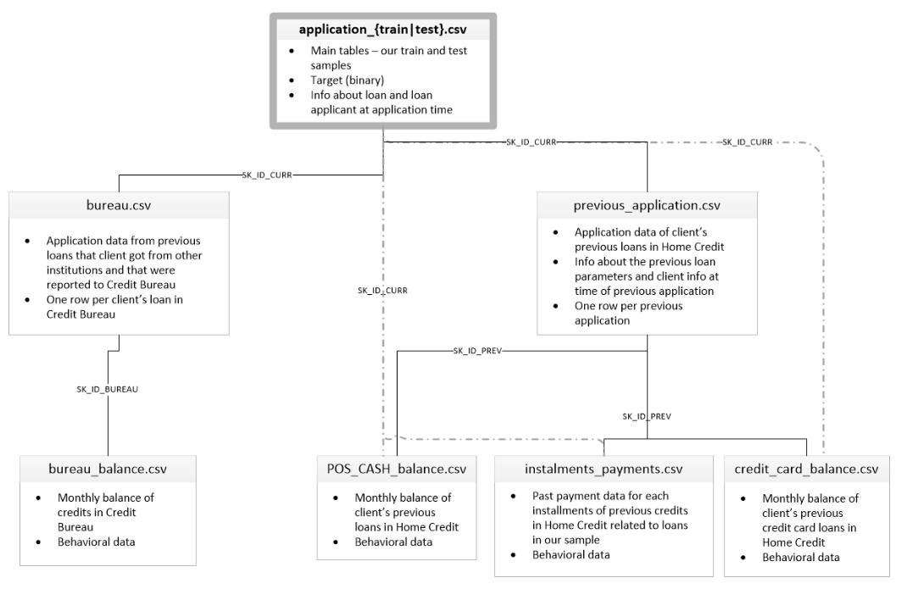
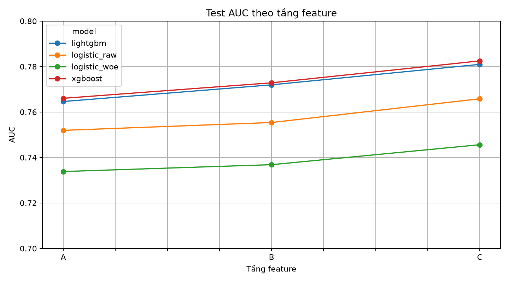
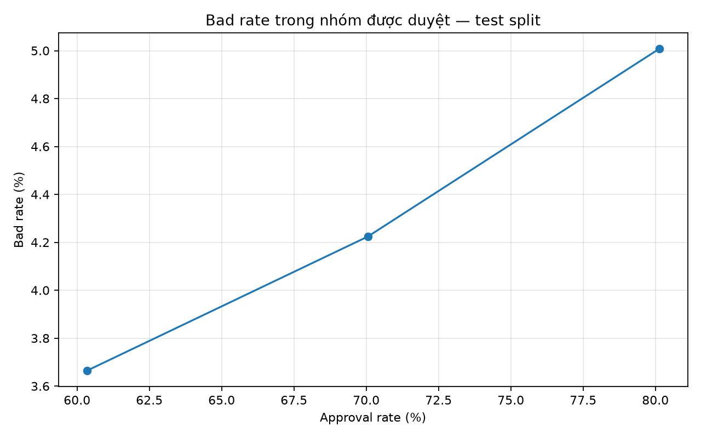

# Báo cáo tuần 2: Home Credit Default Risk

Báo cáo này chỉ dùng số đã tính lại từ pipeline local. Input được tải ngày
31/07/2026, fingerprint nằm tại
`datasets/raw/home-credit-default-risk/source.json`; config và kết quả chính nằm
trong `outputs/hcdr/run_summary_C.json`.

## 0. Thuật ngữ

- `TARGET=1` là khách hàng gặp khó khăn thanh toán; `TARGET=0` là good.
- A/B/C là ba tầng feature: application; thêm bureau/previous; thêm toàn bộ lịch
  sử depth-2 và DPD.
- WoE dùng quy ước `ln(%good/%bad)`. Vì mô hình dự đoán bad, hệ số scorecard hợp
  lệ phải âm.
- Split local là stratified random 60/20/20, không phải out-of-time.

## 1. Bài toán và cấu trúc dữ liệu



**Verified.**

- `application_train.csv` có **307.511 dòng × 122 cột**, trong đó có
  121 cột đầu vào và `TARGET`;
- `application_test.csv` có 48.744 dòng × 121 cột. Bad rate đo lại là **8,0729%**.
- Bộ nguồn có 10 CSV, gồm bảng application, sáu bảng lịch sử, file mô tả cột và sample submission; tất cả có SHA-256 trong `source.json`.

Quan hệ khó nhất là một-nhiều hai tầng:

```text
application.SK_ID_CURR
  ├─ bureau.SK_ID_CURR ─ bureau_balance.SK_ID_BUREAU
  └─ previous_application.SK_ID_CURR ─ SK_ID_PREV
       ├─ POS_CASH_balance
       ├─ installments_payments
       └─ credit_card_balance
```

Không có cột thời gian application đủ để tạo out-of-time split. Các cột
`DAYS_*` chỉ mô tả khoảng cách tới ngày nộp hồ sơ.

## 2. Điểm khó và cách chặn leakage

Aggregate được tính theo lịch sử của chính `SK_ID_CURR`, không dùng `TARGET`, nên có thể cache trước split.

Ngược lại, imputation, scale, one-hot, tree bins, WoE, IV và chọn feature đều chỉ fit trên 60% train rồi freeze cho valid/test. Mỗi bảng aggregate bị assert duy nhất theo `SK_ID_CURR`; mỗi merge bị assert không đổi số dòng.

Máy chạy thật có 14 GiB RAM, không phải 251 GiB như kế hoạch ban đầu. Vì vậy sáu bảng phụ được DuckDB đọc trực tiếp từ CSV, group-by ra Parquet, với memory limit 6 GiB. Toàn bộ cache aggregate chỉ chiếm khoảng 33 MiB; feature matrix A/B/C lần lượt khoảng 31/51/68 MiB.

## 3. EDA và anomaly

**Verified trên train split.** Ba split có bad rate lần lượt 8,0729%, 8,0729%
và 8,0728%; chênh lệch nhỏ hơn 0,000002.

- `DAYS_EMPLOYED=365243`: 55.374 hồ sơ train; bad rate 5,40%. Pipeline tạo cờ anomaly rồi thay sentinel bằng missing.
- `CODE_GENDER=XNA`: 4 hồ sơ; `NAME_FAMILY_STATUS=Unknown`: 2 hồ sơ. Cả hai được giữ bằng cờ trước khi thay missing.
- Khách có lịch sử ở `bureau`: 85,69%; `previous_application`: 94,65%; POS: 94,12%; installments: 94,84%.
- Bureau balance chỉ phủ 29,99% và credit card chỉ phủ 28,26%. Missing 70–72% ở các aggregate này mang nghĩa “không có lịch sử tương ứng”, không mặc định là dữ liệu lỗi.

Ba feature có IV cao nhất vẫn là `EXT_SOURCE_3` (0,326), `EXT_SOURCE_2` (0,312) và `EXT_SOURCE_1` (0,149).

**Lịch sử bổ sung tín hiệu thật:**
`BUREAU_DAYS_CREDIT_MEAN` đạt IV 0,122; `PREV_REFUSED_RATIO` 0,069;
`CC_UTILIZATION_MEAN` 0,067; `INS_DPD_MEAN` 0,054.

Artifact EDA: `outputs/hcdr/eda/anomaly_findings.csv`,
`column_profile.csv`, `categorical_bad_rates.csv`.

## 4. Feature extraction

`application_train` là bảng khung, giữ đúng một dòng cho mỗi `SK_ID_CURR`.
Các bảng lịch sử có nhiều dòng cho một khách hàng nên không được join trực tiếp;
pipeline `GROUP BY SK_ID_CURR` để nén chúng thành một nhóm feature cố định trước khi left join vào bảng khung:

- `bureau` và `previous_application`: đếm số khoản vay/hồ sơ, tổng hợp số tiền bằng mean/max/sum và tính tỷ lệ trạng thái như active, closed, approved hoặc refused;
- `POS_CASH_balance` và `credit_card_balance`: tóm tắt chuỗi ghi nhận hàng tháng bằng số dòng, số hợp đồng, DPD trung bình/lớn nhất, dư nợ và mức sử dụng hạn mức;
- `installments_payments`: biến các lần thanh toán thành số ngày trễ/sớm, tỷ lệ đã thanh toán và phần tiền còn thiếu, rồi lấy các thống kê tổng hợp;
- `bureau_balance` đi qua hai bước vì chỉ có `SK_ID_BUREAU`: trước hết tổng hợp từng khoản vay bureau theo tháng, sau đó ánh xạ khoản vay về `SK_ID_CURR` và tổng hợp lần nữa ở cấp khách hàng.

Kết quả là mỗi bảng phụ chỉ còn tối đa một dòng cho một khách hàng. Các bảng này được left join lần lượt vào application; khách không có lịch sử vẫn được giữ và các feature tương ứng là missing để bước tiền xử lý của mô hình xử lý. 

Cách làm này bổ sung tín hiệu lịch sử mà không nhân bản dòng hay làm thay đổi `TARGET`.
Các phép tổng hợp cụ thể được cài đặt trong [`aggregate.py`](../../../src/home_credit_default_rate/aggregate.py).

| Tầng | Nội dung                                             | Số feature | LightGBM test AUC | XGBoost test AUC |
| ----- | ----------------------------------------------------- | ----------: | ----------------: | ---------------: |
| A     | application clean + ratio                             |         127 |            0,7646 |           0,7660 |
| B     | A + bureau + previous application                     |         145 |            0,7720 |           0,7728 |
| C     | B + bureau balance + POS + installments + credit card |         175 |  **0,7809** | **0,7825** |



Từ A tới C, LightGBM tăng 0,0163 AUC và XGBoost tăng 0,0164. Kết quả hỗ trợ giả thuyết của kế hoạch: trên HCDR, lịch sử nhiều bảng tạo nhiều giá trị hơn việc chỉ đổi thuật toán. Pipeline dừng ở C; không thêm window 3/6/12 tháng vì đã vượt ngưỡng 0,77.

## 5. Mô hình và metric

Kết quả cuối dùng tầng C:

| Mô hình    | Valid AUC |         Test AUC |        Test Gini |          Test KS |
| ------------ | --------: | ---------------: | ---------------: | ---------------: |
| Logistic raw |    0,7603 |           0,7658 |           0,5316 |           0,3987 |
| LightGBM     |    0,7747 |           0,7809 |           0,5619 |           0,4246 |
| XGBoost      |    0,7772 | **0,7825** | **0,5649** | **0,4252** |
| Logistic WoE |    0,7406 |           0,7456 |           0,4912 |           0,3667 |

Chênh lệch tuyệt đối valid–test lớn nhất là 0,00625, dưới ngưỡng 0,01. Raw
logistic ban đầu dùng LBFGS không hội tụ và rơi xuống AUC 0,6422; chạy cuối đổi sang `StandardScaler(with_mean=False)` + SAGA, hội tụ mà không phát warning và đạt 0,7658. Đây là sửa lỗi conditioning, không phải tuning theo test.

`outputs/hcdr/models/metrics_A.csv`, `metrics_B.csv`, `metrics_C.csv` giữ kết quả từng tầng. Feature importance nằm dưới `outputs/hcdr/models/feature_importance/`.

Kaggle đã chấm bốn submission:

| Mô hình    |        Public AUC |       Private AUC |
| ------------ | ----------------: | ----------------: |
| XGBoost      | **0,77517** | **0,77228** |
| LightGBM     |           0,77191 |           0,77019 |
| Logistic raw |           0,75848 |           0,75117 |
| Logistic WoE |           0,73920 |           0,72919 |

Thứ tự Kaggle giống test local. `submission_scores.csv` lưu submission ID,
status và so sánh với snapshot 7.180 đội. Vì đây là submission sau khi cuộc thi
kết thúc, không có official rank; mọi rank trong file đều được ghi rõ là
**hypothetical**.

## 6. Pipeline và khả năng tái lập

```bash
uv sync --locked
uv run python scripts/prepare_hcdr_data.py
uv run python scripts/run_hcdr_pipeline.py --level C
uv run python docs/assets-week2/gen_charts.py
./scripts/check.sh
```

`datasets/processed/hcdr/application-clean.parquet`,
`feature_matrix.parquet` và `split_membership.csv` giữ input sạch, matrix cuối
và membership cố định. `run_summary_C.json` ghi seed 42, split, số dòng, số
feature và metric. Dataset, processed data và output đều được `.gitignore`.

## 7. WoE, scorecard và cutoff

Scorecard cuối giữ 21 feature. Quy trình bỏ IV dưới 0,02, chỉ nhận numeric WoE
đơn điệu, giữ tối đa 25 feature, rồi lặp bỏ mọi feature có hệ số sai dấu. Kết
quả hệ số nằm từ -0,768 tới -0,022: **không có hệ số dương**. Điểm cực trị cộng
theo feature là đúng **300–850**. Bin `MISSING` không có quan sát train được gán
về WoE xấu nhất của feature thay vì nhận điểm trung tính.

| Approval mục tiêu | Approval thực tế | Cutoff | Bad rate được duyệt |
| ------------------: | -----------------: | -----: | ----------------------: |
|                 60% |             60,34% |    603 |                   3,66% |
|                 70% |             70,06% |    586 |                   4,22% |
|                 80% |             80,13% |    565 |                   5,01% |



PSI phân phối điểm giữa train và `application_test` là **0,00253**, rất nhỏ.
Đây là so population competition, có ý nghĩa hơn PSI giữa hai random split,
nhưng vẫn không thay thế monitoring theo thời gian.

## 8. Kết luận và giới hạn

Pipeline local đã hoàn thành dataset structure, EDA, feature extraction nhiều
bảng và bốn baseline mà task yêu cầu. Tầng C vượt ngưỡng LightGBM 0,77; WoE
logistic vượt 0,74; scorecard đúng dấu và đúng range; mọi gap valid–test dưới
0,01.

Bốn submission đã được Kaggle chấm và metadata nằm tại
`outputs/hcdr/submissions/submission_scores.csv`. Random split và leaderboard
không đo temporal drift, fairness, calibration production hay tác động chính
sách phê duyệt. Đây là pipeline thực hành, không phải hệ thống phê duyệt tín
dụng production.

## Liên quan

- [Kế hoạch tuần 2](week2-plan.md)
- [Báo cáo tuần 1](week1-report.md)
- [Report cuộc thi Home Credit](01-kaggle-reports/competition/07-comp-home-credit-default-risk.md)
- [EDA playbook](00-tong-quan/04-eda-playbook.md)
- [Metrics, validation và monitoring](00-tong-quan/06-metrics-validation-monitoring.md)
