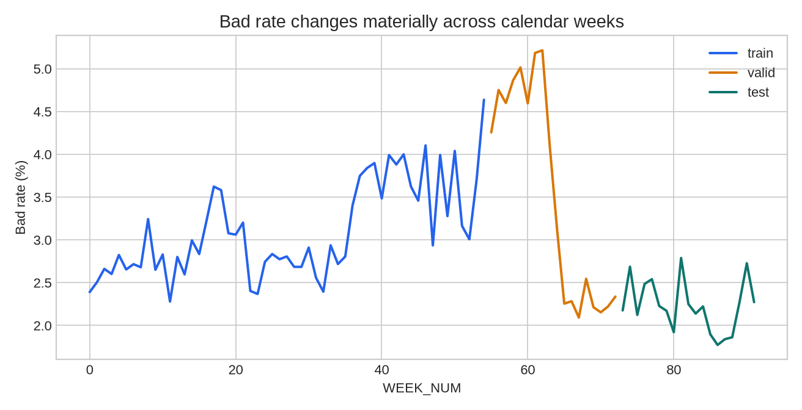
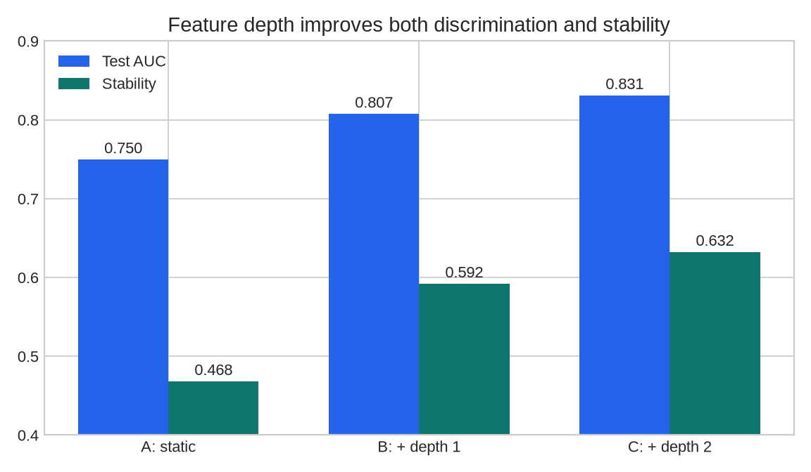
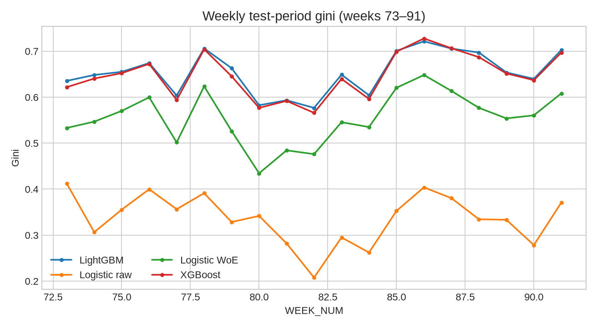
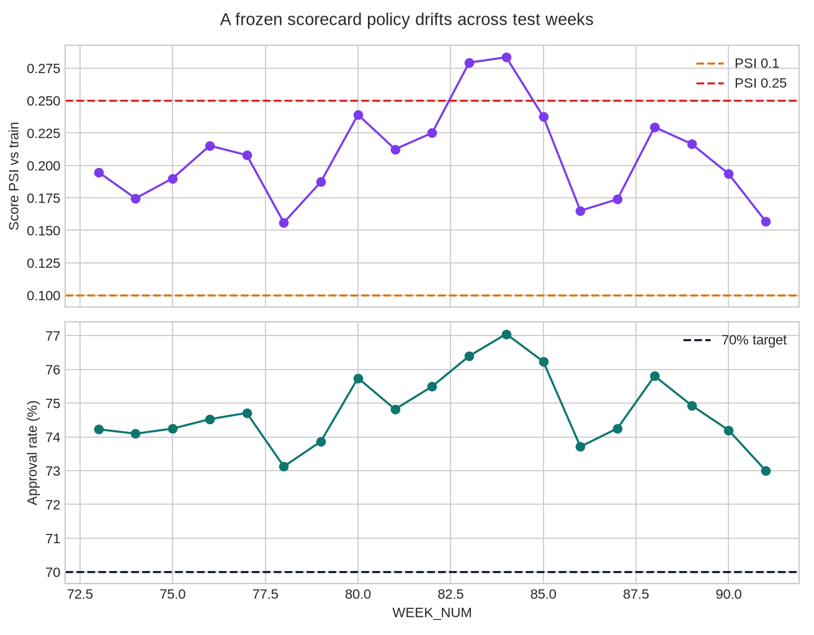

# Báo cáo tuần 2: Home Credit — Credit Risk Model Stability

Báo cáo này chỉ dùng kết quả đã tính lại từ pipeline local ngày 31/07/2026.
Fingerprint dữ liệu nằm tại
`datasets/raw/home-credit-model-stability/source.json`; config, thiết bị và
kết quả chính nằm trong `outputs/hcms/run_summary.json`. Đây là thử nghiệm
credit scoring thực hành, không phải hệ thống phê duyệt tín dụng production.

## 0. Thuật ngữ và câu hỏi

- `target=1` là bad; `target=0` là good.
- A/B/C là ba tầng feature: static; thêm lịch sử depth 1; thêm depth 2.
- WoE dùng `ln(%good/%bad)`. Mô hình dự đoán bad nên hệ số hợp lệ phải âm.
- Out-of-time (OOT) nghĩa là train chỉ dùng tuần sớm hơn valid và test.
- Stability chính thức là
  `mean(gini) + 88 × min(0, slope) − 0,5 × std(residual)`, với gini tính riêng
  theo tuần. Công thức và ngữ cảnh cuộc thi được lưu trong
  [report nguồn #5](../../01-kaggle-reports/competition/05-comp-home-credit-model-stability.md).

Câu hỏi chính là thêm lịch sử có tăng cả AUC lẫn stability hay không, mô hình
mạnh nhất có ổn định nhất không, và random split có thực sự lạc quan hơn OOT
trên chính dữ liệu này không.

## 1. Dataset và quan hệ nhiều bảng

**Verified.** Nhánh giữ lại có 68 Parquet, tổng 1.329.545.413 byte: 32 file
train và 36 file test. `train_base` có **1.526.659 hồ sơ**, 92 tuần và năm cột
`case_id`, `date_decision`, `MONTH`, `WEEK_NUM`, `target`. Bad rate toàn bộ là
**3,1437%**. `feature_definitions.csv` định nghĩa **465 predictor**. Tổng số
dòng vật lý qua mọi bảng là **243.465.546**, vì một hồ sơ có nhiều bản ghi
lịch sử.

```text
case_id
  ├─ depth 0: static_0, static_cb_0
  ├─ depth 1: applprev, person, bureau, tax, deposit, debitcard, other
  └─ depth 2: applprev, person, credit_bureau_a/b
```

Mọi bảng depth 1/2 được aggregate về một dòng mỗi `case_id`. Các file
`credit_bureau_a_2` lớn nhất được xử lý từng chunk rồi gộp từ sum/count/max,
không group-by đồng thời 216 triệu dòng. Cache nằm tại
`datasets/processed/hcms/agg/`; matrix A/B/C lần lượt có 53/283/331 cột kể cả
năm cột base. Matrix C train chiếm khoảng 302 MB.

## 2. Split thời gian và chặn leakage

Split áp dụng trên **92 tuần distinct**, không trên số dòng:

| Tập | Tuần | Số tuần | Số hồ sơ | Bad rate |
|---|---:|---:|---:|---:|
| Train | 0–54 | 55 | 1.129.770 | 3,1254% |
| Valid | 55–72 | 18 | 193.544 | 4,2548% |
| Test | 73–91 | 19 | 203.345 | 2,1879% |

55/18/19 gần 60/20/20 theo tuần, nhưng thành 74/13/13% theo dòng vì volume
tuần không đều. `split_membership.csv` đã được kiểm: mỗi `WEEK_NUM` chỉ thuộc
đúng một tập.

Date feature được đổi thành số ngày cách `date_decision` trước aggregate.
Imputation, missing indicator, chọn feature, LightGBM early stopping, tree bin,
WoE/IV và cutoff đều chỉ fit trên train hoặc valid sớm hơn. Sáu tax-registry
feature không có quan sát trong tuần train bị loại trước imputation; pipeline
không dùng sự xuất hiện của chúng ở tương lai.

## 3. EDA: population thay đổi rõ theo tuần



Bad rate theo tuần dao động từ **1,7722%** (tuần 86) tới **5,2144%** (tuần 62).
Valid có tuần trên 5%, trong khi test chỉ nằm trong khoảng 1,77–2,79%. Vì vậy
valid khó hơn test theo ít nhất một chiều population; không nên đọc chênh AUC
giữa hai tập như overfit thuần túy.

Các tín hiệu quan trọng nhất của LightGBM C gồm số tiền giải ngân và tín dụng,
số bản ghi bureau depth 2, DPD trung bình, khoảng cách tới ngày tạo hồ sơ trước,
annuity, current debt và lịch sử thanh toán. Kết quả này phù hợp với cấu trúc
P/A/D của cuộc thi nhưng chỉ là importance của baseline, không phải quan hệ
nhân quả.

Artifact EDA: `outputs/hcms/eda/dataset_inventory.csv` và
`bad_rate_by_week.csv`.

## 4. Feature extraction A/B/C

Pipeline chọn tối đa 24 cột nguồn mỗi family bằng hậu tố P/A/L/T/D/M, aggregate
numeric bằng mean/max, date bằng min/max gap, category bằng tổng số mức distinct
theo chunk (proxy giới hạn RAM) và luôn giữ row count. Sau đó mỗi family đóng
góp tối đa 10 feature có quan sát ở train;
matrix C giữ 129 feature gốc, thành 244 cột sau missing indicators.

| Tầng | Nội dung | LightGBM test AUC | Stability |
|---|---|---:|---:|
| A | static depth 0 | 0,7496 | 0,4682 |
| B | A + depth 1 | 0,8074 | 0,5920 |
| C | B + depth 2 | **0,8310** | **0,6322** |



Cả hai ngưỡng kế hoạch đều pass: B tốt hơn A và C tốt hơn B trên **cả AUC lẫn
stability**. Trong baseline này, nguồn lịch sử/external không tạo trade-off;
chúng tăng đồng thời discrimination và độ ổn định.

## 5. Bốn mô hình và gini stability

| Mô hình | Train AUC | Valid AUC | Test AUC | Test Gini | Test KS | Stability |
|---|---:|---:|---:|---:|---:|---:|
| LightGBM | 0,8418 | 0,8151 | **0,8310** | **0,6620** | 0,5083 | **0,6322** |
| XGBoost | 0,8270 | 0,8126 | 0,8287 | 0,6574 | **0,5104** | 0,6256 |
| Logistic WoE | 0,7410 | 0,7455 | 0,7839 | 0,5677 | 0,4458 | 0,5296 |
| Logistic raw | 0,6995 | 0,6830 | 0,6677 | 0,3354 | 0,2403 | 0,1491 |



Mỗi mô hình có đủ 19 tuần test; tuần nhỏ nhất có 5.158 hồ sơ và không tuần nào
bị loại. LightGBM, XGBoost và WoE có slope dương nên không nhận thưởng nhưng
không bị phạt suy giảm. Raw logistic có slope **−0,001835/tuần**; riêng thành
phần `88 × slope` đã trừ khoảng 0,1615, kéo stability từ mean gini 0,3364 xuống
0,1491.

Thứ hạng AUC và stability giống nhau: LightGBM > XGBoost > WoE > raw logistic.
Thử chỉ train LightGBM trên nửa sau của tuần train cho stability 0,63222, gần
như bằng nhưng hơi thấp hơn 0,63225 của toàn bộ train. Giả thuyết “dữ liệu gần
hơn sẽ ổn định hơn” **không được hỗ trợ** trong cấu hình này.

## 6. Random split, GPU và khả năng tái lập

Đối chứng dùng cùng LightGBM, cùng feature matrix và **khớp chính xác số dòng**
train/valid/test với OOT:

| Protocol | Test n | Test bad rate | Test AUC |
|---|---:|---:|---:|
| OOT, tuần 73–91 | 203.345 | 2,1879% | **0,8310** |
| Stratified random | 203.345 | 3,1439% | 0,8183 |

Random thấp hơn OOT **0,0127 AUC**, trái với giả thuyết viết trước khi chạy.
Kết quả này không chứng minh random validation “bảo thủ” nói chung: hai test
population khác nhau theo thiết kế, và chuỗi bad rate cho thấy cohort tương lai
đã đổi mạnh. Kết luận đúng là *random split không tự động lạc quan; độ khó của
population theo thời gian quyết định hướng và độ lớn của gap*.

Run đầu tiên OOM khi vừa giữ matrix A/B trong RAM vừa aggregate toàn bộ bureau
depth 2. Bản cuối giải phóng stage cũ, cache aggregate từng file rồi mới combine.
LightGBM chạy GPU trên NVIDIA MX350. XGBoost CUDA đã được thử nhưng wheel chính
thức không hỗ trợ compute capability SM 6.1 của MX350, nên pipeline ghi rõ
`cpu_fallback_sm61_unsupported`; hai logistic chạy CPU.

```bash
uv sync --locked
uv run python scripts/prepare_hcms_data.py
uv run python scripts/run_hcms_pipeline.py
uv run python scripts/generate_hcms_submissions.py
uv run python scripts/build_hcms_kaggle_notebook.py
uv run python docs/weekly-report/week2/assets-week2-stability/gen_charts.py
./scripts/check.sh
```

`run_summary.json` giữ seed 42, row/week ranges, feature count, device và metric.
`source.json` giữ SHA-256 cho 68 Parquet, file định nghĩa và sample submission.
Test 10 dòng công khai chỉ là placeholder của code competition. Bốn file
`lightgbm.csv`, `xgboost.csv`, `logistic_raw.csv`, `logistic_woe.csv` đều khớp
chính xác schema/order `case_id,score` của sample. Kaggle từ chối cả bốn local
upload với HTTP 400 vì đây là code competition.

Notebook end-to-end
[`HCMS End-to-End LightGBM`](../../../notebooks/kaggle/home-credit-model-stability-end-to-end/home-credit-model-stability-end-to-end.ipynb)
đã được push thành private kernel `cyclerlol/hcms-end-to-end-lightgbm`. Version
2 bị Kaggle từ chối format vì fallback fixture dùng synthetic `case_id`, không
khớp 10 ID của sample chính thức. Version 3 sửa bằng cách tìm competition mount
động và giữ đúng ID/schema/order của `sample_submission.csv`.

Kaggle version 3 chạy GPU trên toàn bộ 1.526.659 hồ sơ train, tạo 170 feature và
đạt chronological validation AUC **0,821184**. File public-test tải ngược từ
Kaggle có đúng hai cột `case_id,score`, đúng 10 ID theo thứ tự sample, không null
và score nằm trong `[0,1]`.

Code submission ref **55130117** hoàn tất hidden scoring với public score
**0,49961** và private score **0,39951**. Competition metric này là stability
score, không phải AUC; tên cột `public_auc/private_auc` chỉ được giữ để tương
thích schema của báo cáo submission HCDR. Không có official leaderboard rank
cho post-competition submission nên trường rank vẫn để trống.
`outputs/hcms/submissions/submission_scores.csv` giữ cả failure version 2 và kết
quả xác nhận của version 3.

## 7. WoE, scorecard, cutoff và monitoring

Feature WoE được tree-bin trên train, yêu cầu IV ≥ 0,02, WoE đơn điệu và hệ số
biến thiên IV theo tuần ≤ 1. Sau sign filtering, scorecard giữ **7 feature**;
mọi hệ số nằm trong **−0,693 tới −0,548**, không có hệ số sai dấu. Tổng điểm
cực trị đúng **300–850**.

Cutoff được chốt trên valid rồi freeze cho test:

| Approval mục tiêu valid | Cutoff | Approval test | Bad rate phần duyệt test |
|---:|---:|---:|---:|
| 60% | 391 | 65,70% | 1,21% |
| 70% | 350 | 74,71% | 1,49% |
| 80% | 326 | 82,52% | 1,77% |

Chênh mục tiêu đến từ score ties và population shift, không phải do lấy quantile
trên test. Với policy 70%, approval theo tuần test chạy từ **73,00% tới 77,05%**.
PSI score so với train nằm 0,156–0,283: cả 19 tuần vượt 0,1 và hai tuần vượt
0,25. Đây là tín hiệu monitoring cần điều tra, dù gini của tree model chưa giảm.



## 8. Kết luận và giới hạn

Pipeline đã hoàn thành cấu trúc dataset, EDA theo thời gian, feature extraction
depth 0/1/2, bốn baseline, metric stability, đối chứng split, WoE scorecard,
cutoff theo tuần và submission-format artifact. Kết quả giá trị nhất:

1. Thêm depth 1/2 tăng cả AUC lẫn stability; C là tầng tốt nhất.
2. LightGBM có AUC và stability cao nhất; không xuất hiện đảo hạng metric.
3. Chỉ raw logistic suy giảm có hệ thống và bị hệ số 88 phạt rất mạnh.
4. Bad rate/population drift đủ lớn để làm random-vs-OOT gap đi ngược kỳ vọng.
5. Cutoff đứng yên không giữ đúng approval target; PSI cảnh báo trước khi gini
   tree model suy giảm.

Giới hạn: đây là một baseline chọn tối đa 129 feature, chưa tune sâu, chưa
ensemble và chưa đưa stability vào loss function. Kaggle score của notebook
version 3 thấp hơn baseline local chính và không có official post-competition
rank. AUC/stability local không chứng minh calibration, fairness, tác động chính
sách hay hiệu quả production.

## Liên quan

- [Kế hoạch đã thực thi](week2-model-stability.md)
- [Report cuộc thi #5](../../01-kaggle-reports/competition/05-comp-home-credit-model-stability.md)
- [Báo cáo HCDR tuần 2](week2-report.md)
- [Metrics, validation và monitoring](../../00-tong-quan/06-metrics-validation-monitoring.md)
